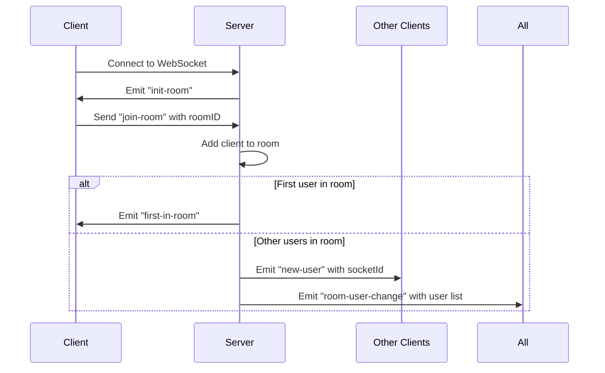
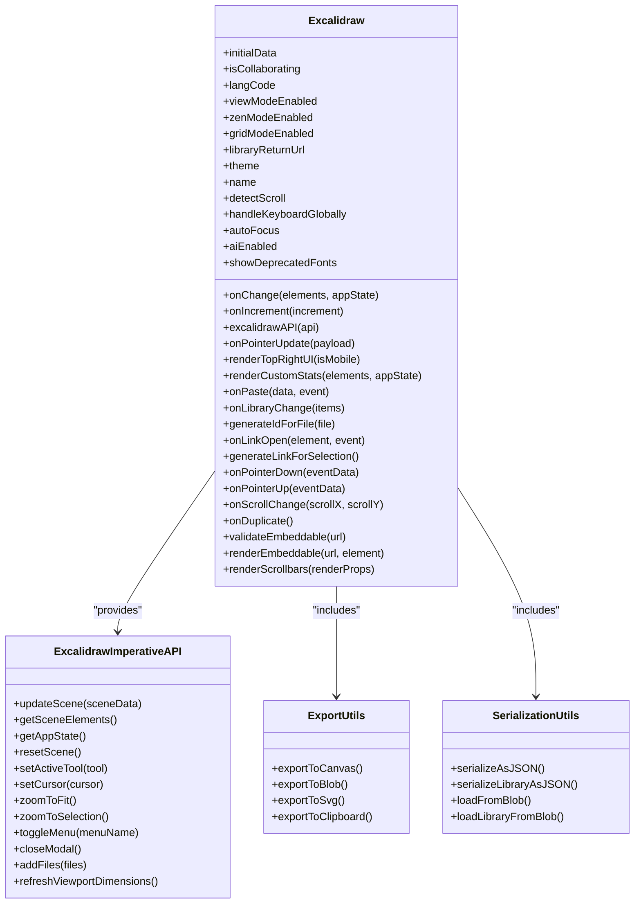

# API Reference

<cite>
**Referenced Files in This Document**   
- [routes.ts](file://Backned/src/routes.ts)
- [index.ts](file://excalidraw-room/src/index.ts)
- [index.tsx](file://excalidraw/packages/excalidraw/index.tsx)
</cite>

## Table of Contents
1. [Introduction](#introduction)
2. [RESTful API](#restful-api)
3. [WebSocket API](#websocket-api)
4. [Frontend Component API](#frontend-component-api)
5. [Client Integration Examples](#client-integration-examples)
6. [Security Considerations](#security-considerations)
7. [Rate Limiting and Versioning](#rate-limiting-and-versioning)
8. [Deprecation Policy](#deprecation-policy)

## Introduction
This document provides comprehensive API documentation for the Excalidraw application, covering RESTful endpoints, WebSocket real-time collaboration, and the frontend React component interface. The documentation includes detailed specifications for request/response formats, authentication mechanisms, error handling, and integration guidelines for developers building on the Excalidraw platform.

## RESTful API

The Excalidraw backend provides a RESTful API for scene persistence, permalink management, and administrative operations. The API is implemented in `Backned/src/routes.ts` and exposes endpoints for storing and retrieving drawing scenes, managing shareable links, and administrative teacher account management.

### Scenes Endpoints

#### GET /api/scenes/:roomId
Retrieves a stored scene by room ID.

**Request**
- Method: GET
- URL Pattern: `/api/scenes/{roomId}`
- Authentication: None

**Response**
```json
{
  "room_id": "string",
  "scene_version": "number",
  "iv": "string",
  "ciphertext": "string",
  "updated_at": "string"
}
```

**Status Codes**
- 200: Scene found
- 404: Scene not found
- 500: Internal server error

#### POST /api/scenes/:roomId
Saves or updates a scene for a specific room.

**Request**
- Method: POST
- URL Pattern: `/api/scenes/{roomId}`
- Authentication: None
- Content-Type: `application/json`

**Request Body**
```json
{
  "scene_version": "number",
  "iv": "string",
  "ciphertext": "string"
}
```

**Validation Rules**
- `scene_version` must be a number
- `iv` must be a string
- `ciphertext` must be a string

**Response**
```json
{ "ok": true }
```

**Status Codes**
- 200: Scene saved successfully
- 400: Invalid payload
- 500: Internal server error

#### POST /api/scenes/
Creates a new scene with a randomly generated room ID.

**Request**
- Method: POST
- URL Pattern: `/api/scenes/`
- Authentication: None
- Content-Type: `application/octet-stream`
- Body: Raw binary data (encrypted scene)

**Response**
```json
{ "id": "string" }
```
Returns the generated room ID.

**Status Codes**
- 200: Scene created successfully
- 400: Invalid payload
- 500: Internal server error

### Permalinks API

#### POST /api/permalinks
Creates a shareable permalink that maps to a room ID and encryption key.

**Request**
- Method: POST
- URL Pattern: `/api/permalinks`
- Authentication: None
- Content-Type: `application/json`

**Request Body**
```json
{
  "room_id": "string",
  "room_key": "string",
  "student_name": "string",
  "teacher_id": "string"
}
```

**Response**
```json
{ "permalink": "string" }
```

**Status Codes**
- 200: Permalink created or existing one returned
- 400: Invalid payload
- 500: Internal server error

#### GET /api/permalinks/:permalink
Resolves a permalink to its associated room information.

**Request**
- Method: GET
- URL Pattern: `/api/permalinks/{permalink}`
- Authentication: None

**Response**
```json
{
  "roomId": "string",
  "roomKey": "string",
  "studentName": "string"
}
```

**Status Codes**
- 200: Permalink resolved successfully
- 404: Permalink not found
- 500: Internal server error

#### GET /api/permalinks
Lists all active permalinks for a teacher.

**Request**
- Method: GET
- URL Pattern: `/api/permalinks?teacher_id={teacherId}`
- Authentication: None

**Query Parameters**
- `teacher_id`: Required teacher identifier

**Response**
```json
{
  "items": [
    {
      "permalink": "string",
      "room_id": "string",
      "room_key": "string",
      "student_name": "string",
      "created_at": "string",
      "last_accessed": "string",
      "is_active": "boolean"
    }
  ]
}
```

**Status Codes**
- 200: Permalinks retrieved successfully
- 400: Missing teacher_id parameter
- 500: Internal server error

#### DELETE /api/permalinks/:permalink
Deactivates a permalink (teacher-managed).

**Request**
- Method: DELETE
- URL Pattern: `/api/permalinks/{permalink}?teacher_id={teacherId}`
- Authentication: None

**Query Parameters**
- `teacher_id`: Required teacher identifier

**Response**
```json
{ "ok": true }
```

**Status Codes**
- 200: Permalink deactivated successfully
- 400: Missing teacher_id parameter
- 500: Internal server error

### Admin Endpoints

#### POST /api/admin/teachers
Creates a new teacher account (admin-protected).

**Request**
- Method: POST
- URL Pattern: `/api/admin/teachers`
- Authentication: x-admin-token header
- Content-Type: `application/json`

**Request Body**
```json
{
  "name": "string",
  "email": "string"
}
```

**Response**
```json
{
  "teacher_id": "string",
  "token": "string"
}
```

**Status Codes**
- 200: Teacher created successfully
- 400: Invalid payload
- 403: Forbidden (invalid admin token)
- 500: Internal server error

#### POST /api/admin/teachers/upload
Bulk creates teacher accounts from CSV data.

**Request**
- Method: POST
- URL Pattern: `/api/admin/teachers/upload`
- Authentication: x-admin-token header
- Content-Type: `application/json`

**Request Body**
```json
{ "csv": "string" }
```
CSV format: `name,email` (header optional)

**Response**
```json
{
  "items": [
    {
      "teacher_id": "string",
      "token": "string",
      "name": "string",
      "email": "string"
    }
  ]
}
```

**Status Codes**
- 200: Teachers created successfully
- 400: Invalid payload
- 403: Forbidden (invalid admin token)
- 500: Internal server error

#### GET /api/admin/teachers
Lists all teacher accounts (admin-protected).

**Request**
- Method: GET
- URL Pattern: `/api/admin/teachers`
- Authentication: x-admin-token header

**Response**
```json
{
  "items": [
    {
      "teacher_id": "string",
      "name": "string",
      "email": "string",
      "token": "string",
      "created_at": "string",
      "last_accessed": "string",
      "is_active": "boolean"
    }
  ]
}
```

**Status Codes**
- 200: Teachers retrieved successfully
- 403: Forbidden (invalid admin token)
- 500: Internal server error

**Section sources**
- [routes.ts](file://Backned/src/routes.ts#L1-L365)

## WebSocket API

The Excalidraw real-time collaboration system is implemented in `excalidraw-room/src/index.ts` and provides WebSocket-based communication for multi-user editing sessions.

### Connection Establishment

Clients connect to the WebSocket server and join rooms to participate in collaborative editing sessions.



**Diagram sources**
- [index.ts](file://excalidraw-room/src/index.ts#L1-L318)

### Message Types

#### Join Room
- Event: `join-room`
- Payload: `string` (room ID)
- Purpose: Joins the client to a specific collaboration room

#### Broadcast Updates
- Event: `server-broadcast`
- Payload: `(roomID: string, encryptedData: ArrayBuffer, iv: Uint8Array)`
- Purpose: Broadcasts encrypted scene updates to all other clients in the room

- Event: `server-volatile-broadcast`
- Payload: `(roomID: string, encryptedData: ArrayBuffer, iv: Uint8Array)`
- Purpose: Volatile broadcast of scene updates (packets may be dropped if slow)

#### Real-time User Following
- Event: `user-follow`
- Payload: `OnUserFollowedPayload`
```typescript
{
  userToFollow: { socketId: string, username: string },
  action: "FOLLOW" | "UNFOLLOW"
}
```
- Purpose: Enables one user to follow another user's viewport in real-time

#### Client Receive Events
- Event: `client-broadcast`
- Payload: `(encryptedData: ArrayBuffer, iv: Uint8Array)`
- Source: Broadcast from other clients in the room

- Event: `new-user`
- Payload: `string` (socket ID)
- Source: Emitted when a new user joins the room

- Event: `room-user-change`
- Payload: `string[]` (list of socket IDs)
- Source: Emitted when users join or leave the room

- Event: `user-follow-room-change`
- Payload: `string[]` (list of follower socket IDs)
- Source: Emitted when followers change for a user

- Event: `broadcast-unfollow`
- Payload: None
- Source: Emitted when last follower leaves a follow room

### Disconnection Handling
When a client disconnects, the server:
1. Removes the client from all rooms
2. Notifies other clients in shared rooms of the disconnection
3. Cleans up follow rooms when the last follower leaves
4. Emits `room-user-change` events to update participant lists

**Section sources**
- [index.ts](file://excalidraw-room/src/index.ts#L1-L318)

## Frontend Component API

The Excalidraw React component is the primary interface for embedding the drawing application in web applications. The component is exported from `excalidraw/packages/excalidraw/index.tsx`.

### Props

The Excalidraw component accepts the following props:

#### Core Functionality Props
- `onChange`: `(elements: NonDeletedExcalidrawElement[], appState: AppState) => void`
  - Callback fired when elements or app state change
- `onIncrement`: `(increment: number) => void`
  - Callback for scene version incrementing
- `initialData`: `InitialData`
  - Initial scene data to load
- `excalidrawAPI`: `(api: ExcalidrawImperativeAPI) => void`
  - Callback to receive the imperative API instance
- `isCollaborating`: `boolean` (default: false)
  - Indicates whether the user is in a collaboration session

#### Interaction Props
- `onPointerUpdate`: `(payload: { pointer: { x: number; y: number }; button: "down" | "up"; pointersMap: Map<any, any> }) => void`
  - Callback for pointer movement updates
- `onPointerDown`: `(eventData: { pointerDown: { x: number; y: number }; button: number; pointersMap: Map<any, any> }) => void`
  - Callback for pointer down events
- `onPointerUp`: `(eventData: { pointer: { x: number; y: number }; button: number; pointersMap: Map<any, any> }) => void`
  - Callback for pointer up events
- `onScrollChange`: `(scrollX: number, scrollY: number) => void`
  - Callback for scroll position changes
- `onPaste`: `(data: { text: string; html: string }, event: ClipboardEvent) => boolean`
  - Callback for paste events, return true to prevent default

#### UI Configuration Props
- `langCode`: `string` (default: browser language)
  - Language code for localization
- `viewModeEnabled`: `boolean`
  - Enables view-only mode
- `zenModeEnabled`: `boolean`
  - Enables distraction-free zen mode
- `gridModeEnabled`: `boolean`
  - Enables grid display
- `theme`: `"light" | "dark"`
  - Color theme
- `name`: `string`
  - Name of the drawing
- `renderTopRightUI`: `(isMobile: boolean) => JSX.Element`
  - Custom UI to render in the top-right corner
- `renderCustomStats`: `(elements: readonly ExcalidrawElement[], appState: AppState) => JSX.Element`
  - Custom stats component to replace default stats
- `renderScrollbars`: `(renderProps: { overlay: boolean }) => React.ReactNode`
  - Custom scrollbar renderer
- `autoFocus`: `boolean` (default: false)
  - Whether to autofocus the canvas on mount
- `detectScroll`: `boolean` (default: true)
  - Whether to detect and respond to scroll events
- `handleKeyboardGlobally`: `boolean` (default: false)
  - Whether keyboard events should be handled globally

#### Library and Export Props
- `libraryReturnUrl`: `string`
  - URL to return to when closing the library
- `onLibraryChange`: `(items: LibraryItems) => void`
  - Callback when library items change
- `generateIdForFile`: `(file: File) => string | Promise<string>`
  - Function to generate IDs for files
- `UIOptions`: `UIOptions`
  - Configuration object for UI elements visibility
- `onDuplicate`: `() => void`
  - Callback when duplicate action is triggered

#### Link and Embed Props
- `onLinkOpen`: `(element: ExcalidrawElement, event: CustomEvent) => void`
  - Callback when a link is opened
- `generateLinkForSelection`: `() => string | null`
  - Function to generate links for selected elements
- `validateEmbeddable`: `(url: string) => boolean | Promise<boolean>`
  - Function to validate embeddable URLs
- `renderEmbeddable`: `(url: string, element: ExcalidrawTextElement) => JSX.Element | null`
  - Custom renderer for embeddable content

#### Advanced Props
- `aiEnabled`: `boolean` (default: true)
  - Whether AI features are enabled
- `showDeprecatedFonts`: `boolean`
  - Whether to show deprecated fonts in the font menu
- `children`: `ReactNode`
  - Child components to render within the Excalidraw component

### Imperative API

The Excalidraw component provides an imperative API through the `excalidrawAPI` prop, which exposes methods for programmatic control:

- `updateScene`: Update the scene with new elements or app state
- `getSceneElements`: Get the current array of elements
- `getAppState`: Get the current app state
- `resetScene`: Reset the scene to initial state
- `setActiveTool`: Change the active tool
- `setCursor`: Set the cursor style
- `zoomToFit`: Zoom to fit all elements
- `zoomToSelection`: Zoom to fit selected elements
- `toggleMenu`: Open or close a specific menu
- `closeModal`: Close the currently open modal
- `addFiles`: Add files to the scene
- `refreshViewportDimensions`: Refresh viewport dimensions

### Exported Utilities

The package exports several utility functions for working with Excalidraw data:

- `exportToCanvas`, `exportToBlob`, `exportToSvg`, `exportToClipboard`: Export utilities
- `serializeAsJSON`, `serializeLibraryAsJSON`: Serialization functions
- `loadFromBlob`, `loadLibraryFromBlob`: Loading functions
- `restore`, `restoreAppState`, `restoreElements`: Scene restoration
- `reconcileElements`: Element reconciliation
- `mergeLibraryItems`, `getLibraryItemsHash`: Library management
- `sceneCoordsToViewportCoords`, `viewportCoordsToSceneCoords`: Coordinate conversion



**Diagram sources**
- [index.tsx](file://excalidraw/packages/excalidraw/index.tsx#L1-L309)

**Section sources**
- [index.tsx](file://excalidraw/packages/excalidraw/index.tsx#L1-L309)

## Client Integration Examples

### Basic Embedding
```typescript
import { Excalidraw } from "@excalidraw/excalidraw";

function MyDrawingApp() {
  return (
    <div style={{ height: "100vh" }}>
      <Excalidraw />
    </div>
  );
}
```

### With Change Callback
```typescript
import { Excalidraw } from "@excalidraw/excalidraw";

function MyDrawingApp() {
  const onChange = (elements, appState) => {
    console.log("Elements changed:", elements);
    console.log("App state changed:", appState);
  };

  return (
    <div style={{ height: "100vh" }}>
      <Excalidraw onChange={onChange} />
    </div>
  );
}
```

### With Initial Data
```typescript
import { Excalidraw } from "@excalidraw/excalidraw";

const initialData = {
  elements: [
    {
      type: "rectangle",
      version: 1,
      versionNonce: 0,
      isDeleted: false,
      id: "id1",
      fillStyle: "hachure",
      strokeWidth: 1,
      strokeStyle: "solid",
      roughness: 1,
      opacity: 100,
      angle: 0,
      x: 100,
      y: 100,
      strokeColor: "#000000",
      backgroundColor: "transparent",
      width: 100,
      height: 100,
      seed: 1,
      points: null,
      pressure: null,
      simulatePressure: null,
      lastCommittedPoint: null,
      boundElementIds: null
    }
  ],
  appState: {
    viewBackgroundColor: "#ffffff"
  }
};

function MyDrawingApp() {
  return (
    <div style={{ height: "100vh" }}>
      <Excalidraw initialData={initialData} />
    </div>
  );
}
```

### With Custom UI Options
```typescript
import { Excalidraw } from "@excalidraw/excalidraw";

function MyDrawingApp() {
  return (
    <div style={{ height: "100vh" }}>
      <Excalidraw
        viewModeEnabled={true}
        zenModeEnabled={false}
        gridModeEnabled={true}
        theme="light"
        name="My Custom Drawing"
        UIOptions={{
          canvasActions: {
            loadScene: false,
            export: {
              saveFileToDisk: true
            }
          },
          tools: {
            image: true
          }
        }}
      />
    </div>
  );
}
```

### With Imperative API Access
```typescript
import { Excalidraw } from "@excalidraw/excalidraw";
import { useRef } from "react";

function MyDrawingApp() {
  const excalidrawRef = useRef(null);

  const handleExport = () => {
    if (excalidrawRef.current) {
      const canvas = excalidrawRef.current.exportToCanvas();
      // Use the canvas element
    }
  };

  return (
    <div style={{ height: "100vh" }}>
      <button onClick={handleExport}>Export to Canvas</button>
      <Excalidraw 
        excalidrawAPI={(api) => {
          excalidrawRef.current = api;
        }} 
      />
    </div>
  );
}
```

### Collaborative Editing Setup
```typescript
import { Excalidraw } from "@excalidraw/excalidraw";
import io from "socket.io-client";

class CollaborativeExcalidraw {
  constructor(roomId) {
    this.roomId = roomId;
    this.socket = io();
    this.isSyncing = false;
  }

  setup() {
    // Join collaboration room
    this.socket.emit("join-room", this.roomId);

    // Listen for updates from other clients
    this.socket.on("client-broadcast", (encryptedData, iv) => {
      if (!this.isSyncing) {
        // Apply the update to local scene
        this.applyRemoteUpdate(encryptedData, iv);
      }
    });

    // Broadcast local changes
    this.onChange = (elements, appState) => {
      if (this.pendingSync) return;
      
      const updateData = this.encryptScene(elements, appState);
      this.socket.emit("server-broadcast", this.roomId, updateData.encrypted, updateData.iv);
    };
  }

  applyRemoteUpdate(encryptedData, iv) {
    this.isSyncing = true;
    try {
      const decryptedData = this.decrypt(encryptedData, iv);
      this.excalidrawRef.current.updateScene(decryptedData);
    } finally {
      this.isSyncing = false;
    }
  }
}
```

## Security Considerations

### Data Encryption
All scene data is transmitted and stored in encrypted form:
- Client-side encryption using AES-GCM
- Initialization vectors (IV) stored separately from ciphertext
- Encryption keys never transmitted to or stored on the server
- Permalink system allows secure sharing without exposing encryption keys

### Authentication and Authorization
- Admin endpoints protected by `x-admin-token` header
- Teacher-specific endpoints require teacher ID and token verification
- No authentication required for basic scene operations
- Rate limiting should be implemented at the reverse proxy level

### Input Validation
- All API endpoints validate input types and structures
- Database queries use parameterized statements to prevent SQL injection
- Scene data is validated on both client and server sides
- Binary data endpoints have size limits (10MB maximum)

### Secure Headers
- CORS headers configurable via environment variables
- Content-Type validation for all requests
- Secure HTTP headers should be configured at the reverse proxy level
- HTTPS required in production environments

### Best Practices
- Use environment variables for sensitive configuration
- Rotate admin and teacher tokens periodically
- Monitor API usage for suspicious patterns
- Implement client-side rate limiting for frequent operations
- Validate and sanitize all user-generated content

## Rate Limiting and Versioning

### Rate Limiting
The Excalidraw API does not implement built-in rate limiting. It is recommended to implement rate limiting at the infrastructure level:

- **REST API**: Limit to 100 requests per minute per IP address
- **WebSocket Connections**: Limit to 10 concurrent connections per IP
- **Admin Endpoints**: Stricter limits of 10 requests per minute

Example Nginx configuration:
```nginx
limit_req_zone $binary_remote_addr zone=api:10m rate=100r/m;
limit_req_zone $binary_remote_addr zone=admin:10m rate=10r/m;

location /api/ {
    limit_req zone=api burst=20;
    # ... other configuration
}

location /api/admin/ {
    limit_req zone=admin burst=5;
    # ... other configuration
}
```

### Versioning Strategy
The API uses a semantic versioning approach:

- **URL Versioning**: Current version is v1 (no version prefix in URLs)
- **Header Versioning**: Future versions may use `Accept-Version` header
- **Backward Compatibility**: Major version changes will maintain backward compatibility through redirects or proxy handlers
- **Deprecation Period**: Deprecated endpoints will remain functional for 6 months after announcement

Current version: 1.0.0  
Release date: Not specified in code

## Deprecation Policy

### Deprecation Process
1. **Announcement**: Deprecation announced in release notes and documentation
2. **Maintenance Period**: Deprecated endpoints remain functional for 6 months
3. **Warning Headers**: Responses include `Warning` headers for deprecated endpoints
4. **Removal**: After 6 months, endpoints are removed and return 410 Gone

### Currently Deprecated
No endpoints are currently deprecated.

### Future Deprecation Notices
- The binary `/api/:id` endpoint may be deprecated in favor of JSON endpoints
- Legacy teacher authentication methods may be deprecated for OAuth2
- WebSocket v1 protocol may be replaced with a more efficient binary protocol

Developers are encouraged to:
- Monitor release notes for deprecation announcements
- Test applications against new versions before production deployment
- Implement graceful handling of 410 Gone responses
- Use the health endpoint to check API status and version

**Section sources**
- [routes.ts](file://Backned/src/routes.ts#L1-L365)
- [index.ts](file://excalidraw-room/src/index.ts#L1-L318)
- [index.tsx](file://excalidraw/packages/excalidraw/index.tsx#L1-L309)