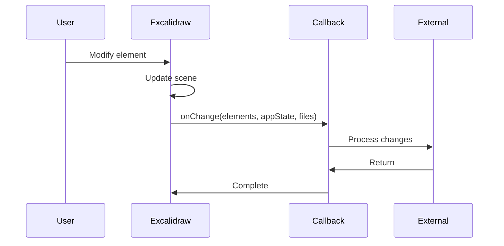
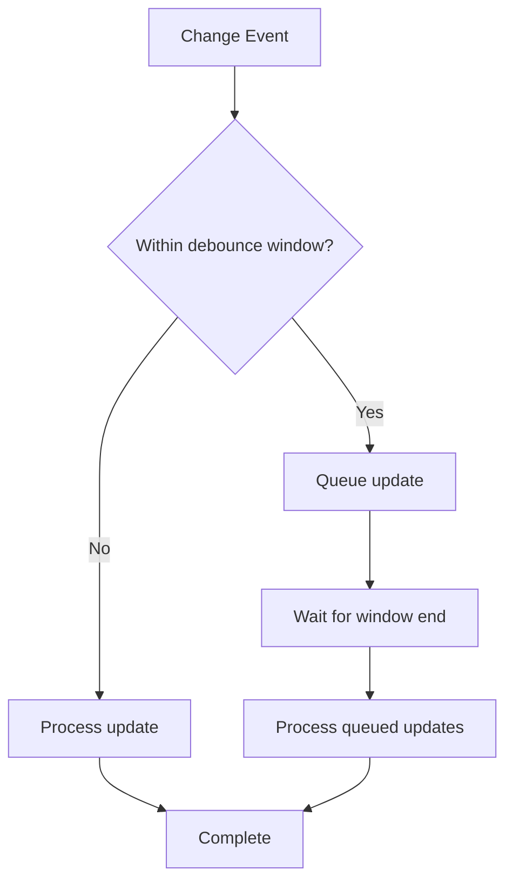
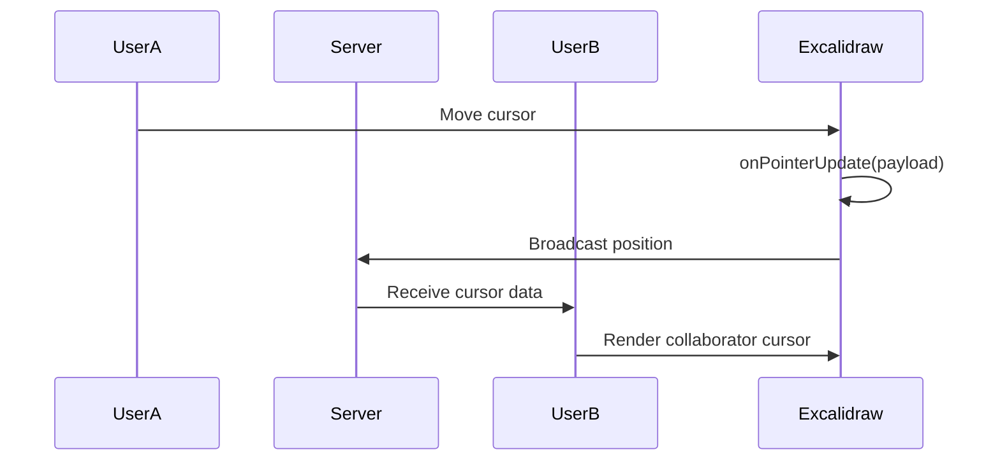
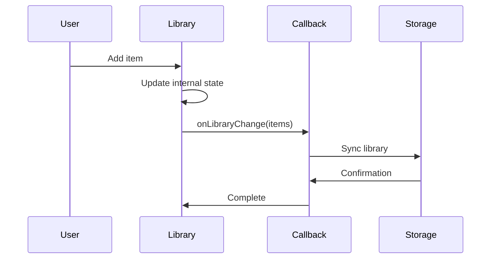
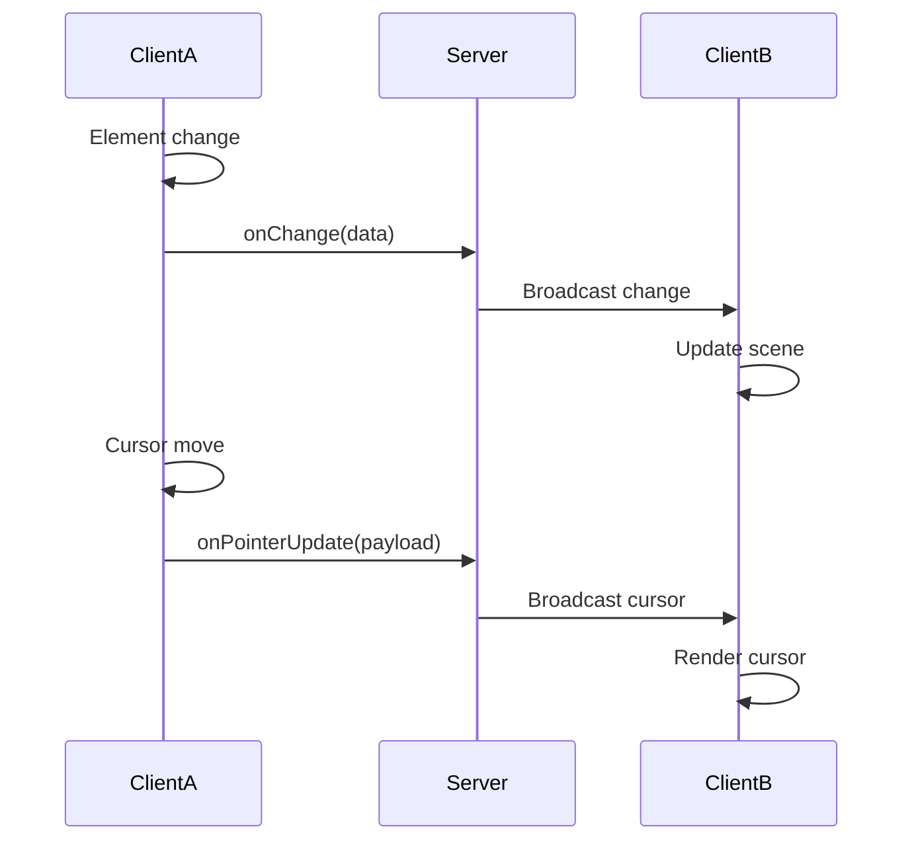
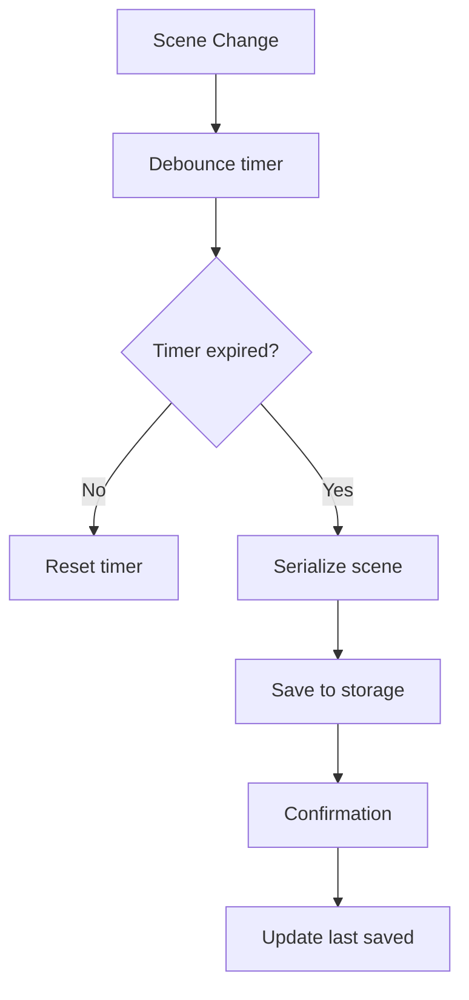
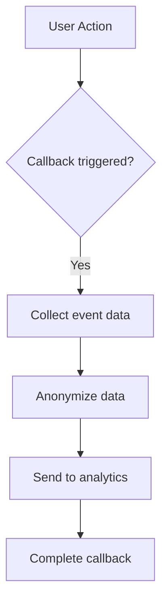
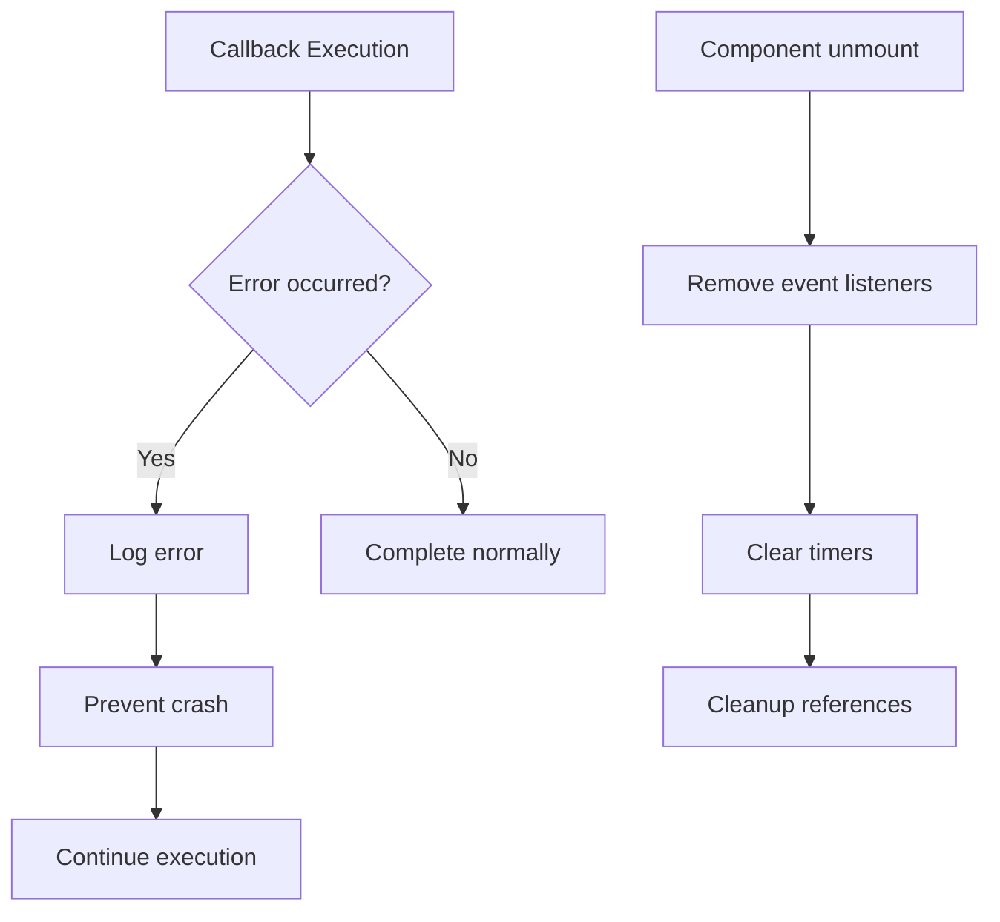
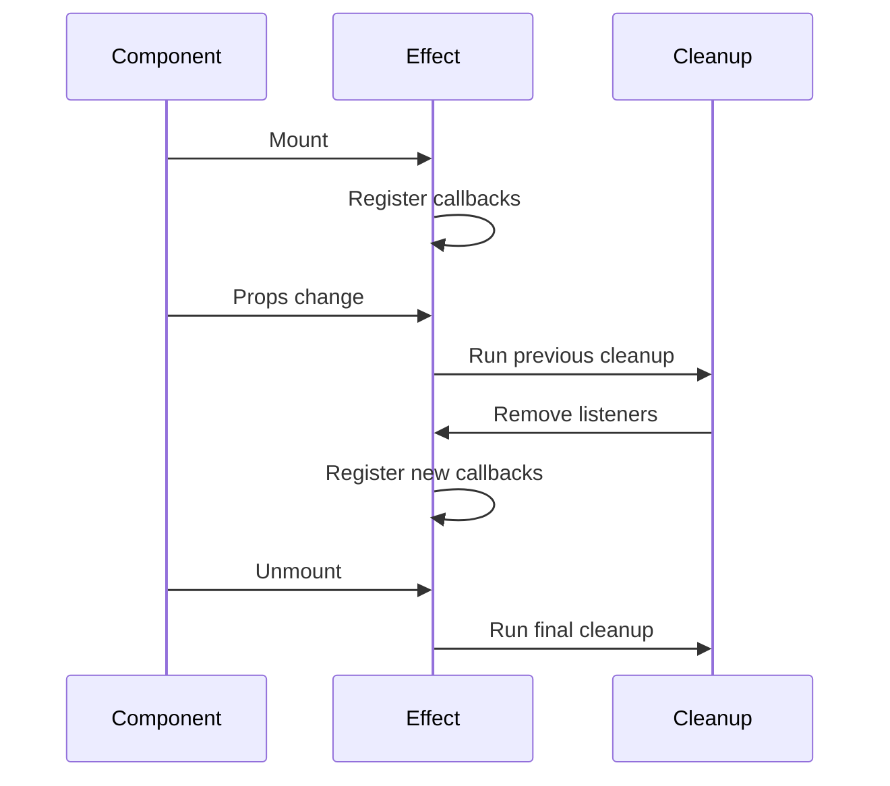

# Callback Handlers

<cite>
**Referenced Files in This Document**   
- [types.ts](file://excalidraw/packages/excalidraw/types.ts)
- [appState.ts](file://excalidraw/packages/excalidraw/appState.ts)
- [App.tsx](file://excalidraw/packages/excalidraw/components/App.tsx)
- [library.ts](file://excalidraw/packages/excalidraw/data/library.ts)
- [events.test.tsx](file://excalidraw/packages/excalidraw/tests/packages/events.test.tsx)
- [useStableCallback.ts](file://excalidraw/packages/excalidraw/hooks/useStableCallback.ts)
</cite>

## Table of Contents
1. [Introduction](#introduction)
2. [onChange Callback](#onchange-callback)
3. [onPointerUpdate Callback](#onpointerupdate-callback)
4. [onPaste Callback](#onpaste-callback)
5. [onLibraryChange Callback](#onlibrarychange-callback)
6. [Callback Argument Structure](#callback-argument-structure)
7. [Implementation Examples](#implementation-examples)
8. [Error Handling and Cleanup](#error-handling-and-cleanup)
9. [Conclusion](#conclusion)

## Introduction
Excalidraw provides a comprehensive callback system that enables developers to respond to user interactions, scene changes, and collaborative events. This documentation details the available callback handlers, their signatures, parameter structures, and practical implementation patterns for real-time collaboration, auto-saving, and analytics tracking.

**Section sources**
- [types.ts](file://excalidraw/packages/excalidraw/types.ts#L1-L50)

## onChange Callback
The `onChange` callback is triggered whenever the scene state changes, including element modifications, app state updates, or file additions. It receives three parameters: elements array, appState object, and binaryFiles map.



**Diagram sources**
- [types.ts](file://excalidraw/packages/excalidraw/types.ts#L500-L520)
- [events.test.tsx](file://excalidraw/packages/excalidraw/tests/packages/events.test.tsx#L53-L67)

To efficiently process scene changes, implement debouncing to avoid excessive processing:



**Diagram sources**
- [useStableCallback.ts](file://excalidraw/packages/excalidraw/hooks/useStableCallback.ts#L1-L17)
- [App.tsx](file://excalidraw/packages/excalidraw/components/App.tsx#L11074-L11131)

**Section sources**
- [types.ts](file://excalidraw/packages/excalidraw/types.ts#L500-L550)
- [App.tsx](file://excalidraw/packages/excalidraw/components/App.tsx#L11074-L11131)

## onPointerUpdate Callback
The `onPointerUpdate` callback tracks cursor movements for collaborative scenarios, providing real-time presence indicators. It receives a payload containing pointer coordinates, button state, and pointers map for multi-touch gestures.



**Diagram sources**
- [types.ts](file://excalidraw/packages/excalidraw/types.ts#L550-L570)
- [App.tsx](file://excalidraw/packages/excalidraw/components/App.tsx#L11074-L11131)

The callback payload includes:
- `pointer`: Object with x, y coordinates and tool type (pointer or laser)
- `button`: Current button state (down or up)
- `pointersMap`: Map of all active pointers for gesture recognition

**Section sources**
- [types.ts](file://excalidraw/packages/excalidraw/types.ts#L550-L570)
- [gesture.ts](file://excalidraw/packages/excalidraw/gesture.ts#L1-L14)

## onPaste Callback
The `onPaste` callback handles custom paste logic, allowing interception and modification of clipboard data before processing. It receives clipboard data and the original event, returning a boolean to indicate whether default paste behavior should proceed.

```mermaid
flowchart TD
A[Paste Event] --> B{onPaste defined?}
B --> |Yes| C[Call onPaste(data, event)]
C --> D{Return false?}
D --> |Yes| E[Cancel paste]
D --> |No| F[Proceed with paste]
B --> |No| F
F --> G[Process clipboard data]
G --> H[Add elements to scene]
```

**Diagram sources**
- [types.ts](file://excalidraw/packages/excalidraw/types.ts#L570-L590)
- [App.tsx](file://excalidraw/packages/excalidraw/components/App.tsx#L3047-L3089)

The clipboard data structure includes:
- `text`: Plain text content
- `spreadsheet`: Parsed spreadsheet data
- `mixedContent`: Array of text and image URL items
- `files`: Map of file objects

**Section sources**
- [types.ts](file://excalidraw/packages/excalidraw/types.ts#L570-L590)
- [clipboard.ts](file://excalidraw/packages/excalidraw/clipboard.ts#L200-L393)

## onLibraryChange Callback
The `onLibraryChange` callback is invoked when library items are updated, added, or removed. It receives the complete library items array, enabling synchronization with external storage systems.



**Diagram sources**
- [library.ts](file://excalidraw/packages/excalidraw/data/library.ts#L197-L239)
- [types.ts](file://excalidraw/packages/excalidraw/types.ts#L590-L610)

The callback is triggered after successful library updates and receives a readonly array of `LibraryItem` objects containing:
- `id`: Unique identifier
- `status`: Published or unpublished
- `elements`: Array of non-deleted elements
- `created`: Timestamp in milliseconds
- `name`: Optional library name

**Section sources**
- [library.ts](file://excalidraw/packages/excalidraw/data/library.ts#L197-L239)
- [types.ts](file://excalidraw/packages/excalidraw/types.ts#L150-L180)

## Callback Argument Structure
The callback arguments are structured using types defined in `appState.ts` and `elements.ts`. The `AppState` interface contains comprehensive UI and interaction state, while element types define the drawing primitives.

```mermaid
classDiagram
class AppState {
+showWelcomeScreen : boolean
+theme : Theme
+collaborators : Map<SocketId, Collaborator>
+currentItemStrokeColor : string
+currentItemBackgroundColor : string
+selectedElementIds : { [id : string] : true }
+scrollX : number
+scrollY : number
+zoom : Zoom
+viewBackgroundColor : string
}
class Collaborator {
+pointer : CollaboratorPointer
+button : "up" | "down"
+selectedElementIds : AppState["selectedElementIds"]
+username : string | null
+color : { background : string, stroke : string }
}
class CollaboratorPointer {
+x : number
+y : number
+tool : "pointer" | "laser"
+renderCursor : boolean
+laserColor : string
}
class LibraryItem {
+id : string
+status : "published" | "unpublished"
+elements : NonDeleted<ExcalidrawElement>[]
+created : number
+name : string
}
AppState --> Collaborator : "has"
AppState --> LibraryItem : "contains"
```

**Diagram sources**
- [appState.ts](file://excalidraw/packages/excalidraw/appState.ts#L1-L300)
- [types.ts](file://excalidraw/packages/excalidraw/types.ts#L1-L799)

**Section sources**
- [appState.ts](file://excalidraw/packages/excalidraw/appState.ts#L1-L300)
- [types.ts](file://excalidraw/packages/excalidraw/types.ts#L1-L799)

## Implementation Examples
### Real-time Collaboration Sync
Implement real-time collaboration by combining `onChange` and `onPointerUpdate` callbacks to synchronize scene state and cursor positions across clients.



**Diagram sources**
- [types.ts](file://excalidraw/packages/excalidraw/types.ts#L500-L570)
- [App.tsx](file://excalidraw/packages/excalidraw/components/App.tsx#L11074-L11131)

### Auto-saving Mechanism
Create an auto-saving mechanism using `onChange` with debouncing to periodically persist scene state to external storage.



**Diagram sources**
- [useStableCallback.ts](file://excalidraw/packages/excalidraw/hooks/useStableCallback.ts#L1-L17)
- [App.tsx](file://excalidraw/packages/excalidraw/components/App.tsx#L11074-L11131)

### Analytics Tracking
Implement analytics tracking by wrapping callbacks to monitor user interactions and feature usage patterns.



**Diagram sources**
- [analytics.ts](file://excalidraw/packages/excalidraw/analytics.ts#L1-L50)
- [types.ts](file://excalidraw/packages/excalidraw/types.ts#L500-L610)

**Section sources**
- [types.ts](file://excalidraw/packages/excalidraw/types.ts#L500-L610)
- [App.tsx](file://excalidraw/packages/excalidraw/components/App.tsx#L11074-L11131)

## Error Handling and Cleanup
Proper error handling within callbacks is essential to maintain application stability. Always wrap callback logic in try-catch blocks and implement proper cleanup in React useEffect or equivalent lifecycle methods.



**Diagram sources**
- [App.tsx](file://excalidraw/packages/excalidraw/components/App.tsx#L2664-L2685)
- [useStableCallback.ts](file://excalidraw/packages/excalidraw/hooks/useStableCallback.ts#L1-L17)

When using React, implement cleanup in useEffect:



**Diagram sources**
- [App.tsx](file://excalidraw/packages/excalidraw/components/App.tsx#L2664-L2685)
- [useStableCallback.ts](file://excalidraw/packages/excalidraw/hooks/useStableCallback.ts#L1-L17)

**Section sources**
- [App.tsx](file://excalidraw/packages/excalidraw/components/App.tsx#L2664-L2685)
- [useStableCallback.ts](file://excalidraw/packages/excalidraw/hooks/useStableCallback.ts#L1-L17)

## Conclusion
Excalidraw's callback system provides comprehensive hooks for monitoring and responding to user interactions, scene changes, and collaborative events. By understanding the callback signatures, argument structures, and implementation patterns, developers can create rich integrations for real-time collaboration, auto-saving, and analytics tracking. Proper error handling and cleanup are essential for maintaining application stability and preventing memory leaks.