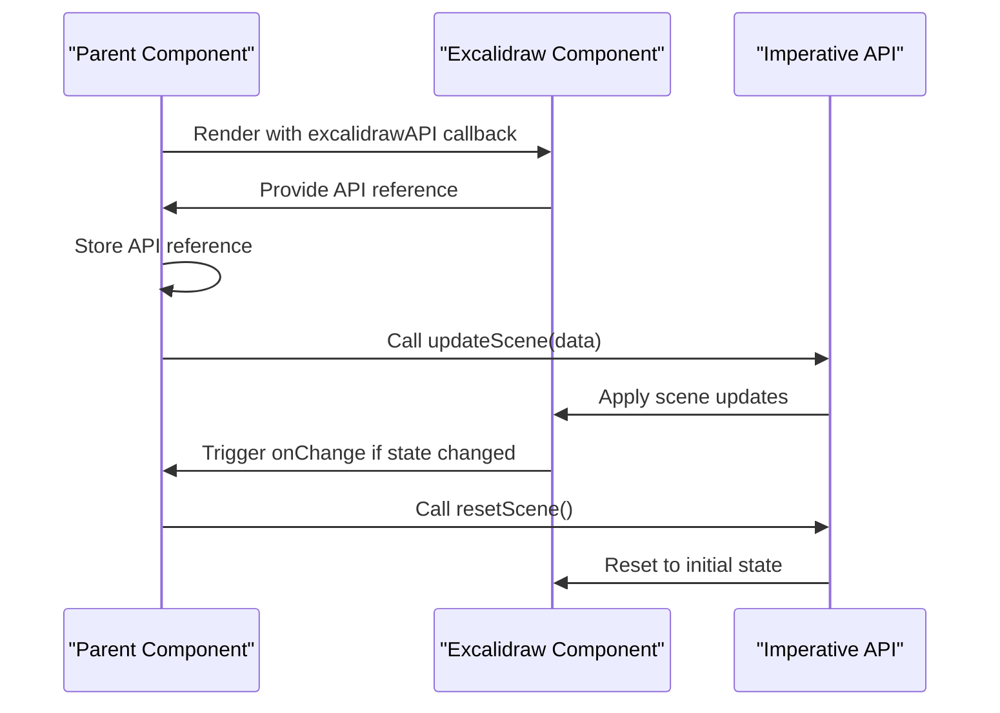
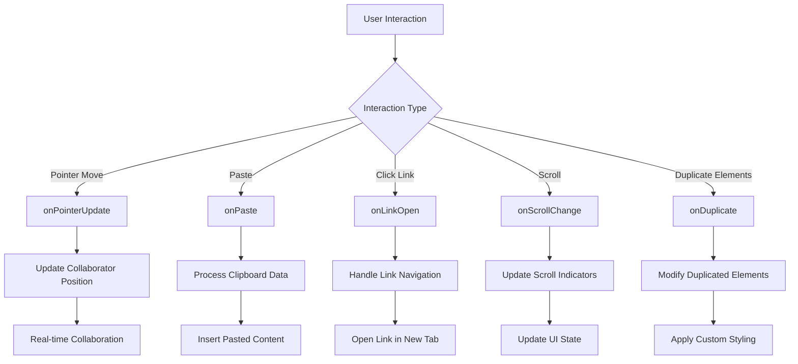

# Component API

<cite>
**Referenced Files in This Document**   
- [index.tsx](file://excalidraw/packages/excalidraw/index.tsx)
- [types.ts](file://excalidraw/packages/excalidraw/types.ts)
- [appState.ts](file://excalidraw/packages/excalidraw/appState.ts)
- [examples/with-nextjs/src/excalidrawWrapper.tsx](file://excalidraw/examples/with-nextjs/src/excalidrawWrapper.tsx)
- [excalidraw-app/react-theme-example.jsx](file://excalidraw/excalidraw-app/react-theme-example.jsx)
- [excalidraw-app/vue-theme-example.vue](file://excalidraw/excalidraw-app/vue-theme-example.vue)
- [excalidraw-app/angular-theme-example.component.ts](file://excalidraw/excalidraw-app/angular-theme-example.component.ts)
</cite>

## Table of Contents
1. [Introduction](#introduction)
2. [Core Props](#core-props)
3. [AppState Interface](#appstate-interface)
4. [onChange Callback](#onchange-callback)
5. [Imperative Methods](#imperative-methods)
6. [Embedding in Frameworks](#embedding-in-frameworks)
7. [Event Handling and Customization](#event-handling-and-customization)
8. [Performance Optimization](#performance-optimization)
9. [Lifecycle and Cleanup](#lifecycle-and-cleanup)

## Introduction
The Excalidraw React component provides a fully-featured collaborative drawing interface that can be embedded into any React application. This documentation details the public API, configuration options, and integration patterns for using Excalidraw in various environments. The component exposes a rich set of props for customization, state management, and event handling, making it suitable for integration into diverse applications requiring diagramming capabilities.

## Core Props

The Excalidraw component accepts a comprehensive set of props that control its behavior, appearance, and interaction with the host application. Key props include:

- **initialData**: Accepts either a direct object or a function returning a promise that resolves to scene data. This prop initializes the canvas with elements, app state, and collaborators.
- **onChange**: Callback function invoked when the scene changes, providing updated elements, app state, and binary files.
- **onCollabButtonClick**: While not explicitly named in the source, collaboration functionality is managed through the `isCollaborating` prop and `onPointerUpdate` callback which handles real-time collaboration events.
- **customElementHandler**: Implemented via `renderEmbeddable` and `validateEmbeddable` props, allowing custom rendering and validation of embeddable elements.

Additional configuration props include `viewModeEnabled`, `gridModeEnabled`, `zenModeEnabled`, and `theme`, which control the visual presentation and interaction modes of the canvas.

**Section sources**
- [index.tsx](file://excalidraw/packages/excalidraw/index.tsx#L30-L180)
- [types.ts](file://excalidraw/packages/excalidraw/types.ts#L500-L700)

## AppState Interface

The AppState interface defines the complete state of the Excalidraw component, encompassing both UI state and element state. Key configurable options include:

- **viewModeEnabled**: When true, hides UI controls and presents the drawing in a clean, presentation-friendly format.
- **gridModeEnabled**: Toggles the visibility of the grid overlay, aiding in precise element placement.
- **zenModeEnabled**: Activates a distraction-free drawing mode that minimizes UI elements.
- **theme**: Controls the color scheme (light/dark) of the interface.
- **objectsSnapModeEnabled**: Enables snapping of elements to each other and to the grid.
- **currentItem properties**: Control the default styling for newly created elements (stroke color, background color, font family, etc.).

The AppState also tracks interactive states such as `selectedElementIds`, `editingTextElement`, `collaborators`, and `scroll` position, providing a complete snapshot of the current canvas state.

```mermaid
classDiagram
class AppState {
+boolean viewModeEnabled
+boolean gridModeEnabled
+boolean zenModeEnabled
+Theme theme
+boolean objectsSnapModeEnabled
+string currentItemStrokeColor
+string currentItemBackgroundColor
+FontFamilyValues currentItemFontFamily
+number currentItemFontSize
+number scrollX
+number scrollY
+Zoom zoom
+Map~SocketId, Collaborator~ collaborators
+{ [id : string] : true } selectedElementIds
+ExcalidrawElement | null editingTextElement
}
class ExcalidrawProps {
+function onChange()
+initialData? ExcalidrawInitialDataState
+boolean isCollaborating
+function onPointerUpdate()
+Language code langCode
+boolean viewModeEnabled
+boolean zenModeEnabled
+boolean gridModeEnabled
+Theme theme
+string name
+Partial~UIOptions~ UIOptions
}
ExcalidrawProps --> AppState : "configures"
```

**Diagram sources**
- [types.ts](file://excalidraw/packages/excalidraw/types.ts#L200-L500)
- [index.tsx](file://excalidraw/packages/excalidraw/index.tsx#L30-L180)

## onChange Callback

The onChange callback is triggered whenever the scene state changes, providing the host application with the current state of the drawing. The callback signature is:

```typescript
onChange?: (
  elements: readonly OrderedExcalidrawElement[],
  appState: AppState,
  files: BinaryFiles
) => void;
```

This callback receives three parameters:
- **elements**: The current array of ordered elements on the canvas
- **appState**: The complete application state including UI state and selection
- **files**: Binary file data for images and other embedded content

For efficient handling of scene updates, applications should implement change detection to avoid unnecessary re-renders. The component uses shallow comparison to optimize rendering, and consumers should similarly compare previous and current states to determine if processing is needed.

**Section sources**
- [types.ts](file://excalidraw/packages/excalidraw/types.ts#L500-L520)
- [index.tsx](file://excalidraw/packages/excalidraw/index.tsx#L30-L180)

## Imperative Methods

The Excalidraw component exposes imperative methods through the `excalidrawAPI` prop, which provides access to the component's internal API. Key methods include:

- **updateScene**: Updates the scene with new elements, app state, or collaborators. Accepts a SceneData object containing any combination of elements, appState, and collaborators.
- **resetScene**: Clears the current scene and optionally loads new initial data. This method effectively resets the canvas to a clean state or initializes it with provided data.

These methods are accessed by passing a callback to the `excalidrawAPI` prop, which receives the API object as its parameter. This pattern allows parent components to store a reference to the API for later use in controlling the Excalidraw instance programmatically.



**Diagram sources**
- [index.tsx](file://excalidraw/packages/excalidraw/index.tsx#L30-L180)
- [types.ts](file://excalidraw/packages/excalidraw/types.ts#L500-L700)

## Embedding in Frameworks

The Excalidraw component can be embedded in various frameworks using wrapper patterns demonstrated in the examples directory. The component is designed to be framework-agnostic through its props-based API.

### React Integration
In React applications, the component is used directly as a JSX element with props passed according to the application's needs:

```jsx
<Excalidraw
  initialData={initialData}
  onChange={handleChange}
  viewModeEnabled={viewMode}
  theme={theme}
/>
```

### Vue Integration
For Vue applications, the component can be wrapped using Vue's render functions or composition API, passing props as reactive data:

```vue
<template>
  <div ref="excalidrawContainer"></div>
</template>
```

### Angular Integration
In Angular applications, the component is integrated through a wrapper component that bridges Angular's change detection with React's rendering:

```typescript
@Component({
  selector: 'app-excalidraw-wrapper',
  template: '<div #container></div>'
})
export class ExcalidrawWrapper {
  @ViewChild('container') container;
  // Use React DOM to render Excalidraw into the container
}
```

**Section sources**
- [react-theme-example.jsx](file://excalidraw/excalidraw-app/react-theme-example.jsx)
- [vue-theme-example.vue](file://excalidraw/excalidraw-app/vue-theme-example.vue)
- [angular-theme-example.component.ts](file://excalidraw/excalidraw-app/angular-theme-example.component.ts)

## Event Handling and Customization

The Excalidraw component provides extensive customization options through event callbacks and UI configuration props. Key customization points include:

- **Toolbar Customization**: Controlled through the `UIOptions` prop, which allows hiding or showing specific canvas actions like export, clear canvas, or theme toggle.
- **Event Handling**: The component exposes numerous callbacks for handling user interactions:
  - `onPointerUpdate`: Tracks cursor movements for collaboration scenarios
  - `onPaste`: Handles clipboard paste operations, allowing custom processing
  - `onLinkOpen`: Triggers when a user clicks on a linked element
  - `onScrollChange`: Notifies when the canvas scroll position changes

Custom elements can be rendered using the `renderEmbeddable` prop, which accepts a function that returns custom JSX for embeddable elements. Validation of embeddable content is handled through the `validateEmbeddable` prop, which can be a boolean, array of allowed domains, regular expression, or custom validation function.



**Diagram sources**
- [index.tsx](file://excalidraw/packages/excalidraw/index.tsx#L30-L180)
- [types.ts](file://excalidraw/packages/excalidraw/types.ts#L500-L700)

## Performance Optimization

For optimal performance with large scenes, consider the following strategies:

- **Efficient onChange Handling**: Implement memoization and change detection to avoid unnecessary processing of scene updates. Compare previous and current element arrays and app states to determine if meaningful changes occurred.
- **Lazy Loading**: When initializing with large datasets, consider using the function form of `initialData` to defer loading until the component mounts.
- **Binary File Management**: The `generateIdForFile` prop allows custom ID generation for binary files, enabling efficient caching and retrieval strategies.
- **Scroll and Keyboard Event Handling**: Configure `detectScroll` and `handleKeyboardGlobally` based on the embedding context to balance functionality with performance.
- **Throttled Updates**: In collaboration scenarios, consider batching updates to reduce network traffic and rendering overhead.

The component internally implements various optimizations including request animation frame throttling, element caching, and efficient rendering pipelines to handle complex scenes.

**Section sources**
- [index.tsx](file://excalidraw/packages/excalidraw/index.tsx#L30-L180)
- [types.ts](file://excalidraw/packages/excalidraw/types.ts#L500-L700)

## Lifecycle and Cleanup

Proper lifecycle management ensures optimal performance and prevents memory leaks:

- **Initialization**: The component sets up event listeners for touch, keyboard, and pointer events during mounting. These are automatically cleaned up on unmount.
- **Event Listener Cleanup**: All event listeners (touchmove, keyboard, pointer) are properly removed when the component unmounts, preventing memory leaks.
- **API Reference Management**: When using the `excalidrawAPI` callback, ensure any stored references are cleared in the parent component's cleanup phase.
- **Memory Management**: The component manages image caches and file data efficiently, with mechanisms to clean up unused binary files based on last retrieval time.

When embedding Excalidraw in long-lived applications, ensure that scene data is properly serialized and deserialized to maintain state across sessions, using the provided serialization utilities like `serializeAsJSON` and `restore`.

**Section sources**
- [index.tsx](file://excalidraw/packages/excalidraw/index.tsx#L150-L180)
- [types.ts](file://excalidraw/packages/excalidraw/types.ts#L500-L700)