# Component Props

<cite>
**Referenced Files in This Document**   
- [types.ts](file://excalidraw/packages/excalidraw/types.ts)
- [appState.ts](file://excalidraw/packages/excalidraw/appState.ts)
- [index.tsx](file://excalidraw/packages/excalidraw/index.tsx)
</cite>

## Table of Contents
1. [Introduction](#introduction)
2. [Core Props](#core-props)
3. [State Management Props](#state-management-props)
4. [UI Customization Props](#ui-customization-props)
5. [Collaboration Props](#collaboration-props)
6. [TypeScript Interfaces](#typescript-interfaces)
7. [Usage Examples](#usage-examples)
8. [Performance Considerations](#performance-considerations)
9. [Best Practices](#best-practices)

## Introduction
This document provides comprehensive documentation for the Excalidraw component props, detailing their purpose, usage, and implementation. The Excalidraw component is a collaborative drawing application that supports various customization options through its props system. This documentation covers the core functionality, state management, UI customization, collaboration features, and performance optimization strategies.

## Core Props

### initialData
The `initialData` prop allows preloading scenes with predefined content when initializing the Excalidraw component. It accepts either a direct data object or a function that returns a promise resolving to the initial data state.

This prop is essential for scenarios where you need to load existing drawings or templates when the component mounts. The data structure follows the `ExcalidrawInitialDataState` interface, which includes elements, app state, and library items.

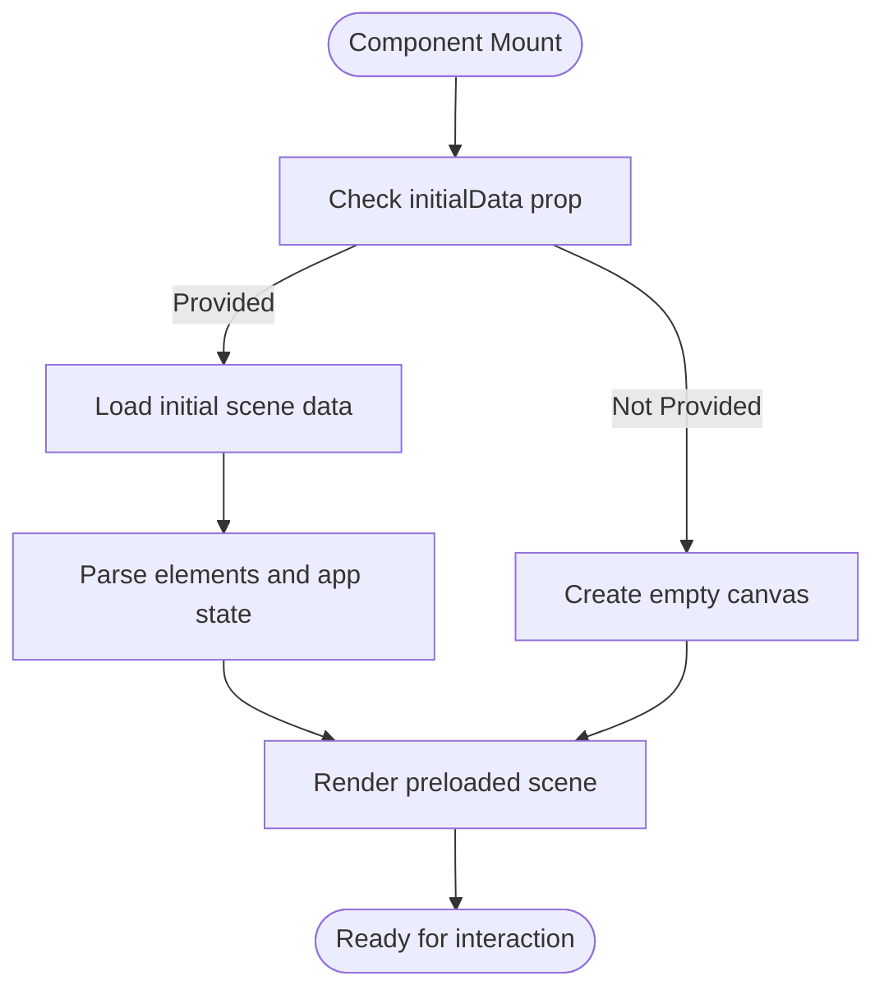

**Section sources**
- [types.ts](file://excalidraw/packages/excalidraw/types.ts#L470-L475)
- [index.tsx](file://excalidraw/packages/excalidraw/index.tsx#L53-L55)

### onChange
The `onChange` callback is triggered whenever there are modifications to the drawing elements or application state. It provides real-time updates about the current state of the canvas, enabling synchronization with external systems.

This function receives three parameters: the current elements array, the application state, and binary files. It's crucial for implementing persistence, collaboration, or any feature that needs to react to changes in the drawing.

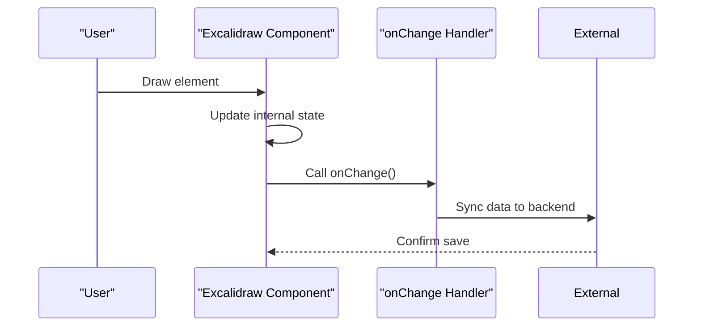

**Section sources**
- [types.ts](file://excalidraw/packages/excalidraw/types.ts#L455-L460)
- [index.tsx](file://excalidraw/packages/excalidraw/index.tsx#L48-L50)

## State Management Props

### onCollabButtonClick
The `onCollabButtonClick` prop (referenced as collaboration integration in the component) enables custom handling of collaboration features. When users interact with collaboration controls, this callback allows integrating with external collaboration systems.

This prop facilitates the implementation of real-time collaboration by providing hooks to connect with WebSocket servers, presence systems, or other real-time data synchronization mechanisms.

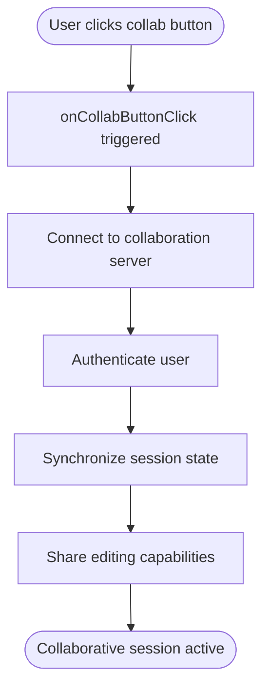

**Section sources**
- [types.ts](file://excalidraw/packages/excalidraw/types.ts#L456-L457)
- [index.tsx](file://excalidraw/packages/excalidraw/index.tsx#L51-L52)

### customElementHandler
The `customElementHandler` prop allows extending the behavior of elements within the Excalidraw canvas. This enables developers to implement custom element types or modify the rendering and interaction behavior of existing elements.

By providing a custom handler, you can introduce specialized elements with unique properties, behaviors, or visual representations that integrate seamlessly with the standard Excalidraw functionality.

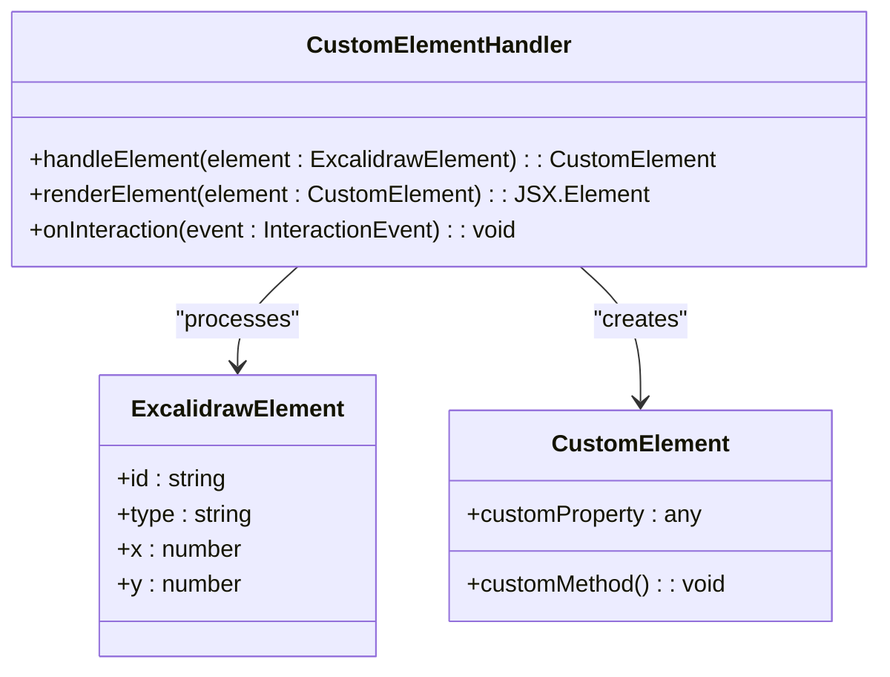

**Section sources**
- [types.ts](file://excalidraw/packages/excalidraw/types.ts#L480-L481)
- [index.tsx](file://excalidraw/packages/excalidraw/index.tsx#L100-L101)

## UI Customization Props

### UIOptions
The `UIOptions` prop provides fine-grained control over the visibility and behavior of various UI components within the Excalidraw interface. This allows tailoring the user experience for specific use cases.

Key configuration options include:
- Canvas actions (export, clear, theme toggle)
- Tool visibility (image tool, etc.)
- Sidebar behavior and docking preferences

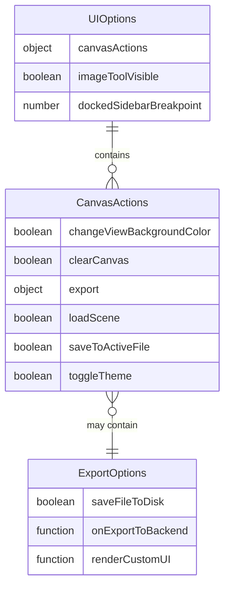

**Section sources**
- [types.ts](file://excalidraw/packages/excalidraw/types.ts#L520-L530)
- [index.tsx](file://excalidraw/packages/excalidraw/index.tsx#L110-L115)

### renderTopRightUI
The `renderTopRightUI` prop enables injecting custom controls into the top-right corner of the Excalidraw interface. This is useful for adding application-specific functionality without modifying the core component.

The callback receives parameters indicating whether the interface is in mobile mode and the current UI application state, allowing for responsive and context-aware UI elements.

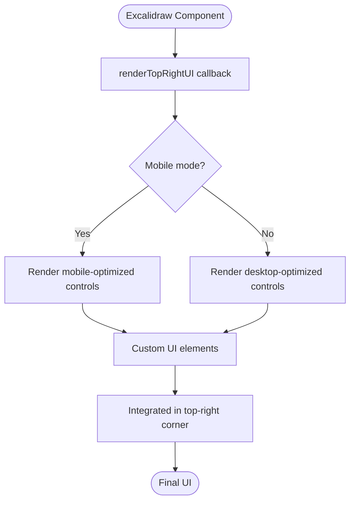

**Section sources**
- [types.ts](file://excalidraw/packages/excalidraw/types.ts#L490-L492)
- [index.tsx](file://excalidraw/packages/excalidraw/index.tsx#L63-L65)

### langCode
The `langCode` prop controls localization within the Excalidraw component. It accepts language codes that correspond to available translation files, enabling internationalization support.

This prop works in conjunction with the i18n system to provide translated user interface elements, tooltips, and other text content based on the specified language.

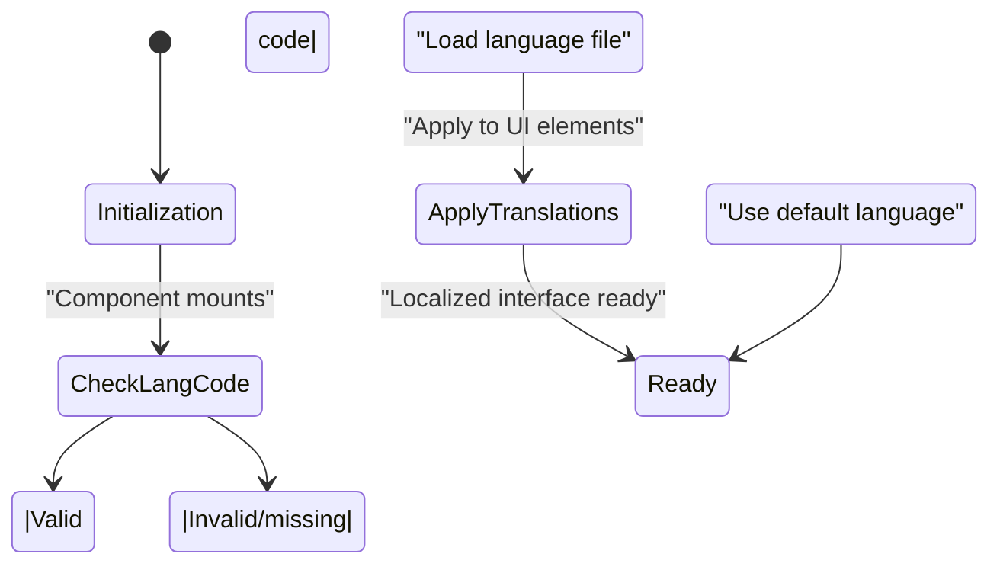

**Section sources**
- [types.ts](file://excalidraw/packages/excalidraw/types.ts#L493-L494)
- [index.tsx](file://excalidraw/packages/excalidraw/index.tsx#L66-L68)

## TypeScript Interfaces

### AppState Interface
The `AppState` interface defines the complete state structure of the Excalidraw component, encompassing user interface state, tool states, collaboration states, and rendering preferences.

```mermaid
classDiagram
class AppState {
+showWelcomeScreen : boolean
+theme : Theme
+collaborators : Map<SocketId, Collaborator>
+currentChartType : ChartType
+currentItemStrokeColor : string
+currentItemBackgroundColor : string
+currentItemFillStyle : FillStyle
+currentItemStrokeWidth : number
+currentItemStrokeStyle : StrokeStyle
+currentItemRoughness : number
+currentItemOpacity : number
+currentItemFontFamily : FontFamilyValues
+currentItemFontSize : number
+currentItemTextAlign : TextAlign
+currentItemStartArrowhead : Arrowhead
+currentItemEndArrowhead : Arrowhead
+currentItemRoundness : StrokeRoundness
+viewBackgroundColor : string
+scrollX : number
+scrollY : number
+zoom : Zoom
+openMenu : "canvas" | "shape" | null
+selectedElementIds : { [id : string] : true }
+selectedGroupIds : { [groupId : string] : boolean }
+editingGroupId : GroupId | null
+zenModeEnabled : boolean
+gridModeEnabled : boolean
+objectsSnapModeEnabled : boolean
+isCropping : boolean
+croppingElementId : string | null
}
```

**Diagram sources**
- [types.ts](file://excalidraw/packages/excalidraw/types.ts#L250-L449)

### ExcalidrawProps Interface
The `ExcalidrawProps` interface defines all available props for the Excalidraw component, including optional and required properties for configuration and customization.

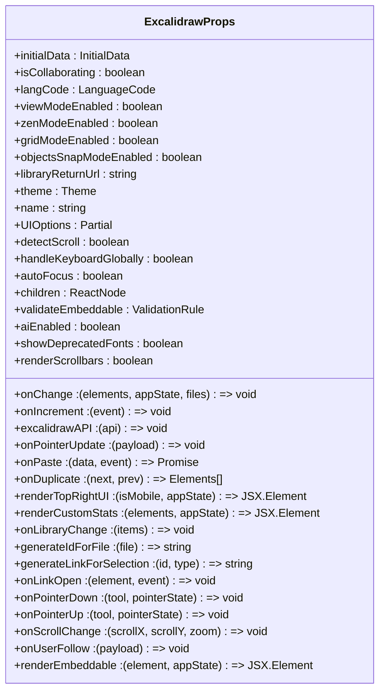

**Diagram sources**
- [types.ts](file://excalidraw/packages/excalidraw/types.ts#L454-L519)

## Usage Examples

### Read-Only Viewer Configuration
Creating a read-only viewer by disabling editing capabilities and hiding unnecessary controls.

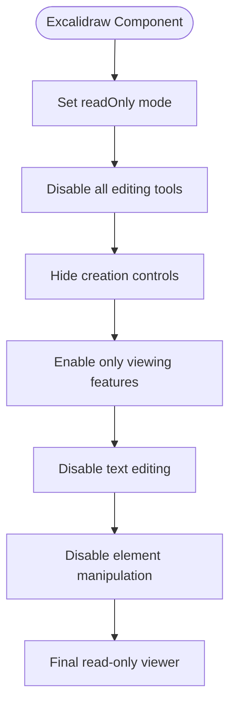

**Section sources**
- [types.ts](file://excalidraw/packages/excalidraw/types.ts#L454-L519)
- [index.tsx](file://excalidraw/packages/excalidraw/index.tsx#L48-L101)

### Collaborative Editor Setup
Configuring the component for real-time collaboration with multiple users.

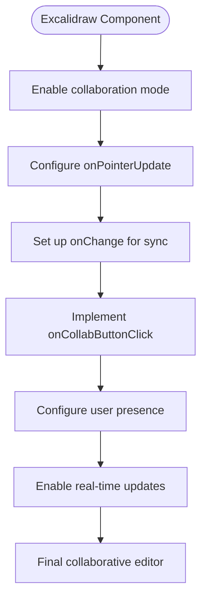

**Section sources**
- [types.ts](file://excalidraw/packages/excalidraw/types.ts#L454-L519)
- [index.tsx](file://excalidraw/packages/excalidraw/index.tsx#L51-L52)

### Embedded Widget Implementation
Using Excalidraw as a lightweight widget within another application.

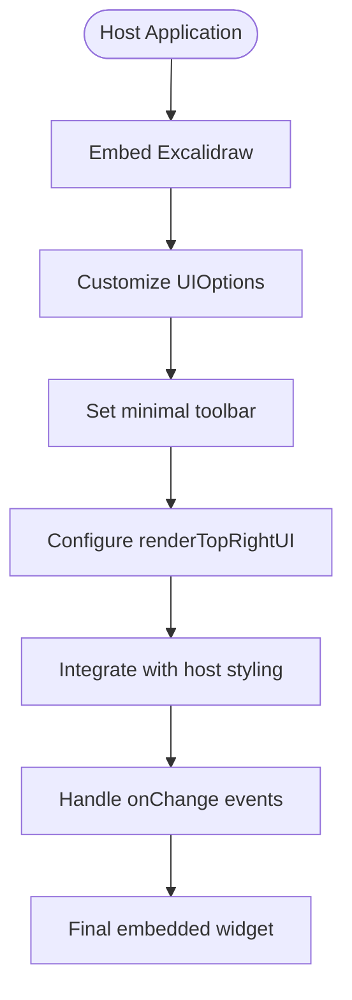

**Section sources**
- [types.ts](file://excalidraw/packages/excalidraw/types.ts#L454-L519)
- [index.tsx](file://excalidraw/packages/excalidraw/index.tsx#L110-L115)

## Performance Considerations
Prop updates can have significant performance implications, particularly with frequent onChange callbacks or complex UI customizations. The component uses React.memo for optimization, comparing props to prevent unnecessary re-renders.

Key performance factors include:
- Frequency of onChange callbacks
- Complexity of custom UI elements
- Size of initial data sets
- Number of binary files

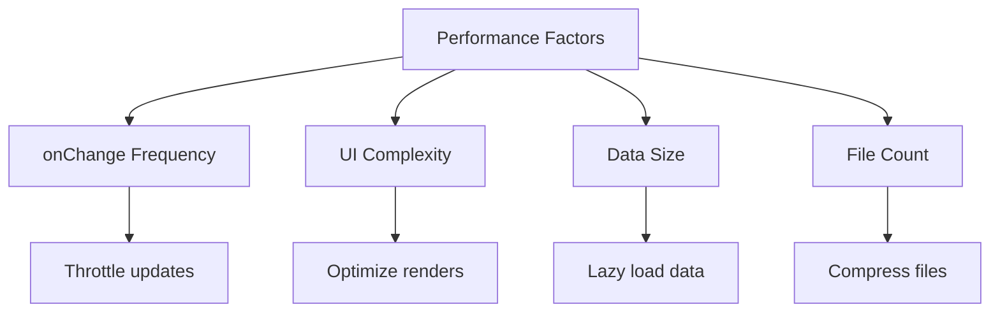

**Section sources**
- [index.tsx](file://excalidraw/packages/excalidraw/index.tsx#L240-L280)
- [types.ts](file://excalidraw/packages/excalidraw/types.ts#L455-L460)

## Best Practices

### Memoization Strategies
Implement proper memoization to prevent unnecessary re-renders and maintain optimal performance.

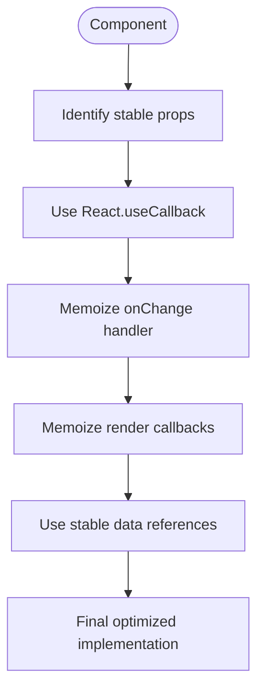

**Section sources**
- [index.tsx](file://excalidraw/packages/excalidraw/index.tsx#L240-L280)
- [types.ts](file://excalidraw/packages/excalidraw/types.ts#L454-L519)