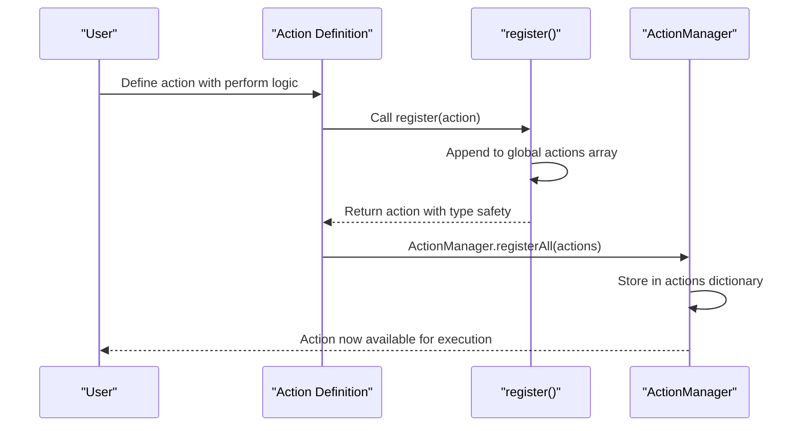
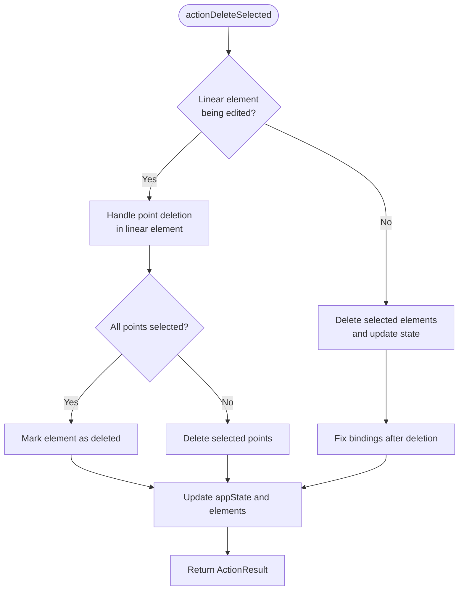
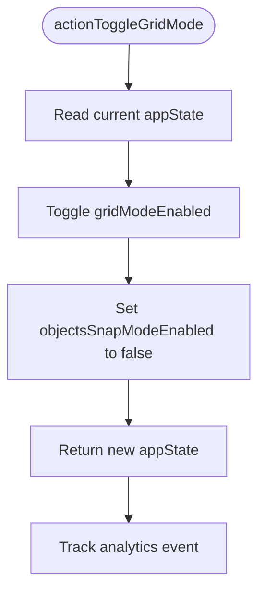
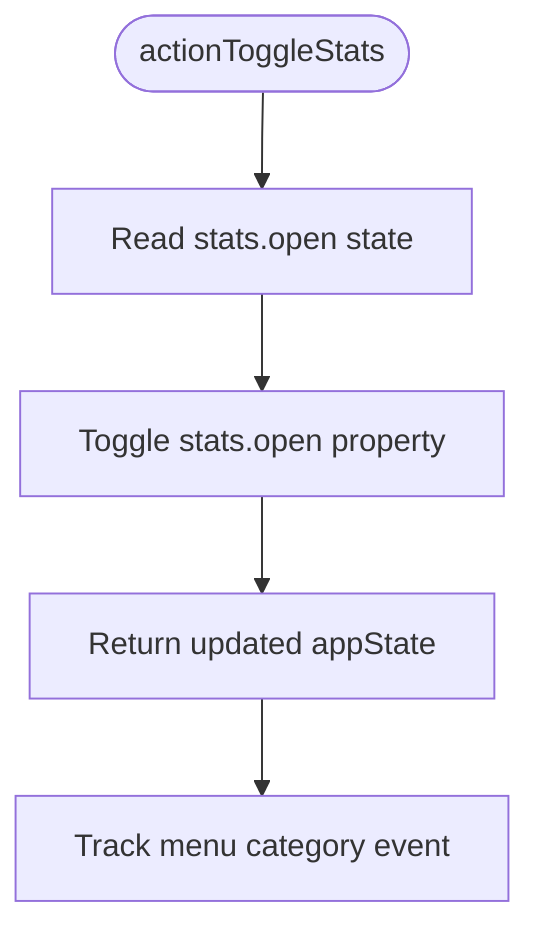
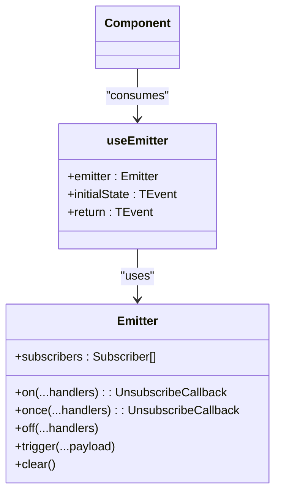
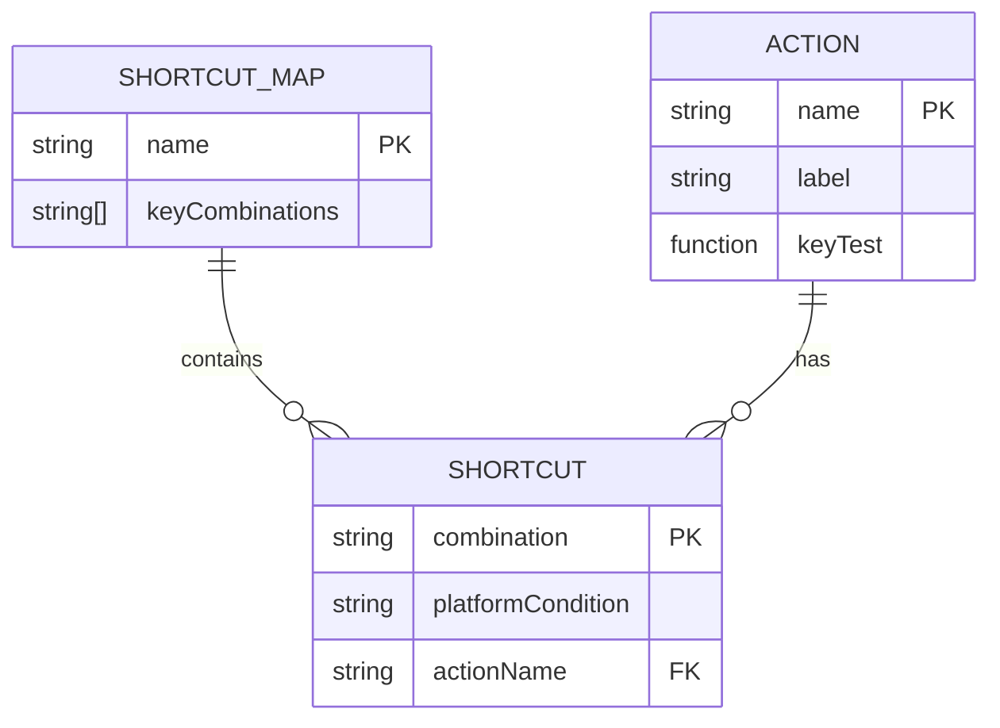
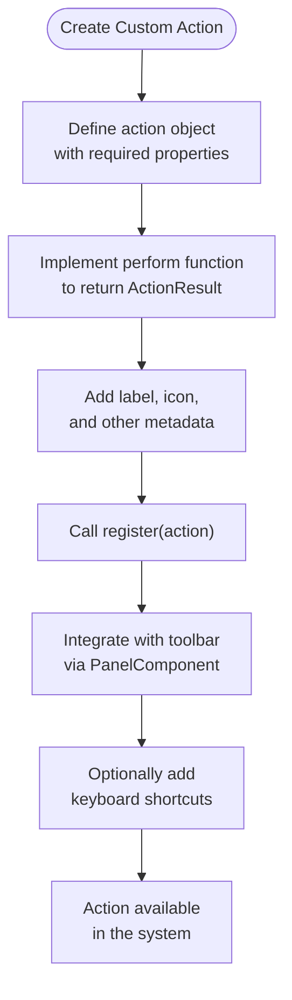

# Event System

<cite>
**Referenced Files in This Document**   
- [manager.tsx](file://excalidraw/packages/excalidraw/actions/manager.tsx)
- [register.ts](file://excalidraw/packages/excalidraw/actions/register.ts)
- [shortcuts.ts](file://excalidraw/packages/excalidraw/actions/shortcuts.ts)
- [types.ts](file://excalidraw/packages/excalidraw/actions/types.ts)
- [actionDeleteSelected.tsx](file://excalidraw/packages/excalidraw/actions/actionDeleteSelected.tsx)
- [actionToggleGridMode.tsx](file://excalidraw/packages/excalidraw/actions/actionToggleGridMode.tsx)
- [actionToggleStats.tsx](file://excalidraw/packages/excalidraw/actions/actionToggleStats.tsx)
- [useEmitter.ts](file://excalidraw/packages/excalidraw/hooks/useEmitter.ts)
- [emitter.ts](file://excalidraw/packages/common/src/emitter.ts)
</cite>

## Table of Contents
1. [Introduction](#introduction)
2. [ActionManager Architecture](#actionmanager-architecture)
3. [Action Registration System](#action-registration-system)
4. [Built-in Actions Implementation](#built-in-actions-implementation)
5. [Custom Event Handling](#custom-event-handling)
6. [Keyboard Shortcut Management](#keyboard-shortcut-management)
7. [Creating Custom Actions](#creating-custom-actions)
8. [Event Propagation and Concurrency](#event-propagation-and-concurrency)
9. [Best Practices](#best-practices)

## Introduction
Excalidraw's event system is built around a centralized ActionManager that processes user interactions through a well-defined action handling mechanism. The system enables both built-in and custom actions to be registered, executed, and tracked consistently across the application. User interactions trigger events that are processed by the ActionManager, which coordinates state changes and UI updates through a structured action-perform-update cycle.

**Section sources**
- [manager.tsx](file://excalidraw/packages/excalidraw/actions/manager.tsx#L1-L200)

## ActionManager Architecture
The ActionManager class serves as the central coordinator for all user interactions in Excalidraw. It manages the registration, execution, and tracking of actions that result from user input. The manager maintains references to application state, elements, and the app instance, providing a consistent context for action execution.

```mermaid
classDiagram
class ActionManager {
+actions : Record<ActionName, Action>
+updater : (actionResult) => void
+getAppState : () => AppState
+getElementsIncludingDeleted : () => ExcalidrawElement[]
+app : AppClassProperties
+registerAction(action : Action)
+registerAll(actions : Action[])
+handleKeyDown(event : KeyboardEvent)
+executeAction(action : Action, source : ActionSource, value : any)
+renderAction(name : ActionName, data : any)
+isActionEnabled(action : Action)
}
class Action {
+name : ActionName
+label : string | (elements, appState, app) => string
+keywords : string[]
+icon : ReactNode | (appState, elements) => ReactNode
+PanelComponent : React.FC<PanelComponentProps>
+perform : ActionFn
+keyPriority : number
+keyTest : (event, appState, elements, app) => boolean
+predicate : (elements, appState, appProps, app) => boolean
+checked : (appState) => boolean
+trackEvent : { category, action, predicate }
+viewMode : boolean
}
ActionManager --> Action : "manages"
```

**Diagram sources**
- [manager.tsx](file://excalidraw/packages/excalidraw/actions/manager.tsx#L58-L199)
- [types.ts](file://excalidraw/packages/excalidraw/actions/types.ts#L160-L216)

**Section sources**
- [manager.tsx](file://excalidraw/packages/excalidraw/actions/manager.tsx#L58-L199)

## Action Registration System
The action registration system uses a global registry pattern to collect and manage all available actions. The `register` function in register.ts creates a singleton registry that accumulates actions throughout the application lifecycle. Each action is registered with metadata that defines its behavior, appearance, and conditions for activation.



**Diagram sources**
- [register.ts](file://excalidraw/packages/excalidraw/actions/register.ts#L0-L9)
- [manager.tsx](file://excalidraw/packages/excalidraw/actions/manager.tsx#L85-L95)

**Section sources**
- [register.ts](file://excalidraw/packages/excalidraw/actions/register.ts#L0-L9)

## Built-in Actions Implementation
Built-in actions are implemented as registered objects with specific properties that define their behavior. Each action includes a perform function that returns the state changes resulting from the action, along with metadata for UI presentation and keyboard shortcut handling.

### Delete Selected Elements Action
The delete action demonstrates conditional logic based on application state, handling both general element deletion and specific cases for linear elements being edited.



**Diagram sources**
- [actionDeleteSelected.tsx](file://excalidraw/packages/excalidraw/actions/actionDeleteSelected.tsx#L201-L326)

### Toggle Grid Mode Action
The grid mode toggle action shows a simple state toggle pattern with additional side effects (disabling object snap mode when grid is enabled).



**Diagram sources**
- [actionToggleGridMode.tsx](file://excalidraw/packages/excalidraw/actions/actionToggleGridMode.tsx#L10-L35)

### Toggle Stats Action
The stats action demonstrates the use of the checked property to determine current state and toggle accordingly.



**Diagram sources**
- [actionToggleStats.tsx](file://excalidraw/packages/excalidraw/actions/actionToggleStats.tsx#L0-L27)

**Section sources**
- [actionDeleteSelected.tsx](file://excalidraw/packages/excalidraw/actions/actionDeleteSelected.tsx#L201-L326)
- [actionToggleGridMode.tsx](file://excalidraw/packages/excalidraw/actions/actionToggleGridMode.tsx#L10-L35)
- [actionToggleStats.tsx](file://excalidraw/packages/excalidraw/actions/actionToggleStats.tsx#L0-L27)

## Custom Event Handling
Excalidraw supports custom events through its emitter system, allowing components to subscribe to and publish events using standard patterns. The Emitter class from @excalidraw/common provides a simple pub-sub mechanism that can be used to create custom event flows.



Custom events like 'export' or 'libraryChange' can be implemented by creating emitters and using the useEmitter hook to subscribe to events in React components. This follows standard DOM event patterns where listeners are attached to event sources and respond to emitted events.

**Section sources**
- [emitter.ts](file://excalidraw/packages/common/src/emitter.ts#L0-L50)
- [useEmitter.ts](file://excalidraw/packages/excalidraw/hooks/useEmitter.ts#L0-L21)

## Keyboard Shortcut Management
Keyboard shortcuts are managed through the shortcuts.ts file, which maps action names to key combinations. The system supports multiple platforms (detecting Darwin for macOS) and provides alternative shortcuts for certain actions.



The ActionManager's handleKeyDown method processes keyboard events by:
1. Sorting actions by keyPriority (higher priority first)
2. Filtering actions based on keyTest conditions
3. Preventing default behavior and stopping propagation
4. Executing the matched action

This ensures that keyboard shortcuts are processed efficiently and unambiguously, with conflict resolution favoring higher-priority actions.

**Section sources**
- [shortcuts.ts](file://excalidraw/packages/excalidraw/actions/shortcuts.ts#L0-L127)
- [manager.tsx](file://excalidraw/packages/excalidraw/actions/manager.tsx#L97-L150)

## Creating Custom Actions
Creating custom actions follows a consistent pattern using the register function. Custom actions can be added to extend functionality and integrate with the existing toolbar and keyboard shortcut system.



Custom actions should return an ActionResult object containing the updated elements, appState, and files as needed. The captureUpdate property determines when the update should be captured in the history system (IMMEDIATELY or EVENTUALLY).

**Section sources**
- [register.ts](file://excalidraw/packages/excalidraw/actions/register.ts#L0-L9)
- [types.ts](file://excalidraw/packages/excalidraw/actions/types.ts#L44-L116)

## Event Propagation and Concurrency
The event system handles propagation issues by preventing default behavior and stopping event propagation when actions are executed via keyboard shortcuts. This prevents unintended side effects from browser default behaviors.

For collaborative environments, the system must handle concurrent actions through proper state management and conflict resolution. The ActionManager ensures that actions are processed sequentially, with each action receiving the current state and returning a new state, preventing race conditions in state updates.

The updater function in ActionManager handles both synchronous and promise-like results, allowing for asynchronous operations while maintaining a consistent interface for state updates.

**Section sources**
- [manager.tsx](file://excalidraw/packages/excalidraw/actions/manager.tsx#L60-L75)
- [manager.tsx](file://excalidraw/packages/excalidraw/actions/manager.tsx#L135-L145)

## Best Practices
When working with Excalidraw's event system, consider the following best practices:

1. **Use the register pattern** consistently for all actions to ensure they're properly integrated with the system
2. **Implement proper predicate functions** to control when actions should be available based on application state
3. **Include comprehensive analytics tracking** using the trackEvent property to monitor feature usage
4. **Handle keyboard shortcuts thoughtfully** by considering platform differences and providing alternatives
5. **Manage side effects carefully** in perform functions, ensuring all state changes are accounted for in the returned ActionResult
6. **Consider viewMode compatibility** by setting the viewMode property appropriately for actions that should work in view-only mode
7. **Use appropriate captureUpdate settings** to control when changes are captured in the history system

Following these practices ensures that custom actions integrate seamlessly with the existing system and provide a consistent user experience.

**Section sources**
- [manager.tsx](file://excalidraw/packages/excalidraw/actions/manager.tsx#L1-L200)
- [types.ts](file://excalidraw/packages/excalidraw/actions/types.ts#L160-L216)