# Exposed Methods

<cite>
**Referenced Files in This Document**   
- [index.tsx](file://excalidraw/packages/excalidraw/index.tsx)
- [types.ts](file://excalidraw/packages/excalidraw/types.ts)
- [appState.ts](file://excalidraw/packages/excalidraw/appState.ts)
- [library.ts](file://excalidraw/packages/excalidraw/data/library.ts)
- [scene.ts](file://excalidraw/packages/excalidraw/scene/scene.ts)
- [clients.ts](file://excalidraw/packages/excalidraw/clients.ts)
</cite>

## Table of Contents
1. [Introduction](#introduction)
2. [Core Imperative Methods](#core-imperative-methods)
3. [Scene Management Methods](#scene-management-methods)
4. [Library Management Methods](#library-management-methods)
5. [Collaboration API Methods](#collaboration-api-methods)
6. [TypeScript Definitions](#typescript-definitions)
7. [Usage Examples with React useRef](#usage-examples-with-react-useref)
8. [Integration with External State Management](#integration-with-external-state-management)
9. [Undo/Redo Implementation Patterns](#undo-redo-implementation-patterns)
10. [Common Issues and Solutions](#common-issues-and-solutions)

## Introduction
This document details the imperative methods exposed by the Excalidraw component through its ref API. These methods enable programmatic control over the drawing canvas, allowing developers to manipulate elements, manage scene state, import libraries, and handle real-time collaboration. The API is designed to work seamlessly with React applications, providing fine-grained control over the Excalidraw component's behavior and state.

## Core Imperative Methods

The Excalidraw component exposes a comprehensive set of imperative methods through its ref, enabling direct manipulation of the canvas and its contents. These methods are accessible via the `excalidrawAPI` callback prop and provide low-level access to the component's functionality.

**Section sources**
- [index.tsx](file://excalidraw/packages/excalidraw/index.tsx#L0-L308)
- [types.ts](file://excalidraw/packages/excalidraw/types.ts#L0-L799)

## Scene Management Methods

### updateScene
The `updateScene` method allows for programmatic modification of both elements and appState. It accepts a partial scene data object and applies the changes to the current scene.

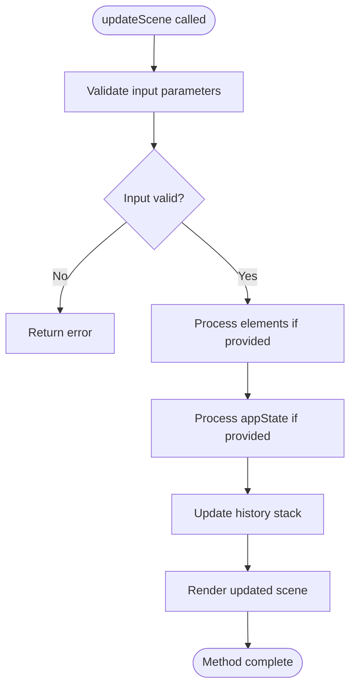

**Diagram sources**
- [index.tsx](file://excalidraw/packages/excalidraw/index.tsx#L0-L308)
- [scene.ts](file://excalidraw/packages/excalidraw/scene/scene.ts)

### resetScene
The `resetScene` method clears or resets the canvas to its initial state. It can be used to completely clear the drawing surface or restore it to a predefined initial state.

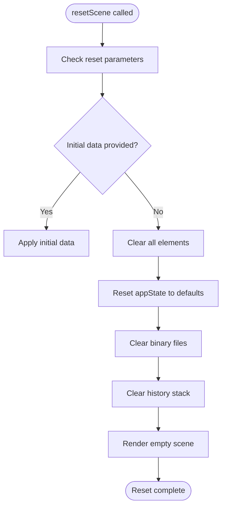

**Diagram sources**
- [index.tsx](file://excalidraw/packages/excalidraw/index.tsx#L0-L308)
- [scene.ts](file://excalidraw/packages/excalidraw/scene/scene.ts)

### getSceneElements
The `getSceneElements` method retrieves the current elements from the scene, returning a readonly array of non-deleted elements.

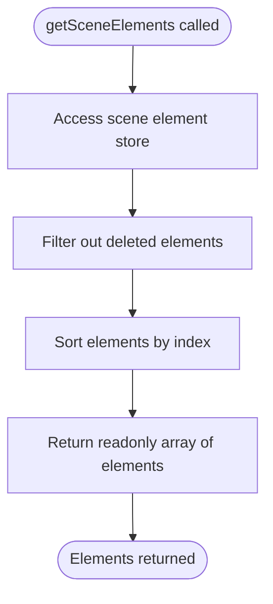

**Diagram sources**
- [index.tsx](file://excalidraw/packages/excalidraw/index.tsx#L0-L308)
- [scene.ts](file://excalidraw/packages/excalidraw/scene/scene.ts)

**Section sources**
- [index.tsx](file://excalidraw/packages/excalidraw/index.tsx#L0-L308)
- [types.ts](file://excalidraw/packages/excalidraw/types.ts#L0-L799)
- [scene.ts](file://excalidraw/packages/excalidraw/scene/scene.ts)

## Library Management Methods

### importLibrary
The `importLibrary` method loads predefined shapes and elements from a library, making them available for use in the current session.

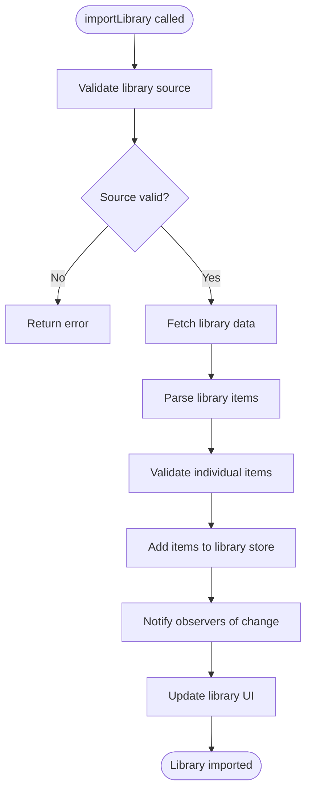

**Diagram sources**
- [library.ts](file://excalidraw/packages/excalidraw/data/library.ts)
- [index.tsx](file://excalidraw/packages/excalidraw/index.tsx#L0-L308)

**Section sources**
- [library.ts](file://excalidraw/packages/excalidraw/data/library.ts)
- [types.ts](file://excalidraw/packages/excalidraw/types.ts#L0-L799)

## Collaboration API Methods

### broadcastElements
The `broadcastElements` method enables real-time synchronization of elements across collaborators in a shared session.

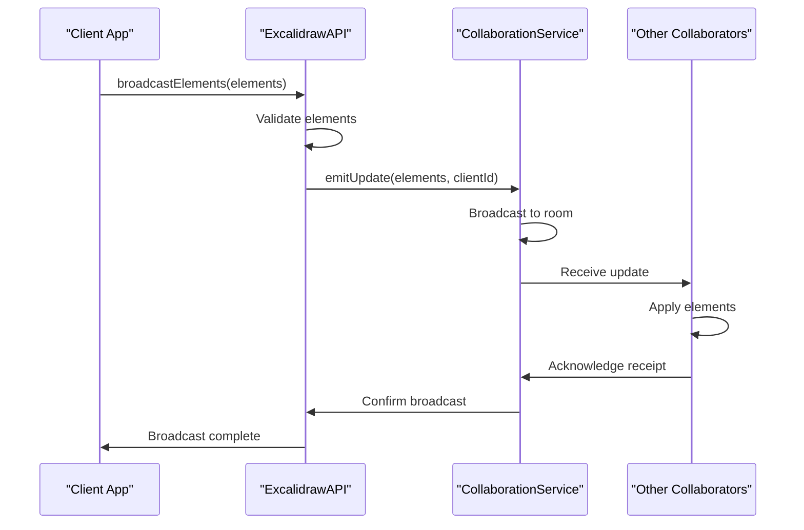

**Diagram sources**
- [clients.ts](file://excalidraw/packages/excalidraw/clients.ts)
- [index.tsx](file://excalidraw/packages/excalidraw/index.tsx#L0-L308)

**Section sources**
- [clients.ts](file://excalidraw/packages/excalidraw/clients.ts)
- [types.ts](file://excalidraw/packages/excalidraw/types.ts#L0-L799)

## TypeScript Definitions

The Excalidraw API provides comprehensive TypeScript definitions for type safety and IDE support. The core API interface is defined as follows:

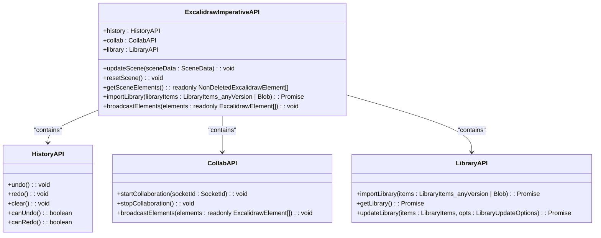

**Diagram sources**
- [types.ts](file://excalidraw/packages/excalidraw/types.ts#L0-L799)
- [index.tsx](file://excalidraw/packages/excalidraw/index.tsx#L0-L308)

**Section sources**
- [types.ts](file://excalidraw/packages/excalidraw/types.ts#L0-L799)

## Usage Examples with React useRef

### Basic Ref Usage
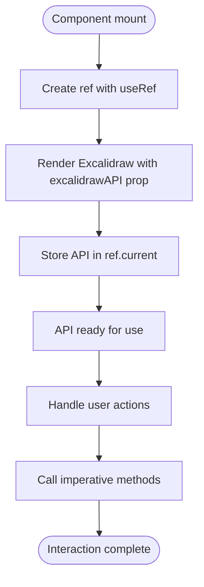

**Diagram sources**
- [index.tsx](file://excalidraw/packages/excalidraw/index.tsx#L0-L308)
- [types.ts](file://excalidraw/packages/excalidraw/types.ts#L0-L799)

### Programmatic Element Update
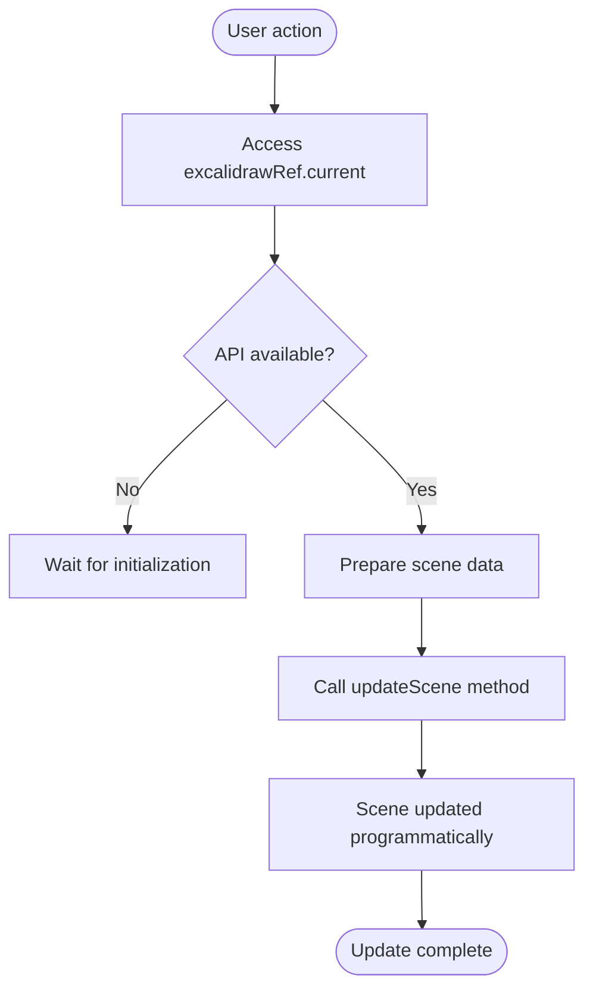

**Diagram sources**
- [index.tsx](file://excalidraw/packages/excalidraw/index.tsx#L0-L308)
- [scene.ts](file://excalidraw/packages/excalidraw/scene/scene.ts)

**Section sources**
- [index.tsx](file://excalidraw/packages/excalidraw/index.tsx#L0-L308)
- [types.ts](file://excalidraw/packages/excalidraw/types.ts#L0-L799)

## Integration with External State Management

### Redux Integration Pattern
```mermaid
flowchart LR
ReduxStore[Redux Store] < --> Middleware[Custom Middleware]
Middleware < --> ExcalidrawAPI[Excalidraw API]
ExcalidrawAPI < --> Canvas[Excalidraw Canvas]
Canvas --> |onChange| Middleware
Middleware --> |dispatch| ReduxStore
ReduxStore --> |subscribe| Middleware
Middleware --> |updateScene| ExcalidrawAPI
```

**Diagram sources**
- [index.tsx](file://excalidraw/packages/excalidraw/index.tsx#L0-L308)
- [types.ts](file://excalidraw/packages/excalidraw/types.ts#L0-L799)

### Jotai Integration Pattern
```mermaid
flowchart LR
JotaiAtom[Jotai Atom] < --> SyncEffect[Synchronization Effect]
SyncEffect < --> ExcalidrawAPI[Excalidraw API]
ExcalidrawAPI < --> Canvas[Excalidraw Canvas]
Canvas --> |onChange| SyncEffect
SyncEffect --> |setAtom| JotaiAtom
JotaiAtom --> |useAtom| SyncEffect
SyncEffect --> |updateScene| ExcalidrawAPI
```

**Diagram sources**
- [appState.ts](file://excalidraw/packages/excalidraw/appState.ts)
- [index.tsx](file://excalidraw/packages/excalidraw/index.tsx#L0-L308)

**Section sources**
- [appState.ts](file://excalidraw/packages/excalidraw/appState.ts)
- [index.tsx](file://excalidraw/packages/excalidraw/index.tsx#L0-L308)

## Undo/Redo Implementation Patterns

### Built-in History Management
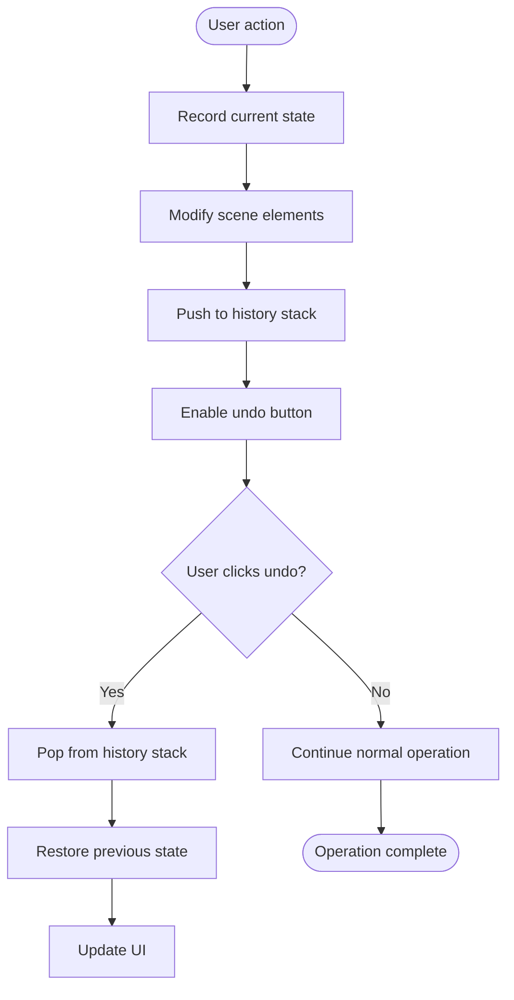

**Diagram sources**
- [index.tsx](file://excalidraw/packages/excalidraw/index.tsx#L0-L308)
- [types.ts](file://excalidraw/packages/excalidraw/types.ts#L0-L799)

**Section sources**
- [index.tsx](file://excalidraw/packages/excalidraw/index.tsx#L0-L308)
- [types.ts](file://excalidraw/packages/excalidraw/types.ts#L0-L799)

## Common Issues and Solutions

### Method Availability During Initialization
A common issue occurs when attempting to call imperative methods before the Excalidraw component has fully initialized. The API is only available after the component mounts and the `excalidrawAPI` callback is invoked.

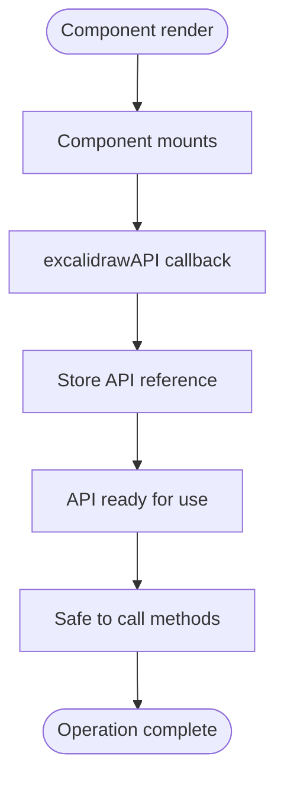

**Diagram sources**
- [index.tsx](file://excalidraw/packages/excalidraw/index.tsx#L0-L308)
- [types.ts](file://excalidraw/packages/excalidraw/types.ts#L0-L799)

### TypeScript Typing Issues
Proper typing in TypeScript projects requires correct import of types and interface declaration. Common issues include missing type definitions and incorrect ref typing.

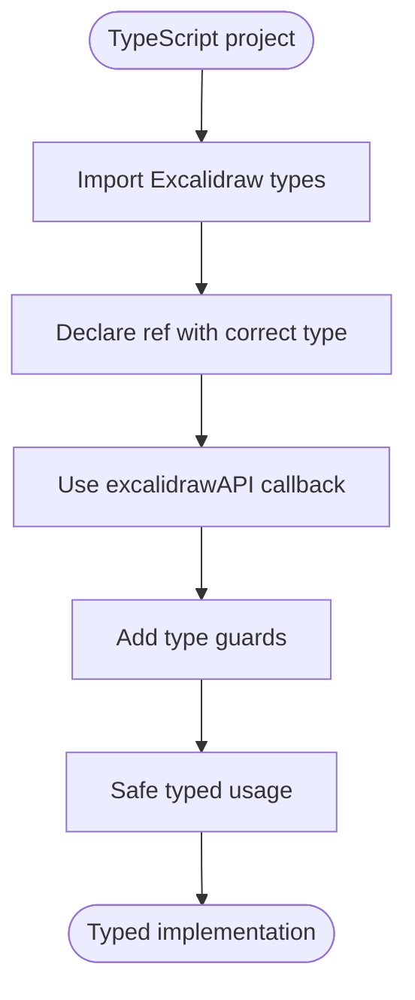

**Diagram sources**
- [types.ts](file://excalidraw/packages/excalidraw/types.ts#L0-L799)
- [index.tsx](file://excalidraw/packages/excalidraw/index.tsx#L0-L308)

**Section sources**
- [types.ts](file://excalidraw/packages/excalidraw/types.ts#L0-L799)
- [index.tsx](file://excalidraw/packages/excalidraw/index.tsx#L0-L308)