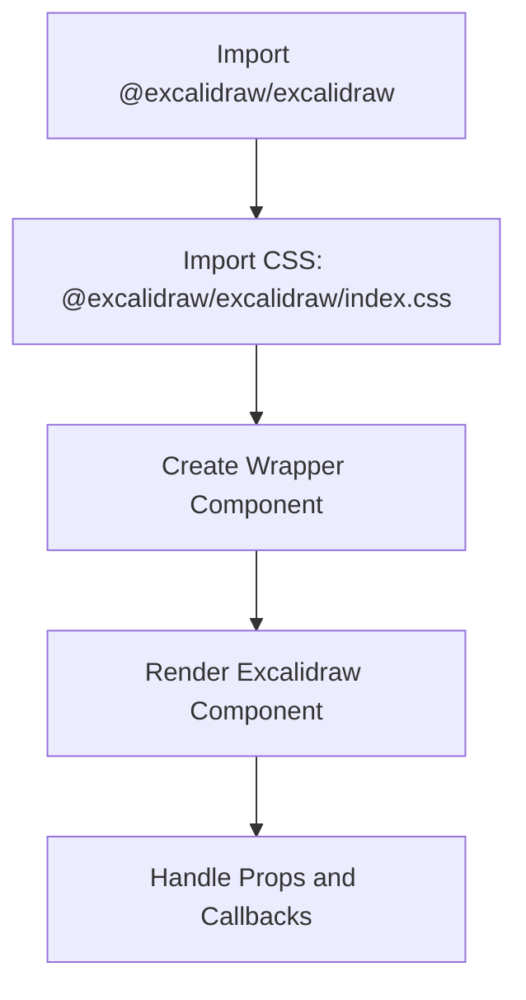
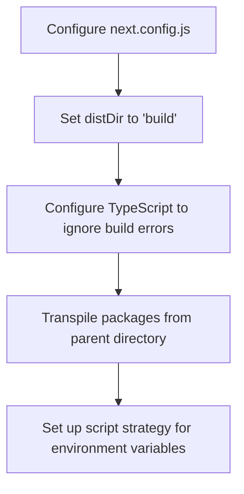
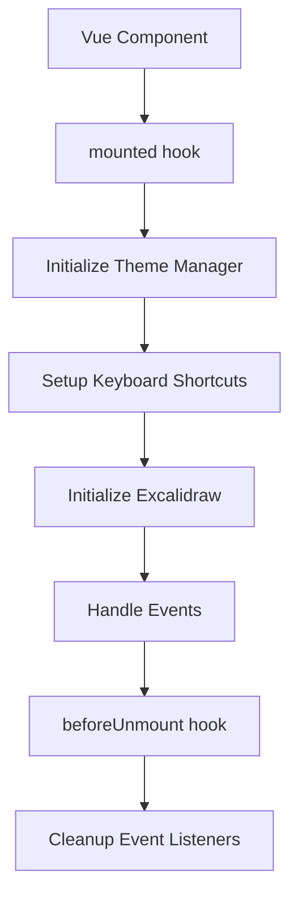
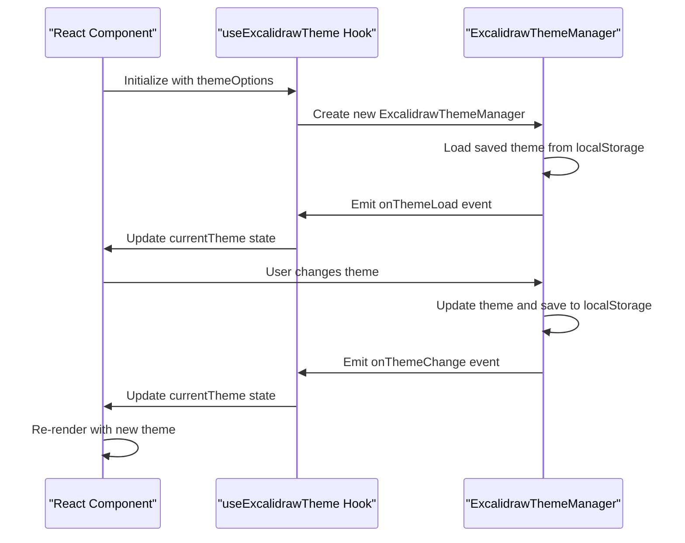
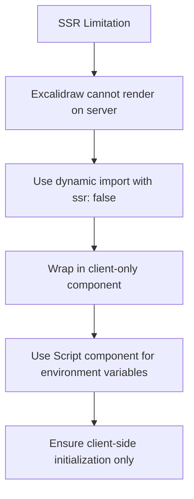

# Framework Integration Examples

<cite>
**Referenced Files in This Document**   
- [excalidrawWrapper.tsx](file://excalidraw/examples/with-nextjs/src/excalidrawWrapper.tsx)
- [page.tsx](file://excalidraw/examples/with-nextjs/src/app/page.tsx)
- [excalidraw-in-pages.tsx](file://excalidraw/examples/with-nextjs/src/pages/excalidraw-in-pages.tsx)
- [react-theme-example.jsx](file://excalidraw/excalidraw-app/react-theme-example.jsx)
- [angular-theme-example.component.ts](file://excalidraw/excalidraw-app/angular-theme-example.component.ts)
- [vue-theme-example.vue](file://excalidraw/excalidraw-app/vue-theme-example.vue)
- [package.json](file://excalidraw/examples/with-nextjs/package.json)
- [next.config.js](file://excalidraw/examples/with-nextjs/next.config.js)
</cite>

## Table of Contents
1. [Introduction](#introduction)
2. [React Integration](#react-integration)
3. [Next.js App Router Integration](#nextjs-app-router-integration)
4. [Vue Integration](#vue-integration)
5. [Angular Integration](#angular-integration)
6. [State Synchronization](#state-synchronization)
7. [Common Integration Pitfalls](#common-integration-pitfalls)
8. [Conclusion](#conclusion)

## Introduction
This document provides practical integration examples for using Excalidraw in various frameworks. It covers React (including Next.js App Router), Vue, and Angular implementations using official wrapper examples. The documentation includes setup processes, dependency management, TypeScript configuration, and build tool considerations for each framework. Special attention is given to handling framework-specific lifecycle events when initializing the Excalidraw component and synchronizing state between framework state and Excalidraw's internal state.

**Section sources**
- [excalidrawWrapper.tsx](file://excalidraw/examples/with-nextjs/src/excalidrawWrapper.tsx)
- [react-theme-example.jsx](file://excalidraw/excalidraw-app/react-theme-example.jsx)

## React Integration

### Setup Process
To integrate Excalidraw with React, install the required dependencies:
```bash
npm install @excalidraw/excalidraw
```

The React integration example demonstrates how to create a wrapper component that manages the Excalidraw instance. The component imports the Excalidraw library and its CSS, then renders the component within a custom App wrapper.



**Diagram sources**
- [excalidrawWrapper.tsx](file://excalidraw/examples/with-nextjs/src/excalidrawWrapper.tsx)

### Lifecycle Management
In React, the Excalidraw component is initialized during the component mounting phase. The wrapper component uses React's functional component pattern with hooks to manage the component lifecycle. No special lifecycle methods are required as the component is rendered directly.

**Section sources**
- [excalidrawWrapper.tsx](file://excalidraw/examples/with-nextjs/src/excalidrawWrapper.tsx)
- [react-theme-example.jsx](file://excalidraw/excalidraw-app/react-theme-example.jsx)

## Next.js App Router Integration

### Project Configuration
The Next.js integration requires specific configuration in `next.config.js` to handle the Excalidraw package properly:



**Diagram sources**
- [next.config.js](file://excalidraw/examples/with-nextjs/next.config.js)

### SSR and Client-Side Considerations
Next.js requires special handling for Excalidraw due to server-side rendering constraints. The component must be dynamically imported with SSR disabled:

```typescript
import dynamic from "next/dynamic";

const ExcalidrawWithClientOnly = dynamic(
  async () => (await import("../excalidrawWrapper")).default,
  {
    ssr: false,
  },
);
```

Environment variables must be loaded using the Script component with "beforeInteractive" strategy:

```typescript
<Script id="load-env-variables" strategy="beforeInteractive">
  {`window["EXCALIDRAW_ASSET_PATH"] = window.origin;`}
</Script>
```

**Section sources**
- [page.tsx](file://excalidraw/examples/with-nextjs/src/app/page.tsx)
- [next.config.js](file://excalidraw/examples/with-nextjs/next.config.js)
- [package.json](file://excalidraw/examples/with-nextjs/package.json)

## Vue Integration

### Component Structure
The Vue integration example demonstrates a comprehensive component structure for managing Excalidraw with theme capabilities. The component uses Vue's Options API with proper lifecycle hooks:



**Diagram sources**
- [vue-theme-example.vue](file://excalidraw/excalidraw-app/vue-theme-example.vue)

### Lifecycle Management
Vue's lifecycle hooks are used to manage the Excalidraw integration:
- `mounted`: Initialize the theme manager, set up keyboard shortcuts, and initialize Excalidraw
- `beforeUnmount`: Clean up event listeners and remove keyboard shortcut handlers

The component uses Vue's reactivity system to bind to the current theme and available themes, updating the UI automatically when theme changes occur.

**Section sources**
- [vue-theme-example.vue](file://excalidraw/excalidraw-app/vue-theme-example.vue)

## Angular Integration

### Service-Based Architecture
The Angular integration uses a service-based architecture to manage the Excalidraw theme state across components:

```mermaid
classDiagram
class ExcalidrawThemeService {
-themeManager : any
-currentThemeSubject : BehaviorSubject<string>
-availableThemesSubject : BehaviorSubject<{[key : string] : string}>
-isLoadingSubject : BehaviorSubject<boolean>
+currentTheme$ : Observable<string>
+availableThemes$ : Observable<{[key : string] : string}>
+isLoading$ : Observable<boolean>
+setTheme(themeName : string) : void
+nextTheme() : void
+previousTheme() : void
+randomTheme() : void
+exportConfig() : any
+importConfig(config : any) : void
}
class ThemeSelectorComponent {
+selectedTheme : string
+themeEntries : {key : string, value : string}[]
+onThemeChange(event : Event) : void
}
class ThemeButtonsComponent {
+currentTheme : string
+themeEntries : {key : string, value : string}[]
+onThemeClick(themeName : string) : void
}
class ThemeControlPanelComponent {
+currentTheme : string
+currentThemeName : string
+showAdvanced : boolean
+customColor : string
+nextTheme() : void
+previousTheme() : void
+randomTheme() : void
+exportConfig() : void
+importConfig(event : Event) : void
}
class ExcalidrawWithThemeComponent {
+currentTheme : string
+isLoading : boolean
+excalidrawAPI : any
+initializeThemeManager() : void
+setupKeyboardShortcuts() : void
+initializeExcalidraw() : void
+cleanup() : void
}
ExcalidrawThemeService --> ThemeSelectorComponent : "Injected"
ExcalidrawThemeService --> ThemeButtonsComponent : "Injected"
ExcalidrawThemeService --> ThemeControlPanelComponent : "Injected"
ExcalidrawThemeService --> ExcalidrawWithThemeComponent : "Injected"
```

**Diagram sources**
- [angular-theme-example.component.ts](file://excalidraw/excalidraw-app/angular-theme-example.component.ts)

### Lifecycle Management
Angular's lifecycle hooks are used to manage the Excalidraw integration:
- `ngOnInit`: Initialize the theme manager and set up subscriptions to theme changes
- `ngOnDestroy`: Unsubscribe from observables to prevent memory leaks using the `takeUntil` pattern with a `Subject`

The service uses RxJS BehaviorSubjects to manage state and provide reactive updates to components.

**Section sources**
- [angular-theme-example.component.ts](file://excalidraw/excalidraw-app/angular-theme-example.component.ts)

## State Synchronization

### React State Management
In React, state synchronization is achieved through custom hooks and context:



**Diagram sources**
- [react-theme-example.jsx](file://excalidraw/excalidraw-app/react-theme-example.jsx)

### Cross-Framework State Patterns
Each framework implements state synchronization differently:
- **React**: Custom hooks with useState and useEffect
- **Vue**: Reactive data properties and computed properties
- **Angular**: RxJS Observables and Subjects

The common pattern across all frameworks involves:
1. Initializing the theme manager
2. Subscribing to theme change events
3. Updating component state when themes change
4. Persisting theme preferences to localStorage
5. Cleaning up event listeners on component destruction

**Section sources**
- [react-theme-example.jsx](file://excalidraw/excalidraw-app/react-theme-example.jsx)
- [angular-theme-example.component.ts](file://excalidraw/excalidraw-app/angular-theme-example.component.ts)
- [vue-theme-example.vue](file://excalidraw/excalidraw-app/vue-theme-example.vue)

## Common Integration Pitfalls

### CSS Loading Order
CSS loading order is critical for proper Excalidraw rendering. The Excalidraw CSS must be imported before any component usage:

```typescript
import "@excalidraw/excalidraw/index.css";
```

Failure to import the CSS in the correct order can result in missing styles and broken UI elements.

### Hydration Issues in SSR
Server-side rendering frameworks like Next.js require special handling to avoid hydration mismatches:



**Diagram sources**
- [page.tsx](file://excalidraw/examples/with-nextjs/src/app/page.tsx)

### Ref Handling
Ref handling differs across frameworks:
- **React**: Use ref callback or useRef hook
- **Vue**: Use ref attribute and $refs or ref template reference
- **Angular**: Use @ViewChild decorator

Proper ref handling ensures access to the Excalidraw API for programmatic control.

**Section sources**
- [excalidrawWrapper.tsx](file://excalidraw/examples/with-nextjs/src/excalidrawWrapper.tsx)
- [vue-theme-example.vue](file://excalidraw/excalidraw-app/vue-theme-example.vue)
- [angular-theme-example.component.ts](file://excalidraw/excalidraw-app/angular-theme-example.component.ts)

## Conclusion
Integrating Excalidraw with different frameworks requires understanding each framework's specific patterns for component lifecycle management, state synchronization, and build configuration. The examples provided demonstrate best practices for React, Next.js, Vue, and Angular integrations, addressing common pitfalls like CSS loading order, SSR hydration issues, and proper ref handling. By following these patterns, developers can successfully integrate Excalidraw into their applications while maintaining framework-specific best practices.

[No sources needed since this section summarizes without analyzing specific files]