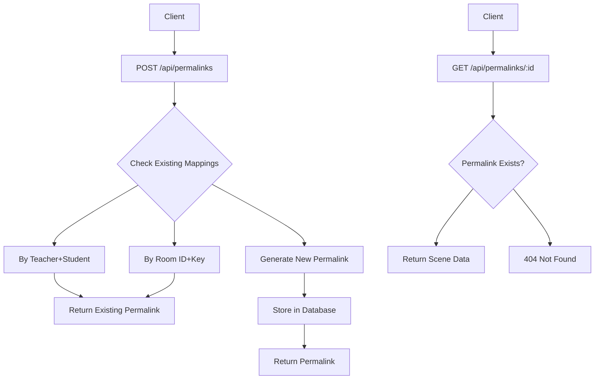
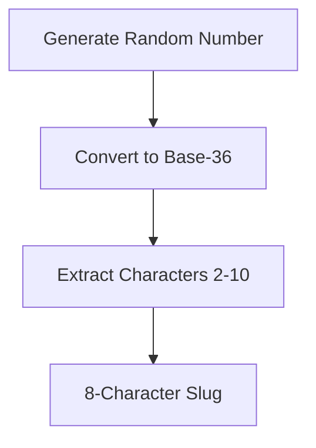
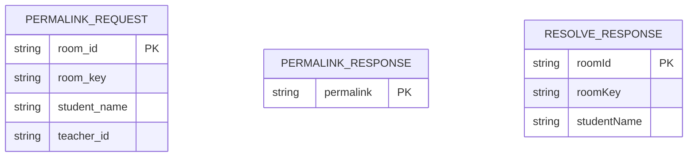
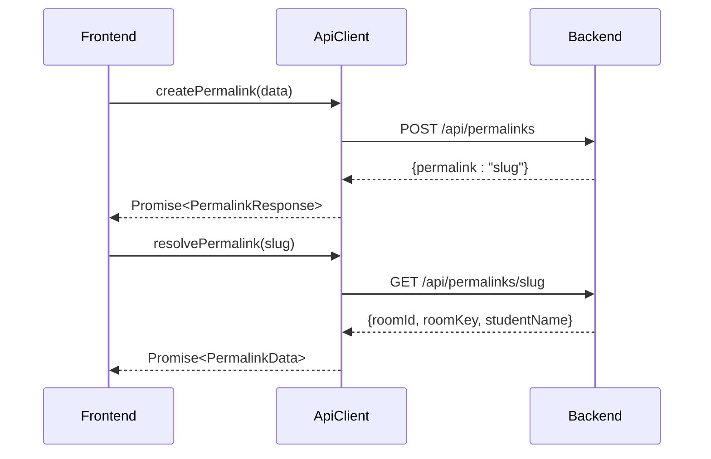
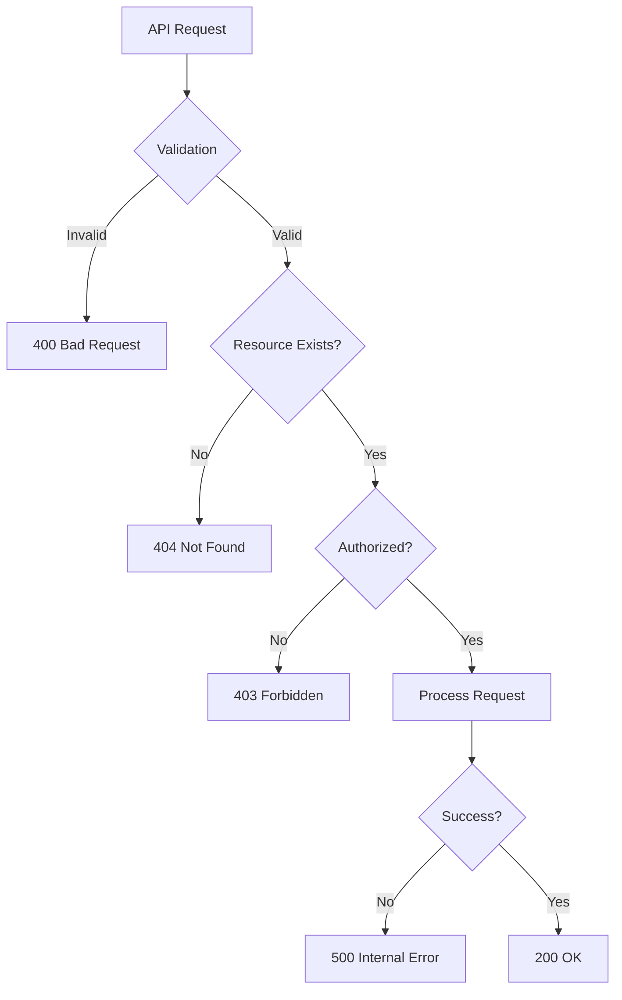

# Permalinks API

<cite>
**Referenced Files in This Document**   
- [routes.ts](file://Backned/src/routes.ts)
- [db.ts](file://Backned/src/db.ts)
- [api-client.ts](file://excalidraw/excalidraw-app/data/api-client.ts)
</cite>

## Table of Contents
1. [Introduction](#introduction)
2. [Permalinks Endpoints](#permalinks-endpoints)
3. [Short URL Generation](#short-url-generation)
4. [Request and Response Formats](#request-and-response-formats)
5. [Database Storage Mechanism](#database-storage-mechanism)
6. [Frontend Integration](#frontend-integration)
7. [Usage Examples](#usage-examples)
8. [Error Handling](#error-handling)
9. [Security Considerations](#security-considerations)

## Introduction
The Permalinks API provides a mechanism to create and resolve short URLs that map to Excalidraw scene data. This system enables users to generate shareable links for collaborative drawing sessions, with special support for educational use cases involving teachers and students. The API consists of two primary endpoints: creating permalinks and resolving them to retrieve scene information.

**Section sources**
- [routes.ts](file://Backned/src/routes.ts#L106-L364)

## Permalinks Endpoints
The Permalinks API exposes two main endpoints for managing short URLs:

- **POST /api/permalinks**: Creates a new permalink mapping to a scene
- **GET /api/permalinks/:id**: Resolves a permalink to retrieve scene data

Additional endpoints support teacher-managed operations:
- **GET /api/permalinks?teacher_id**: Lists permalinks for a specific teacher
- **DELETE /api/permalinks/:permalink**: Deactivates a permalink (teacher-managed)

The system ensures link stability by reusing existing permalinks when the same room_id and room_key combination is requested again.



**Diagram sources**
- [routes.ts](file://Backned/src/routes.ts#L126-L187)
- [routes.ts](file://Backned/src/routes.ts#L328-L364)

**Section sources**
- [routes.ts](file://Backned/src/routes.ts#L126-L364)

## Short URL Generation
Permalinks are generated using a random string algorithm that produces short, alphanumeric identifiers. The system uses JavaScript's Math.random() method combined with base-36 encoding to create compact slugs.

The generation process:
1. Generates a random floating-point number
2. Converts it to a base-36 string representation
3. Extracts characters from position 2 to 10, yielding an 8-character slug

This approach balances brevity with sufficient entropy to minimize collision risks in typical usage scenarios.



**Diagram sources**
- [routes.ts](file://Backned/src/routes.ts#L106-L108)

**Section sources**
- [routes.ts](file://Backned/src/routes.ts#L106-L108)

## Request and Response Formats
### Create Permalink Request
The POST /api/permalinks endpoint accepts a JSON payload with the following schema:

```json
{
  "room_id": "string",
  "room_key": "string",
  "student_name": "string (optional)",
  "teacher_id": "string (optional)"
}
```

All required fields must be strings. The optional student_name and teacher_id fields enable educational use cases where teachers need to manage links for specific students.

### Create Permalink Response
Upon successful creation, the API returns a JSON object containing the generated slug:

```json
{
  "permalink": "generated-slug"
}
```

### Resolve Permalink Response
The GET /api/permalinks/:id endpoint returns scene mapping data:

```json
{
  "roomId": "string",
  "roomKey": "string",
  "studentName": "string (optional)"
}
```



**Diagram sources**
- [routes.ts](file://Backned/src/routes.ts#L126-L187)
- [api-client.ts](file://excalidraw/excalidraw-app/data/api-client.ts#L29-L33)

**Section sources**
- [routes.ts](file://Backned/src/routes.ts#L126-L187)
- [api-client.ts](file://excalidraw/excalidraw-app/data/api-client.ts#L29-L33)

## Database Storage Mechanism
The permalink system uses SQLite to store mappings between short URLs and scene data. The database schema includes a dedicated table for permalinks with the following structure:

- **permalink**: Primary key, the short URL slug
- **room_id**: The target room identifier
- **room_key**: Encryption key for the scene
- **student_name**: Optional student identifier
- **teacher_id**: Optional teacher identifier
- **created_at**: Timestamp of creation
- **last_accessed**: Timestamp of last access
- **is_active**: Status flag (soft delete)

The system implements expiration handling through the is_active flag rather than time-based expiration. Permalinks can be deactivated (soft-deleted) but remain in the database for audit purposes. When a permalink is accessed, the last_accessed timestamp is updated to track usage patterns.

Unique constraints ensure that each teacher-student combination can have only one active permalink, preventing duplicate entries in educational scenarios.

```mermaid
erDiagram
PERMALINKS {
string permalink PK
string room_id
string room_key
string student_name
string teacher_id
datetime created_at
datetime last_accessed
boolean is_active
}
PERMALINKS ||--o{ TEACHERS : "belongs to"
INDEXES {
idx_permalinks_room_id
idx_permalinks_teacher_id
idx_permalinks_teacher_student
}
```

**Diagram sources**
- [db.ts](file://Backned/src/db.ts#L20-L65)
- [routes.ts](file://Backned/src/routes.ts#L328-L364)

**Section sources**
- [db.ts](file://Backned/src/db.ts#L20-L65)

## Frontend Integration
The frontend integrates with the Permalinks API through the api-client.ts module, which provides a clean interface for interacting with the backend services.

### Key Methods
- **createPermalink()**: Creates a new permalink with scene mapping
- **getSceneByPermalink()**: Resolves a permalink to retrieve scene data
- **listPermalinks()**: Retrieves all permalinks for a teacher
- **deletePermalink()**: Deactivates a permalink

The ApiClient class handles HTTP communication, error parsing, and URL construction, abstracting the underlying API details from the rest of the application.



**Diagram sources**
- [api-client.ts](file://excalidraw/excalidraw-app/data/api-client.ts#L65-L105)
- [routes.ts](file://Backned/src/routes.ts#L126-L187)

**Section sources**
- [api-client.ts](file://excalidraw/excalidraw-app/data/api-client.ts#L65-L105)

## Usage Examples
### Creating a Permalink with curl
```bash
curl -X POST https://backend.example.com/api/permalinks \
  -H "Content-Type: application/json" \
  -d '{
    "room_id": "abc123xyz",
    "room_key": "secret-encryption-key",
    "student_name": "John Doe",
    "teacher_id": "teacher789"
  }'
```

Expected response:
```json
{"permalink": "a1b2c3d4"}
```

### Resolving a Permalink in JavaScript
```javascript
import { apiClient } from './data/api-client';

async function loadSceneFromPermalink(permalink) {
  try {
    const data = await apiClient.resolvePermalink(permalink);
    if (data) {
      console.log('Room ID:', data.roomId);
      console.log('Room Key:', data.roomKey);
      console.log('Student:', data.studentName);
      // Use data to join the collaborative session
    } else {
      console.error('Permalink not found');
    }
  } catch (error) {
    console.error('Failed to resolve permalink:', error.message);
  }
}

// Usage
loadSceneFromPermalink('a1b2c3d4');
```

**Section sources**
- [api-client.ts](file://excalidraw/excalidraw-app/data/api-client.ts#L85-L105)
- [routes.ts](file://Backned/src/routes.ts#L328-L364)

## Error Handling
The Permalinks API implements comprehensive error handling with standardized responses:

- **400 Bad Request**: Invalid payload (missing or incorrect field types)
- **404 Not Found**: Permalink does not exist or has been deactivated
- **403 Forbidden**: Authentication failure (invalid teacher token)
- **409 Conflict**: Attempt to create duplicate teacher-student mapping
- **500 Internal Server Error**: Unexpected server-side issues

The system handles potential slug collisions by checking for existing mappings before creation. When a teacher attempts to create a permalink for a student who already has one, the system returns the existing permalink rather than creating a duplicate.

Special handling exists for unique constraint violations (SQLITE_CONSTRAINT), where the system attempts to retrieve and return the existing permalink for the teacher-student combination.



**Diagram sources**
- [routes.ts](file://Backned/src/routes.ts#L126-L187)
- [routes.ts](file://Backned/src/routes.ts#L328-L364)

**Section sources**
- [routes.ts](file://Backned/src/routes.ts#L126-L187)
- [routes.ts](file://Backned/src/routes.ts#L328-L364)

## Security Considerations
The permalinks system incorporates several security measures to protect data integrity and privacy:

### Slug Generation Security
- Uses Math.random() with base-36 encoding for unpredictable slugs
- 8-character length provides approximately 2.8 trillion possible combinations
- No dictionary words or patterns that could be easily guessed
- Collision resistance through database uniqueness constraints

### Access Control
- Teacher-student mappings are protected by teacher_id scoping
- All teacher operations require either teacher_id query parameter or token authentication
- Soft deletion (is_active flag) prevents accidental data loss while maintaining access control
- Unique index on (teacher_id, student_name) prevents enumeration attacks

### Data Protection
- Room keys are stored in the database but transmitted securely
- No sensitive user data stored beyond what's necessary for functionality
- Timestamps for creation and access enable monitoring of usage patterns
- Parameterized SQL queries prevent injection attacks

The system balances usability with security, providing educators with tools to manage student access while maintaining the privacy and integrity of collaborative sessions.

**Section sources**
- [routes.ts](file://Backned/src/routes.ts#L106-L187)
- [db.ts](file://Backned/src/db.ts#L55-L65)