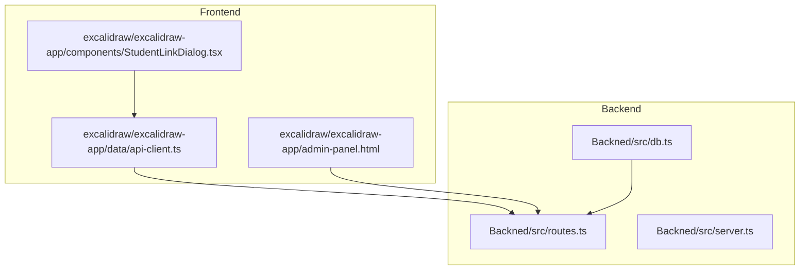
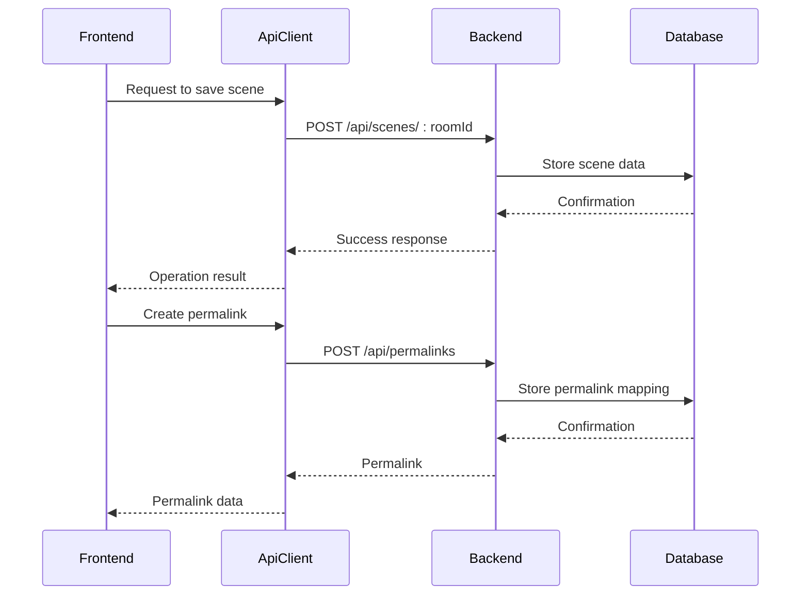
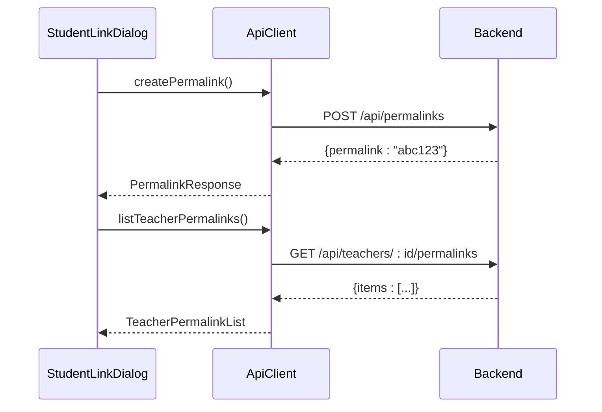
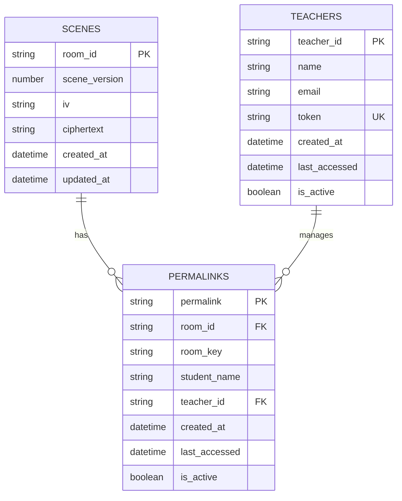
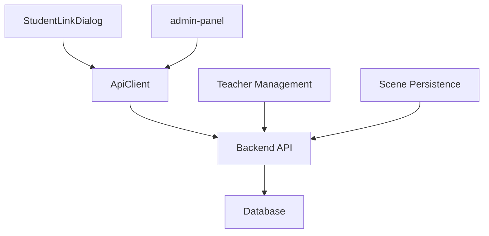

# REST API

<cite>
**Referenced Files in This Document**   
- [routes.ts](file://Backned/src/routes.ts)
- [db.ts](file://Backned/src/db.ts)
- [api-client.ts](file://excalidraw/excalidraw-app/data/api-client.ts)
</cite>

## Table of Contents
1. [Introduction](#introduction)
2. [Project Structure](#project-structure)
3. [Core Components](#core-components)
4. [Architecture Overview](#architecture-overview)
5. [Detailed Component Analysis](#detailed-component-analysis)
6. [Dependency Analysis](#dependency-analysis)
7. [Performance Considerations](#performance-considerations)
8. [Troubleshooting Guide](#troubleshooting-guide)
9. [Conclusion](#conclusion)

## Introduction
This document provides comprehensive REST API documentation for the Excalidraw backend system. The API supports scene persistence, permalink generation, and teacher/student management workflows. It details all endpoints defined in `routes.ts`, including HTTP methods, URL patterns, request parameters, response formats, authentication requirements, and error handling. The documentation also covers the interaction between the frontend `api-client.ts` and backend routes, data flow for key operations, database interactions via `db.ts`, and security considerations including input validation and access control.

## Project Structure
The project consists of a backend service in the `Backned` directory and a frontend application in the `excalidraw` directory. The backend contains the API routes, database operations, and server configuration, while the frontend includes the API client implementation and user interface components for teacher and student management.

**Diagram sources**
- [routes.ts](file://Backned/src/routes.ts)
- [db.ts](file://Backned/src/db.ts)
- [api-client.ts](file://excalidraw/excalidraw-app/data/api-client.ts)

**Section sources**
- [routes.ts](file://Backned/src/routes.ts)
- [db.ts](file://Backned/src/db.ts)
- [api-client.ts](file://excalidraw/excalidraw-app/data/api-client.ts)

## Core Components
The core components of the system include the API routes that handle scene persistence and permalink management, the database operations that store and retrieve scene data, and the API client that facilitates communication between the frontend and backend. The system also includes administrative functionality for managing teacher accounts and student links.

**Section sources**
- [routes.ts](file://Backned/src/routes.ts#L1-L365)
- [db.ts](file://Backned/src/db.ts#L1-L96)
- [api-client.ts](file://excalidraw/excalidraw-app/data/api-client.ts#L1-L157)

## Architecture Overview
The system architecture follows a client-server model where the frontend application communicates with the backend API to persist scenes and manage permalinks. The backend stores scene data in an SQLite database and provides REST endpoints for creating, retrieving, and managing scenes and permalinks. Teacher and student management is handled through protected endpoints that require authentication tokens.

**Diagram sources**
- [routes.ts](file://Backned/src/routes.ts#L1-L365)
- [db.ts](file://Backned/src/db.ts#L1-L96)
- [api-client.ts](file://excalidraw/excalidraw-app/data/api-client.ts#L1-L157)

## Detailed Component Analysis

### Scene Persistence API
The scene persistence API allows clients to save and retrieve Excalidraw scenes using room identifiers. Scenes are stored with versioning information and encrypted data.

#### Endpoints
**GET /api/scenes/:roomId**
- **Method**: GET
- **Description**: Retrieve a scene by room ID
- **Parameters**: 
  - roomId (path): Unique identifier for the scene
- **Response**: Scene data including version, initialization vector, and ciphertext
- **Authentication**: None
- **Error Codes**:
  - 404: Scene not found
  - 500: Internal server error

**POST /api/scenes/:roomId**
- **Method**: POST
- **Description**: Save or update a scene
- **Parameters**:
  - roomId (path): Unique identifier for the scene
  - scene_version (body): Version number of the scene
  - iv (body): Initialization vector for encryption
  - ciphertext (body): Encrypted scene data
- **Response**: Success confirmation
- **Authentication**: None
- **Error Codes**:
  - 400: Invalid payload
  - 500: Internal server error

**Section sources**
- [routes.ts](file://Backned/src/routes.ts#L45-L76)

### Permalink Management API
The permalink management API enables the creation of stable URLs that map to specific Excalidraw rooms, supporting teacher-student workflows.

#### Endpoints
**POST /api/permalinks**
- **Method**: POST
- **Description**: Create a new permalink or retrieve existing one
- **Request Body**:
  - room_id: Target room identifier
  - room_key: Encryption key for the room
  - student_name: Optional student identifier
  - teacher_id: Optional teacher identifier
- **Response**: Generated or existing permalink
- **Authentication**: None
- **Error Codes**:
  - 400: Invalid payload
  - 500: Internal server error

**GET /api/permalinks/:permalink**
- **Method**: GET
- **Description**: Resolve a permalink to its target room
- **Parameters**:
  - permalink (path): Short identifier for the link
- **Response**: Room ID, room key, and optional student name
- **Authentication**: None
- **Error Codes**:
  - 404: Permalink not found
  - 500: Internal server error

**Section sources**
- [routes.ts](file://Backned/src/routes.ts#L126-L187)

### Teacher Management API
The teacher management API provides endpoints for administrators to create and manage teacher accounts, and for teachers to manage their student permalinks.

#### Endpoints
**POST /api/admin/teachers**
- **Method**: POST
- **Description**: Create a new teacher account
- **Request Headers**:
  - x-admin-token: Administrator authentication token
- **Request Body**:
  - name: Teacher's name
  - email: Teacher's email address
- **Response**: Generated teacher_id and authentication token
- **Authentication**: Admin token required
- **Error Codes**:
  - 400: Invalid payload
  - 403: Forbidden (invalid admin token)
  - 500: Internal server error

**GET /api/teachers/:teacherId/permalinks**
- **Method**: GET
- **Description**: List all active permalinks for a teacher
- **Parameters**:
  - teacherId (path): Teacher identifier
  - token (query): Teacher's authentication token
- **Response**: List of permalink mappings with room information
- **Authentication**: Teacher token required
- **Error Codes**:
  - 403: Forbidden (invalid token)
  - 500: Internal server error

**DELETE /api/teachers/:teacherId/permalinks/:permalink**
- **Method**: DELETE
- **Description**: Deactivate a specific permalink
- **Parameters**:
  - teacherId (path): Teacher identifier
  - permalink (path): Permalink to deactivate
  - token (query): Teacher's authentication token
- **Response**: Success confirmation
- **Authentication**: Teacher token required
- **Error Codes**:
  - 403: Forbidden (invalid token)
  - 500: Internal server error

**Section sources**
- [routes.ts](file://Backned/src/routes.ts#L274-L364)

### Frontend-Backend Interaction
The frontend and backend interact through the `api-client.ts` module, which provides a typed interface for all API operations. This client handles request formatting, error handling, and response parsing.

**Diagram sources**
- [api-client.ts](file://excalidraw/excalidraw-app/data/api-client.ts#L1-L157)
- [routes.ts](file://Backned/src/routes.ts#L1-L365)

**Section sources**
- [api-client.ts](file://excalidraw/excalidraw-app/data/api-client.ts#L1-L157)

### Database Interaction
The database interaction is handled through `db.ts`, which provides a promise-based interface to SQLite operations. The system uses three main tables: scenes, permalinks, and teachers.

**Diagram sources**
- [db.ts](file://Backned/src/db.ts#L1-L96)

**Section sources**
- [db.ts](file://Backned/src/db.ts#L1-L96)

## Dependency Analysis
The system has a clear dependency structure with the frontend depending on the backend API, and the backend depending on the database layer. The API client abstracts the HTTP communication details, providing a clean interface for the frontend components.

**Diagram sources**
- [routes.ts](file://Backned/src/routes.ts)
- [db.ts](file://Backned/src/db.ts)
- [api-client.ts](file://excalidraw/excalidraw-app/data/api-client.ts)

**Section sources**
- [routes.ts](file://Backned/src/routes.ts)
- [db.ts](file://Backned/src/db.ts)
- [api-client.ts](file://excalidraw/excalidraw-app/data/api-client.ts)

## Performance Considerations
The API is designed for efficient scene retrieval and storage operations. Database indexes are created on frequently queried fields such as room_id, teacher_id, and updated_at timestamps. The system uses connection pooling and prepared statements to optimize database performance. For high-traffic scenarios, caching mechanisms could be implemented at the application level to reduce database load.

## Troubleshooting Guide
Common issues and their solutions:

- **404 errors on scene retrieval**: Verify that the room_id exists in the database and has been properly saved.
- **Authentication failures**: Ensure the correct token is provided in the appropriate header or query parameter.
- **Database connection issues**: Check that the DATABASE_PATH environment variable is correctly set and the database file is writable.
- **CORS issues**: Ensure the frontend and backend are properly configured for cross-origin requests.

**Section sources**
- [routes.ts](file://Backned/src/routes.ts)
- [db.ts](file://Backned/src/db.ts)

## Conclusion
The Excalidraw REST API provides a robust foundation for scene persistence and educational workflow management. The well-defined endpoints support collaborative drawing scenarios with features for teacher-student interactions through permalinks. The separation of concerns between frontend and backend components, along with proper authentication mechanisms, creates a secure and maintainable system. Future enhancements could include rate limiting, enhanced error reporting, and additional analytics capabilities.