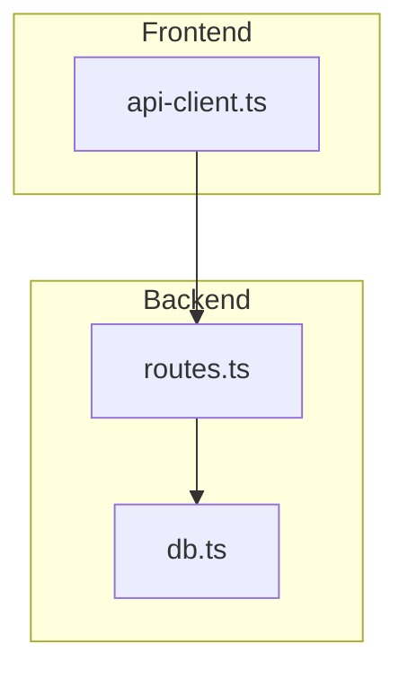
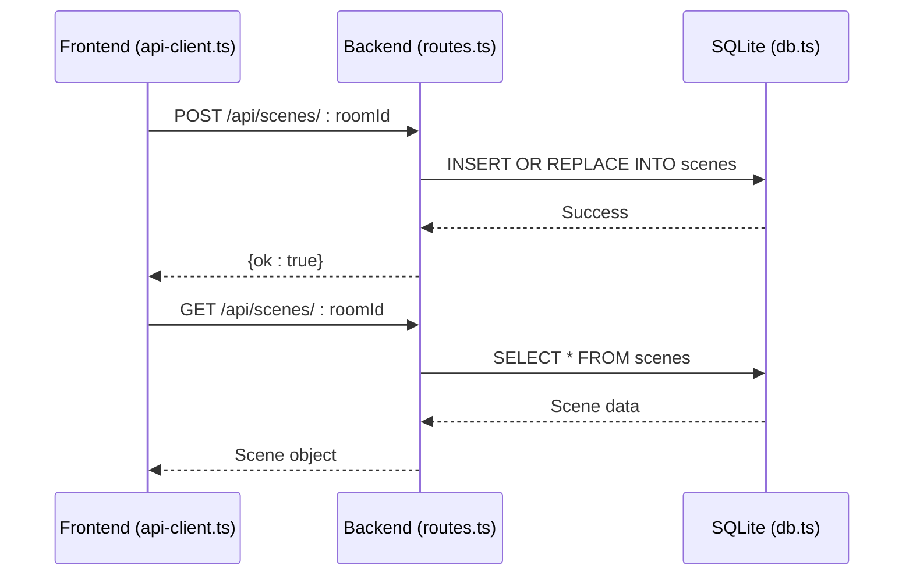
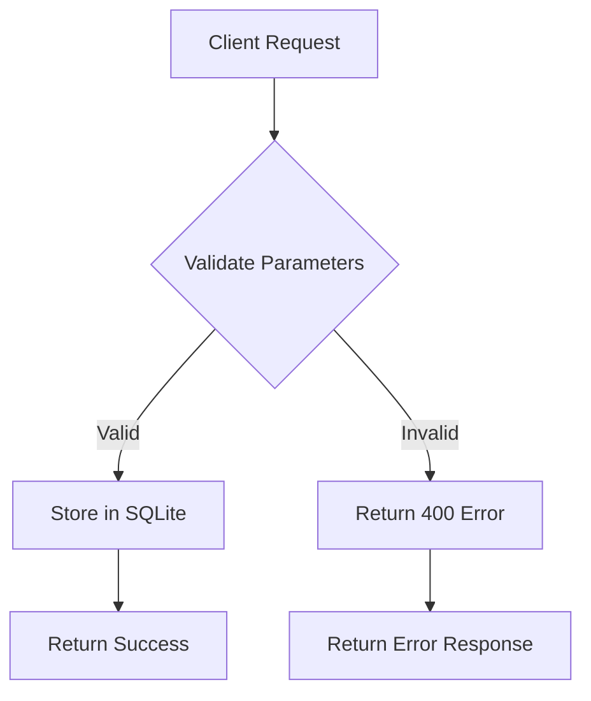
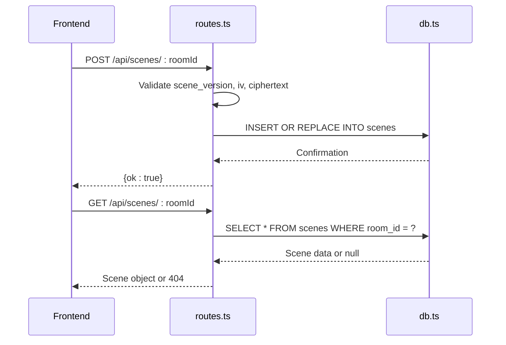
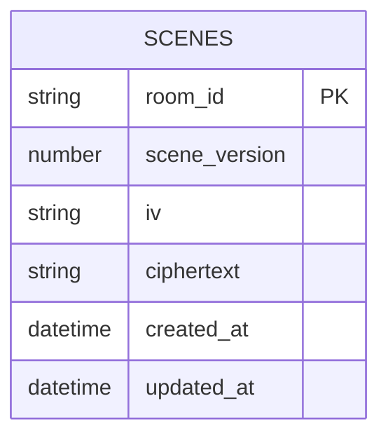
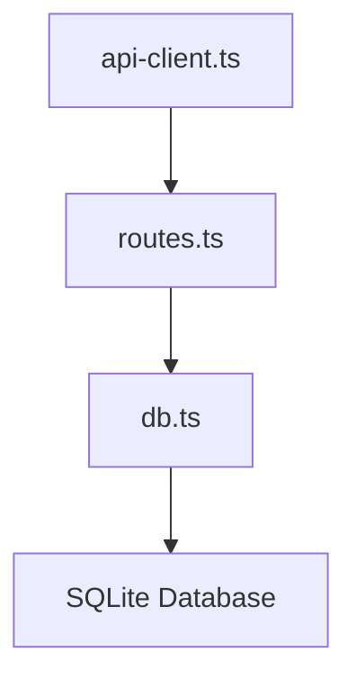

# Scenes API

<cite>
**Referenced Files in This Document**   
- [routes.ts](file://Backned/src/routes.ts)
- [db.ts](file://Backned/src/db.ts)
- [api-client.ts](file://excalidraw/excalidraw-app/data/api-client.ts)
</cite>

## Table of Contents
1. [Introduction](#introduction)
2. [Project Structure](#project-structure)
3. [Core Components](#core-components)
4. [Architecture Overview](#architecture-overview)
5. [Detailed Component Analysis](#detailed-component-analysis)
6. [Dependency Analysis](#dependency-analysis)
7. [Performance Considerations](#performance-considerations)
8. [Troubleshooting Guide](#troubleshooting-guide)
9. [Conclusion](#conclusion)

## Introduction
This document provides comprehensive API documentation for the scenes endpoints in the Excalidraw backend system. It details the implementation of `GET /api/scenes/:id`, `POST /api/scenes/:id`, and related functionality for saving and retrieving scene data. The documentation covers request/response schemas, data serialization, storage via SQLite, error handling, and the interaction between frontend and backend components. Special attention is given to data validation, security considerations, and integration patterns.

## Project Structure
The project structure reveals a backend service located in the `Backned` directory that handles scene persistence through REST APIs. Scene data is stored in SQLite via `db.ts`, with API routes defined in `routes.ts`. The frontend application in `excalidraw-app` interacts with these endpoints through `api-client.ts`. This separation of concerns allows for clear delineation between data storage, API exposure, and client interaction layers.

**Diagram sources**
- [routes.ts](file://Backned/src/routes.ts)
- [db.ts](file://Backned/src/db.ts)
- [api-client.ts](file://excalidraw/excalidraw-app/data/api-client.ts)

**Section sources**
- [routes.ts](file://Backned/src/routes.ts)
- [db.ts](file://Backned/src/db.ts)
- [api-client.ts](file://excalidraw/excalidraw-app/data/api-client.ts)

## Core Components
The core components of the scenes API include the routing layer in `routes.ts` that handles HTTP requests, the database abstraction in `db.ts` that manages SQLite operations, and the frontend API client in `api-client.ts` that facilitates communication between the UI and backend. These components work together to provide a complete scene persistence solution with proper error handling and data validation.

**Section sources**
- [routes.ts](file://Backned/src/routes.ts#L45-L124)
- [db.ts](file://Backned/src/db.ts#L1-L96)
- [api-client.ts](file://excalidraw/excalidraw-app/data/api-client.ts#L70-L123)

## Architecture Overview
The architecture follows a standard REST pattern with the frontend client making HTTP requests to backend endpoints that interact with a SQLite database. Scene data is encrypted client-side and transmitted as ciphertext, with the backend storing only the encrypted payload. This design ensures data privacy while providing reliable persistence.

**Diagram sources**
- [routes.ts](file://Backned/src/routes.ts#L45-L79)
- [db.ts](file://Backned/src/db.ts#L1-L96)
- [api-client.ts](file://excalidraw/excalidraw-app/data/api-client.ts#L70-L123)

## Detailed Component Analysis

### Scene Persistence Analysis
The scene persistence system handles saving and retrieving encrypted scene data through dedicated endpoints. When saving a scene, the client sends the room ID, scene version, initialization vector, and ciphertext. The backend validates these parameters and stores them in the SQLite database with a timestamp.

**Diagram sources**
- [routes.ts](file://Backned/src/routes.ts#L58-L79)
- [api-client.ts](file://excalidraw/excalidraw-app/data/api-client.ts#L85-L95)

#### For API/Service Components:

**Diagram sources**
- [routes.ts](file://Backned/src/routes.ts#L45-L79)
- [db.ts](file://Backned/src/db.ts#L1-L96)

**Section sources**
- [routes.ts](file://Backned/src/routes.ts#L45-L79)
- [api-client.ts](file://excalidraw/excalidraw-app/data/api-client.ts#L70-L95)

### Data Storage Analysis
The data storage implementation uses SQLite to persist scene data with proper schema design and indexing. The scenes table includes fields for room ID, scene version, initialization vector, ciphertext, and timestamps. Database operations are promisified for async/await usage, and the schema includes indexes to optimize query performance.

**Diagram sources**
- [db.ts](file://Backned/src/db.ts#L15-L30)

**Section sources**
- [db.ts](file://Backned/src/db.ts#L1-L96)

## Dependency Analysis
The scenes API has a clear dependency chain from the frontend client through the routing layer to the database abstraction. The `api-client.ts` depends on the REST endpoints defined in `routes.ts`, which in turn depends on the database utilities in `db.ts`. This layered architecture ensures separation of concerns and maintainability.

**Diagram sources**
- [api-client.ts](file://excalidraw/excalidraw-app/data/api-client.ts)
- [routes.ts](file://Backned/src/routes.ts)
- [db.ts](file://Backned/src/db.ts)

**Section sources**
- [routes.ts](file://Backned/src/routes.ts)
- [db.ts](file://Backned/src/db.ts)
- [api-client.ts](file://excalidraw/excalidraw-app/data/api-client.ts)

## Performance Considerations
The implementation includes several performance optimizations such as database indexing on frequently queried fields and efficient query patterns. The use of prepared statements helps prevent SQL injection while also improving execution speed through query plan caching. The 10MB size limit for requests prevents abuse and ensures system stability.

## Troubleshooting Guide
Common issues include CORS errors when the frontend and backend ports don't match, and payload validation failures due to missing or incorrectly typed parameters. The system returns specific error codes: 400 for invalid payloads, 404 for non-existent scenes, and 500 for internal server errors. When troubleshooting, verify the request structure matches the expected schema and check server logs for detailed error information.

**Section sources**
- [routes.ts](file://Backned/src/routes.ts#L58-L79)
- [api-client.ts](file://excalidraw/excalidraw-app/data/api-client.ts#L75-L80)

## Conclusion
The scenes API provides a robust solution for persisting Excalidraw scenes through a well-designed REST interface. The system effectively separates concerns between frontend and backend components, uses secure data storage practices, and includes comprehensive error handling. The implementation demonstrates good architectural principles with clear component boundaries and proper dependency management.