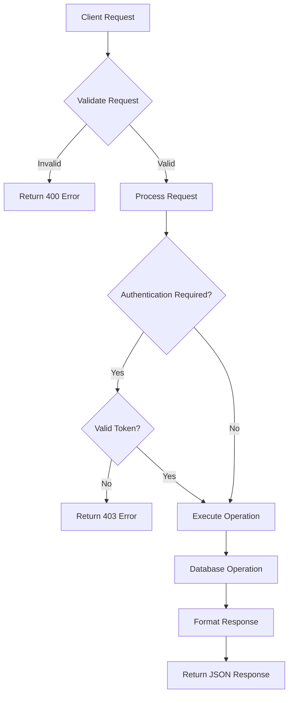
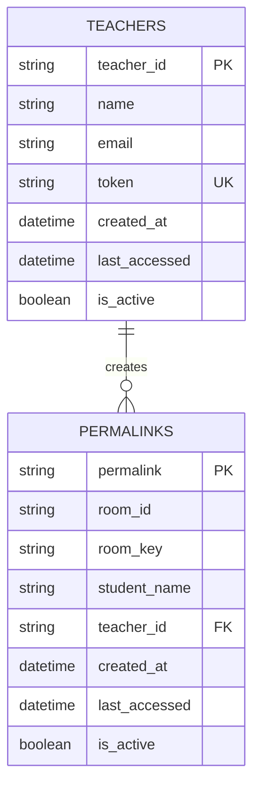
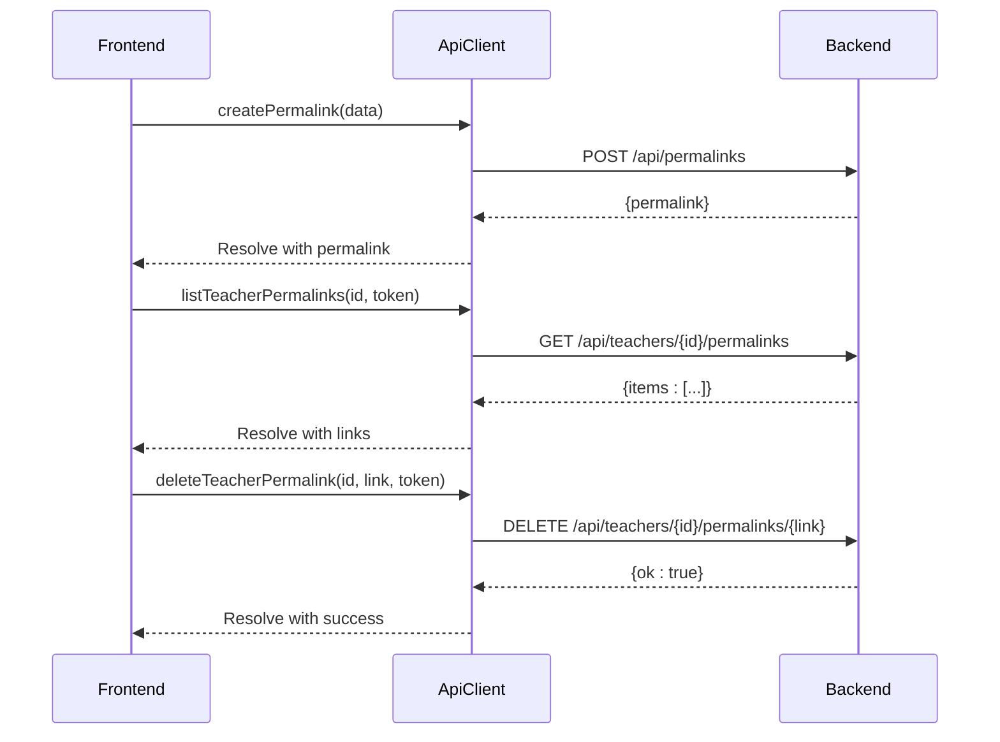

# Teachers API

<cite>
**Referenced Files in This Document**   
- [routes.ts](file://Backned/src/routes.ts)
- [db.ts](file://Backned/src/db.ts)
- [api-client.ts](file://excalidraw/excalidraw-app/data/api-client.ts)
- [admin-panel.js](file://excalidraw/excalidraw-app/admin-panel.js)
- [StudentLinkDialog.tsx](file://excalidraw/excalidraw-app/components/StudentLinkDialog.tsx)
</cite>

## Table of Contents
1. [Introduction](#introduction)
2. [Teacher Registration Process](#teacher-registration-process)
3. [Student Link Generation](#student-link-generation)
4. [Classroom Management Capabilities](#classroom-management-capabilities)
5. [Request/Response Schemas](#requestresponse-schemas)
6. [Database Storage and Validation](#database-storage-and-validation)
7. [Admin Panel Integration](#admin-panel-integration)
8. [Frontend API Client Methods](#frontend-api-client-methods)
9. [Usage Examples](#usage-examples)
10. [Security Considerations](#security-considerations)

## Introduction
This document provides comprehensive API documentation for the teachers endpoints in the Excalidraw educational platform. The system enables teachers to manage classrooms through persistent student links, with secure authentication and data management. The API supports teacher registration, student link generation, and classroom management operations through a RESTful interface. Teachers can create and manage student-specific collaboration links that persist across sessions, allowing for consistent classroom management and student progress tracking.

## Teacher Registration Process
The teacher registration process is handled through the admin-only endpoint POST /api/admin/teachers. Only authenticated administrators can create new teacher accounts by providing a name and optional email address. Upon successful registration, the system generates a unique teacher_id and a secure token for authentication. These credentials are stored in the teachers table with appropriate constraints to ensure uniqueness and data integrity. The registration process does not require password input as the token serves as the primary authentication mechanism for teacher-specific operations.

**Section sources**
- [routes.ts](file://Backned/src/routes.ts#L200-L230)
- [db.ts](file://Backned/src/db.ts#L58-L62)

## Student Link Generation
Student link generation occurs when a teacher creates a persistent connection between a student and a collaboration room. The process begins with POST /api/permalinks, where the teacher provides the room_id, room_key, student_name, and teacher_id. The system first checks for existing mappings to maintain link stability, then creates a unique permalink that persists across sessions. Each student link is associated with a specific teacher and student name combination, ensuring that students always access the same collaborative workspace. The generated permalink can be shared with students and remains valid until explicitly deactivated by the teacher.

**Section sources**
- [routes.ts](file://Backned/src/routes.ts#L100-L160)
- [StudentLinkDialog.tsx](file://excalidraw/excalidraw-app/components/StudentLinkDialog.tsx#L150-L180)

## Classroom Management Capabilities
The API provides comprehensive classroom management capabilities through teacher-specific endpoints. Teachers can retrieve their list of student links via GET /api/teachers/:teacherId/permalinks by providing their token for authentication. They can also deactivate specific student links using DELETE /api/teachers/:teacherId/permalinks/:permalink, effectively removing a student's access to their collaborative workspace. The system maintains a record of all active links, their creation time, and last access date, allowing teachers to monitor classroom activity and manage student participation effectively.

**Section sources**
- [routes.ts](file://Backned/src/routes.ts#L162-L198)
- [StudentLinkDialog.tsx](file://excalidraw/excalidraw-app/components/StudentLinkDialog.tsx#L110-L148)

## Request/Response Schemas
The API uses standardized request and response schemas for all teacher-related operations. For teacher registration, the request requires a JSON body with "name" (string) and optional "email" (string), returning a response with "teacher_id" and "token". For student link creation, the request includes "room_id", "room_key", "student_name", and "teacher_id", returning a "permalink" identifier. All responses follow a consistent pattern with either success data or error objects containing descriptive error codes. Teacher authentication requires the token to be passed as a query parameter in protected endpoints.



**Diagram sources**
- [routes.ts](file://Backned/src/routes.ts#L100-L230)
- [api-client.ts](file://excalidraw/excalidraw-app/data/api-client.ts#L20-L50)

## Database Storage and Validation
Teacher and student data is stored in SQLite databases with structured schemas and appropriate validation. The teachers table contains teacher_id, name, email, and a unique token field, with constraints ensuring data integrity. The permalinks table stores the mapping between teachers, students, and collaboration rooms, with a composite unique index on teacher_id and student_name to prevent duplicate entries for the same student under a teacher. The database initialization process creates necessary tables and indexes, including foreign key relationships and performance-optimized indexes on frequently queried fields.



**Diagram sources**
- [db.ts](file://Backned/src/db.ts#L40-L85)
- [routes.ts](file://Backned/src/routes.ts#L50-L85)

## Admin Panel Integration
The admin panel provides a web interface for managing teachers through the admin-panel.js file. Administrators can load the list of all teachers, view their credentials, and upload new teachers via CSV. The interface displays teacher information including name, email, teacher_id, and token, with direct links to their teacher management panel. The admin panel uses the same API endpoints as other clients, authenticating with an x-admin-token header. This integration allows for bulk operations and centralized management of teacher accounts without requiring direct database access.

**Section sources**
- [admin-panel.js](file://excalidraw/excalidraw-app/admin-panel.js#L1-L78)
- [routes.ts](file://Backned/src/routes.ts#L200-L270)

## Frontend API Client Methods
The frontend implements teacher functionality through the api-client.ts module, which provides a clean interface for all teacher-related API operations. The ApiClient class includes methods for creating permalinks, listing teacher permalinks, and deleting permalinks with proper authentication handling. The client automatically manages token passing for teacher-protected endpoints and handles error responses consistently. The StudentLinkDialog component uses these methods to provide a complete classroom management interface, allowing teachers to create, view, and manage student links directly from the application.



**Diagram sources**
- [api-client.ts](file://excalidraw/excalidraw-app/data/api-client.ts#L60-L120)
- [StudentLinkDialog.tsx](file://excalidraw/excalidraw-app/components/StudentLinkDialog.tsx#L150-L200)

## Usage Examples
### Creating a Teacher (Admin Only)
```bash
curl -X POST http://localhost:3005/api/admin/teachers \
  -H "x-admin-token: your_admin_token" \
  -H "Content-Type: application/json" \
  -d '{"name": "John Doe", "email": "john@example.com"}'
```

### Generating a Student Link
```bash
curl -X POST http://localhost:3005/api/permalinks \
  -H "Content-Type: application/json" \
  -d '{
    "room_id": "abc123",
    "room_key": "xyz789",
    "student_name": "Jane Smith",
    "teacher_id": "tch_001"
  }'
```

### JavaScript Fetch Example
```javascript
// Create student link
const response = await fetch('/api/permalinks', {
  method: 'POST',
  headers: { 'Content-Type': 'application/json' },
  body: JSON.stringify({
    room_id: 'abc123',
    room_key: 'xyz789',
    student_name: 'Jane Smith',
    teacher_id: 'tch_001'
  })
});
const { permalink } = await response.json();

// List teacher's student links
const linksResponse = await fetch(`/api/teachers/tch_001/permalinks?token=teacher_token`);
const { items } = await linksResponse.json();
```

**Section sources**
- [routes.ts](file://Backned/src/routes.ts#L100-L160)
- [api-client.ts](file://excalidraw/excalidraw-app/data/api-client.ts#L60-L80)

## Security Considerations
The system implements multiple security measures to protect teacher and student data. Teacher authentication relies on randomly generated tokens (16 characters) rather than passwords, reducing the risk of weak credentials. All teacher-specific operations require token verification through query parameters. The database enforces uniqueness constraints to prevent credential conflicts. Administrative operations are protected by an environment-variable-based admin token, ensuring only authorized personnel can create teachers. The system also includes proper error handling that avoids leaking sensitive information in error responses. Token-based authentication is used consistently across all teacher endpoints, with validation occurring before any database operations.

**Section sources**
- [routes.ts](file://Backned/src/routes.ts#L90-L95)
- [db.ts](file://Backned/src/db.ts#L58-L62)
- [api-client.ts](file://excalidraw/excalidraw-app/data/api-client.ts#L100-L120)