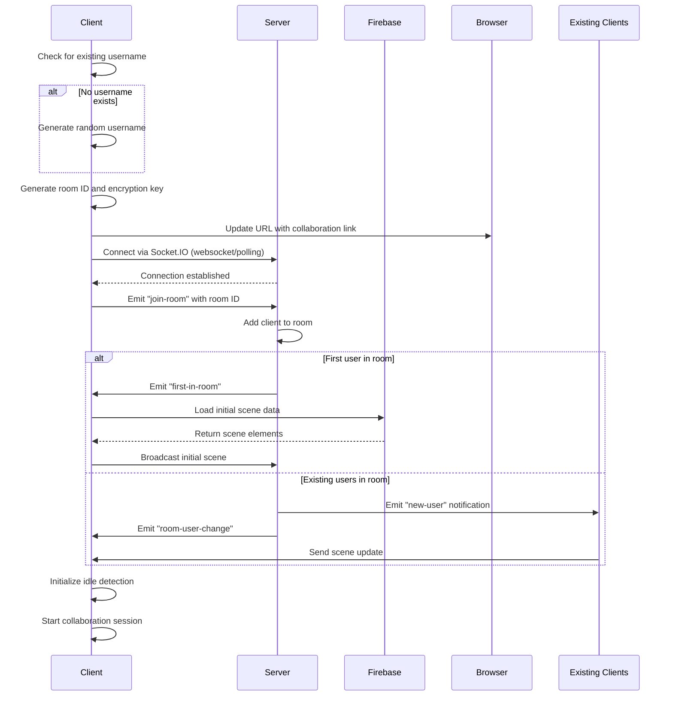
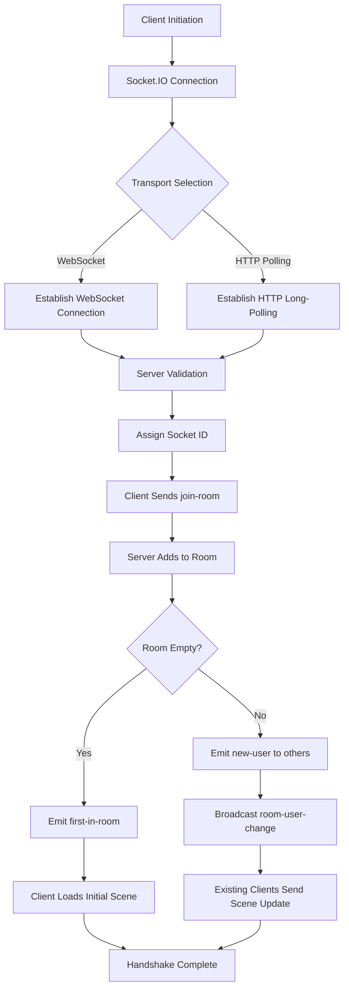
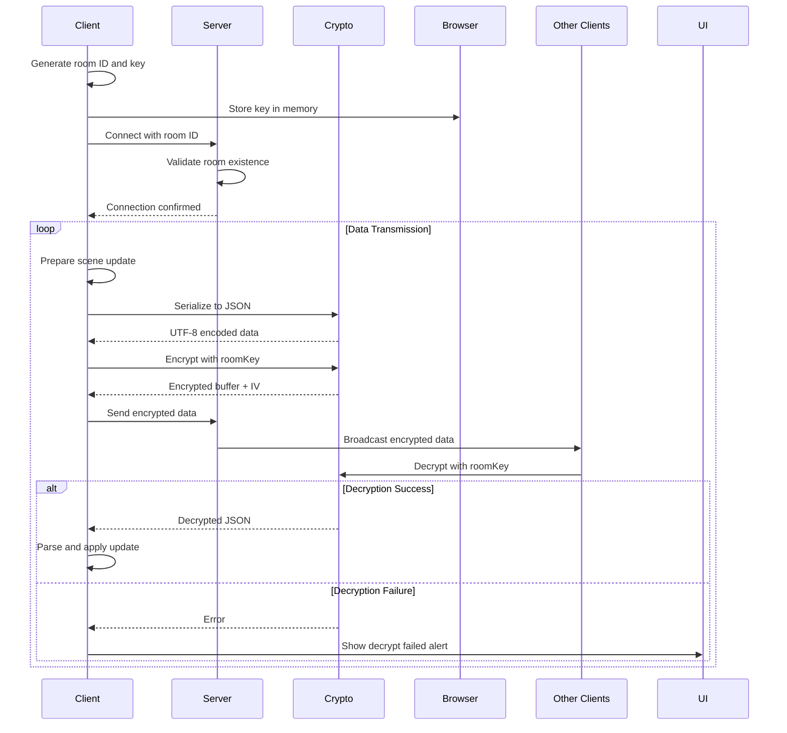
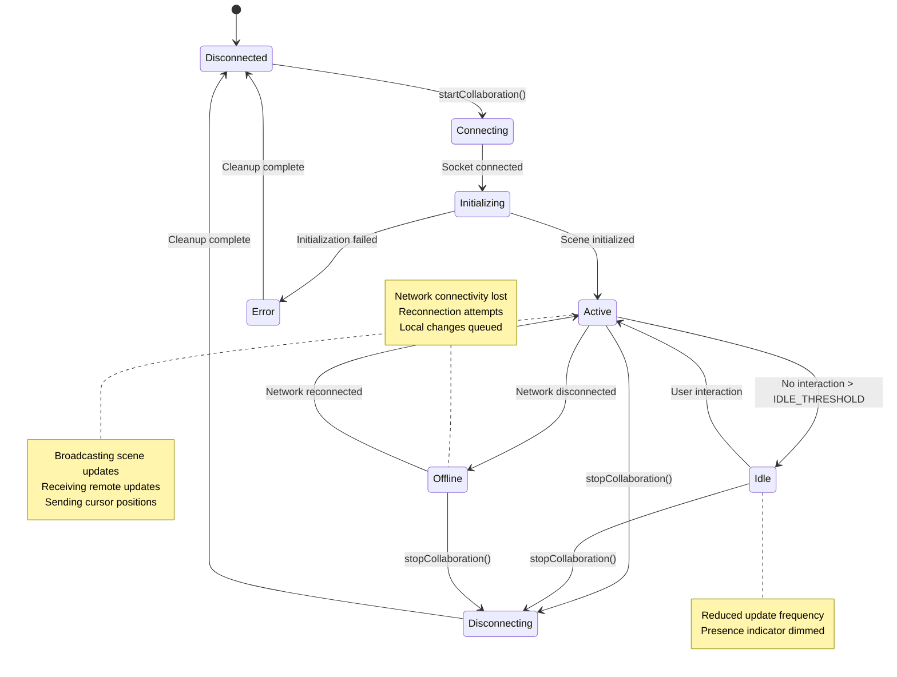

# Connection Management

<cite>
**Referenced Files in This Document**   
- [Collab.tsx](file://excalidraw/excalidraw-app/collab/Collab.tsx)
- [Portal.tsx](file://excalidraw/excalidraw-app/collab/Portal.tsx)
- [index.ts](file://excalidraw-room/src/index.ts)
- [index.js](file://excalidraw/excalidraw-room/src/index.js)
- [app_constants.ts](file://excalidraw/excalidraw-app/app_constants.ts)
- [data/index.ts](file://excalidraw/excalidraw-app/data/index.ts)
</cite>

## Table of Contents
1. [Introduction](#introduction)
2. [Connection Establishment Process](#connection-establishment-process)
3. [WebSocket Handshake Protocol](#websocket-handshake-protocol)
4. [Room Joining Mechanism](#room-joining-mechanism)
5. [Authentication and Security Flow](#authentication-and-security-flow)
6. [Connection States and Lifecycle](#connection-states-and-lifecycle)
7. [Session Persistence Strategy](#session-persistence-strategy)
8. [Error Conditions and Handling](#error-conditions-and-handling)
9. [Reconnection Logic](#reconnection-logic)
10. [Security Considerations](#security-considerations)

## Introduction
This document provides comprehensive documentation for the WebSocket connection lifecycle in the Excalidraw collaboration system. It details the end-to-end process of establishing, maintaining, and terminating collaborative sessions between clients and servers. The documentation covers the connection establishment process between the client (Collab.tsx) and the server (index.ts), including the handshake protocol, room joining mechanism, and authentication flow. It also documents connection states, session persistence strategies, error conditions during connection setup, and reconnection logic when network interruptions occur.

The Excalidraw collaboration system enables real-time collaborative drawing through a WebSocket-based architecture that synchronizes drawing elements, cursor positions, and user states across multiple clients. The system uses encrypted communication to ensure data privacy and implements various security measures to prevent unauthorized access and abuse.

**Section sources**
- [Collab.tsx](file://excalidraw/excalidraw-app/collab/Collab.tsx#L1-L100)
- [index.ts](file://excalidraw-room/src/index.ts#L1-L50)

## Connection Establishment Process

The WebSocket connection establishment process in Excalidraw follows a structured sequence of operations that begins with client initialization and culminates in a fully synchronized collaborative session. The process is initiated when a user creates or joins a collaboration room, either through a direct room link or by creating a new room.

When starting a new collaboration session, the client first checks for an existing username in local storage, generating a random username if none exists. It then generates a unique room identifier and encryption key using the `generateCollaborationLinkData()` function. The client updates the browser's URL with the collaboration link containing the room ID and key, enabling easy sharing and bookmarking of the collaborative session.

The actual WebSocket connection is established through the Socket.IO client library, which connects to the server specified by the `VITE_APP_WS_SERVER_URL` environment variable. The connection uses both WebSocket and HTTP polling transports for maximum compatibility across different network environments. Once the socket connection is established, the client joins the specified room by emitting a "join-room" event with the room ID.

During the initialization phase, the client implements a fallback mechanism to ensure robust connection establishment. A timer is set to trigger a fallback initialization handler if the initial scene update is not received within the `INITIAL_SCENE_UPDATE_TIMEOUT` period. This ensures that clients can recover from potential message loss during the critical initialization phase.

**Diagram sources**
- [Collab.tsx](file://excalidraw/excalidraw-app/collab/Collab.tsx#L467-L550)
- [index.ts](file://excalidraw-room/src/index.ts#L195-L238)
- [Portal.tsx](file://excalidraw/excalidraw-app/collab/Portal.tsx#L41-L101)

**Section sources**
- [Collab.tsx](file://excalidraw/excalidraw-app/collab/Collab.tsx#L467-L550)
- [Portal.tsx](file://excalidraw/excalidraw-app/collab/Portal.tsx#L41-L101)

## WebSocket Handshake Protocol

The WebSocket handshake protocol in Excalidraw's collaboration system follows the Socket.IO framework's connection establishment process with additional application-level authentication and encryption. The protocol ensures secure and reliable communication between clients and the collaboration server.

The handshake begins with the client establishing a Socket.IO connection to the server using the configured `VITE_APP_WS_SERVER_URL`. The Socket.IO client automatically negotiates the optimal transport method between WebSocket and HTTP long-polling based on network conditions and browser capabilities. The connection includes CORS configuration to ensure cross-origin compatibility, with the origin specified by the `CORS_ORIGIN` environment variable or defaulting to wildcard access.

During the handshake, the server validates the connection and assigns a unique socket ID to the client. The client then joins a specific collaboration room by sending a "join-room" message with the room identifier. The server maintains a Map of active rooms and their associated users, adding the client's socket ID to the specified room. When a client joins a room, the server notifies all existing members of the new participant through a "new-user" event and broadcasts the updated user list via "room-user-change" events.

A critical aspect of the handshake protocol is the initialization sequence that ensures all clients have a consistent view of the collaborative scene. When the first user joins an empty room, the server emits a "first-in-room" event to that client, signaling that they should initialize the room state. For subsequent joiners, existing clients automatically broadcast the current scene state to the new participant, ensuring immediate synchronization.

The protocol also includes health check endpoints that allow monitoring of the server's availability. The `/health` endpoint returns a JSON status response with a timestamp, while the root endpoint provides a simple text confirmation that the collaboration server is operational.

**Diagram sources**
- [index.ts](file://excalidraw-room/src/index.ts#L195-L238)
- [index.js](file://excalidraw/excalidraw-room/src/index.js#L54-L100)
- [Collab.tsx](file://excalidraw/excalidraw-app/collab/Collab.tsx#L467-L550)

**Section sources**
- [index.ts](file://excalidraw-room/src/index.ts#L195-L238)
- [index.js](file://excalidraw/excalidraw-room/src/index.js#L54-L100)

## Room Joining Mechanism

The room joining mechanism in Excalidraw's collaboration system is designed to provide seamless entry for both new and existing users while maintaining data consistency across all participants. The mechanism handles both the creation of new rooms and joining of existing rooms through a unified interface.

When a user attempts to join a room, the process begins with parsing the room identifier and encryption key from the URL hash, which follows the format `#room=roomId,roomKey`. If no existing room data is present in the URL, the system generates a new room ID and encryption key using cryptographically secure methods. The generated room link is then pushed to the browser history, making it easily shareable.

The actual room joining occurs through the Socket.IO "join-room" event, where the client sends the room ID to the server. The server implements a safety mechanism that automatically removes the client from any previous rooms before joining the new room, preventing clients from being present in multiple collaboration sessions simultaneously. This ensures that each client maintains a single, coherent collaborative context.

For new rooms, the system implements a first-user initialization pattern. When the first participant joins an empty room, the server triggers a "first-in-room" event that prompts the client to initialize the room state by loading any persisted scene data from Firebase. This initialization includes decrypting the stored elements using the room-specific encryption key and reconciling them with the local state.

For existing rooms, the joining mechanism relies on peer-to-peer synchronization. When a new user joins a populated room, existing participants automatically detect the new member and broadcast the current scene state. This is achieved through the "new-user" event, which notifies all existing clients of the newcomer, prompting them to send the complete scene update. The broadcasting client encrypts the scene data using the room key before transmission, ensuring end-to-end encryption.

The room joining process also includes user presence management. The server maintains a real-time list of users in each room and broadcasts "room-user-change" events whenever the membership changes. This allows all clients to maintain an up-to-date display of active collaborators, including their cursors, selection states, and idle status.

**Section sources**
- [Collab.tsx](file://excalidraw/excalidraw-app/collab/Collab.tsx#L467-L550)
- [Portal.tsx](file://excalidraw/excalidraw-app/collab/Portal.tsx#L41-L101)
- [index.ts](file://excalidraw-room/src/index.ts#L200-L238)

## Authentication and Security Flow

The authentication and security flow in Excalidraw's collaboration system implements a multi-layered approach to ensure data privacy and prevent unauthorized access. The system uses a combination of room-based access control, end-to-end encryption, and client-side authentication mechanisms.

Access to collaboration rooms is controlled through cryptographically generated room identifiers and encryption keys. Each room is identified by a unique roomId parameter, while the roomKey serves as both an authentication token and encryption key. This dual-purpose design ensures that only users with the complete room link (containing both ID and key) can join and decrypt the collaborative session. The keys are generated using secure random methods, making brute-force attacks computationally infeasible.

All data transmitted between clients and servers is encrypted end-to-end using the roomKey. When a client sends data to the server, it first serializes the payload to JSON, encodes it as UTF-8, and then encrypts it using the Web Crypto API with the roomKey. The encrypted buffer and initialization vector (IV) are then transmitted to the server, which broadcasts them to other room participants without being able to decrypt the content. This ensures that even the server operator cannot access the collaborative content.

The client implements a robust decryption process that handles potential errors gracefully. When receiving encrypted data, the client attempts to decrypt it using the stored roomKey. If decryption fails (due to incorrect key, corrupted data, or other issues), the system displays an alert to the user and logs the error, but continues operation to maintain usability. The failed message is discarded to prevent potential security vulnerabilities from malformed data.

User authentication is implemented at the client level through username management. The system either uses a username from local storage or generates a random username if none exists. This username is transmitted with cursor position updates and other presence indicators, allowing collaborators to identify each other. The username is not used for access control but serves as a persistent identifier within the collaboration session.

The system also implements connection validation through periodic health checks and connection state monitoring. Clients monitor their network status through browser online/offline events and adjust their behavior accordingly. When a client detects it has gone offline, it updates its internal state to reflect this condition, which is then communicated to other participants.

**Diagram sources**
- [Collab.tsx](file://excalidraw/excalidraw-app/collab/Collab.tsx#L869-L912)
- [Portal.tsx](file://excalidraw/excalidraw-app/collab/Portal.tsx#L150-L199)
- [data/index.ts](file://excalidraw/excalidraw-app/data/index.ts#L79-L136)

**Section sources**
- [Collab.tsx](file://excalidraw/excalidraw-app/collab/Collab.tsx#L869-L912)
- [Portal.tsx](file://excalidraw/excalidraw-app/collab/Portal.tsx#L150-L199)

## Connection States and Lifecycle

The WebSocket connection in Excalidraw's collaboration system maintains several distinct states throughout its lifecycle, each representing a different phase of the collaborative session. These states are carefully managed to ensure data consistency and provide appropriate user feedback.

The connection lifecycle begins in the disconnected state, where no active collaboration session exists. When a user initiates collaboration, the system transitions to the connecting state during which the Socket.IO client establishes the underlying transport connection. Once the transport is established, the connection enters the initializing state while the client joins the specified room and awaits the initial scene data.

Upon successful room joining, the connection reaches the active state, where real-time collaboration occurs. In this state, the client actively sends and receives scene updates, cursor positions, and other collaborative data. The system maintains a `socketInitialized` flag to ensure that no updates are broadcast until the initialization process is complete, preventing race conditions and data inconsistencies.

The system also tracks user idle states through a dedicated mechanism. Users can be in one of three states: active, idle, or offline. The active state represents users who are actively interacting with the application, while the idle state indicates users who have not interacted for a period exceeding the `IDLE_THRESHOLD`. The offline state represents users whose network connection has been interrupted. These states are broadcast to other participants to provide presence awareness.

When a user leaves the collaboration session, either manually or due to page navigation, the connection enters the disconnecting state. During this phase, the system performs cleanup operations including saving the current scene state to persistent storage, resetting internal state variables, and properly closing the socket connection. The `destroySocketClient` method handles this cleanup, ensuring that resources are properly released.

The connection lifecycle is further complicated by the browser's page visibility and online/offline events. The system listens for `visibilitychange` events to detect when the tab is in the background and for `online`/`offline` events to monitor network connectivity. These events trigger appropriate state changes and can affect the frequency of updates to conserve bandwidth when the application is not in focus or when connectivity is poor.

**Diagram sources**
- [Collab.tsx](file://excalidraw/excalidraw-app/collab/Collab.tsx#L387-L429)
- [Collab.tsx](file://excalidraw/excalidraw-app/collab/Collab.tsx#L869-L912)
- [Portal.tsx](file://excalidraw/excalidraw-app/collab/Portal.tsx#L41-L101)

**Section sources**
- [Collab.tsx](file://excalidraw/excalidraw-app/collab/Collab.tsx#L387-L429)
- [Collab.tsx](file://excalidraw/excalidraw-app/collab/Collab.tsx#L869-L912)

## Session Persistence Strategy

The session persistence strategy in Excalidraw's collaboration system combines real-time synchronization with periodic server-side storage to ensure data durability while maintaining real-time collaboration performance. The strategy is designed to prevent data loss during unexpected disconnections while minimizing server load.

The primary persistence mechanism uses Firebase as the backend storage system. When a collaboration session is active, the client periodically saves the current scene state to Firebase using the room ID as the storage key and the room key for encryption. This occurs through the `saveToFirebase` function, which encrypts the scene elements and associated application state before transmission.

The persistence process is triggered by several events: when a user attempts to leave the page (via the `beforeUnload` event), when explicitly stopping collaboration, and at regular intervals during active collaboration. The `SYNC_FULL_SCENE_INTERVAL_MS` constant determines how frequently the complete scene is synchronized to the server, balancing between data safety and network efficiency.

For persistent rooms (when `VITE_APP_PERSISTENT_ROOMS` is enabled), the system uses a REST backend instead of Firebase. However, there is a critical implementation issue where the client attempts to use Node.js PostgreSQL libraries directly in the browser environment, which is not feasible. This results in persistent rooms not actually being persisted in practice, as the PostgreSQL connection fails silently in the browser context.

The system implements a reconciliation process to handle potential conflicts between local and remote states. When joining a room or recovering from disconnection, the client loads the latest saved state from the server and reconciles it with any local changes using the `reconcileElements` function. This ensures that no changes are lost during temporary connectivity issues.

File attachments, such as imported images, are handled separately from the main scene data. The `FileManager` class manages the upload and retrieval of binary files, encrypting them with the room key before storage in Firebase. This separation allows for efficient handling of large binary data while keeping the main scene synchronization lightweight.

A critical aspect of the persistence strategy is the handling of deleted elements. Before creating a new room, the system removes deleted elements from the scene to prevent potential privacy issues where sensitive data might be inadvertently persisted. This is particularly important for collaborative environments where users might delete content they don't want preserved.

**Section sources**
- [Collab.tsx](file://excalidraw/excalidraw-app/collab/Collab.tsx#L250-L350)
- [Collab.tsx](file://excalidraw/excalidraw-app/collab/Collab.tsx#L869-L912)
- [data/index.ts](file://excalidraw/excalidraw-app/data/index.ts#L79-L136)

## Error Conditions and Handling

The WebSocket connection system in Excalidraw implements comprehensive error handling to maintain stability and provide meaningful feedback during various failure conditions. The error handling strategy addresses network issues, authentication failures, data corruption, and server errors.

Connection errors are handled through Socket.IO's built-in error events and custom fallback mechanisms. When a `connect_error` event occurs, the system triggers a fallback initialization handler that attempts to load the scene directly from the server, bypassing the WebSocket initialization process. This provides resilience against temporary network issues or server restarts during the critical connection phase.

Authentication and decryption errors are managed through a dedicated error handling pathway. When decryption fails (typically due to incorrect room keys or corrupted data), the system displays an alert to the user with a localized message ("alerts.decryptFailed") and logs the error to the console. The failed message is discarded to prevent potential security vulnerabilities from malformed data, but the connection remains active to allow recovery.

The system implements specific error handling for storage operations, particularly when saving scenes to Firebase or the REST backend. Storage errors are categorized and handled differently based on their nature. Size limit errors (when scene data exceeds `FILE_UPLOAD_MAX_BYTES`) trigger a specific error message, while general storage failures display a generic save failure message. The system tracks which errors have been notified to avoid repeatedly alerting users about the same issue.

Network connectivity changes are monitored through browser `online` and `offline` events. When the system detects a loss of network connectivity, it updates the `isOfflineAtom` state, which can trigger UI changes to inform the user. During offline periods, local changes are queued and will be synchronized when connectivity is restored, provided the session remains active.

The system also handles errors related to file operations, such as image uploads and downloads. The `FileManager` class returns both saved and errored files, allowing the application to provide granular feedback about which specific files failed to upload or download. This enables targeted retry mechanisms for individual files rather than failing the entire operation.

A critical error condition occurs when attempting to use the deprecated JavaScript server (`excalidraw/excalidraw-room/src/index.js`) instead of the TypeScript server. The JavaScript server uses incompatible event names (`server`/`client` instead of `server-broadcast`/`client-broadcast`), causing collaboration to fail silently without clear error messages. Users are advised to use the TypeScript server to avoid this issue.

**Section sources**
- [Collab.tsx](file://excalidraw/excalidraw-app/collab/Collab.tsx#L250-L350)
- [Collab.tsx](file://excalidraw/excalidraw-app/collab/Collab.tsx#L467-L550)
- [index.js](file://excalidraw/excalidraw-room/src/index.js#L54-L100)

## Reconnection Logic

The reconnection logic in Excalidraw's collaboration system is designed to provide seamless recovery from network interruptions while maintaining data consistency across all participants. The system implements both automatic reconnection attempts and state recovery mechanisms to ensure minimal disruption to the collaborative workflow.

When a network interruption occurs, the Socket.IO client automatically attempts to reconnect to the server using exponential backoff. The reconnection process preserves the existing room ID and encryption key, allowing the client to rejoin the same collaboration session once connectivity is restored. During the reconnection attempt, the system continues to accept local edits, queuing them for synchronization once the connection is reestablished.

The reconnection process includes a state recovery mechanism that ensures the client has the most up-to-date scene data. Upon successful reconnection, the client triggers the `initializeRoom` function with `fetchScene: true`, which loads the latest scene state from the server. This prevents potential data loss that could occur if only local changes were synchronized, especially if other collaborators made changes during the disconnection period.

A critical component of the reconnection logic is the initialization timeout mechanism. The system sets an `INITIAL_SCENE_UPDATE_TIMEOUT` timer when starting collaboration, which triggers a fallback initialization handler if the initial scene data is not received within the specified period. This ensures that clients can recover from scenarios where initialization messages are lost due to network issues or server restarts.

The system also implements a full scene synchronization at regular intervals through the `SYNC_FULL_SCENE_INTERVAL_MS` constant. This periodic full synchronization serves as a reconciliation mechanism that can resolve any divergence between clients that might occur due to dropped messages during brief network interruptions.

For file attachments, the reconnection logic includes a mechanism to re-fetch images that may have failed to load. The `fetchImageFilesFromFirebase` method can be called with `forceFetchFiles: true` to retrieve files that are in an errored or pending state, ensuring that all visual elements are properly restored after reconnection.

The reconnection process is further enhanced by the browser's built-in online/offline detection. When the system detects that the browser has gone offline, it updates the UI to reflect this state and may reduce the frequency of update attempts to conserve resources. When connectivity is restored, the system automatically resumes normal operation and initiates the reconnection process if not already connected.

**Section sources**
- [Collab.tsx](file://excalidraw/excalidraw-app/collab/Collab.tsx#L467-L550)
- [Collab.tsx](file://excalidraw/excalidraw-app/collab/Collab.tsx#L869-L912)
- [Portal.tsx](file://excalidraw/excalidraw-app/collab/Portal.tsx#L150-L199)

## Security Considerations

The WebSocket connection system in Excalidraw incorporates multiple security layers to protect user data and prevent unauthorized access to collaboration sessions. These security considerations address authentication, encryption, access control, and abuse prevention.

The primary security mechanism is end-to-end encryption using room-specific keys. All data transmitted between clients is encrypted with the roomKey before being sent to the server, ensuring that even the server operator cannot access the collaborative content. The encryption uses modern Web Crypto API standards with appropriate key derivation and initialization vectors to prevent cryptographic attacks.

Access to collaboration rooms is controlled through the combination of roomId and roomKey parameters in the URL hash. The roomKey serves as a bearer token that must be presented to join the room, implementing a form of capability-based security. Since both components are required and are cryptographically random, guessing a valid room link is computationally infeasible.

The system implements protection against unauthorized room access through several mechanisms. First, the roomKey is never transmitted in plaintext and is only stored in memory during the session. Second, the system does not provide any API for enumerating existing rooms, preventing discovery attacks. Third, all operations require the correct roomKey, making unauthorized access impossible without compromising the URL.

Rate limiting and abuse prevention are partially implemented through the underlying Socket.IO and Express frameworks. The server configuration includes CORS policies that restrict access to authorized origins, preventing cross-site request forgery attacks. However, explicit rate limiting for connection attempts or message frequency is not evident in the current implementation, representing a potential vulnerability.

The system includes client-side validation of received data to prevent injection attacks. All incoming messages are decrypted and parsed as JSON, with strict type checking before being applied to the scene. Malformed or invalid messages are discarded without affecting the application state, preventing potential security vulnerabilities from malicious data.

A significant security concern exists with the deprecated JavaScript server (`excalidraw/excalidraw-room/src/index.js`), which uses different event names than the client expects. This mismatch could potentially be exploited if an attacker could redirect clients to the incompatible server, though the primary impact is denial of service rather than data compromise.

The system also addresses privacy concerns through the handling of deleted elements. Before creating a new room, the system removes deleted elements from the scene to prevent potential exposure of sensitive data that users intended to remove. This is particularly important in collaborative environments where users might delete content they don't want preserved.

**Section sources**
- [Collab.tsx](file://excalidraw/excalidraw-app/collab/Collab.tsx#L869-L912)
- [Portal.tsx](file://excalidraw/excalidraw-app/collab/Portal.tsx#L150-L199)
- [index.ts](file://excalidraw-room/src/index.ts#L195-L238)