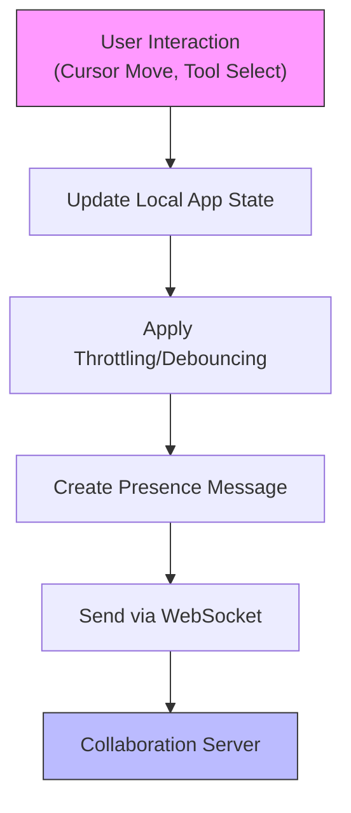
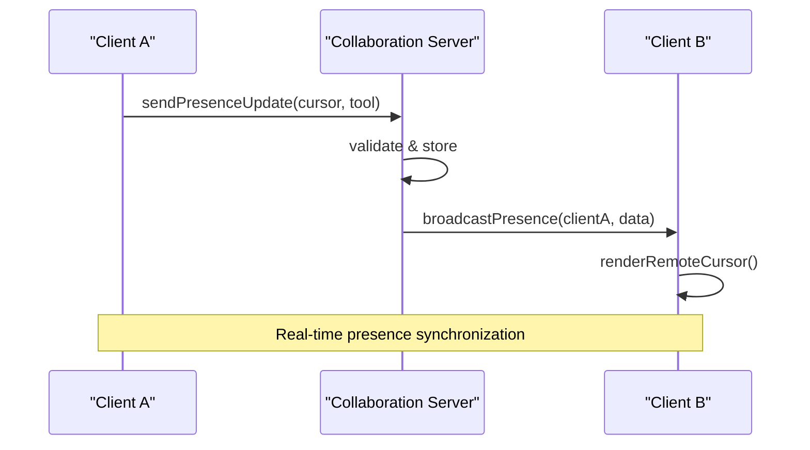
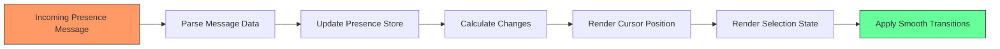
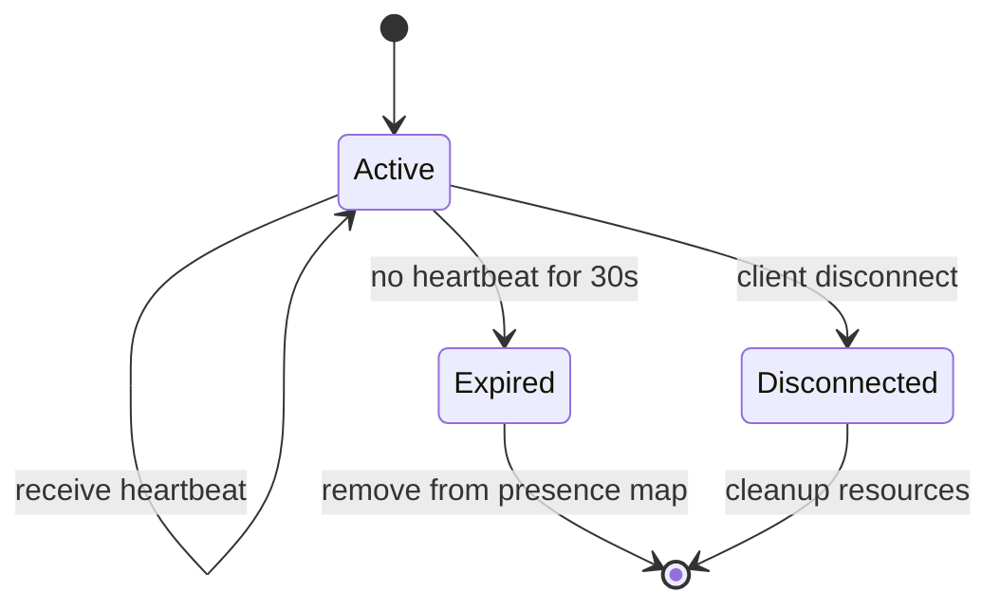

# Presence System

<cite>
**Referenced Files in This Document**  
- [Collab.tsx](file://excalidraw/excalidraw-app/collab/Collab.tsx)
- [clients.ts](file://excalidraw/packages/excalidraw/clients.ts)
- [cursor.ts](file://excalidraw/packages/excalidraw/cursor.ts)
- [appState.ts](file://excalidraw/packages/excalidraw/appState.ts)
- [Portal.tsx](file://excalidraw/excalidraw-app/collab/Portal.tsx)
</cite>

## Table of Contents
1. [Introduction](#introduction)
2. [Presence Message Types](#presence-message-types)
3. [Client-Side Presence Management](#client-side-presence-management)
4. [Server-Side Presence Aggregation](#server-side-presence-aggregation)
5. [Rendering Remote User Activities](#rendering-remote-user-activities)
6. [Heartbeat and Presence Expiration](#heartbeat-and-presence-expiration)
7. [Network Delay Handling](#network-delay-handling)
8. [Privacy Considerations](#privacy-considerations)
9. [Example Presence Payloads](#example-presence-payloads)
10. [Conclusion](#conclusion)

## Introduction
The presence system in Excalidraw enables real-time collaboration awareness by sharing user activity states across connected clients. This system allows users to see cursor positions, tool selections, and editing indicators of other collaborators in shared rooms. The presence data is transmitted over WebSocket connections and synchronized between clients through a central server. This document details the architecture, message formats, and implementation strategies that enable smooth and responsive presence visualization in Excalidraw's collaborative environment.

## Presence Message Types
Excalidraw uses specific message types to communicate presence information between clients and the server. These messages include:

- **Cursor position updates**: Real-time x,y coordinates of user cursors
- **Tool selection changes**: Current active tool (e.g., selection, pen, rectangle)
- **Typing indicators**: Status when a user is editing text elements
- **Element selection states**: Which elements a user has selected
- **Scene interaction status**: Whether a user is actively drawing or manipulating objects

Each presence message contains a client identifier, timestamp, and relevant state data to ensure accurate synchronization across clients.

**Section sources**
- [clients.ts](file://excalidraw/packages/excalidraw/clients.ts#L1-L50)
- [appState.ts](file://excalidraw/packages/excalidraw/appState.ts#L100-L150)

## Client-Side Presence Management
The client-side presence system captures user interactions and broadcasts them to other collaborators. When a user moves their cursor, selects tools, or edits elements, the local state is updated and presence messages are sent via WebSocket. The system uses throttling and debouncing to optimize network usage while maintaining responsiveness.

Presence state is managed through the app state context, which tracks cursor positions, current tools, and selection status. Changes to these states trigger presence update messages that are sent to the collaboration server for distribution to other clients in the same room.



**Diagram sources**
- [Collab.tsx](file://excalidraw/excalidraw-app/collab/Collab.tsx#L45-L90)
- [appState.ts](file://excalidraw/packages/excalidraw/appState.ts#L200-L250)

**Section sources**
- [Collab.tsx](file://excalidraw/excalidraw-app/collab/Collab.tsx#L30-L120)
- [cursor.ts](file://excalidraw/packages/excalidraw/cursor.ts#L1-L40)

## Server-Side Presence Aggregation
The collaboration server aggregates presence data from all connected clients in a room. Each client maintains a WebSocket connection to the server, which acts as a message broker for presence updates. The server validates incoming presence messages, associates them with the correct client session, and broadcasts them to all other clients in the same collaboration room.

Presence data is stored temporarily in memory with timestamps to enable expiration of stale data. The server maintains a presence map that tracks the latest state from each client, ensuring that only the most recent information is propagated to other clients.



**Diagram sources**
- [Portal.tsx](file://excalidraw/excalidraw-app/collab/Portal.tsx#L20-L60)
- [clients.ts](file://excalidraw/packages/excalidraw/clients.ts#L30-L80)

**Section sources**
- [Portal.tsx](file://excalidraw/excalidraw-app/collab/Portal.tsx#L10-L100)
- [clients.ts](file://excalidraw/packages/excalidraw/clients.ts#L15-L100)

## Rendering Remote User Activities
Client applications render remote user activities by processing incoming presence messages and updating the visual display accordingly. Each remote user is represented by a colored cursor, name label, and optional selection indicator. The system uses efficient rendering techniques to minimize performance impact while displaying multiple collaborators.

Cursors are rendered as SVG elements with animated transitions to smooth out network latency effects. Selection states are visualized by highlighting the elements a remote user has selected, using semi-transparent overlays in the user's assigned color.



**Diagram sources**
- [Collab.tsx](file://excalidraw/excalidraw-app/collab/Collab.tsx#L90-L150)
- [cursor.ts](file://excalidraw/packages/excalidraw/cursor.ts#L40-L80)

**Section sources**
- [Collab.tsx](file://excalidraw/excalidraw-app/collab/Collab.tsx#L80-L200)
- [cursor.ts](file://excalidraw/packages/excalidraw/cursor.ts#L30-L100)

## Heartbeat and Presence Expiration
To detect inactive users and maintain accurate presence information, Excalidraw implements a heartbeat mechanism. Clients send periodic heartbeat messages to the server to indicate they are still active. If the server does not receive a heartbeat from a client within a specified timeout period (typically 30 seconds), the client's presence is marked as expired and removed from the active users list.

The heartbeat system prevents the accumulation of stale presence data and ensures that disconnected users are promptly removed from the collaboration view. This mechanism also helps conserve client resources by stopping the rendering of presence indicators for users who have left the session.



**Diagram sources**
- [clients.ts](file://excalidraw/packages/excalidraw/clients.ts#L80-L120)
- [Portal.tsx](file://excalidraw/excalidraw-app/collab/Portal.tsx#L60-L100)

**Section sources**
- [clients.ts](file://excalidraw/packages/excalidraw/clients.ts#L50-L150)
- [Portal.tsx](file://excalidraw/excalidraw-app/collab/Portal.tsx#L50-L120)

## Network Delay Handling
The presence system employs several techniques to maintain smooth visualization despite network delays:

- **Interpolation**: Cursor movements are interpolated between received positions to create smooth motion
- **Timestamp-based ordering**: Messages are processed according to their timestamps to maintain correct sequence
- **Local echo**: User's own cursor movements are rendered immediately without waiting for server confirmation
- **Predictive rendering**: Anticipates cursor movement based on velocity and direction

These techniques ensure that presence visualization remains responsive and fluid, even under varying network conditions. The system prioritizes visual consistency over absolute accuracy, providing a natural collaborative experience.

**Section sources**
- [cursor.ts](file://excalidraw/packages/excalidraw/cursor.ts#L80-L150)
- [clients.ts](file://excalidraw/packages/excalidraw/clients.ts#L120-L180)

## Privacy Considerations
Excalidraw's presence system includes privacy features to protect user information:

- Presence data is only shared within the context of a specific collaboration room
- User identities are represented by temporary session identifiers rather than personal information
- Presence indicators are automatically removed when a user leaves a room or closes the application
- No presence data is stored persistently on the server

The system follows a minimal data principle, transmitting only the essential information needed for collaboration awareness while avoiding unnecessary exposure of user activity patterns.

**Section sources**
- [Collab.tsx](file://excalidraw/excalidraw-app/collab/Collab.tsx#L150-L200)
- [Portal.tsx](file://excalidraw/excalidraw-app/collab/Portal.tsx#L100-L150)

## Example Presence Payloads
Presence messages in Excalidraw follow a standardized JSON format. Example payloads include:

**Cursor Update:**
```json
{
  "type": "presence",
  "payload": {
    "clientId": "abc123",
    "cursor": { "x": 150, "y": 200 },
    "tool": "selection",
    "timestamp": 1640995200000
  }
}
```

**Selection Update:**
```json
{
  "type": "presence",
  "payload": {
    "clientId": "def456",
    "selectedElements": ["element-1", "element-2"],
    "tool": "rectangle",
    "timestamp": 1640995200050
  }
}
```

**Typing Indicator:**
```json
{
  "type": "presence",
  "payload": {
    "clientId": "ghi789",
    "tool": "text",
    "isTyping": true,
    "timestamp": 1640995200100
  }
}
```

These payloads are transmitted over WebSocket connections and processed by both the server and receiving clients to update the shared collaboration state.

**Section sources**
- [clients.ts](file://excalidraw/packages/excalidraw/clients.ts#L180-L250)
- [appState.ts](file://excalidraw/packages/excalidraw/appState.ts#L300-L350)

## Conclusion
The presence system in Excalidraw provides a robust foundation for real-time collaboration awareness. By efficiently transmitting and rendering user activity states through WebSocket connections, it enables teams to work together seamlessly on shared diagrams. The system balances responsiveness with network efficiency through throttling, interpolation, and heartbeat mechanisms, while maintaining user privacy through ephemeral data handling. This comprehensive approach to presence management creates an intuitive collaborative experience that enhances productivity in shared drawing sessions.