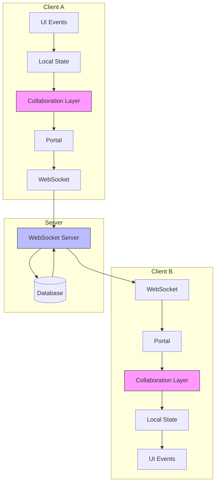
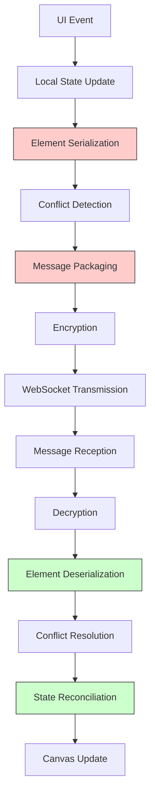
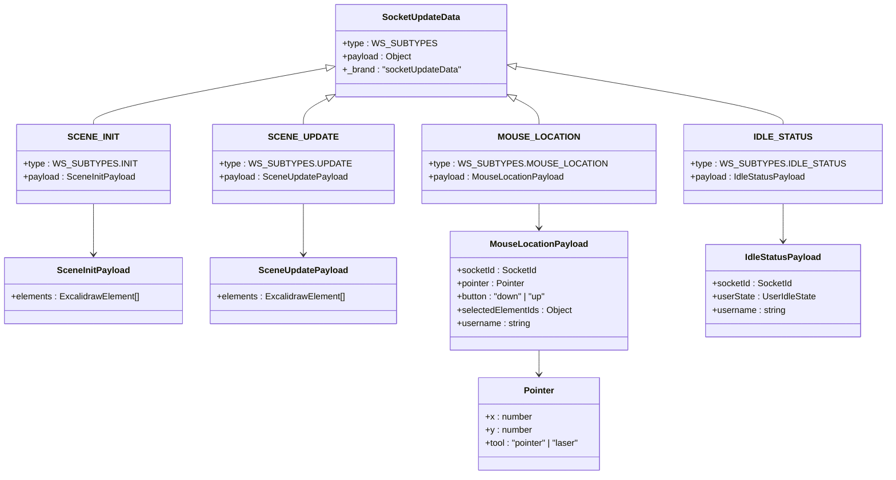
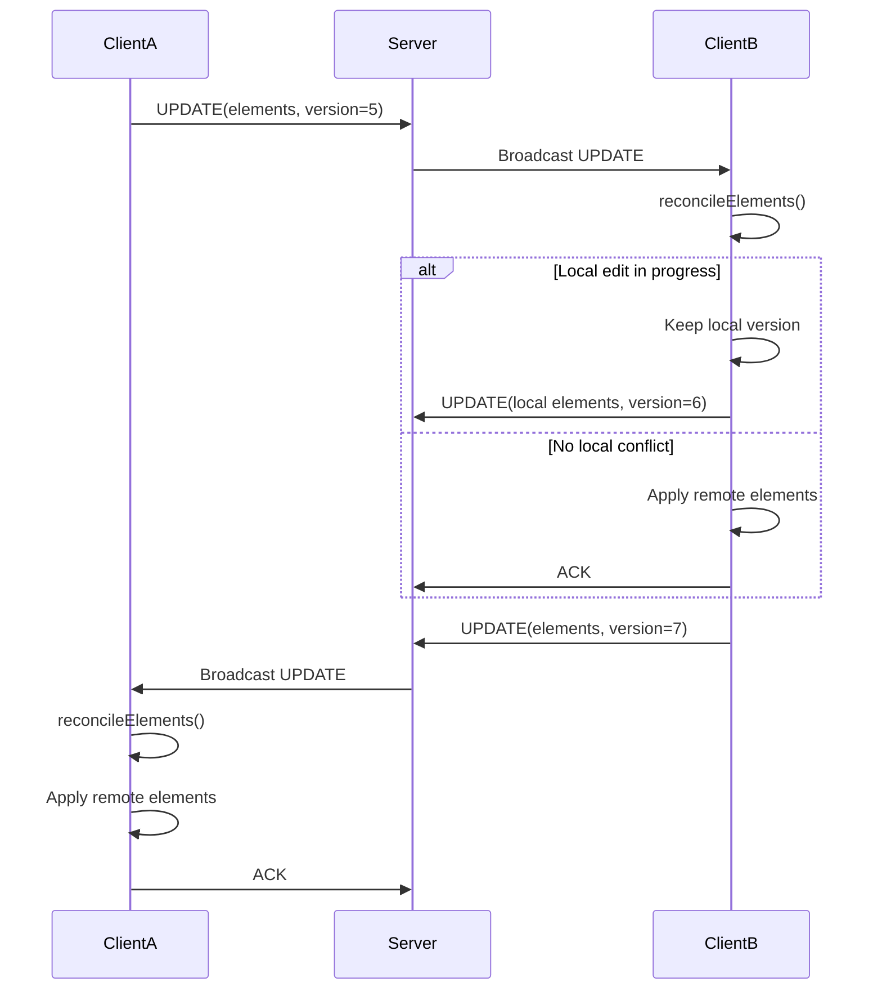
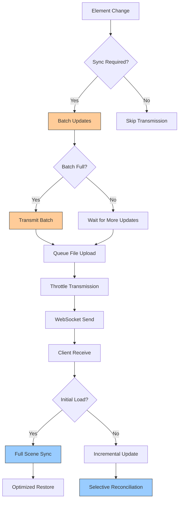
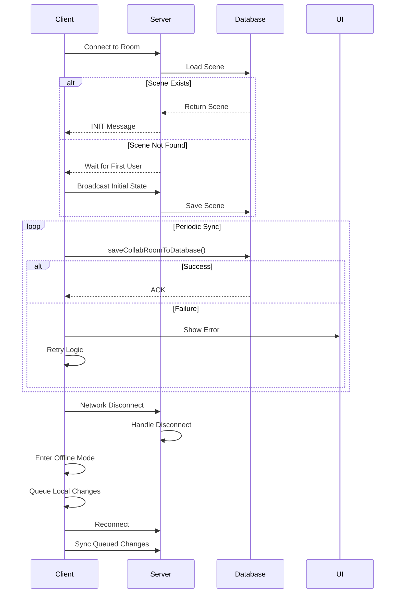

# Real-Time Synchronization

<cite>
**Referenced Files in This Document**   
- [Collab.tsx](file://excalidraw/excalidraw-app/collab/Collab.tsx)
- [Portal.tsx](file://excalidraw/excalidraw-app/collab/Portal.tsx)
- [reconcile.ts](file://excalidraw/packages/excalidraw/data/reconcile.ts)
- [transform.ts](file://excalidraw/packages/excalidraw/data/transform.ts)
- [api-client.ts](file://excalidraw/excalidraw-app/data/api-client.ts)
- [app_constants.ts](file://excalidraw/excalidraw-app/app_constants.ts)
- [index.ts](file://excalidraw/excalidraw-app/data/index.ts)
- [types.ts](file://excalidraw/packages/excalidraw/types.ts)
</cite>

## Table of Contents
1. [Introduction](#introduction)
2. [Architecture Overview](#architecture-overview)
3. [Data Transformation Pipeline](#data-transformation-pipeline)
4. [Message Framing and Transmission](#message-framing-and-transmission)
5. [Conflict Resolution Mechanism](#conflict-resolution-mechanism)
6. [Performance Optimizations](#performance-optimizations)
7. [Error Handling and Reliability](#error-handling-and-reliability)
8. [Conclusion](#conclusion)

## Introduction
Excalidraw implements a real-time collaborative drawing system that enables multiple users to simultaneously edit a shared canvas. The synchronization system is built on WebSocket communication with operational transformation principles to handle concurrent edits. This document details the architecture, data flow, and conflict resolution mechanisms that enable seamless collaborative drawing experiences.

The system uses a client-server architecture where all clients connect to a central WebSocket server to exchange drawing operations. Each client maintains its own local state and synchronizes changes with other collaborators through encrypted messages. The synchronization protocol handles various drawing operations including element creation, modification, deletion, and cursor movements.

**Section sources**
- [Collab.tsx](file://excalidraw/excalidraw-app/collab/Collab.tsx#L1-L50)
- [Portal.tsx](file://excalidraw/excalidraw-app/collab/Portal.tsx#L1-L30)

## Architecture Overview

**Diagram sources**
- [Collab.tsx](file://excalidraw/excalidraw-app/collab/Collab.tsx#L1-L100)
- [Portal.tsx](file://excalidraw/excalidraw-app/collab/Portal.tsx#L1-L50)

The real-time synchronization system in Excalidraw follows a client-server architecture with WebSocket communication. Each client maintains a local state of the drawing canvas and communicates changes to other collaborators through a central server. The collaboration layer handles the serialization of drawing operations, encryption of messages, and reconciliation of concurrent edits.

When a user performs an action on the canvas, the UI generates events that are processed by the local state management system. The collaboration layer intercepts these changes and packages them into structured messages that are transmitted via WebSocket to the server. The server then broadcasts these messages to all other connected clients in the same collaboration room.

Each client receives messages from the server through the Portal component, which handles decryption and message routing. The received data is then processed by the collaboration layer to update the local state while resolving any conflicts with local changes. This bidirectional flow ensures that all clients eventually converge to the same state.

**Section sources**
- [Collab.tsx](file://excalidraw/excalidraw-app/collab/Collab.tsx#L1-L150)
- [Portal.tsx](file://excalidraw/excalidraw-app/collab/Portal.tsx#L1-L100)

## Data Transformation Pipeline

**Diagram sources**
- [Collab.tsx](file://excalidraw/excalidraw-app/collab/Collab.tsx#L150-L300)
- [transform.ts](file://excalidraw/packages/excalidraw/data/transform.ts#L1-L100)

The data transformation pipeline in Excalidraw's collaboration system converts UI events into network messages and back to state updates. When a user interacts with the canvas, the system captures the event and updates the local state with the new drawing elements or modifications.

The collaboration layer then serializes the affected elements into a structured format that can be transmitted over the network. This serialization process converts complex drawing elements like lines, shapes, and text into JSON-compatible objects that preserve all necessary properties for rendering.

Before transmission, the system performs conflict detection by comparing version numbers and timestamps of the modified elements. This information is included in the message payload to enable proper conflict resolution on receiving clients. The serialized data is then packaged with metadata including the operation type and user identification.

On the receiving end, the pipeline reverses this process. Incoming messages are decrypted and deserialized into element objects. The conflict resolution system compares the received elements with the local state to determine how to integrate the changes. Finally, the reconciled elements are applied to the local state, triggering a canvas update to reflect the changes from other collaborators.

**Section sources**
- [Collab.tsx](file://excalidraw/excalidraw-app/collab/Collab.tsx#L150-L400)
- [transform.ts](file://excalidraw/packages/excalidraw/data/transform.ts#L1-L200)
- [index.ts](file://excalidraw/excalidraw-app/data/index.ts#L1-L50)

## Message Framing and Transmission

**Diagram sources**
- [Collab.tsx](file://excalidraw/excalidraw-app/collab/Collab.tsx#L300-L500)
- [Portal.tsx](file://excalidraw/excalidraw-app/collab/Portal.tsx#L100-L200)
- [types.ts](file://excalidraw/packages/excalidraw/types.ts#L1-L100)

The message framing format in Excalidraw's collaboration system is designed for efficient transmission of drawing operations over WebSocket connections. Messages are structured as JSON objects with a type field that indicates the operation being performed and a payload containing the relevant data.

The system defines several message types through the WS_SUBTYPES enum, including INIT for initial scene synchronization, UPDATE for incremental changes, MOUSE_LOCATION for cursor position updates, and IDLE_STATUS for user presence information. Each message type has a specific payload structure optimized for its purpose.

Messages are encrypted before transmission using AES-GCM encryption with a room-specific key. The encryption process generates an initialization vector (IV) and encrypted buffer that are sent separately to the server. This ensures that sensitive drawing data remains private even if intercepted.

The transmission strategy employs operation batching to reduce network overhead. Instead of sending individual messages for each small change, the system batches multiple updates and transmits them together. This is particularly important for high-frequency operations like freehand drawing, where numerous small changes occur in rapid succession.

Volatile messages, such as cursor positions, are transmitted with lower reliability requirements to minimize latency impact on user experience. These messages can be dropped if network conditions are poor, as they represent transient state that will be updated frequently. In contrast, scene updates are transmitted reliably to ensure all clients eventually converge to the same state.

**Section sources**
- [Collab.tsx](file://excalidraw/excalidraw-app/collab/Collab.tsx#L300-L600)
- [Portal.tsx](file://excalidraw/excalidraw-app/collab/Portal.tsx#L100-L250)
- [app_constants.ts](file://excalidraw/excalidraw-app/app_constants.ts#L1-L30)

## Conflict Resolution Mechanism

**Diagram sources**
- [Collab.tsx](file://excalidraw/excalidraw-app/collab/Collab.tsx#L500-L700)
- [reconcile.ts](file://excalidraw/packages/excalidraw/data/reconcile.ts#L1-L100)

Excalidraw employs an operational transformation approach to resolve conflicts in collaborative editing. The conflict resolution mechanism is implemented in the reconcileElements function, which determines how to merge remote changes with local state when concurrent edits occur.

The system uses version numbers and versionNonce values to determine the most recent state of each element. When a conflict is detected between local and remote versions of an element, the system applies deterministic rules to resolve it. Generally, the version with the higher version number takes precedence, but when versions are equal, the one with the lower versionNonce is chosen to ensure consistency across all clients.

The reconciliation process considers the application state to make intelligent decisions about conflict resolution. For example, if a user is actively editing a text element, their local changes will take precedence over incoming remote updates, even if the remote version is newer. This prevents the user's input from being overwritten while they are actively working on an element.

Elements are processed in a specific order during reconciliation, with remote elements processed first, followed by any remaining local elements. This ensures that the most up-to-date remote state is incorporated while preserving local changes that haven't been synchronized yet. The final result is a merged state that incorporates changes from all collaborators in a consistent manner.

The system also handles special cases like element deletion and restoration. Deleted elements are retained temporarily with a tombstone marker to prevent accidental permanent deletion and to allow for proper conflict resolution if another user attempts to modify the element concurrently.

**Section sources**
- [reconcile.ts](file://excalidraw/packages/excalidraw/data/reconcile.ts#L1-L119)
- [Collab.tsx](file://excalidraw/excalidraw-app/collab/Collab.tsx#L500-L800)

## Performance Optimizations

**Diagram sources**
- [Collab.tsx](file://excalidraw/excalidraw-app/collab/Collab.tsx#L700-L900)
- [Portal.tsx](file://excalidraw/excalidraw-app/collab/Portal.tsx#L200-L250)
- [app_constants.ts](file://excalidraw/excalidraw-app/app_constants.ts#L30-L60)

Excalidraw implements several performance optimizations to ensure smooth real-time collaboration, particularly for high-frequency updates. The system employs aggressive batching and throttling strategies to minimize network traffic while maintaining responsiveness.

Operation batching is implemented through the broadcastScene method, which collects multiple element updates and transmits them as a single message. This reduces the overhead of WebSocket communication and prevents flooding the network with small, frequent updates. The batching interval is tuned to balance responsiveness with network efficiency.

The system implements differential synchronization by tracking the last broadcasted scene version for each element. When preparing an update, only elements that have changed since the last transmission are included in the message payload. This significantly reduces bandwidth usage, especially for large drawings where only a small portion changes at any given time.

For file uploads, such as images embedded in the drawing, the system uses a separate throttled queue. This prevents large file transfers from blocking the main collaboration channel and ensures that element updates are transmitted promptly. The file upload process is decoupled from element synchronization to maintain responsiveness.

The client also implements intelligent scene loading optimizations. During initial connection, clients can request either a full scene state or incremental updates based on their current state. This allows returning users to quickly synchronize only the changes that occurred while they were disconnected, rather than downloading the entire drawing state.

**Section sources**
- [Collab.tsx](file://excalidraw/excalidraw-app/collab/Collab.tsx#L700-L1000)
- [Portal.tsx](file://excalidraw/excalidraw-app/collab/Portal.tsx#L150-L250)
- [app_constants.ts](file://excalidraw/excalidraw-app/app_constants.ts#L1-L60)

## Error Handling and Reliability

**Diagram sources**
- [Collab.tsx](file://excalidraw/excalidraw-app/collab/Collab.tsx#L900-L1063)
- [api-client.ts](file://excalidraw/excalidraw-app/data/api-client.ts#L1-L150)
- [index.ts](file://excalidraw/excalidraw-app/data/index.ts#L50-L100)

The collaboration system in Excalidraw includes comprehensive error handling and reliability features to ensure data integrity and user experience during network disruptions. The system is designed to gracefully handle various failure scenarios while minimizing data loss.

Connection reliability is maintained through automatic reconnection logic and fallback mechanisms. If a WebSocket connection fails, the client attempts to reinitialize the room state from the server database. A timeout mechanism ensures that collaboration can proceed even if the initial connection fails, allowing the first user in a room to establish the initial state.

Data persistence is implemented through periodic synchronization with a backend database. The saveCollabRoomToDatabase function saves the current scene state to ensure that progress is not lost if users disconnect. This function is called at regular intervals and before page unload, providing multiple layers of protection against data loss.

Error states are communicated to users through dedicated error dialogs and status indicators. The system distinguishes between different types of errors, such as network connectivity issues, authentication failures, and data size limits, providing appropriate feedback and recovery options for each scenario.

The system also implements conflict resolution for edge cases like simultaneous room creation and concurrent state updates. When multiple users attempt to modify the same element at the same time, the reconciliation process ensures that all clients converge to a consistent state, even if some messages are delayed or arrive out of order.

**Section sources**
- [Collab.tsx](file://excalidraw/excalidraw-app/collab/Collab.tsx#L800-L1063)
- [api-client.ts](file://excalidraw/excalidraw-app/data/api-client.ts#L1-L158)
- [index.ts](file://excalidraw/excalidraw-app/data/index.ts#L100-L200)

## Conclusion
Excalidraw's real-time synchronization system provides a robust foundation for collaborative drawing through a well-designed architecture that balances performance, reliability, and conflict resolution. The system effectively handles the complexities of concurrent editing by combining operational transformation principles with efficient data transmission strategies.

Key strengths of the implementation include the use of version-based conflict resolution, differential synchronization to minimize bandwidth usage, and comprehensive error handling to maintain data integrity during network disruptions. The modular design separates concerns between the collaboration layer, data transformation, and network communication, making the system maintainable and extensible.

The performance optimizations, particularly operation batching and selective element synchronization, ensure that the system remains responsive even with high-frequency updates. The encryption of messages provides privacy for collaborative sessions while the fallback mechanisms ensure that collaboration can continue even under adverse network conditions.

Overall, the real-time synchronization system in Excalidraw demonstrates a sophisticated approach to collaborative editing that effectively addresses the challenges of concurrent access, network latency, and data consistency in a real-time drawing application.