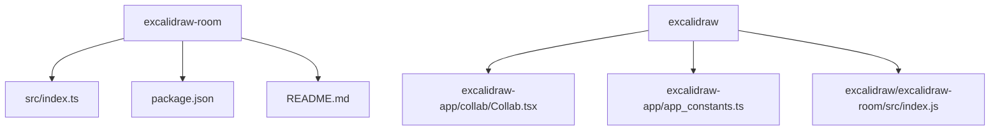
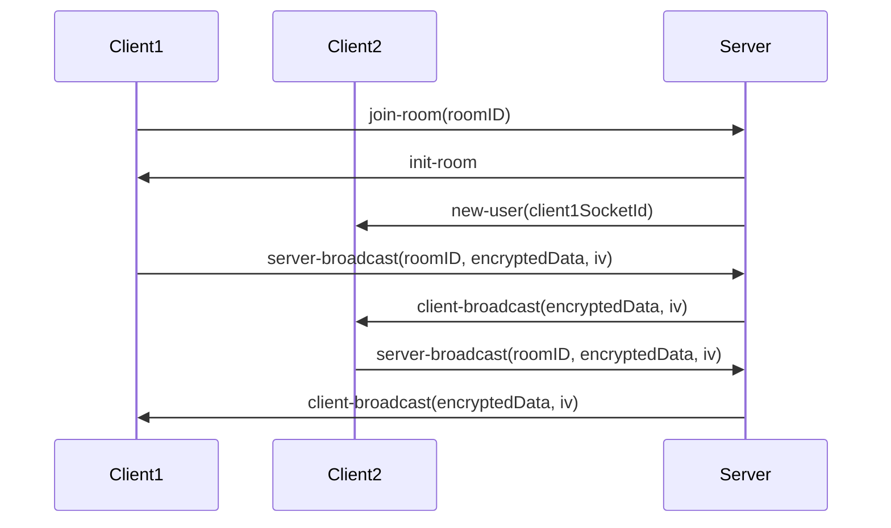
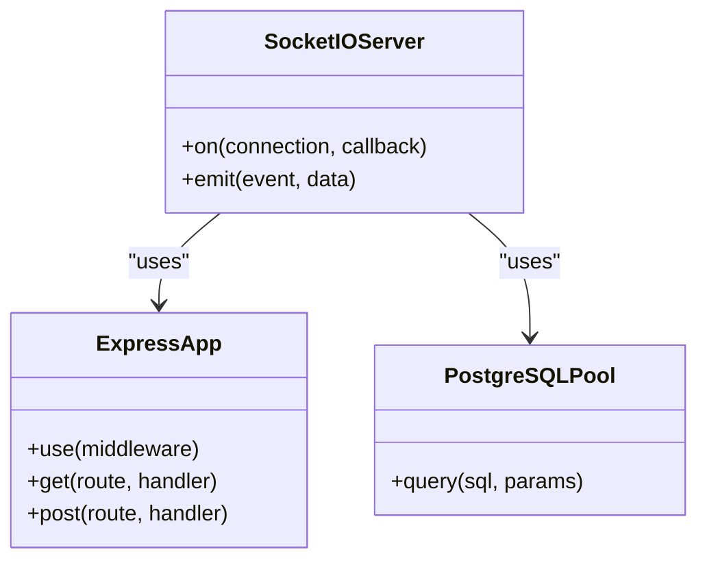
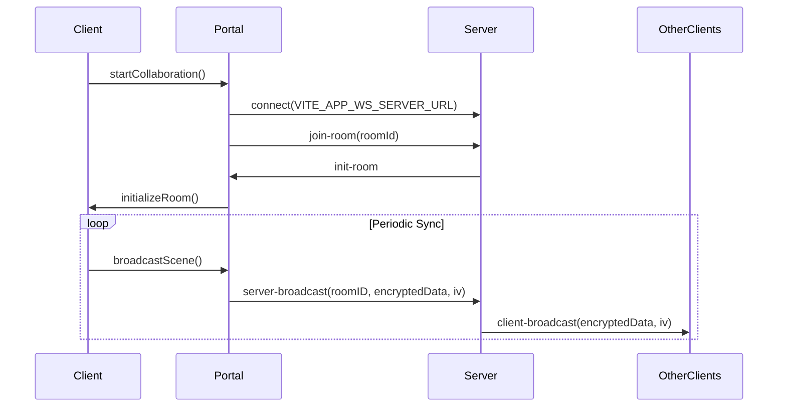
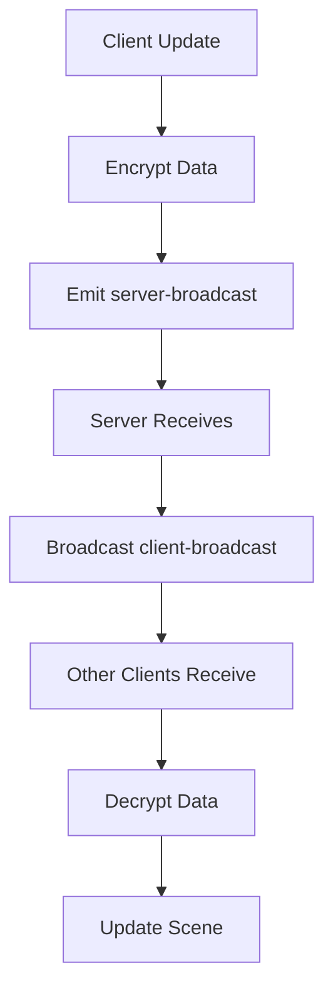
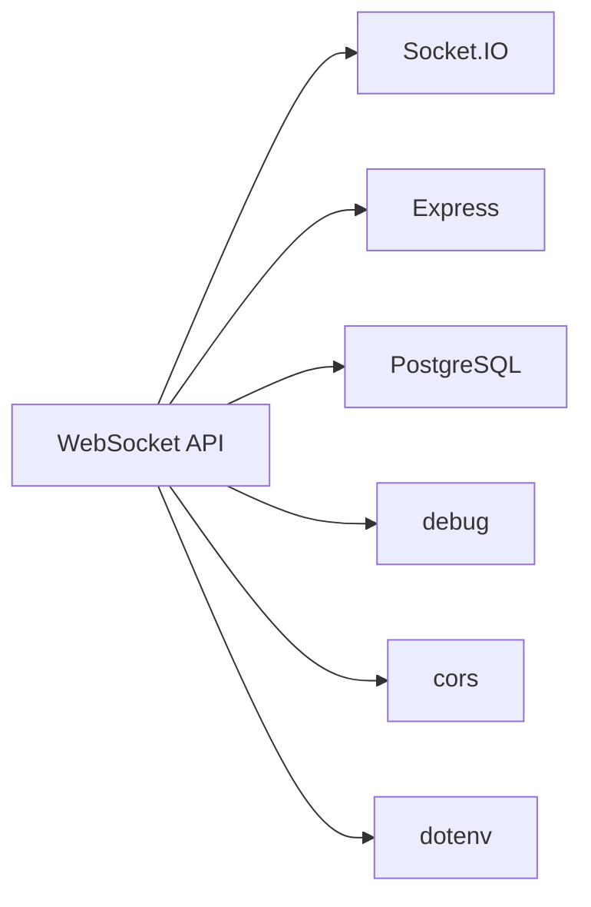

# WebSocket API

<cite>
**Referenced Files in This Document**   
- [index.ts](file://excalidraw-room/src/index.ts)
- [Collab.tsx](file://excalidraw/excalidraw-app/collab/Collab.tsx)
- [app_constants.ts](file://excalidraw/excalidraw-app/app_constants.ts)
- [index.js](file://excalidraw/excalidraw-room/src/index.js)
- [index.ts](file://excalidraw-room/src/index.ts)
- [data/index.ts](file://excalidraw/excalidraw-app/data/index.ts)
</cite>

## Table of Contents
1. [Introduction](#introduction)
2. [Project Structure](#project-structure)
3. [Core Components](#core-components)
4. [Architecture Overview](#architecture-overview)
5. [Detailed Component Analysis](#detailed-component-analysis)
6. [Dependency Analysis](#dependency-analysis)
7. [Performance Considerations](#performance-considerations)
8. [Troubleshooting Guide](#troubleshooting-guide)
9. [Conclusion](#conclusion)

## Introduction
This document provides comprehensive documentation for the WebSocket API used in the Excalidraw real-time collaboration system. It details the connection establishment process, message framing, event types, data serialization format, and client-server interaction patterns between Collab.tsx and the WebSocket server. The documentation covers room joining, state synchronization, conflict resolution, real-time drawing updates, cursor sharing, user presence, heartbeat mechanisms, reconnection logic, and security aspects.

## Project Structure
The project structure reveals two collaboration servers: a deprecated JavaScript server and a current TypeScript server. The TypeScript server in the root excalidraw-room directory is the active implementation that matches the client's expected event names.

**Diagram sources**
- [index.ts](file://excalidraw-room/src/index.ts)
- [Collab.tsx](file://excalidraw/excalidraw-app/collab/Collab.tsx)
- [index.js](file://excalidraw/excalidraw-room/src/index.js)

**Section sources**
- [index.ts](file://excalidraw-room/src/index.ts)
- [Collab.tsx](file://excalidraw/excalidraw-app/collab/Collab.tsx)

## Core Components
The core components of the WebSocket API include the TypeScript server implementation in index.ts, the client-side collaboration logic in Collab.tsx, and the constants defined in app_constants.ts that coordinate the communication protocol between client and server.

**Section sources**
- [index.ts](file://excalidraw-room/src/index.ts)
- [Collab.tsx](file://excalidraw/excalidraw-app/collab/Collab.tsx)
- [app_constants.ts](file://excalidraw/excalidraw-app/app_constants.ts)

## Architecture Overview
The WebSocket API architecture follows a client-server model where multiple clients connect to a central server to collaborate on shared drawing sessions. The server manages room state, broadcasts updates, and handles user presence information.

**Diagram sources**
- [index.ts](file://excalidraw-room/src/index.ts)
- [Collab.tsx](file://excalidraw/excalidraw-app/collab/Collab.tsx)

## Detailed Component Analysis

### Server Implementation Analysis
The server implementation in index.ts handles WebSocket connections, room management, and message broadcasting. It uses Socket.IO for WebSocket communication and PostgreSQL for persistent storage of scene data.

**Diagram sources**
- [index.ts](file://excalidraw-room/src/index.ts)

**Section sources**
- [index.ts](file://excalidraw-room/src/index.ts)

### Client Implementation Analysis
The client implementation in Collab.tsx manages the WebSocket connection, handles incoming messages, and coordinates state synchronization between the local client and remote collaborators.

**Diagram sources**
- [Collab.tsx](file://excalidraw/excalidraw-app/collab/Collab.tsx)

**Section sources**
- [Collab.tsx](file://excalidraw/excalidraw-app/collab/Collab.tsx)

### Message Flow Analysis
The message flow between client and server follows a publish-subscribe pattern where clients publish updates to the server, which then broadcasts them to all other clients in the same room.

**Diagram sources**
- [index.ts](file://excalidraw-room/src/index.ts)
- [Collab.tsx](file://excalidraw/excalidraw-app/collab/Collab.tsx)

**Section sources**
- [index.ts](file://excalidraw-room/src/index.ts)
- [Collab.tsx](file://excalidraw/excalidraw-app/collab/Collab.tsx)

## Dependency Analysis
The WebSocket API has dependencies on several external packages including Socket.IO for WebSocket communication, Express for HTTP server functionality, PostgreSQL for persistent storage, and debug for logging.

**Diagram sources**
- [package.json](file://excalidraw-room/package.json)

**Section sources**
- [package.json](file://excalidraw-room/package.json)

## Performance Considerations
The WebSocket API includes several performance optimizations including volatile broadcasting for high-frequency updates like cursor movements, throttling of scene updates, and periodic full scene synchronization to prevent divergence.

**Section sources**
- [app_constants.ts](file://excalidraw/excalidraw-app/app_constants.ts)
- [Collab.tsx](file://excalidraw/excalidraw-app/collab/Collab.tsx)

## Troubleshooting Guide
Common issues with the WebSocket API include event name mismatches between client and server, CORS configuration problems, and database connection issues. The deprecated JavaScript server uses different event names (server/client) than the current TypeScript server (server-broadcast/client-broadcast), which can cause silent failures.

**Section sources**
- [issue.md](file://issue.md)
- [README.md](file://excalidraw/excalidraw-room/README.md)

## Conclusion
The WebSocket API for the Excalidraw real-time collaboration system provides a robust foundation for multi-user drawing sessions. The current implementation using the TypeScript server in excalidraw-room/src/index.ts is the recommended approach, as it properly handles event naming, persistent storage, and message broadcasting. Developers should ensure they are using this implementation rather than the deprecated JavaScript version.