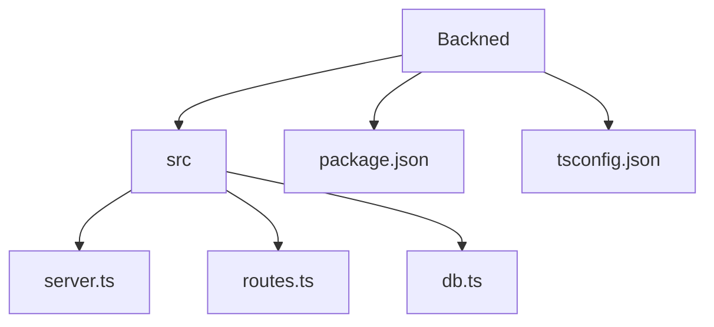
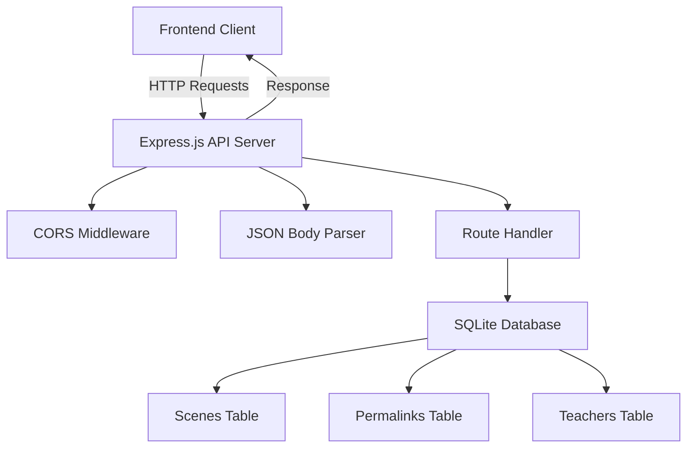
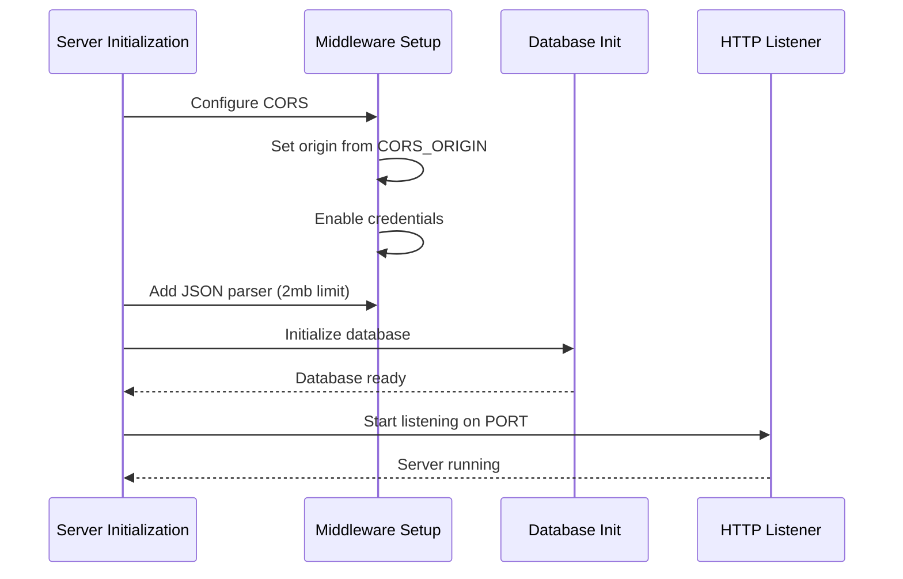
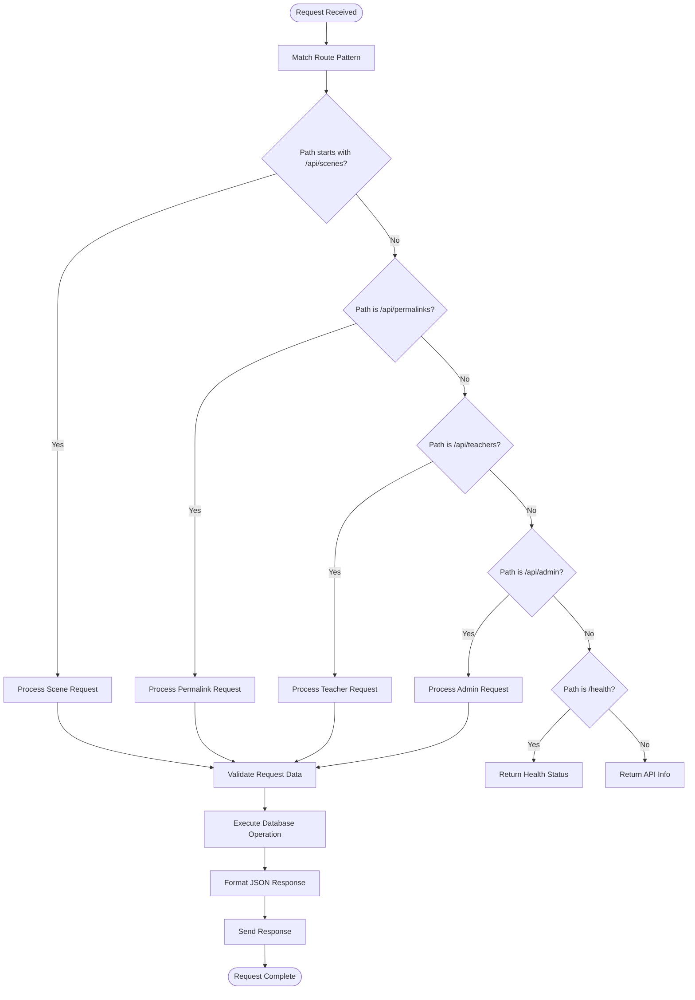
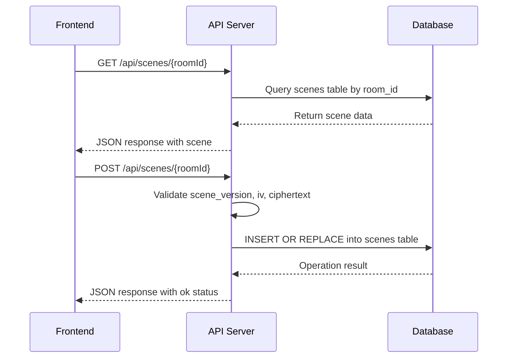
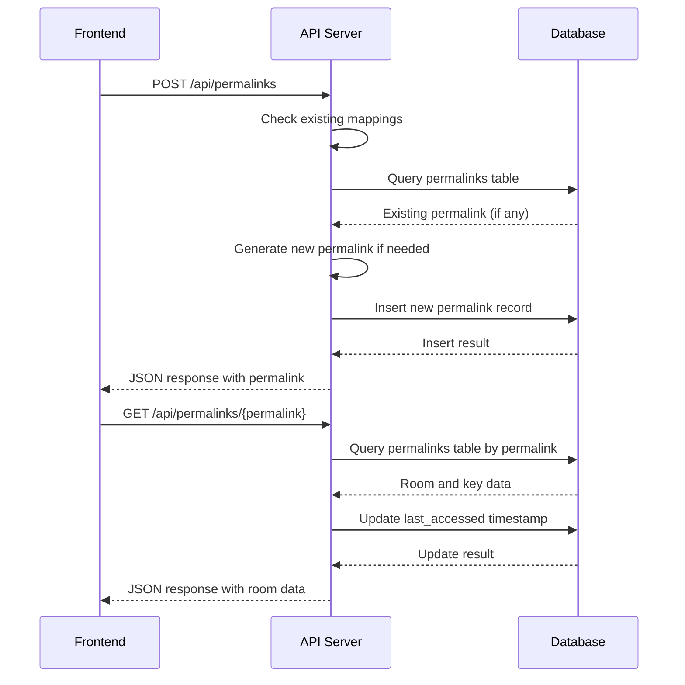
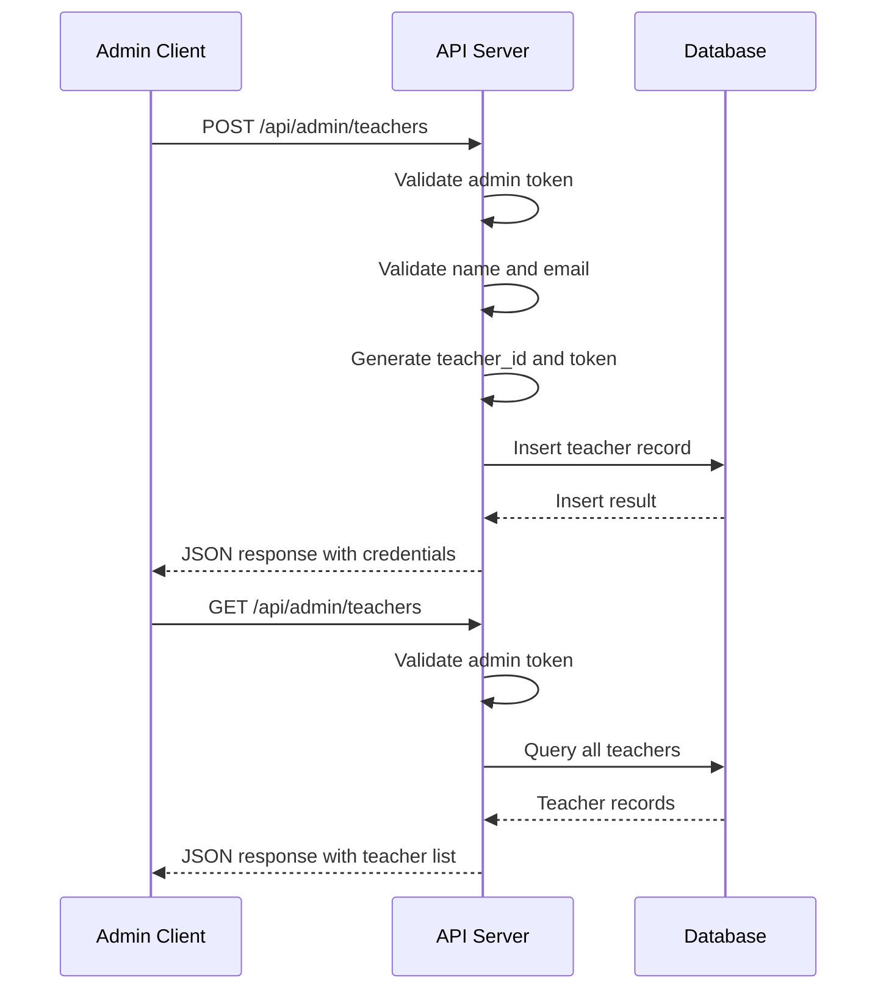
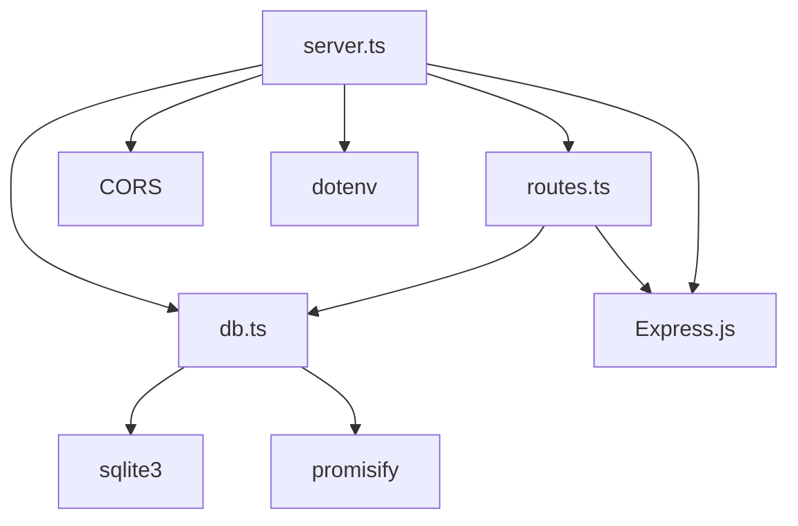

# API Layer

<cite>
**Referenced Files in This Document**   
- [server.ts](file://Backned/src/server.ts)
- [routes.ts](file://Backned/src/routes.ts)
- [db.ts](file://Backned/src/db.ts)
- [api-client.ts](file://excalidraw/excalidraw-app/data/api-client.ts)
</cite>

## Table of Contents
1. [Introduction](#introduction)
2. [Project Structure](#project-structure)
3. [Core Components](#core-components)
4. [Architecture Overview](#architecture-overview)
5. [Detailed Component Analysis](#detailed-component-analysis)
6. [Dependency Analysis](#dependency-analysis)
7. [Performance Considerations](#performance-considerations)
8. [Troubleshooting Guide](#troubleshooting-guide)
9. [Conclusion](#conclusion)

## Introduction
This document provides comprehensive architectural documentation for the backend API layer of the Excalidraw application. It details the Express.js server initialization, middleware pipeline, and route handling mechanism. The document covers RESTful endpoint design patterns, request/response lifecycle, error propagation strategy, and integration points with frontend and collaboration services. Key routes including scene persistence, permalink generation, and teacher management are explained with implementation examples from the codebase.

## Project Structure

**Diagram sources**
- [server.ts](file://Backned/src/server.ts)
- [routes.ts](file://Backned/src/routes.ts)
- [db.ts](file://Backned/src/db.ts)

**Section sources**
- [server.ts](file://Backned/src/server.ts)
- [routes.ts](file://Backned/src/routes.ts)

## Core Components

The backend API layer consists of three core components: the Express.js server initialization in `server.ts`, the route definitions in `routes.ts`, and the database operations in `db.ts`. These components work together to provide a RESTful API for scene persistence, permalink management, and teacher administration.

**Section sources**
- [server.ts](file://Backned/src/server.ts#L1-L36)
- [routes.ts](file://Backned/src/routes.ts#L1-L365)
- [db.ts](file://Backned/src/db.ts#L1-L96)

## Architecture Overview

**Diagram sources**
- [server.ts](file://Backned/src/server.ts#L1-L36)
- [routes.ts](file://Backned/src/routes.ts#L1-L365)
- [db.ts](file://Backned/src/db.ts#L1-L96)

## Detailed Component Analysis

### Server Initialization and Middleware Pipeline

The Express.js server is initialized with essential middleware for handling CORS and JSON requests. The server configuration establishes the foundation for API operations including route handling and database connectivity.

**Diagram sources**
- [server.ts](file://Backned/src/server.ts#L1-L36)

**Section sources**
- [server.ts](file://Backned/src/server.ts#L1-L36)

### Route Handling Mechanism

The route handling mechanism implements a comprehensive RESTful API with endpoints for scene management, permalink operations, and teacher administration. The routing system follows Express.js patterns with proper error handling and response formatting.

**Diagram sources**
- [routes.ts](file://Backned/src/routes.ts#L1-L365)

**Section sources**
- [routes.ts](file://Backned/src/routes.ts#L1-L365)

### Scene Persistence Implementation

The scene persistence API provides endpoints for storing and retrieving Excalidraw scenes using SQLite as the backend storage. The implementation supports both JSON and binary data formats for scene data.

**Diagram sources**
- [routes.ts](file://Backned/src/routes.ts#L45-L85)
- [db.ts](file://Backned/src/db.ts#L20-L25)

**Section sources**
- [routes.ts](file://Backned/src/routes.ts#L45-L85)
- [db.ts](file://Backned/src/db.ts#L20-L25)

### Permalink Generation and Resolution

The permalink system enables stable URLs for Excalidraw rooms, supporting both student-teacher relationships and direct room access. The implementation includes creation, resolution, and management endpoints.

**Diagram sources**
- [routes.ts](file://Backned/src/routes.ts#L87-L200)
- [db.ts](file://Backned/src/db.ts#L27-L32)

**Section sources**
- [routes.ts](file://Backned/src/routes.ts#L87-L200)
- [db.ts](file://Backned/src/db.ts#L27-L32)

### Teacher Management System

The teacher management system provides administrative functionality for creating and managing teacher accounts, with protected endpoints requiring authentication tokens.

**Diagram sources**
- [routes.ts](file://Backned/src/routes.ts#L250-L320)
- [db.ts](file://Backned/src/db.ts#L34-L39)

**Section sources**
- [routes.ts](file://Backned/src/routes.ts#L250-L320)
- [db.ts](file://Backned/src/db.ts#L34-L39)

## Dependency Analysis

**Diagram sources**
- [server.ts](file://Backned/src/server.ts#L1-L36)
- [routes.ts](file://Backned/src/routes.ts#L1-L365)
- [db.ts](file://Backned/src/db.ts#L1-L96)

**Section sources**
- [server.ts](file://Backned/src/server.ts#L1-L36)
- [routes.ts](file://Backned/src/routes.ts#L1-L365)
- [db.ts](file://Backned/src/db.ts#L1-L96)

## Performance Considerations
The API layer implements several performance optimizations including database indexing for frequently queried fields, connection pooling through sqlite3, and efficient JSON parsing with size limits. The server uses asynchronous database operations to prevent blocking the event loop during I/O operations.

## Troubleshooting Guide

Common issues and their solutions:

1. **CORS errors**: Ensure the CORS_ORIGIN environment variable matches the frontend origin
2. **Database connection failures**: Verify the DATABASE_PATH environment variable points to a writable location
3. **Route not found errors**: Check that the Vite proxy is configured to forward /api requests to the correct port
4. **Authentication failures**: Verify admin tokens are correctly set in the environment variables

**Section sources**
- [server.ts](file://Backned/src/server.ts#L10-L18)
- [routes.ts](file://Backned/src/routes.ts#L240-L245)
- [db.ts](file://Backned/src/db.ts#L5-L10)

## Conclusion
The Excalidraw backend API layer provides a robust foundation for scene persistence and collaboration features. The Express.js server with SQLite backend offers a simple yet effective solution for storing and retrieving drawing data. The API design follows RESTful principles with clear endpoints for different functionality areas. While the current implementation works well for development and small-scale usage, considerations for production deployment include implementing proper authentication, scaling the database layer, and adding comprehensive monitoring and logging.