# Backend Architecture

<cite>
**Referenced Files in This Document**   
- [server.ts](file://Backned/src/server.ts)
- [routes.ts](file://Backned/src/routes.ts)
- [db.ts](file://Backned/src/db.ts)
- [init-db.sql](file://excalidraw/init-db.sql)
- [package.json](file://Backned/package.json)
</cite>

## Table of Contents
1. [Introduction](#introduction)
2. [Project Structure](#project-structure)
3. [Express.js Server Setup](#expressjs-server-setup)
4. [REST API Endpoint Design](#rest-api-endpoint-design)
5. [Database Interaction Patterns](#database-interaction-patterns)
6. [SQLite Database Schema](#sqlite-database-schema)
7. [API Security Model](#api-security-model)
8. [Error Handling Strategy](#error-handling-strategy)
9. [Request Validation Approach](#request-validation-approach)
10. [Permalink System](#permalink-system)
11. [Scene Storage Mechanism](#scene-storage-mechanism)
12. [Teacher/Student Management Endpoints](#teacherstudent-management-endpoints)
13. [Scalability Considerations](#scalability-considerations)
14. [Connection Pooling](#connection-pooling)
15. [Database Migration Strategies](#database-migration-strategies)
16. [Sequence Diagrams for Key API Workflows](#sequence-diagrams-for-key-api-workflows)
17. [Database Schema ER Diagram](#database-schema-er-diagram)

## Introduction
This document provides comprehensive architectural documentation for the backend service of the Excalidraw application. It details the Express.js server configuration, REST API design, database interaction patterns, and security model. The documentation covers the SQLite database schema, persistence mechanisms, and data access layer implementation. It also explains the permalink system, scene storage architecture, and teacher/student management endpoints. The document addresses scalability considerations, connection handling, and database migration strategies, providing sequence diagrams for key workflows and an ER diagram for the database schema.

## Project Structure
The backend service is organized in a clean, modular structure with clear separation of concerns. The core components are organized under the `src` directory, with distinct files for server configuration, routing, and database operations.

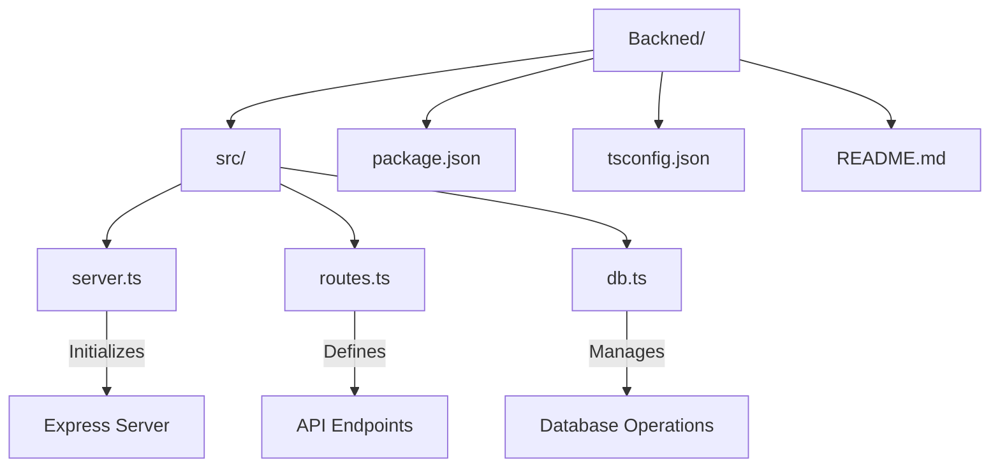

**Diagram sources**
- [server.ts](file://Backned/src/server.ts#L1-L37)
- [routes.ts](file://Backned/src/routes.ts#L1-L365)
- [db.ts](file://Backned/src/db.ts#L1-L96)

**Section sources**
- [server.ts](file://Backned/src/server.ts#L1-L37)
- [routes.ts](file://Backned/src/routes.ts#L1-L365)
- [db.ts](file://Backned/src/db.ts#L1-L96)

## Express.js Server Setup
The Express.js server is configured with essential middleware for handling JSON payloads, CORS, and environment variables. The server uses TypeScript with `ts-node-dev` for development and includes proper error handling during initialization.

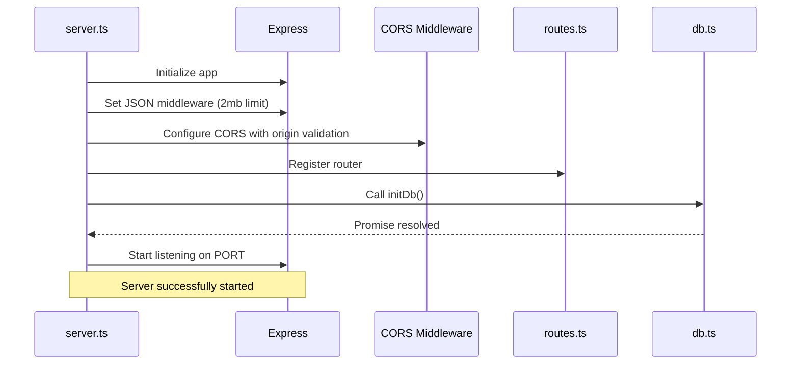

**Diagram sources**
- [server.ts](file://Backned/src/server.ts#L1-L37)

**Section sources**
- [server.ts](file://Backned/src/server.ts#L1-L37)

## REST API Endpoint Design
The REST API follows a logical structure with endpoints organized by resource type. The design includes health checks, scene management, permalink operations, and administrative functions with appropriate HTTP methods and status codes.

```mermaid
flowchart TD
A["API Endpoints"] --> B["GET /"]
A --> C["GET /health"]
A --> D["GET /api/scenes/:roomId"]
A --> E["POST /api/scenes/:roomId"]
A --> F["POST /api/scenes/"]
A --> G["POST /api/permalinks"]
A --> H["GET /api/permalinks/:permalink"]
A --> I["GET /api/permalinks"]
A --> J["DELETE /api/permalinks/:permalink"]
A --> K["GET /api/teachers/:teacherId/permalinks"]
A --> L["DELETE /api/teachers/:teacherId/permalinks/:permalink"]
A --> M["POST /api/admin/teachers"]
A --> N["POST /api/admin/teachers/upload"]
A --> O["GET /api/admin/teachers"]
B --> |"API Info"| P["Returns API metadata"]
C --> |"Health Check"| Q["Returns status ok"]
D --> |"Scene Retrieval"| R["Returns scene data"]
E --> |"Scene Update"| S["Creates/updates scene"]
F --> |"Binary Scene Upload"| T["Creates new scene"]
G --> |"Permalink Creation"| U["Generates short link"]
H --> |"Permalink Resolution"| V["Returns room details"]
I --> |"Teacher Permalinks"| W["Lists teacher's links"]
J --> |"Link Deactivation"| X["Marks link inactive"]
K --> |"Teacher Protected"| Y["Requires teacher token"]
L --> |"Teacher Protected"| Z["Requires teacher token"]
M --> |"Admin Only"| AA["Creates teacher account"]
N --> |"Admin Only"| AB["Bulk teacher upload"]
O --> |"Admin Only"| AC["Lists all teachers"]
```

**Diagram sources**
- [routes.ts](file://Backned/src/routes.ts#L1-L365)

**Section sources**
- [routes.ts](file://Backned/src/routes.ts#L1-L365)

## Database Interaction Patterns
The application uses a clean database access pattern with promisified SQLite3 methods. The data access layer provides a consistent interface for database operations with proper error handling and transaction management.

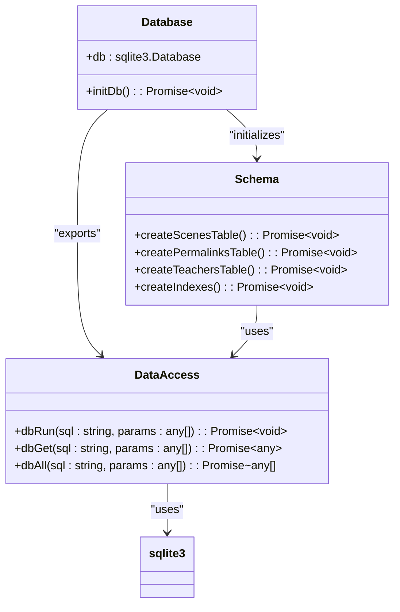

**Diagram sources**
- [db.ts](file://Backned/src/db.ts#L1-L96)

**Section sources**
- [db.ts](file://Backned/src/db.ts#L1-L96)

## SQLite Database Schema
The SQLite database schema consists of three main tables: scenes, permalinks, and teachers. The schema is designed for efficient lookups with appropriate indexes and constraints to maintain data integrity.

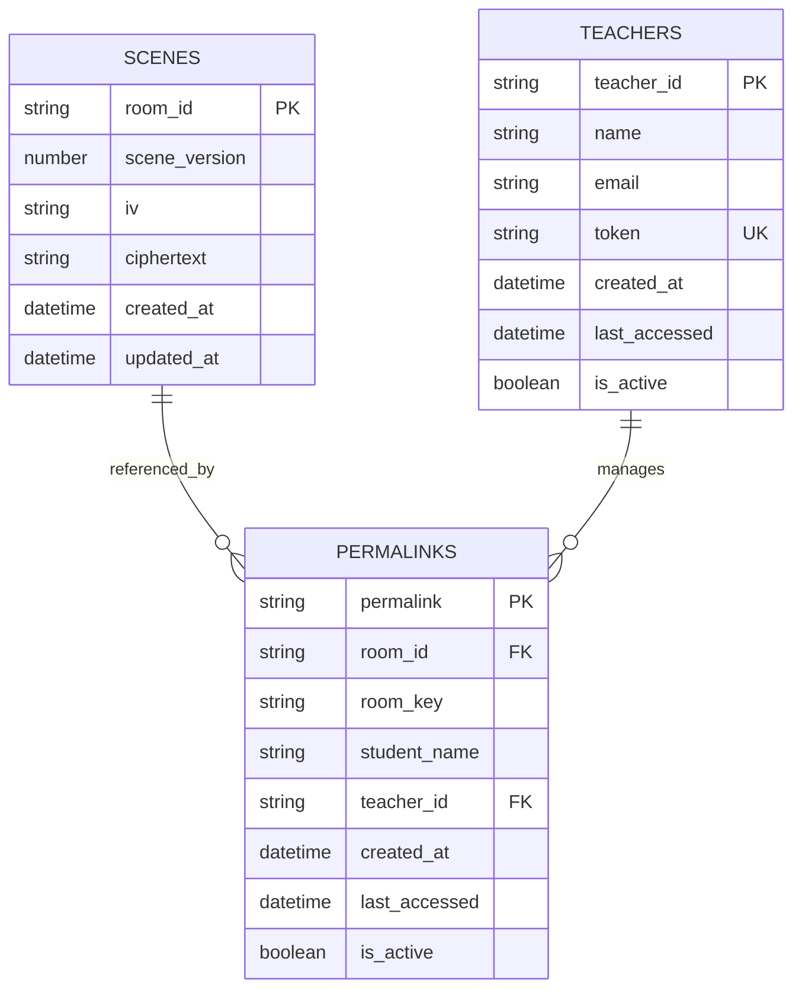

**Diagram sources**
- [db.ts](file://Backned/src/db.ts#L1-L96)
- [init-db.sql](file://excalidraw/init-db.sql#L1-L65)

**Section sources**
- [db.ts](file://Backned/src/db.ts#L1-L96)

## API Security Model
The API implements a multi-layered security model with different access levels for public, teacher, and admin endpoints. Authentication is handled through token-based verification with environment-controlled admin access.

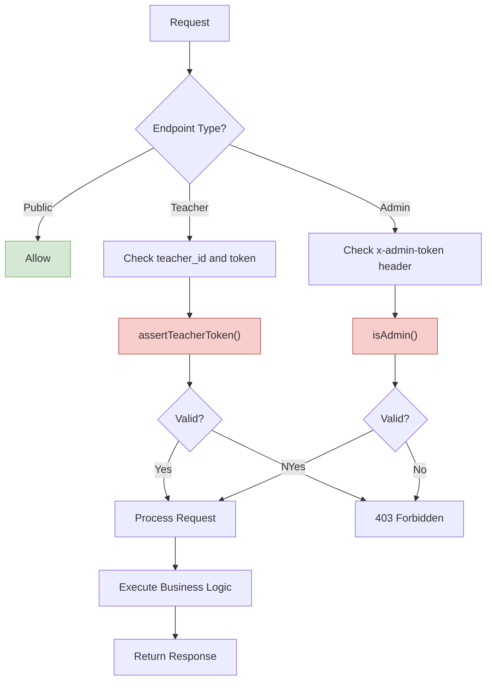

**Diagram sources**
- [routes.ts](file://Backned/src/routes.ts#L1-L365)

**Section sources**
- [routes.ts](file://Backned/src/routes.ts#L1-L365)

## Error Handling Strategy
The application implements a comprehensive error handling strategy with centralized error management, proper logging, and meaningful client responses. Errors are caught at the route level and translated into appropriate HTTP status codes.

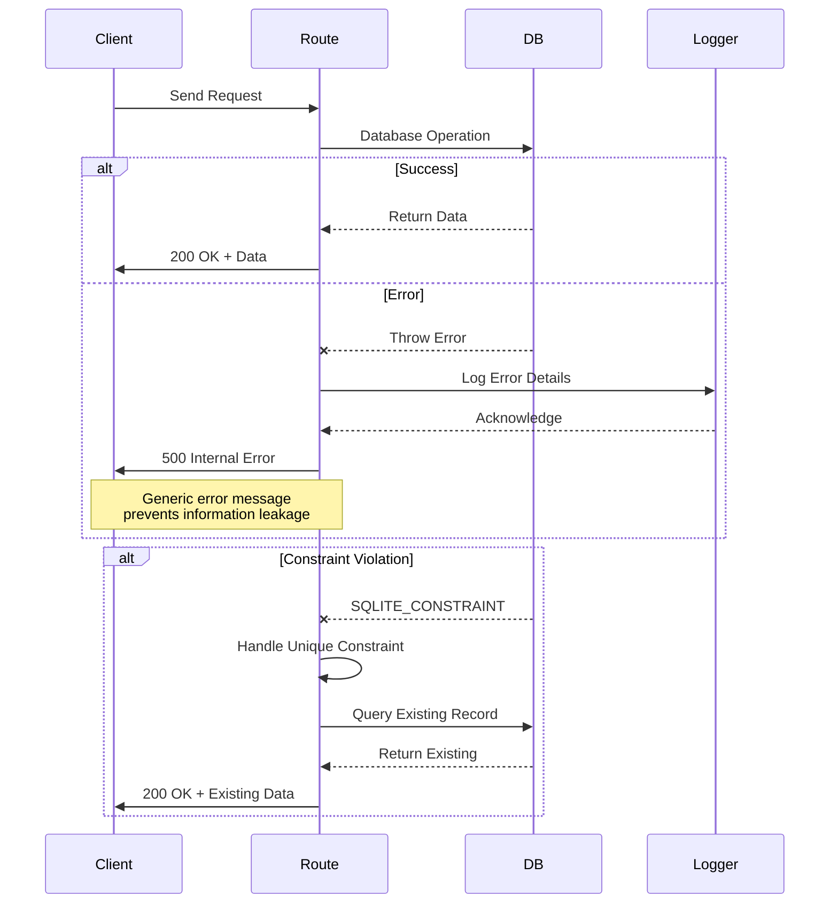

**Diagram sources**
- [routes.ts](file://Backned/src/routes.ts#L1-L365)

**Section sources**
- [routes.ts](file://Backned/src/routes.ts#L1-L365)

## Request Validation Approach
The API implements strict request validation for all endpoints, checking both the presence and type of required parameters. Validation occurs at the route level before any database operations are performed.

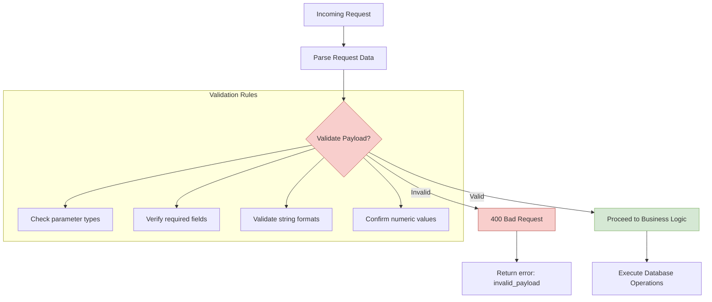

**Diagram sources**
- [routes.ts](file://Backned/src/routes.ts#L1-L365)

**Section sources**
- [routes.ts](file://Backned/src/routes.ts#L1-L365)

## Permalink System
The permalink system provides short, shareable URLs that resolve to Excalidraw scenes. The system supports both anonymous and teacher-managed links, with mechanisms to prevent duplication and ensure stable references.

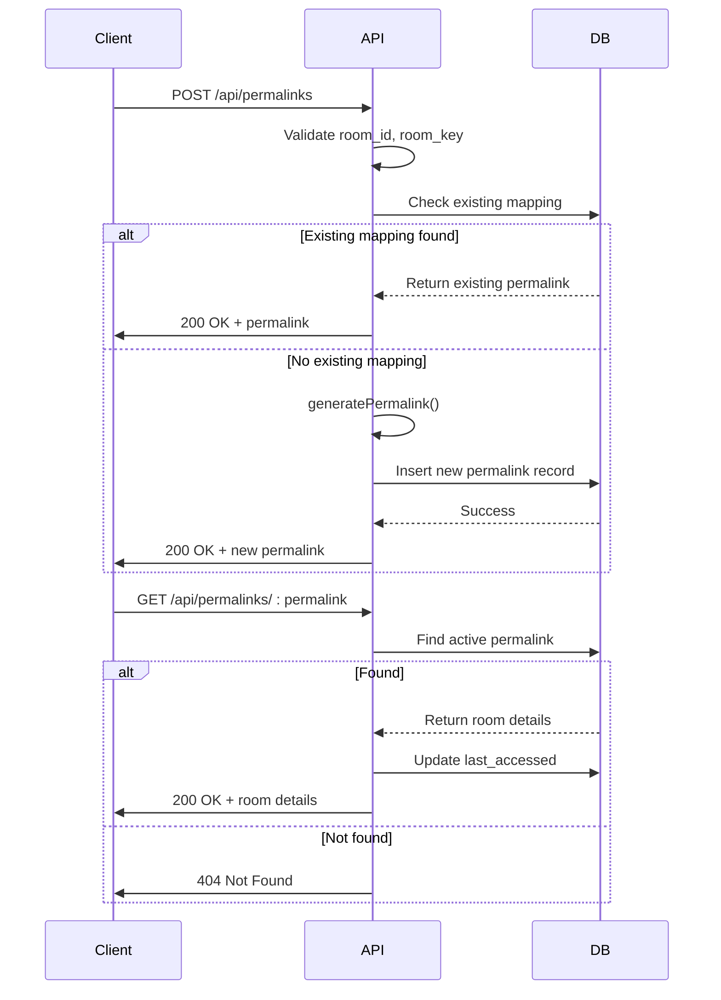

**Diagram sources**
- [routes.ts](file://Backned/src/routes.ts#L1-L365)

**Section sources**
- [routes.ts](file://Backned/src/routes.ts#L1-L365)

## Scene Storage Mechanism
The scene storage mechanism uses SQLite to persist Excalidraw scenes with versioning and encryption support. Scenes are stored with their cryptographic components and metadata for efficient retrieval and updates.

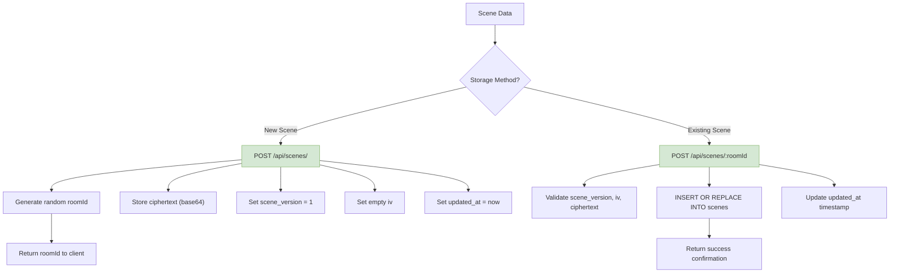

**Diagram sources**
- [routes.ts](file://Backned/src/routes.ts#L1-L365)
- [db.ts](file://Backned/src/db.ts#L1-L96)

**Section sources**
- [routes.ts](file://Backned/src/routes.ts#L1-L365)

## Teacher/Student Management Endpoints
The teacher/student management system provides endpoints for creating teacher accounts, managing student permalinks, and listing active links. The system supports both individual and bulk operations with appropriate access controls.

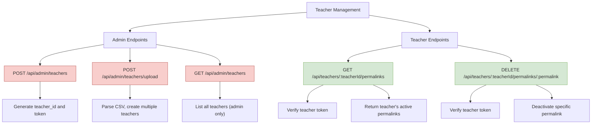

**Diagram sources**
- [routes.ts](file://Backned/src/routes.ts#L1-L365)

**Section sources**
- [routes.ts](file://Backned/src/routes.ts#L1-L365)

## Scalability Considerations
The backend architecture includes several scalability considerations, including database indexing, efficient query patterns, and stateless operation that enables horizontal scaling.

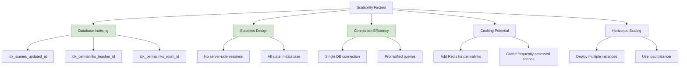

**Section sources**
- [db.ts](file://Backned/src/db.ts#L1-L96)
- [routes.ts](file://Backned/src/routes.ts#L1-L365)

## Connection Pooling
The current implementation uses a single SQLite database connection without explicit connection pooling. This is suitable for moderate loads but could be enhanced for high-concurrency scenarios.

```mermaid
flowchart TD
A["Express Server"] --> B["Single SQLite Connection"]
B --> C["Database File"]
A --> D["Request 1"]
A --> E["Request 2"]
A --> F["Request N"]
D --> B
E --> B
F --> B
B --> G{"Query Queue"}
G --> H["Execute Sequentially"]
H --> I["Return Results"]
style B fill:#FFF2CC,stroke:#D6B656
Note over G,H: SQLite handles concurrency<br/>through file locking
```

**Section sources**
- [db.ts](file://Backned/src/db.ts#L1-L96)

## Database Migration Strategies
The application implements a lightweight migration strategy within the `initDb` function, allowing for schema evolution without external migration tools. This approach handles both table creation and incremental schema changes.

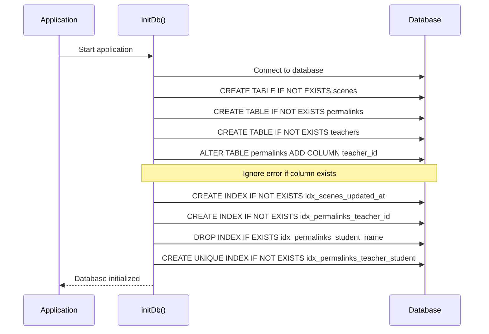

**Diagram sources**
- [db.ts](file://Backned/src/db.ts#L1-L96)

**Section sources**
- [db.ts](file://Backned/src/db.ts#L1-L96)

## Sequence Diagrams for Key API Workflows
This section provides sequence diagrams for the most critical API workflows, illustrating the interaction between components during common operations.

### Scene Retrieval Workflow
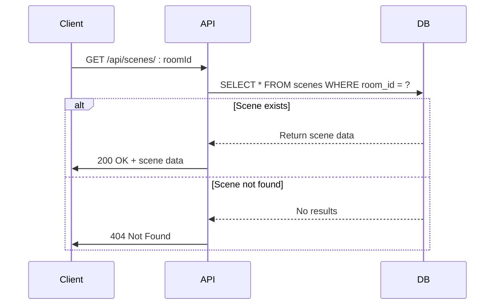

**Diagram sources**
- [routes.ts](file://Backned/src/routes.ts#L1-L365)

### Permalink Creation Workflow
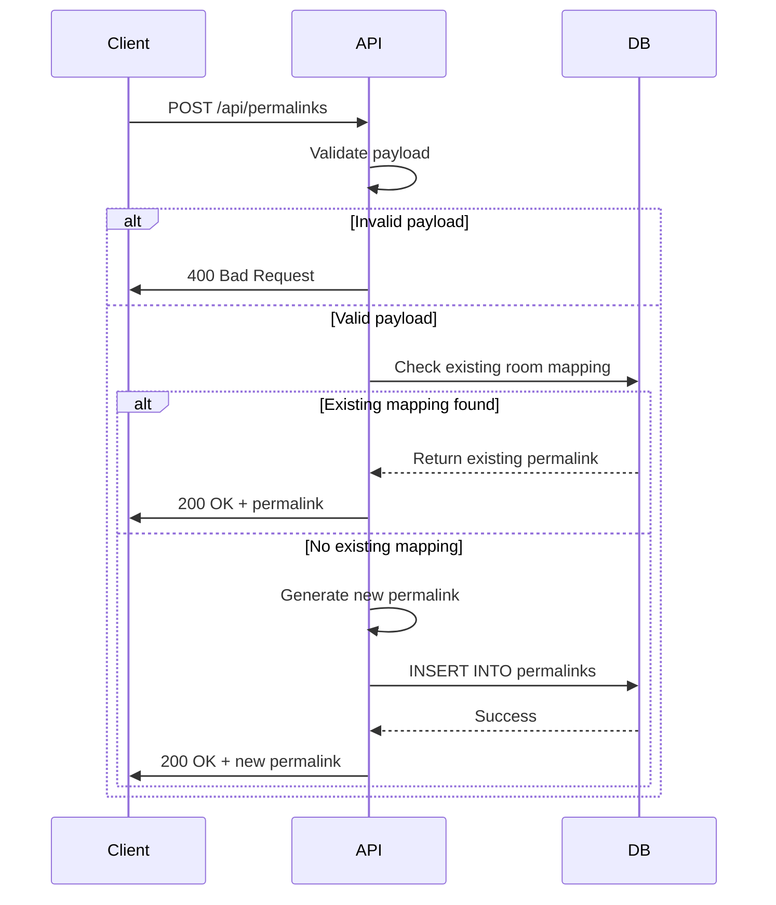

**Diagram sources**
- [routes.ts](file://Backned/src/routes.ts#L1-L365)

### Teacher Registration Workflow
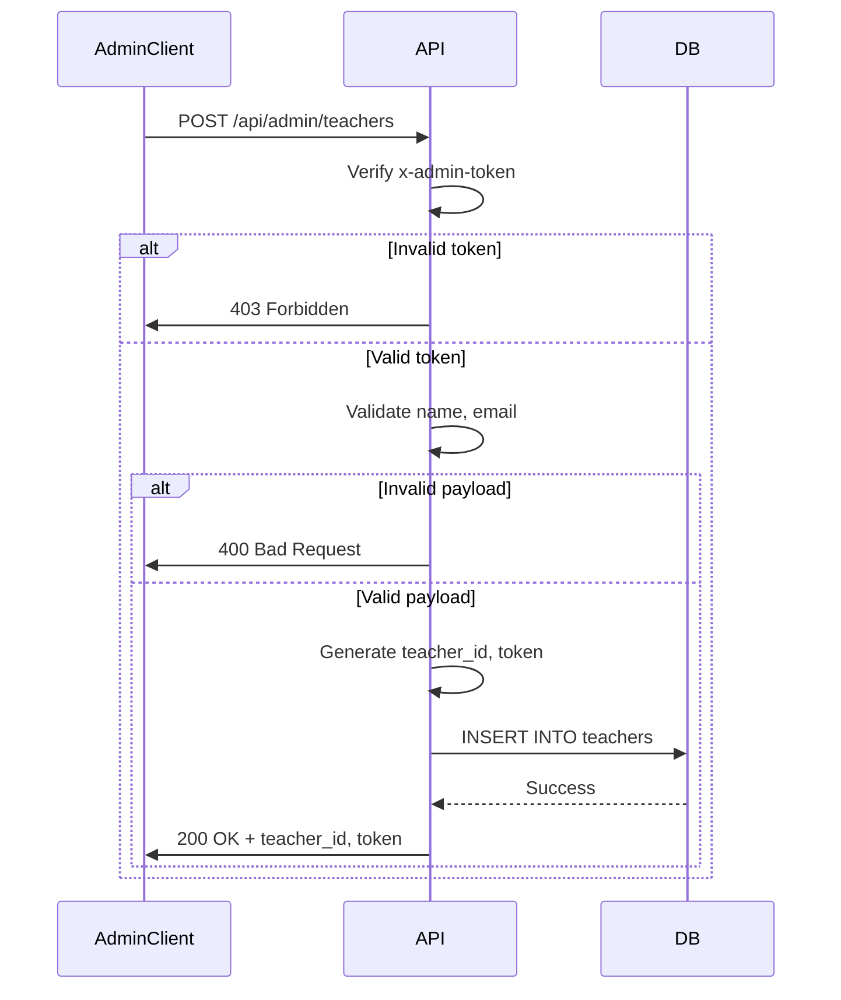

**Diagram sources**
- [routes.ts](file://Backned/src/routes.ts#L1-L365)

## Database Schema ER Diagram
The final ER diagram combines all entities and relationships in the system, providing a comprehensive view of the database structure.

```mermaid
erDiagram
SCENES {
string room_id PK
number scene_version
string iv
string ciphertext
datetime created_at
datetime updated_at
}
PERMALINKS {
string permalink PK
string room_id FK
string room_key
string student_name
string teacher_id FK
datetime created_at
datetime last_accessed
boolean is_active
}
TEACHERS {
string teacher_id PK
string name
string email
string token UK
datetime created_at
datetime last_accessed
boolean is_active
}
SCENES ||--o{ PERMALINKS : "has"
TEACHERS ||--o{ PERMALINKS : "manages"
index idx_scenes_updated_at on SCENES(updated_at)
index idx_permalinks_teacher_id on PERMALINKS(teacher_id)
index idx_permalinks_room_id on PERMALINKS(room_id)
index idx_permalinks_teacher_student on PERMALINKS(teacher_id, student_name) where student_name IS NOT NULL AND teacher_id IS NOT NULL
```

**Diagram sources**
- [db.ts](file://Backned/src/db.ts#L1-L96)
- [init-db.sql](file://excalidraw/init-db.sql#L1-L65)