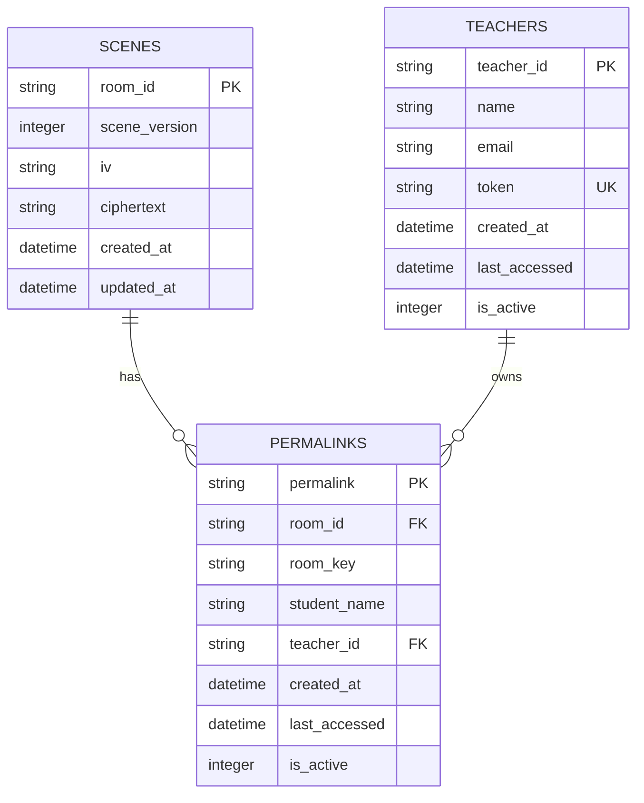

# Data Layer

<cite>
**Referenced Files in This Document**   
- [init-db.sql](file://excalidraw/init-db.sql)
- [db.ts](file://Backned/src/db.ts)
</cite>

## Table of Contents
1. [Introduction](#introduction)
2. [Database Schema](#database-schema)
3. [Data Access Patterns](#data-access-patterns)
4. [Query Optimization and Indexing](#query-optimization-and-indexing)
5. [Transaction Management](#transaction-management)
6. [Schema Design Decisions](#schema-design-decisions)
7. [Primary and Foreign Key Relationships](#primary-and-foreign-key-relationships)
8. [Indexing Strategy](#indexing-strategy)
9. [Database Migration Considerations](#database-migration-considerations)
10. [Connection Handling](#connection-handling)
11. [Data Lifecycle Management](#data-lifecycle-management)
12. [Performance Considerations](#performance-considerations)
13. [API Layer Integration](#api-layer-integration)
14. [Entity Relationship Diagram](#entity-relationship-diagram)

## Introduction
This document provides comprehensive documentation for the backend data persistence system used in the Excalidraw application. The system utilizes SQLite for local data storage with a schema designed to support collaborative drawing sessions, permalinks for student access, teacher management, and scene persistence. The database layer is implemented in TypeScript using the sqlite3 library with promisified methods for asynchronous operations. This documentation details the database schema, data access patterns, optimization techniques, and integration with the application's API layer.

## Database Schema
The database schema consists of four primary tables: scenes, permalinks, teachers, and students (implied through student_name in permalinks). The scenes table stores encrypted Excalidraw scene data with room identifiers and cryptographic information. The permalinks table manages student access to specific drawing rooms with tracking of access times and active status. The teachers table stores teacher account information including authentication tokens. Each table includes timestamps for creation and updates to support data lifecycle management and auditing.

**Section sources**
- [init-db.sql](file://excalidraw/init-db.sql#L15-L65)
- [db.ts](file://Backned/src/db.ts#L15-L40)

## Data Access Patterns
The data access layer employs asynchronous patterns using promisified SQLite methods to prevent blocking operations. The implementation uses three primary methods: dbRun for executing statements that don't return data, dbGet for retrieving a single row, and dbAll for fetching multiple rows. These methods are exported for use throughout the application, creating a consistent interface for database operations. The initDb function initializes all tables and indexes during application startup, ensuring the database schema is ready for use. Data access follows a direct SQL execution pattern rather than using an ORM, providing fine-grained control over queries and performance optimization.

**Section sources**
- [db.ts](file://Backned/src/db.ts#L7-L13)
- [db.ts](file://Backned/src/db.ts#L15-L40)

## Query Optimization and Indexing
The database implements several indexing strategies to optimize query performance. The scenes table is indexed on the updated_at column to facilitate efficient cleanup operations and time-based queries. The permalinks table features indexes on room_id and teacher_id columns to accelerate lookups by these common query parameters. Additionally, a unique composite index ensures that student names are unique within each teacher's collection, preventing naming conflicts while allowing the same student name across different teachers. These indexes support the application's primary access patterns, which involve retrieving scenes by room ID and finding permalinks by various identifier combinations.

**Section sources**
- [db.ts](file://Backned/src/db.ts#L55-L75)
- [init-db.sql](file://excalidraw/init-db.sql#L10-L11)

## Transaction Management
While the current implementation does not explicitly use database transactions for individual operations, it employs atomic SQL statements to ensure data integrity. Each database operation is designed to be self-contained and complete in a single execution. The application handles potential errors during schema modifications, such as adding the teacher_id column to the permalinks table, by catching and ignoring errors if the column already exists. This approach allows for safe database initialization even when the database has been partially set up. For future enhancement, wrapping related operations in explicit transactions would provide stronger consistency guarantees, particularly for operations that involve multiple table updates.

**Section sources**
- [db.ts](file://Backned/src/db.ts#L48-L53)
- [db.ts](file://Backned/src/db.ts#L77-L82)

## Schema Design Decisions
The schema design reflects several key decisions to support the application's collaborative drawing functionality. The scenes table uses room_id as the primary key, establishing a one-to-one relationship between rooms and their scene data. Encryption-related fields (iv and ciphertext) are stored separately to maintain security best practices. The permalinks table serves as a mapping layer between human-readable permalinks and internal room identifiers, enabling easy sharing of drawing sessions. Teacher authentication is managed through unique tokens rather than passwords, simplifying the security model. The use of INTEGER fields for boolean values (is_active) follows SQLite conventions and ensures compatibility across different platforms.

**Section sources**
- [init-db.sql](file://excalidraw/init-db.sql#L15-L35)
- [db.ts](file://Backned/src/db.ts#L15-L40)

## Primary and Foreign Key Relationships
The database schema establishes relationships between entities through foreign key references. The permalinks table contains a room_id column that references the scenes table, creating a parent-child relationship where each permalink points to a specific scene. Additionally, the permalinks table includes a teacher_id column that references the teachers table, establishing ownership of permalinks by specific teachers. These relationships enable the application to enforce referential integrity and navigate between related entities. The primary keys for all tables use TEXT or UUID types, with room_id, permalink, and teacher_id serving as natural keys that have meaning within the application context.

**Section sources**
- [db.ts](file://Backned/src/db.ts#L20-L40)
- [init-db.sql](file://excalidraw/init-db.sql#L15-L35)

## Indexing Strategy
The indexing strategy focuses on the most common query patterns in the application. The idx_scenes_updated_at index on the scenes table supports time-based operations such as cleaning up stale sessions or finding recently modified scenes. The idx_permalinks_room_id index allows for rapid lookup of permalinks by room, which is essential when redirecting users to specific drawing sessions. The idx_permalinks_teacher_id index facilitates operations that involve finding all permalinks associated with a particular teacher. The unique index idx_permalinks_teacher_student ensures data consistency by preventing duplicate student names within a teacher's collection, which is crucial for maintaining clear identification in educational settings.

**Section sources**
- [db.ts](file://Backned/src/db.ts#L55-L75)
- [init-db.sql](file://excalidraw/init-db.sql#L25-L35)

## Database Migration Considerations
The database initialization function includes built-in migration capabilities to handle schema evolution. When adding the teacher_id column to the permalinks table, the code attempts the alteration and gracefully handles the case where the column already exists, allowing the application to run the initialization routine multiple times without error. This approach supports zero-downtime deployments and simplifies the upgrade process for existing installations. The DROP INDEX statement for the legacy idx_permalinks_student_name index demonstrates a pattern for removing outdated schema elements while maintaining backward compatibility. Future migrations could be enhanced by implementing a versioning system to track schema changes and apply only necessary updates.

**Section sources**
- [db.ts](file://Backned/src/db.ts#L48-L53)
- [db.ts](file://Backned/src/db.ts#L77-L82)

## Connection Handling
The database connection is established at the module level using a single sqlite3.Database instance, creating a shared connection pool for the application. The connection string is configurable through the DATABASE_PATH environment variable, with a default value of "./excalidraw.db" for development convenience. The use of a single connection simplifies the implementation but may become a bottleneck under high concurrency. The promisification of database methods ensures that operations are handled asynchronously, preventing the event loop from being blocked. Error handling in the initDb function ensures that database initialization failures are properly reported, allowing the application to fail fast if the database cannot be accessed.

**Section sources**
- [db.ts](file://Backned/src/db.ts#L5-L7)
- [db.ts](file://Backned/src/db.ts#L15-L40)

## Data Lifecycle Management
Data lifecycle management is implemented through timestamp fields and active status flags in the database schema. The created_at and updated_at fields in the scenes table, along with last_accessed in the permalinks table, provide the necessary information for implementing data retention policies and cleanup operations. The is_active flag allows for soft deletion of records, preserving data while making it effectively invisible to the application. This approach supports features like session expiration, user deactivation, and historical data preservation. The updated_at trigger in the PostgreSQL version (shown in init-db.sql) demonstrates how automatic timestamp updates can be implemented at the database level, though the SQLite version handles this in application code.

**Section sources**
- [init-db.sql](file://excalidraw/init-db.sql#L8-L65)
- [db.ts](file://Backned/src/db.ts#L15-L40)

## Performance Considerations
The performance characteristics of the database layer are optimized for the application's typical access patterns. Read operations for scenes by room_id are efficient due to the primary key lookup. The indexing strategy supports fast queries on the most commonly accessed fields. Write operations are kept simple and atomic to minimize transaction time. The use of TEXT fields for storing encrypted data (ciphertext) allows for efficient storage of variable-length content without the overhead of BLOB handling. Memory usage is optimized by using INTEGER values for boolean flags and avoiding unnecessary data duplication. For high-traffic scenarios, additional optimizations could include query caching, connection pooling improvements, and partitioning of historical data.

**Section sources**
- [db.ts](file://Backned/src/db.ts#L15-L40)
- [init-db.sql](file://excalidraw/init-db.sql#L55-L65)

## API Layer Integration
The database layer integrates with the API layer through exported functions and direct SQL execution. The dbRun, dbGet, and dbAll methods provide a clean interface for executing queries from route handlers. The initDb function is called during application startup to ensure the database is ready before accepting requests. The schema design directly supports the API's resource model, with tables corresponding to API resources (scenes, permalinks, teachers). Error handling in the database layer propagates to the API layer, allowing for appropriate HTTP status codes to be returned. The separation of concerns between database operations and API logic enables maintainable code and clear boundaries between system components.

**Section sources**
- [db.ts](file://Backned/src/db.ts#L7-L13)
- [db.ts](file://Backned/src/db.ts#L15-L40)

## Entity Relationship Diagram

**Diagram sources**
- [init-db.sql](file://excalidraw/init-db.sql#L15-L35)
- [db.ts](file://Backned/src/db.ts#L15-L40)