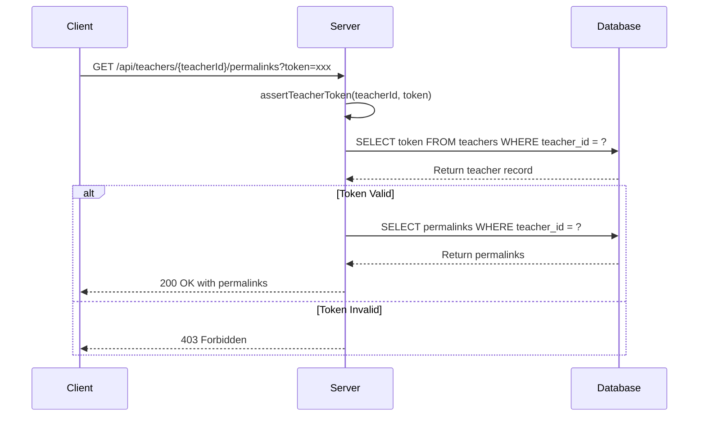
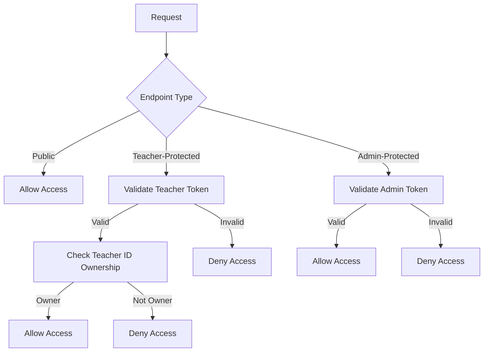
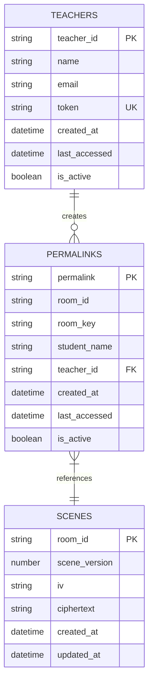
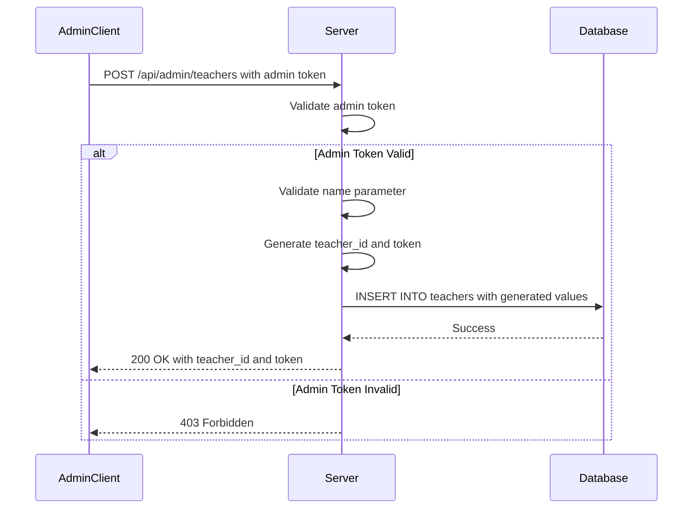

# Security Model

<cite>
**Referenced Files in This Document**   
- [server.ts](file://Backned/src/server.ts)
- [routes.ts](file://Backned/src/routes.ts)
- [db.ts](file://Backned/src/db.ts)
- [admin-panel.js](file://excalidraw/excalidraw-app/admin-panel.js)
- [admin-panel.html](file://excalidraw/excalidraw-app/admin-panel.html)
</cite>

## Table of Contents
1. [Introduction](#introduction)
2. [Authentication and Authorization Mechanisms](#authentication-and-authorization-mechanisms)
3. [Session Management and Access Control](#session-management-and-access-control)
4. [Route Protection and Input Validation](#route-protection-and-input-validation)
5. [Database Security and Query Parameterization](#database-security-and-query-parameterization)
6. [Permalink System Security](#permalink-system-security)
7. [Teacher Administration API Security](#teacher-administration-api-security)
8. [Data Validation and Error Handling](#data-validation-and-error-handling)
9. [Protection Against Common Web Vulnerabilities](#protection-against-common-web-vulnerabilities)
10. [End-to-End Encryption and Secure Data Transmission](#end-to-end-encryption-and-secure-data-transmission)
11. [Conclusion](#conclusion)

## Introduction
This document provides a comprehensive analysis of the backend security architecture for the Excalidraw application, focusing on teacher and student endpoints. The security model is designed to protect sensitive educational data, ensure proper access control, and prevent common web vulnerabilities. The system implements a multi-layered security approach that includes authentication, authorization, input validation, database protection, and secure data transmission mechanisms.

**Section sources**
- [server.ts](file://Backned/src/server.ts#L1-L37)
- [routes.ts](file://Backned/src/routes.ts#L1-L365)

## Authentication and Authorization Mechanisms

The backend implements a token-based authentication system for teacher accounts with administrative privileges. The authentication mechanism is centered around teacher tokens that are validated for access to protected endpoints.

Teacher authentication is implemented through query parameters containing a token, which is compared against stored values in the database. The system uses a dedicated `assertTeacherToken` function to verify the authenticity of teacher credentials by comparing the provided token with the stored token for the specified teacher ID.

Administrative access is controlled through an admin token configured in environment variables. The `isAdmin` function checks for the presence and validity of this token in the request headers, providing a separate authentication path for administrative operations.

**Diagram sources**
- [routes.ts](file://Backned/src/routes.ts#L126-L129)
- [routes.ts](file://Backned/src/routes.ts#L227-L245)

## Session Management and Access Control

The system implements stateless session management through token-based authentication rather than traditional session cookies. Teacher sessions are managed through unique tokens that are validated on each request to teacher-protected endpoints.

Access control policies are implemented at the route level, with different permission levels for various endpoints:

1. **Public endpoints**: Accessible without authentication (e.g., `/api/permalinks/:permalink`)
2. **Teacher-protected endpoints**: Require valid teacher credentials (e.g., `/api/teachers/:teacherId/permalinks`)
3. **Admin-protected endpoints**: Require administrative privileges (e.g., `/api/admin/teachers`)

The access control model follows a hierarchical structure where administrative functions can manage teacher accounts, while teachers can manage their own permalinks and student associations. The system enforces ownership-based access control, ensuring that teachers can only access or modify resources associated with their teacher ID.

**Diagram sources**
- [routes.ts](file://Backned/src/routes.ts#L126-L129)
- [routes.ts](file://Backned/src/routes.ts#L227-L272)
- [routes.ts](file://Backned/src/routes.ts#L274-L326)

## Route Protection and Input Validation

The backend implements comprehensive route protection and input validation to prevent unauthorized access and malformed requests. All routes are protected through middleware and explicit authentication checks.

Input validation is implemented at multiple levels:

1. **Type validation**: Ensuring that incoming data matches expected types (string, number, etc.)
2. **Presence validation**: Checking for required parameters
3. **Format validation**: Verifying that data conforms to expected formats

For example, the `/api/permalinks` endpoint validates that `room_id` and `room_key` are strings, while the teacher administration endpoints validate that names are provided as strings. The system uses TypeScript type assertions and explicit type checks to validate incoming request data before processing.

The server also implements CORS (Cross-Origin Resource Sharing) protection through the cors middleware, restricting requests to authorized origins specified in the environment variables. This prevents unauthorized domains from accessing the API endpoints.

**Section sources**
- [server.ts](file://Backned/src/server.ts#L10-L20)
- [routes.ts](file://Backned/src/routes.ts#L126-L162)
- [routes.ts](file://Backned/src/routes.ts#L274-L292)

## Database Security and Query Parameterization

The backend implements robust database security measures, with a primary focus on preventing SQL injection attacks through proper query parameterization.

All database queries use parameterized statements with placeholders (`?` in SQLite queries) rather than string concatenation. This approach ensures that user input is properly escaped and treated as data rather than executable code. The database operations are abstracted through the `dbRun`, `dbGet`, and `dbAll` functions, which consistently apply parameterization across all queries.

The database schema includes several security-focused design elements:

1. **Unique constraints**: The teachers table enforces unique tokens to prevent duplication
2. **Ownership relationships**: Permalinks are linked to teacher IDs, establishing ownership
3. **Active/inactive flags**: Resources can be deactivated rather than deleted, preserving audit trails

The system also implements proper error handling for database operations, preventing the exposure of sensitive database information in error responses.

**Diagram sources**
- [db.ts](file://Backned/src/db.ts#L30-L96)
- [routes.ts](file://Backned/src/routes.ts#L126-L162)

## Permalink System Security

The permalink system implements several security measures to protect shared educational content while maintaining usability for teachers and students.

Permalinks are generated using cryptographically secure random strings with sufficient entropy to prevent guessing attacks. The `generatePermalink` function creates 8-character random strings using base-36 encoding, providing approximately 47 bits of entropy.

The system implements a multi-factor approach to permalink creation and resolution:

1. **Room-based stability**: When a permalink already exists for a room_id and room_key combination, the system reuses it to maintain link stability
2. **Teacher-student mapping**: When both teacher_id and student_name are provided, the system checks for existing mappings to prevent duplicate links
3. **Active status tracking**: Permalinks can be deactivated rather than deleted, allowing for revocation without losing historical data

Access to permalinks is protected through a combination of direct access (via permalink ID) and teacher-managed access (via teacher ID). The system updates the last_accessed timestamp when a permalink is resolved, providing audit capabilities.

**Section sources**
- [routes.ts](file://Backned/src/routes.ts#L100-L162)
- [routes.ts](file://Backned/src/routes.ts#L328-L364)

## Teacher Administration API Security

The teacher administration API implements strict security controls to protect the creation and management of teacher accounts. These endpoints are protected by administrative authentication, requiring a valid admin token in the request headers.

The API provides two methods for creating teacher accounts:

1. **Single teacher creation**: Accepts name and email to create an individual teacher account
2. **Bulk teacher upload**: Accepts CSV data to create multiple teacher accounts at once

Both endpoints implement input validation to ensure data integrity. The single creation endpoint validates that the name is a string, while the bulk upload endpoint processes CSV data with header detection and field extraction.

When creating teacher accounts, the system generates both a teacher_id and a random token using the `generateId` function. The teacher_id is 10 characters long, while the token is 16 characters, providing sufficient entropy for security. The tokens are stored in the database and used for subsequent authentication to teacher-protected endpoints.

The system also provides administrative endpoints to list all teachers, exposing teacher_id, name, email, and token information to authorized administrators.

**Diagram sources**
- [routes.ts](file://Backned/src/routes.ts#L274-L326)
- [admin-panel.js](file://excalidraw/excalidraw-app/admin-panel.js#L1-L32)

## Data Validation and Error Handling

The backend implements comprehensive data validation and error handling to ensure data integrity and prevent information leakage.

Input validation is performed on all endpoints, with specific checks for:

1. **Required fields**: Ensuring essential parameters are present
2. **Data types**: Verifying that parameters match expected types
3. **String formats**: Checking for valid string formats where applicable

Error handling follows security best practices by:

1. **Generic error messages**: Using non-descriptive error messages like "internal_error" to prevent information disclosure
2. **Proper HTTP status codes**: Returning appropriate status codes (400, 403, 404, 500) to indicate error types without revealing implementation details
3. **Server-side logging**: Logging detailed error information on the server while sending minimal information to clients

The system also implements proper validation for teacher-specific operations, requiring both teacher_id and token parameters for access to protected endpoints. When these parameters are missing, the system returns appropriate error responses without revealing whether a particular teacher_id exists in the system.

**Section sources**
- [routes.ts](file://Backned/src/routes.ts#L126-L162)
- [routes.ts](file://Backned/src/routes.ts#L227-L272)
- [routes.ts](file://Backned/src/routes.ts#L274-L292)

## Protection Against Common Web Vulnerabilities

The backend implements several measures to protect against common web vulnerabilities:

**SQL Injection Protection**: All database queries use parameterized statements with placeholders, preventing SQL injection attacks by ensuring user input is properly escaped and treated as data rather than executable code.

**Cross-Site Scripting (XSS) Prevention**: While the backend primarily serves JSON data, the system avoids directly embedding user input into HTML responses. The focus on API endpoints that return structured data rather than HTML content reduces XSS risk.

**Cross-Site Request Forgery (CSRF) Mitigation**: The stateless, token-based authentication system reduces CSRF risk by not relying on session cookies. Each request requires explicit authentication tokens, making it difficult for attackers to forge requests on behalf of authenticated users.

**Insecure Direct Object Reference (IDOR) Prevention**: The system implements ownership checks by requiring teacher_id parameters for operations on teacher-specific resources. This ensures that users can only access resources they own.

**Rate Limiting Considerations**: While not explicitly implemented in the provided code, the use of random identifiers with sufficient entropy makes brute force attacks impractical.

The system also implements proper CORS configuration to restrict API access to authorized domains, preventing unauthorized cross-origin requests.

**Section sources**
- [server.ts](file://Backned/src/server.ts#L10-L20)
- [db.ts](file://Backned/src/db.ts#L5-L96)
- [routes.ts](file://Backned/src/routes.ts#L126-L364)

## End-to-End Encryption and Secure Data Transmission

The security architecture includes provisions for end-to-end encryption and secure data transmission, though the implementation details are primarily handled by the frontend application.

The backend stores encrypted scene data in the database, with the actual encryption and decryption processes managed by the client application. The scenes table stores ciphertext and initialization vectors (iv) as text fields, indicating that encryption is performed client-side before transmission to the server.

Data transmission security is ensured through:

1. **HTTPS enforcement**: While not explicitly shown in the code, production deployments should use HTTPS to encrypt data in transit
2. **Secure token transmission**: Authentication tokens are transmitted via HTTP headers, which should be protected by TLS in production
3. **CORS configuration**: Proper CORS settings prevent unauthorized domains from accessing the API

The system design supports end-to-end encryption by storing only encrypted data on the server, with decryption keys maintained exclusively on client devices. This architecture ensures that even if the database is compromised, the actual content remains protected.

The permalink system also contributes to security by providing stable, shareable links without exposing sensitive room keys in the URL structure. The actual room_key is stored server-side and only transmitted to authorized users.

**Section sources**
- [db.ts](file://Backned/src/db.ts#L30-L38)
- [routes.ts](file://Backned/src/routes.ts#L126-L162)
- [routes.ts](file://Backned/src/routes.ts#L328-L364)

## Conclusion
The backend security architecture for the Excalidraw application implements a comprehensive set of security measures to protect teacher and student data. The system uses token-based authentication for teacher accounts, with administrative privileges controlled through environment-configured tokens. Route protection, input validation, and database query parameterization prevent common web vulnerabilities like SQL injection and XSS.

The permalink system provides a secure method for sharing educational content, with proper access controls and ownership verification. Teacher administration functions are protected by administrative authentication, ensuring that only authorized personnel can create and manage teacher accounts.

While the current implementation provides solid security foundations, potential enhancements could include rate limiting, more granular permission levels, and improved error handling to further strengthen the security posture. The architecture's reliance on client-side encryption for end-to-end protection is a strong security feature that ensures data confidentiality even in the event of a database compromise.