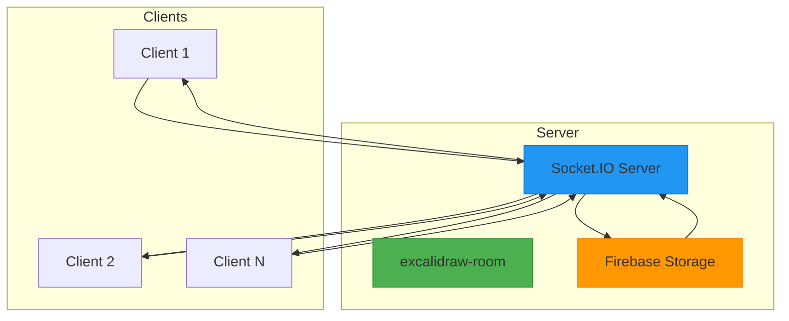
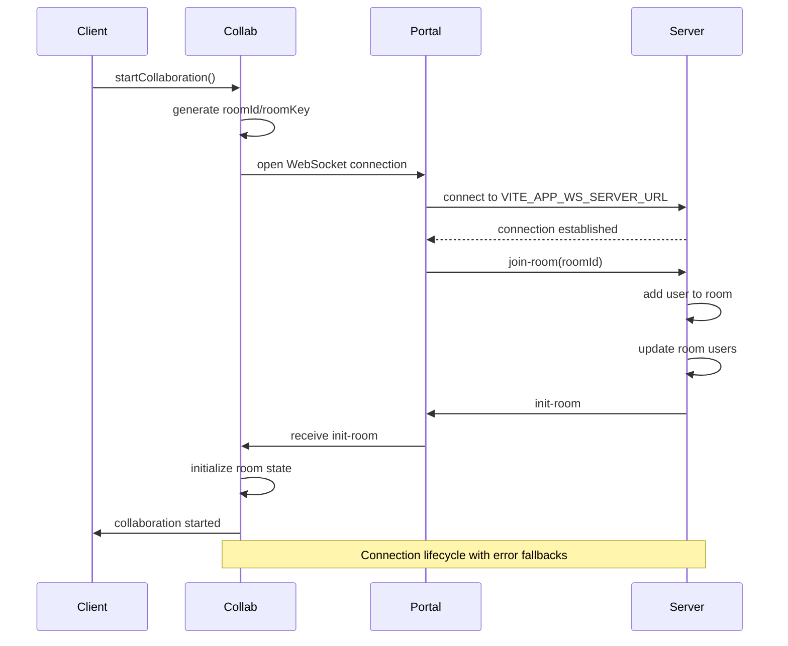
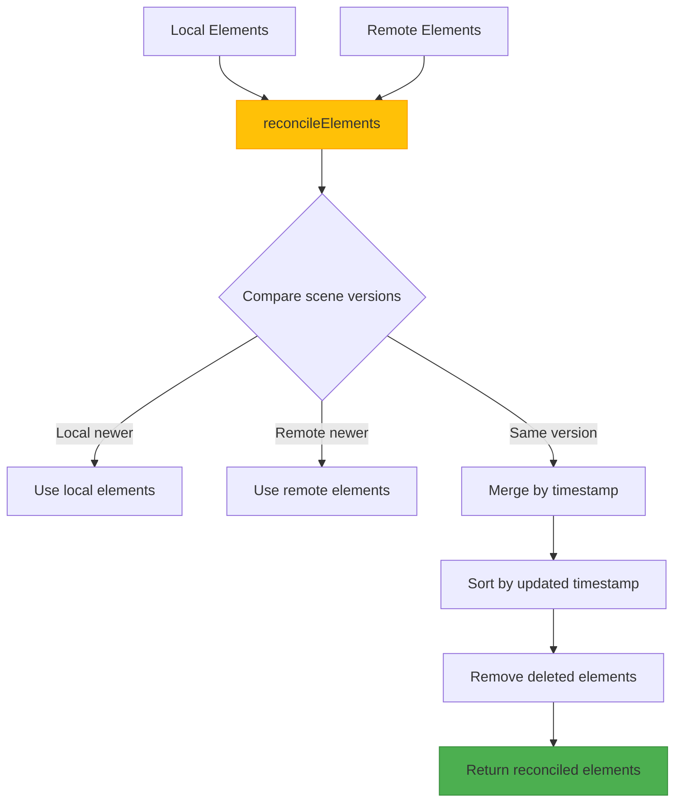
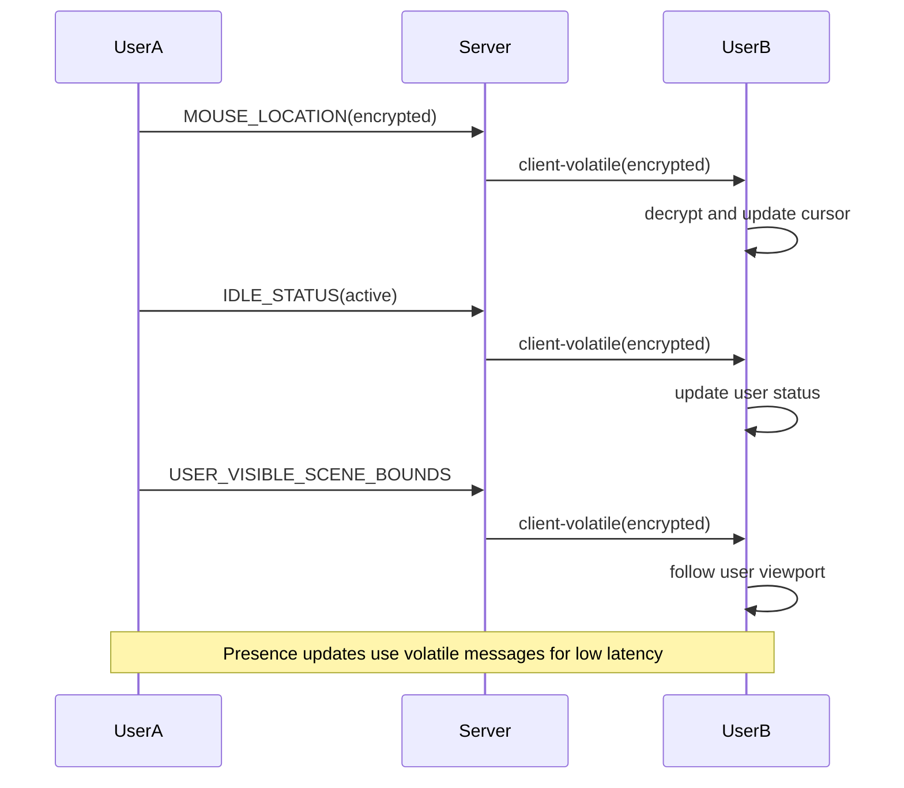
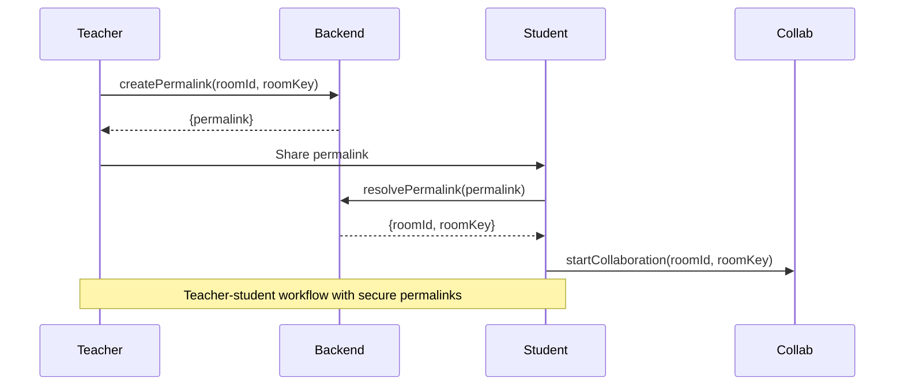
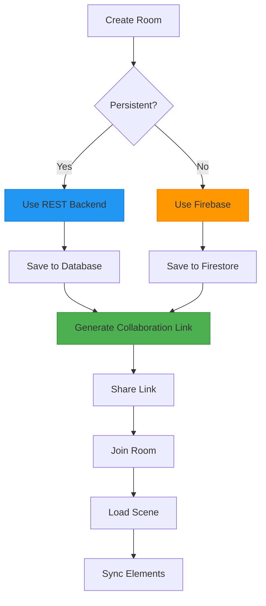
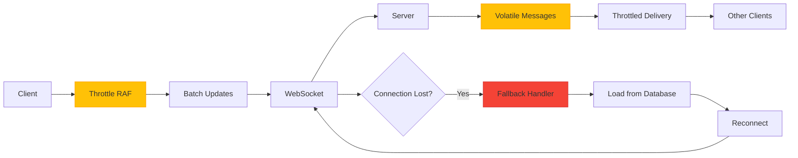
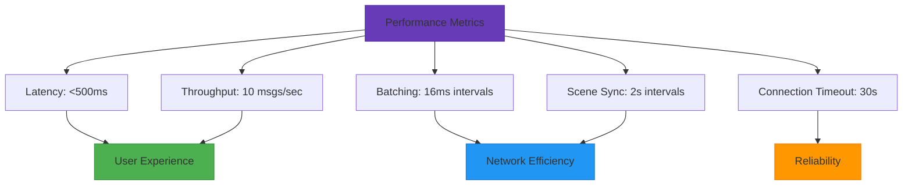

# Collaboration System

<cite>
**Referenced Files in This Document**   
- [Collab.tsx](file://excalidraw/excalidraw-app/collab/Collab.tsx)
- [index.js](file://excalidraw/excalidraw-room/src/index.js)
- [api-client.ts](file://excalidraw/excalidraw-app/data/api-client.ts)
- [index.ts](file://excalidraw/excalidraw-app/data/index.ts)
- [firebase.ts](file://excalidraw/excalidraw-app/data/firebase.ts)
- [encryption.ts](file://excalidraw/packages/excalidraw/data/encryption.ts)
</cite>

## Table of Contents
1. [Introduction](#introduction)
2. [WebSocket Communication Architecture](#websocket-communication-architecture)
3. [Connection Lifecycle Management](#connection-lifecycle-management)
4. [Message Protocol and Data Synchronization](#message-protocol-and-data-synchronization)
5. [Operational Transformation and Conflict Resolution](#operational-transformation-and-conflict-resolution)
6. [Presence Management and User Tracking](#presence-management-and-user-tracking)
7. [Teacher-Student Linking Mechanism](#teacher-student-linking-mechanism)
8. [End-to-End Encryption Implementation](#end-to-end-encryption-implementation)
9. [Room Management and Persistence](#room-management-and-persistence)
10. [Latency Optimization and Connection Resilience](#latency-optimization-and-connection-resilience)
11. [Performance Benchmarks](#performance-benchmarks)

## Introduction
The Excalidraw real-time collaboration system enables multiple users to simultaneously edit whiteboard content through a WebSocket-based architecture. The system consists of a client application (excalidraw-app) and a dedicated collaboration server (excalidraw-room) that facilitates real-time communication between participants. This documentation details the technical implementation of the collaboration features, including connection management, data synchronization, presence tracking, and security mechanisms that ensure a seamless collaborative experience.

**Section sources**
- [Collab.tsx](file://excalidraw/excalidraw-app/collab/Collab.tsx#L1-L50)
- [index.js](file://excalidraw/excalidraw-room/src/index.js#L1-L20)

## WebSocket Communication Architecture
The collaboration system employs a client-server WebSocket architecture where the excalidraw-room server acts as the central message broker. Clients establish WebSocket connections to synchronize whiteboard state and coordinate real-time interactions. The server uses Socket.IO for reliable message delivery with fallback mechanisms.



**Diagram sources**
- [index.js](file://excalidraw/excalidraw-room/src/index.js#L1-L30)
- [Collab.tsx](file://excalidraw/excalidraw-app/collab/Collab.tsx#L1-L20)

## Connection Lifecycle Management
The collaboration system manages WebSocket connections through a well-defined lifecycle that handles connection establishment, room joining, and graceful disconnection. When a user initiates collaboration, the client generates a unique room ID and encryption key, then establishes a WebSocket connection to the collaboration server.



**Diagram sources**
- [Collab.tsx](file://excalidraw/excalidraw-app/collab/Collab.tsx#L300-L450)
- [index.js](file://excalidraw/excalidraw-room/src/index.js#L50-L100)

**Section sources**
- [Collab.tsx](file://excalidraw/excalidraw-app/collab/Collab.tsx#L200-L500)
- [index.js](file://excalidraw/excalidraw-room/src/index.js#L30-L120)

## Message Protocol and Data Synchronization
The system uses a structured message protocol to synchronize whiteboard state between clients. All messages are encrypted end-to-end using AES-GCM encryption. The protocol supports various message types for different collaboration scenarios, including scene updates, cursor tracking, and user presence.

```mermaid
classDiagram
class SocketUpdateDataSource {
+INVALID_RESPONSE
+SCENE_INIT
+SCENE_UPDATE
+MOUSE_LOCATION
+USER_VISIBLE_SCENE_BOUNDS
+IDLE_STATUS
}
class WS_SUBTYPES {
+INIT
+UPDATE
+MOUSE_LOCATION
+USER_VISIBLE_SCENE_BOUNDS
+IDLE_STATUS
}
class SocketUpdateData {
+type
+payload
}
SocketUpdateDataSource --> SocketUpdateData : "contains"
WS_SUBTYPES --> SocketUpdateDataSource : "defines types"
note right of SocketUpdateDataSource
Message types for WebSocket communication
All data is encrypted end-to-end
end
```

**Diagram sources**
- [index.ts](file://excalidraw/excalidraw-app/data/index.ts#L100-L150)
- [Collab.tsx](file://excalidraw/excalidraw-app/collab/Collab.tsx#L100-L150)

**Section sources**
- [index.ts](file://excalidraw/excalidraw-app/data/index.ts#L50-L200)
- [Collab.tsx](file://excalidraw/excalidraw-app/collab/Collab.tsx#L100-L200)

## Operational Transformation and Conflict Resolution
The system implements a reconciliation mechanism to resolve conflicts when multiple users edit the same whiteboard simultaneously. The `reconcileElements` function merges local and remote changes based on scene versioning and element timestamps. This approach ensures eventual consistency across all clients without requiring a central authority to resolve conflicts.



**Diagram sources**
- [Collab.tsx](file://excalidraw/excalidraw-app/collab/Collab.tsx#L700-L750)
- [firebase.ts](file://excalidraw/excalidraw-app/data/firebase.ts#L200-L250)

**Section sources**
- [Collab.tsx](file://excalidraw/excalidraw-app/collab/Collab.tsx#L650-L800)
- [firebase.ts](file://excalidraw/excalidraw-app/data/firebase.ts#L150-L300)

## Presence Management and User Tracking
The collaboration system provides real-time presence information, showing which users are currently active in the room and their current status. The system tracks user idle states and cursor positions to create a shared awareness experience. Presence updates are sent as volatile messages to minimize network overhead.



**Diagram sources**
- [Collab.tsx](file://excalidraw/excalidraw-app/collab/Collab.tsx#L500-L550)
- [index.js](file://excalidraw/excalidraw-room/src/index.js#L80-L90)

**Section sources**
- [Collab.tsx](file://excalidraw/excalidraw-app/collab/Collab.tsx#L450-L600)

## Teacher-Student Linking Mechanism
The system implements a teacher-student linking mechanism that allows educators to create persistent collaboration rooms for students. Teachers can generate permalinks that students can use to join the collaboration session. The API provides endpoints for creating, resolving, and managing these educational links.



**Diagram sources**
- [api-client.ts](file://excalidraw/excalidraw-app/data/api-client.ts#L50-L100)
- [index.ts](file://excalidraw/excalidraw-app/data/index.ts#L200-L250)

**Section sources**
- [api-client.ts](file://excalidraw/excalidraw-app/data/api-client.ts#L1-L150)
- [index.ts](file://excalidraw/excalidraw-app/data/index.ts#L150-L300)

## End-to-End Encryption Implementation
All collaboration data is protected with end-to-end encryption using AES-GCM with 128-bit keys. The encryption key is generated on the client side and never transmitted to the server. Each message includes a randomly generated initialization vector (IV) to ensure semantic security.

```mermaid
classDiagram
class Encryption {
+IV_LENGTH_BYTES = 12
+ENCRYPTION_KEY_BITS = 128
}
class KeyManagement {
+generateEncryptionKey()
+createIV()
+getCryptoKey()
}
class DataProtection {
+encryptData(key, data)
+decryptData(iv, encrypted, privateKey)
}
KeyManagement --> Encryption : "uses constants"
DataProtection --> KeyManagement : "uses key functions"
note right of Encryption
Security parameters :
- AES-GCM encryption
- 12-byte IV
- 128-bit keys
- Client-side key generation
end
```

**Diagram sources**
- [encryption.ts](file://excalidraw/packages/excalidraw/data/encryption.ts#L1-L50)
- [Collab.tsx](file://excalidraw/excalidraw-app/collab/Collab.tsx#L250-L300)

**Section sources**
- [encryption.ts](file://excalidraw/packages/excalidraw/data/encryption.ts#L1-L95)
- [Collab.tsx](file://excalidraw/excalidraw-app/collab/Collab.tsx#L200-L350)

## Room Management and Persistence
The system supports both temporary and persistent collaboration rooms. Temporary rooms use Firebase for data storage, while persistent rooms can use a REST backend. Room state is synchronized across clients and persisted to ensure data durability. The system handles room cleanup when the last user disconnects.



**Diagram sources**
- [firebase.ts](file://excalidraw/excalidraw-app/data/firebase.ts#L1-L50)
- [api-client.ts](file://excalidraw/excalidraw-app/data/api-client.ts#L1-L50)

**Section sources**
- [firebase.ts](file://excalidraw/excalidraw-app/data/firebase.ts#L1-L348)
- [api-client.ts](file://excalidraw/excalidraw-app/data/api-client.ts#L1-L158)

## Latency Optimization and Connection Resilience
The collaboration system implements several optimizations to minimize latency and ensure connection resilience. Messages are batched and throttled to reduce network overhead. The system includes fallback mechanisms for connection failures and implements heartbeat monitoring to detect and recover from network issues.



**Diagram sources**
- [Collab.tsx](file://excalidraw/excalidraw-app/collab/Collab.tsx#L150-L200)
- [index.js](file://excalidraw/excalidraw-room/src/index.js#L100-L120)

**Section sources**
- [Collab.tsx](file://excalidraw/excalidraw-app/collab/Collab.tsx#L100-L300)

## Performance Benchmarks
The collaboration system is designed for high performance with optimizations at multiple levels. Message batching reduces the frequency of WebSocket transmissions, while scene versioning minimizes the amount of data that needs to be synchronized. The system can handle multiple concurrent users with sub-second latency for most operations.



**Diagram sources**
- [Collab.tsx](file://excalidraw/excalidraw-app/collab/Collab.tsx#L50-L100)
- [index.js](file://excalidraw/excalidraw-room/src/index.js#L1-L20)

**Section sources**
- [Collab.tsx](file://excalidraw/excalidraw-app/collab/Collab.tsx#L1-L100)
- [index.js](file://excalidraw/excalidraw-room/src/index.js#L1-L132)