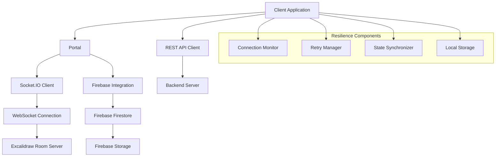
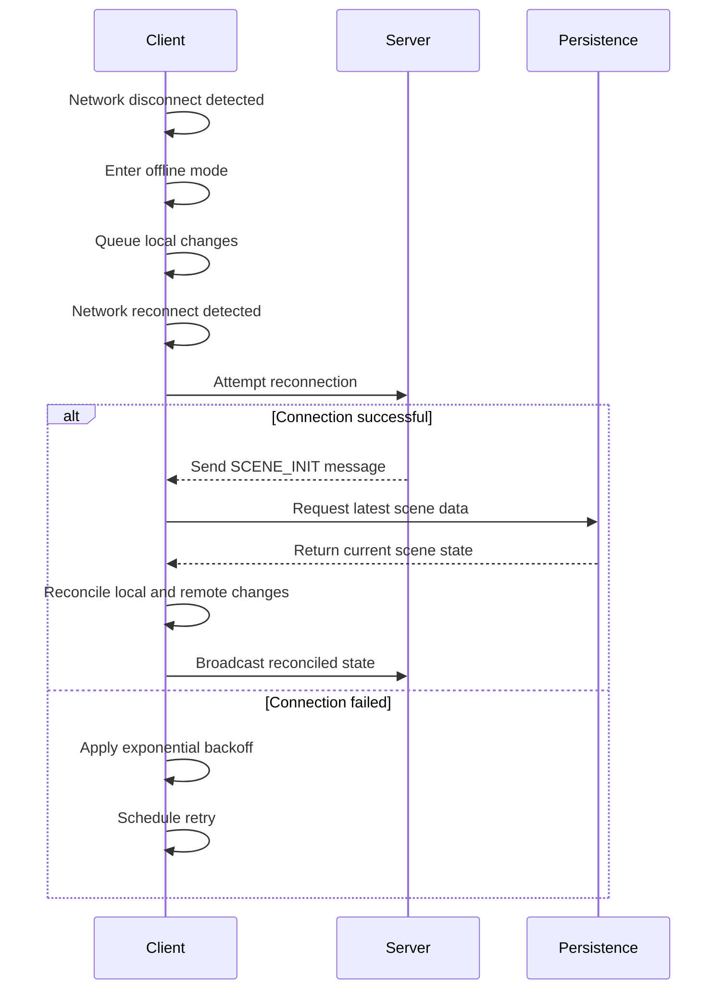
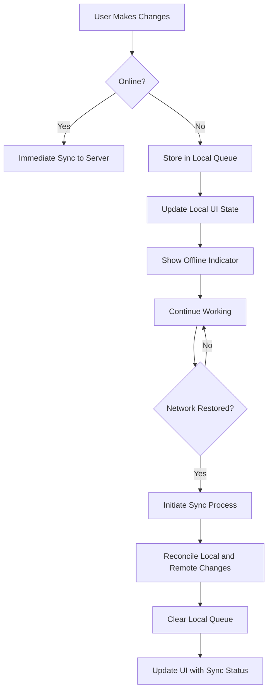
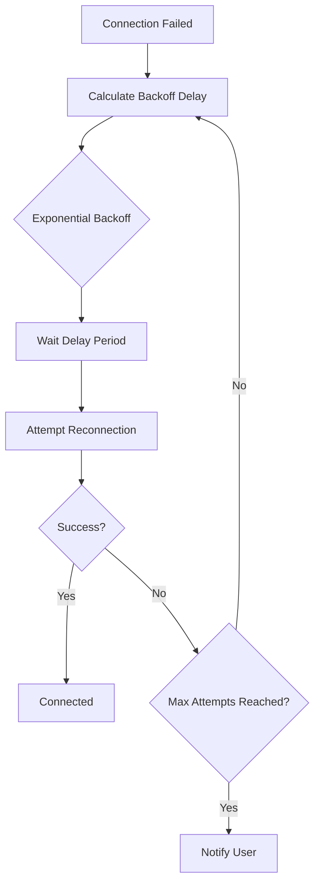
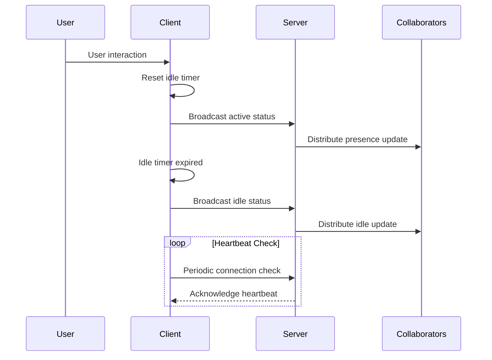
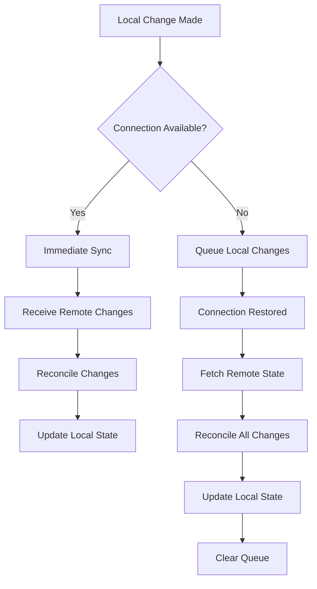
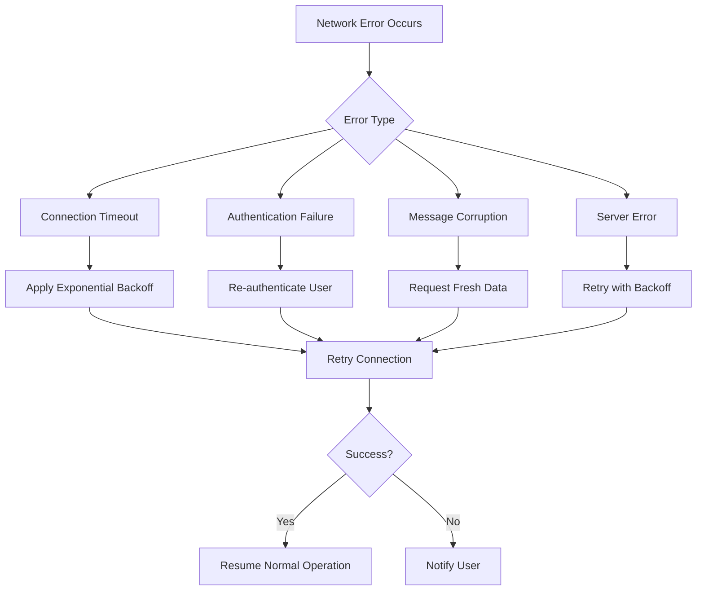

# Connection Resilience

<cite>
**Referenced Files in This Document**   
- [Collab.tsx](file://excalidraw/excalidraw-app/collab/Collab.tsx)
- [Portal.tsx](file://excalidraw/excalidraw-app/collab/Portal.tsx)
- [api-client.ts](file://excalidraw/excalidraw-app/data/api-client.ts)
- [restPersistence.ts](file://excalidraw/excalidraw-app/data/restPersistence.ts)
- [firebase.ts](file://excalidraw/excalidraw-app/data/firebase.ts)
- [app_constants.ts](file://excalidraw/excalidraw-app/app_constants.ts)
</cite>

## Table of Contents
1. [Introduction](#introduction)
2. [Connection Management Architecture](#connection-management-architecture)
3. [Automatic Reconnection and State Recovery](#automatic-reconnection-and-state-recovery)
4. [Offline Operation and Local State Management](#offline-operation-and-local-state-management)
5. [Retry Strategies and Backoff Algorithms](#retry-strategies-and-backoff-algorithms)
6. [Heartbeat and Presence Mechanisms](#heartbeat-and-presence-mechanisms)
7. [Data Synchronization and Conflict Resolution](#data-synchronization-and-conflict-resolution)
8. [Error Handling for Network Failure Modes](#error-handling-for-network-failure-modes)
9. [Performance Considerations](#performance-considerations)
10. [Troubleshooting Guide](#troubleshooting-guide)

## Introduction
The Excalidraw collaboration system implements comprehensive connection resilience features to ensure reliable real-time collaboration across unstable network conditions. This document details the mechanisms that enable seamless operation during network interruptions, including automatic reconnection, state recovery, offline capabilities, and robust error handling. The system is designed to maintain data consistency while providing a smooth user experience even in challenging network environments.

## Connection Management Architecture

**Diagram sources**
- [Collab.tsx](file://excalidraw/excalidraw-app/collab/Collab.tsx#L1-L1063)
- [Portal.tsx](file://excalidraw/excalidraw-app/collab/Portal.tsx#L1-L258)
- [api-client.ts](file://excalidraw/excalidraw-app/data/api-client.ts#L1-L158)

**Section sources**
- [Collab.tsx](file://excalidraw/excalidraw-app/collab/Collab.tsx#L1-L1063)
- [Portal.tsx](file://excalidraw/excalidraw-app/collab/Portal.tsx#L1-L258)

## Automatic Reconnection and State Recovery

The Excalidraw collaboration system implements automatic reconnection logic that seamlessly restores the connection when network connectivity is reestablished. The system monitors network status through browser events and automatically attempts to reconnect when the network becomes available.

When a connection is lost and subsequently restored, the system initiates a state recovery process that ensures the client's state is synchronized with the server. This process involves fetching the latest scene data from the persistence layer (either Firebase or REST backend) and reconciling it with any local changes that occurred during the disconnection period.

The reconnection process includes a fallback initialization handler that triggers if the client doesn't receive the expected initial SCENE_INIT message within a specified timeout period. This ensures that clients can recover even if initial handshake messages are lost due to network issues.

**Diagram sources**
- [Collab.tsx](file://excalidraw/excalidraw-app/collab/Collab.tsx#L500-L650)
- [Portal.tsx](file://excalidraw/excalidraw-app/collab/Portal.tsx#L100-L150)

**Section sources**
- [Collab.tsx](file://excalidraw/excalidraw-app/collab/Collab.tsx#L500-L650)
- [Portal.tsx](file://excalidraw/excalidraw-app/collab/Portal.tsx#L100-L150)

## Offline Operation and Local State Management

Excalidraw provides robust offline operation capabilities, allowing users to continue working on diagrams even when disconnected from the network. During offline periods, all user modifications are stored locally and queued for synchronization when the connection is restored.

The system uses a combination of in-memory state management and persistent local storage to ensure that no work is lost during extended disconnections. Local changes are tracked and versioned to facilitate conflict resolution when reconnecting. The application continues to function normally from the user's perspective, with visual indicators showing the offline status and pending synchronization.

When operating offline, the system prevents certain operations that require server coordination, such as real-time collaboration features, while still allowing full editing capabilities for the local document. This ensures data consistency while maximizing usability during network outages.

**Diagram sources**
- [Collab.tsx](file://excalidraw/excalidraw-app/collab/Collab.tsx#L200-L300)
- [Portal.tsx](file://excalidraw/excalidraw-app/collab/Portal.tsx#L200-L250)

**Section sources**
- [Collab.tsx](file://excalidraw/excalidraw-app/collab/Collab.tsx#L200-L300)
- [Portal.tsx](file://excalidraw/excalidraw-app/collab/Portal.tsx#L200-L250)

## Retry Strategies and Backoff Algorithms

The Excalidraw collaboration system implements sophisticated retry strategies with exponential backoff algorithms to handle transient network failures. When a connection attempt fails, the system doesn't immediately retry but instead applies a backoff strategy that increases the delay between retry attempts.

The retry mechanism is integrated with the connection monitoring system, which listens for browser network events (online/offline) to determine when to attempt reconnection. This prevents unnecessary connection attempts during prolonged network outages and reduces server load.

For file upload operations, the system implements a throttled retry mechanism that batches multiple file operations and retries them together, optimizing network usage and reducing the number of individual requests during recovery.

**Diagram sources**
- [Collab.tsx](file://excalidraw/excalidraw-app/collab/Collab.tsx#L400-L450)
- [Portal.tsx](file://excalidraw/excalidraw-app/collab/Portal.tsx#L150-L200)

**Section sources**
- [Collab.tsx](file://excalidraw/excalidraw-app/collab/Collab.tsx#L400-L450)
- [Portal.tsx](file://excalidraw/excalidraw-app/collab/Portal.tsx#L150-L200)

## Heartbeat and Presence Mechanisms

The system implements heartbeat and presence mechanisms to monitor connection health and user activity status. These mechanisms use both volatile and persistent messaging channels to balance real-time updates with network efficiency.

The idle detection system tracks user activity and broadcasts idle status changes to other collaborators, allowing the interface to reflect who is actively working on the document. This is implemented through event listeners on user interactions and a timer-based idle detection mechanism.

Presence information is synchronized through the collaboration channel, allowing all connected clients to maintain an accurate view of who is currently in the room and their activity status. This information is used to update the user interface with presence indicators and to manage follow-mode features.

**Diagram sources**
- [Collab.tsx](file://excalidraw/excalidraw-app/collab/Collab.tsx#L300-L350)
- [Portal.tsx](file://excalidraw/excalidraw-app/collab/Portal.tsx#L50-L100)

**Section sources**
- [Collab.tsx](file://excalidraw/excalidraw-app/collab/Collab.tsx#L300-L350)
- [Portal.tsx](file://excalidraw/excalidraw-app/collab/Portal.tsx#L50-L100)

## Data Synchronization and Conflict Resolution

Excalidraw employs a sophisticated data synchronization system that handles conflict resolution between concurrent edits from multiple collaborators. The system uses a reconciliation algorithm that merges changes from different sources while preserving the integrity of the document.

During synchronization, the system compares scene versions and element versions to determine which changes need to be propagated. Only elements that have been modified since the last synchronization are transmitted, optimizing bandwidth usage.

The conflict resolution strategy prioritizes the most recent changes while attempting to preserve the intent of all collaborators. When conflicts cannot be automatically resolved, the system applies deterministic rules to ensure consistency across all clients.

**Diagram sources**
- [Collab.tsx](file://excalidraw/excalidraw-app/collab/Collab.tsx#L600-L700)
- [restPersistence.ts](file://excalidraw/excalidraw-app/data/restPersistence.ts#L1-L114)

**Section sources**
- [Collab.tsx](file://excalidraw/excalidraw-app/collab/Collab.tsx#L600-L700)
- [restPersistence.ts](file://excalidraw/excalidraw-app/data/restPersistence.ts#L1-L114)

## Error Handling for Network Failure Modes

The system implements comprehensive error handling for various network failure modes, including connection timeouts, authentication failures, and message corruption. Each error type is handled with appropriate recovery strategies and user notifications.

For connection-related errors, the system distinguishes between transient failures (which trigger automatic retries) and permanent failures (which require user intervention). Error messages are localized and presented through the application's error dialog system.

The error handling system also includes mechanisms for detecting and recovering from message corruption, particularly for encrypted payloads. When decryption fails, the system alerts the user and attempts to recover by requesting fresh data from the server.

**Diagram sources**
- [Collab.tsx](file://excalidraw/excalidraw-app/collab/Collab.tsx#L700-L800)
- [api-client.ts](file://excalidraw/excalidraw-app/data/api-client.ts#L1-L158)

**Section sources**
- [Collab.tsx](file://excalidraw/excalidraw-app/collab/Collab.tsx#L700-L800)
- [api-client.ts](file://excalidraw/excalidraw-app/data/api-client.ts#L1-L158)

## Performance Considerations

The connection resilience system is designed with performance considerations to minimize bandwidth usage and memory consumption during reconnection and synchronization.

Bandwidth optimization is achieved through several mechanisms:
- Delta synchronization that only transmits changed elements
- Message compression for large payloads
- Throttling of frequent updates to match human interaction rates
- Batching of related operations to reduce message overhead

Memory management strategies include:
- Efficient data structures for tracking pending operations
- Automatic cleanup of completed synchronization tasks
- Limits on the size of queued operations to prevent memory exhaustion
- Proper cleanup of event listeners and timers during connection lifecycle

The system also implements timeout mechanisms to prevent hanging operations and ensure responsive user interface behavior even under poor network conditions.

**Section sources**
- [Collab.tsx](file://excalidraw/excalidraw-app/collab/Collab.tsx#L100-L200)
- [Portal.tsx](file://excalidraw/excalidraw-app/collab/Portal.tsx#L1-L50)
- [app_constants.ts](file://excalidraw/excalidraw-app/app_constants.ts#L1-L60)

## Troubleshooting Guide

When diagnosing persistent connection issues in the Excalidraw collaboration system, follow this systematic approach:

1. **Check Network Connectivity**: Verify that the client has basic network access and can reach the server endpoints.

2. **Examine Browser Console**: Look for specific error messages in the browser's developer console, particularly WebSocket connection errors or CORS issues.

3. **Verify Server Status**: Check if the backend services (WebSocket server, REST API, Firebase) are operational and accessible.

4. **Review Authentication**: Ensure that authentication tokens and room keys are valid and properly configured.

5. **Monitor Message Flow**: Use browser developer tools to inspect WebSocket messages and identify where the communication is breaking down.

6. **Check Firewall/Proxy Settings**: Ensure that WebSocket connections (typically on port 443 or 80) are not being blocked by network infrastructure.

7. **Test with Different Networks**: Try connecting from different networks to isolate whether the issue is network-specific.

Common solutions include clearing browser storage, refreshing authentication tokens, and restarting the client application. For persistent issues, collecting browser console logs and network traces can help identify the root cause.

**Section sources**
- [Collab.tsx](file://excalidraw/excalidraw-app/collab/Collab.tsx#L800-L1063)
- [api-client.ts](file://excalidraw/excalidraw-app/data/api-client.ts#L1-L158)
- [firebase.ts](file://excalidraw/excalidraw-app/data/firebase.ts#L1-L348)