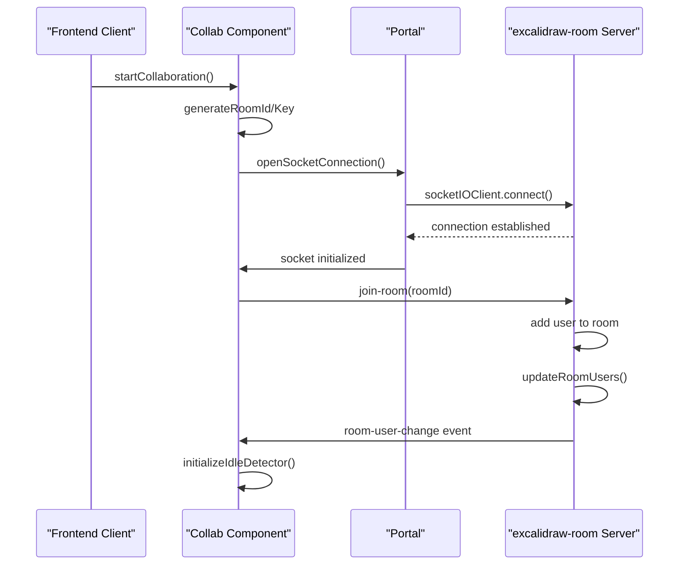
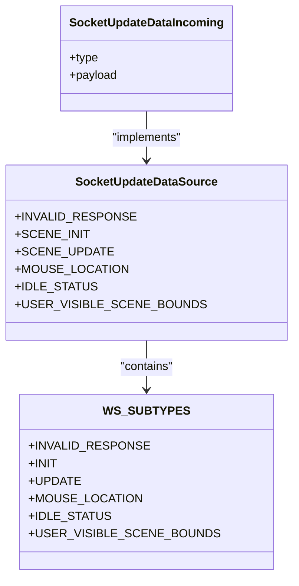
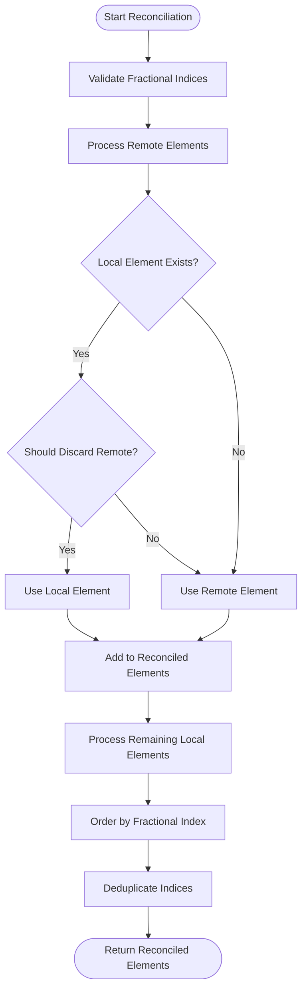
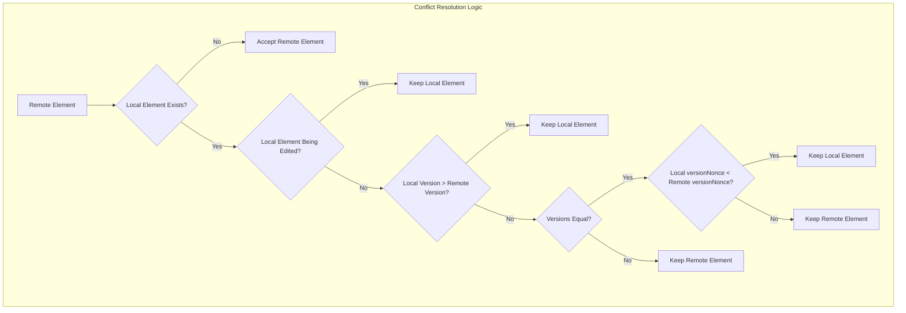
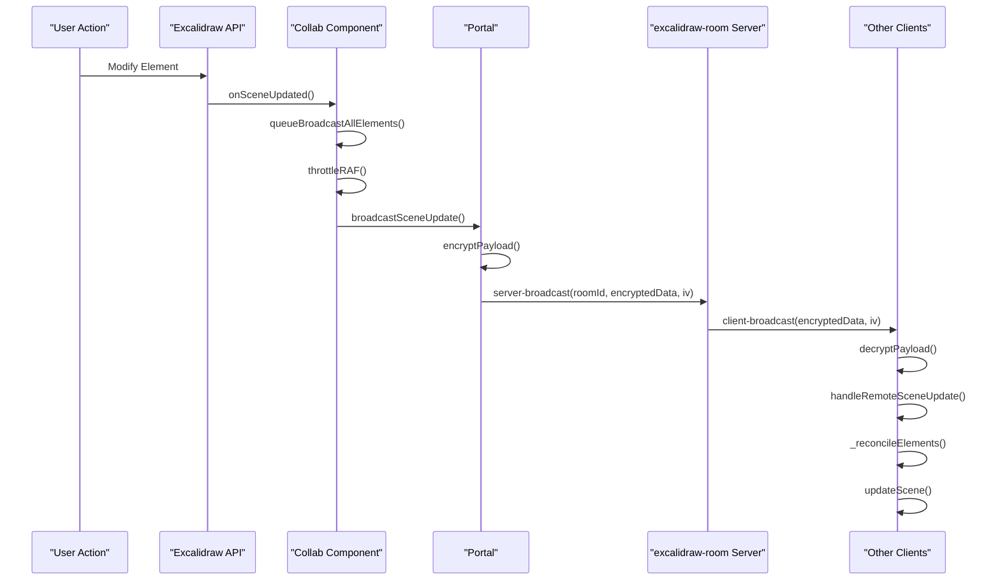
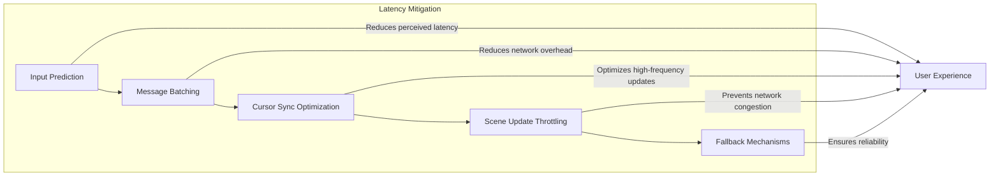
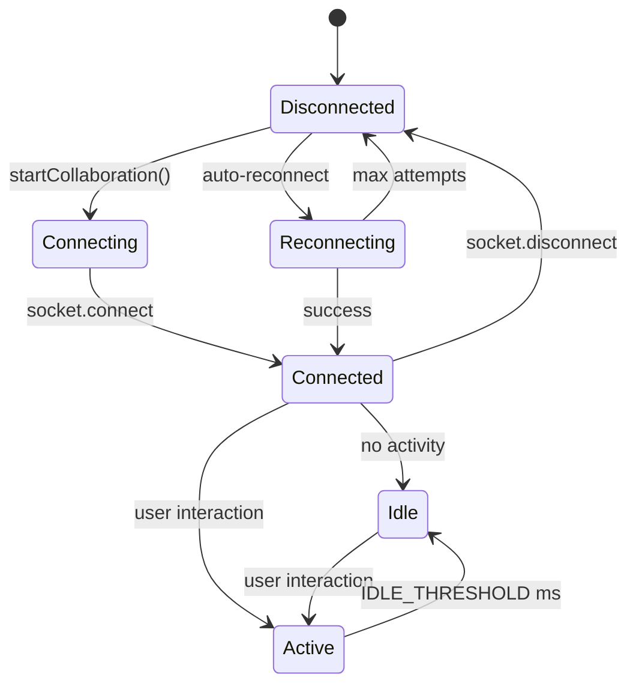
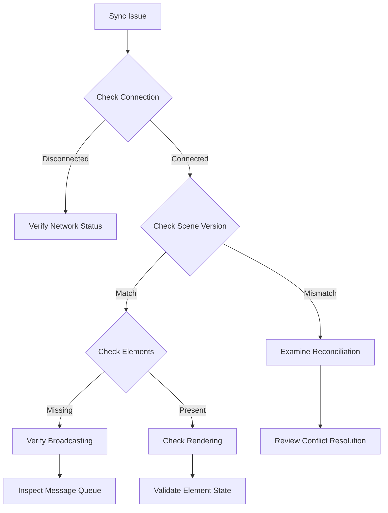
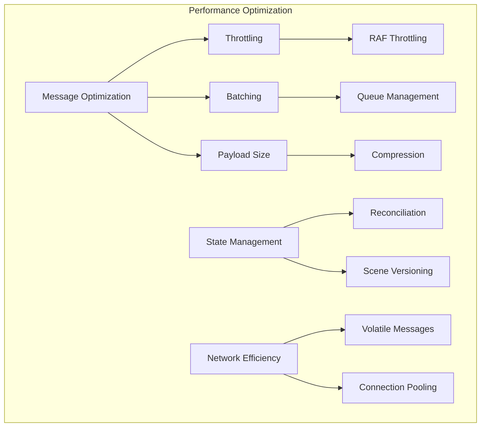

# Real-Time Synchronization

<cite>
**Referenced Files in This Document**   
- [Collab.tsx](file://excalidraw/excalidraw-app/collab/Collab.tsx)
- [index.js](file://excalidraw/excalidraw-room/src/index.js)
- [api-client.ts](file://excalidraw/excalidraw-app/data/api-client.ts)
- [reconcile.ts](file://excalidraw/packages/excalidraw/data/reconcile.ts)
- [app_constants.ts](file://excalidraw/excalidraw-app/app_constants.ts)
- [index.ts](file://excalidraw/excalidraw-app/data/index.ts)
- [firebase.ts](file://excalidraw/excalidraw-app/data/firebase.ts)
</cite>

## Table of Contents
1. [Introduction](#introduction)
2. [WebSocket Connection Management](#websocket-connection-management)
3. [Message Protocol Structure](#message-protocol-structure)
4. [Client State Reconciliation](#client-state-reconciliation)
5. [Operational Transformation and Conflict Resolution](#operational-transformation-and-conflict-resolution)
6. [Broadcasting User Actions](#broadcasting-user-actions)
7. [Latency Mitigation Techniques](#latency-mitigation-techniques)
8. [Connection Health Monitoring](#connection-health-monitoring)
9. [Debugging Sync Issues](#debugging-sync-issues)
10. [Performance Optimization](#performance-optimization)

## Introduction
The Excalidraw collaboration system implements a real-time synchronization mechanism that enables multiple users to collaboratively edit diagrams simultaneously. This document details the architecture and implementation of the synchronization system, focusing on the WebSocket-based communication between the frontend client and the excalidraw-room server. The system employs end-to-end encryption, operational transformation principles, and various latency mitigation techniques to ensure a seamless collaborative experience.

**Section sources**
- [Collab.tsx](file://excalidraw/excalidraw-app/collab/Collab.tsx#L1-L1063)
- [index.js](file://excalidraw/excalidraw-room/src/index.js#L1-L132)

## WebSocket Connection Management

The real-time synchronization in Excalidraw is built on a WebSocket connection established between the client and the excalidraw-room server. The connection process begins when a user initiates collaboration by either creating a new room or joining an existing one.

**Diagram sources**
- [Collab.tsx](file://excalidraw/excalidraw-app/collab/Collab.tsx#L300-L400)
- [index.js](file://excalidraw/excalidraw-room/src/index.js#L40-L80)

When a user starts collaboration, the system generates a unique room ID and encryption key. The client establishes a WebSocket connection to the server using Socket.IO, which provides fallback mechanisms like long polling if WebSocket is not available. The connection is secured with end-to-end encryption, where the room key is never transmitted to the server but is used to encrypt all data payloads.

The server maintains active rooms in a Map data structure, tracking which users are in which rooms. When a user joins a room, they are added to the room's user set, and other users in the room are notified of the new participant. The server also handles graceful disconnection, removing users from rooms when they disconnect and notifying remaining participants.

**Section sources**
- [Collab.tsx](file://excalidraw/excalidraw-app/collab/Collab.tsx#L299-L400)
- [index.js](file://excalidraw/excalidraw-room/src/index.js#L40-L100)

## Message Protocol Structure

The Excalidraw collaboration system uses a structured message protocol to communicate various types of updates between clients. All messages are encrypted end-to-end using the room key and transmitted through the WebSocket connection.

**Diagram sources**
- [app_constants.ts](file://excalidraw/excalidraw-app/app_constants.ts#L40-L55)
- [index.ts](file://excalidraw/excalidraw-app/data/index.ts#L80-L150)

The message protocol includes several message types defined in the WS_SUBTYPES enum:

- **SCENE_INIT**: Sent when a new user joins a room, containing the current state of all elements
- **SCENE_UPDATE**: Sent when elements are modified, containing updated element data
- **MOUSE_LOCATION**: Volatile message containing cursor position, button state, and selection
- **IDLE_STATUS**: Indicates whether a user is active or idle
- **USER_VISIBLE_SCENE_BOUNDS**: Contains the visible scene bounds when following a user

Messages are categorized into two transmission types: regular and volatile. Regular messages (using "server-broadcast") ensure delivery and are used for critical scene updates, while volatile messages (using "server-volatile-broadcast") may be dropped if the network is congested and are used for high-frequency updates like cursor movements.

All data payloads are encrypted using AES-GCM encryption with a unique initialization vector (IV) for each message. The encryption key is derived from the room key and is never transmitted over the network, ensuring end-to-end security.

**Section sources**
- [app_constants.ts](file://excalidraw/excalidraw-app/app_constants.ts#L40-L55)
- [index.ts](file://excalidraw/excalidraw-app/data/index.ts#L80-L150)
- [Collab.tsx](file://excalidraw/excalidraw-app/collab/Collab.tsx#L400-L500)

## Client State Reconciliation

Client state reconciliation is a critical component of the Excalidraw collaboration system, ensuring that all clients maintain a consistent view of the diagram despite concurrent edits. The reconciliation process resolves conflicts between local and remote changes using a deterministic algorithm.

**Diagram sources**
- [reconcile.ts](file://excalidraw/packages/excalidraw/data/reconcile.ts#L1-L119)
- [Collab.tsx](file://excalidraw/excalidraw-app/collab/Collab.tsx#L700-L750)

The reconciliation algorithm follows these principles:

1. For each remote element, check if a local element with the same ID exists
2. If a local element exists and should be preserved (based on version, editing state, etc.), use the local element
3. Otherwise, use the remote element
4. Add all remaining local elements that weren't processed
5. Order elements by fractional index to maintain correct z-ordering
6. Validate and synchronize fractional indices to prevent conflicts

The decision to discard a remote element is based on several factors:
- If the local element is currently being edited (text, resize, etc.)
- If the local element has a higher version number
- If versions are equal, the element with the lower versionNonce is preferred

This deterministic approach ensures that all clients arrive at the same state regardless of the order in which updates are received.

**Section sources**
- [reconcile.ts](file://excalidraw/packages/excalidraw/data/reconcile.ts#L1-L119)
- [Collab.tsx](file://excalidraw/excalidraw-app/collab/Collab.tsx#L700-L750)

## Operational Transformation and Conflict Resolution

The Excalidraw collaboration system implements a form of operational transformation to handle concurrent edits and resolve conflicts deterministically. Unlike traditional OT systems that transform operations, Excalidraw uses a state-based reconciliation approach that compares element versions and metadata.

**Diagram sources**
- [reconcile.ts](file://excalidraw/packages/excalidraw/data/reconcile.ts#L50-L80)
- [Collab.tsx](file://excalidraw/excalidraw-app/collab/Collab.tsx#L720-L740)

The conflict resolution strategy prioritizes local changes in the following order:

1. **Editing Priority**: If a user is actively editing an element (e.g., typing in a text element), their local changes take precedence over remote updates, preventing disruptive overwrites during active editing sessions.

2. **Version-Based Resolution**: Each element has a version number that increments with each modification. When conflicts occur, the element with the higher version number is preserved, following the "last write wins" principle with causal ordering.

3. **Deterministic Tie-Breaking**: When versions are identical, the system uses the versionNonce property to break ties deterministically. The element with the lower versionNonce is preserved, ensuring all clients make the same decision.

4. **Fractional Index Ordering**: For element ordering conflicts, Excalidraw uses fractional indices that allow precise insertion between any two elements without reindexing. This prevents ordering conflicts during concurrent insertions.

The system also handles special cases like element deletion. Deleted elements are retained for 24 hours to allow recovery and to ensure proper reconciliation across clients that may have different sync timings.

**Section sources**
- [reconcile.ts](file://excalidraw/packages/excalidraw/data/reconcile.ts#L50-L80)
- [Collab.tsx](file://excalidraw/excalidraw-app/collab/Collab.tsx#L720-L740)

## Broadcasting User Actions

User actions in Excalidraw are broadcast to other collaborators through the WebSocket connection using a publish-subscribe pattern. The system distinguishes between different types of updates based on their frequency and importance.

**Diagram sources**
- [Collab.tsx](file://excalidraw/excalidraw-app/collab/Collab.tsx#L600-L700)
- [index.js](file://excalidraw/excalidraw-room/src/index.js#L90-L100)

The broadcasting process follows these steps:

1. When a user performs an action (drawing, moving elements, etc.), the Excalidraw API notifies the collaboration system through event handlers.

2. The Collab component queues the update for broadcasting, using throttling to batch multiple rapid changes into a single update.

3. For scene updates, the system uses requestAnimationFrame throttling to limit updates to approximately 60fps, preventing network congestion from rapid successive changes.

4. The payload is encrypted using the room key and sent to the server via the "server-broadcast" channel.

5. The server forwards the encrypted message to all other clients in the same room.

6. Receiving clients decrypt the payload and apply the updates through the reconciliation process.

For high-frequency updates like cursor movements, the system uses volatile broadcasting which may drop messages under network congestion, prioritizing scene integrity over perfect cursor position accuracy.

**Section sources**
- [Collab.tsx](file://excalidraw/excalidraw-app/collab/Collab.tsx#L600-L700)
- [index.js](file://excalidraw/excalidraw-room/src/index.js#L90-L100)

## Latency Mitigation Techniques

The Excalidraw collaboration system employs several techniques to mitigate latency and provide a responsive user experience despite network delays.

**Diagram sources**
- [Collab.tsx](file://excalidraw/excalidraw-app/collab/Collab.tsx#L100-L200)
- [app_constants.ts](file://excalidraw/excalidraw-app/app_constants.ts#L10-L30)

Key latency mitigation strategies include:

**Input Prediction**: The system immediately renders user actions locally without waiting for server confirmation, providing instant feedback. This creates the illusion of zero-latency interaction, with remote updates reconciled later.

**Message Batching**: Rapid successive changes are batched together using throttling mechanisms. The system uses requestAnimationFrame throttling for scene updates, limiting broadcasts to approximately 60fps, which reduces network overhead while maintaining visual smoothness.

**Cursor Synchronization**: Cursor position updates are sent frequently (approximately every 33ms, or 30fps) but marked as volatile, allowing the system to drop these messages under network congestion without affecting scene integrity.

**Scene Update Throttling**: The system uses multiple throttling strategies:
- Regular scene updates are throttled to prevent excessive network traffic
- Full scene synchronization occurs at regular intervals (every 20 seconds) to recover from potential sync drift
- Initial scene update has a timeout to handle cases where the initial sync message is lost

**Fallback Mechanisms**: The system includes fallbacks for various failure modes:
- If the initial SCENE_INIT message is not received within a timeout period, the client fetches the scene directly from the database
- Connection errors trigger automatic reconnection attempts
- Network offline status is monitored and displayed to users

These techniques work together to provide a responsive collaboration experience even under suboptimal network conditions.

**Section sources**
- [Collab.tsx](file://excalidraw/excalidraw-app/collab/Collab.tsx#L100-L200)
- [app_constants.ts](file://excalidraw/excalidraw-app/app_constants.ts#L10-L30)

## Connection Health Monitoring

The Excalidraw collaboration system implements comprehensive connection health monitoring to detect and respond to network issues, ensuring reliable collaboration.

**Diagram sources**
- [Collab.tsx](file://excalidraw/excalidraw-app/collab/Collab.tsx#L200-L300)
- [index.js](file://excalidraw/excalidraw-room/src/index.js#L100-L120)

The system monitors connection health through several mechanisms:

**Network Status Detection**: The client listens to browser online/offline events to detect network connectivity changes. When the network goes offline, the system updates the UI to reflect the disconnected state.

**User Idle Detection**: The system tracks user activity to distinguish between active collaboration and idle states. Users are considered active when interacting with the canvas and idle after a period of inactivity (IDLE_THRESHOLD). This information is shared with other collaborators to provide presence awareness.

**Socket Connection Management**: The WebSocket connection includes built-in health checks:
- Connection timeout handling for failed connections
- Automatic reconnection attempts when disconnected
- Heartbeat mechanisms to detect stale connections
- Graceful shutdown handling for application unload

**Scene Synchronization**: The system periodically synchronizes the full scene state to recover from potential sync drift:
- Full scene sync occurs every 20 seconds (SYNC_FULL_SCENE_INTERVAL_MS)
- Initial scene sync has a timeout (INITIAL_SCENE_UPDATE_TIMEOUT) to handle lost messages
- Clients can request the current scene state from the server if needed

**Error Handling**: The system implements comprehensive error handling:
- Connection errors trigger user notifications
- Failed operations are retried with exponential backoff
- Data integrity checks prevent corrupted state propagation
- Users are notified of sync issues and provided with recovery options

This comprehensive monitoring ensures that collaboration remains reliable even under challenging network conditions.

**Section sources**
- [Collab.tsx](file://excalidraw/excalidraw-app/collab/Collab.tsx#L200-L300)
- [index.js](file://excalidraw/excalidraw-room/src/index.js#L100-L120)

## Debugging Sync Issues

Debugging synchronization issues in the Excalidraw collaboration system requires understanding the various components and their interactions. The system provides several mechanisms to diagnose and resolve common sync problems.

**Diagram sources**
- [Collab.tsx](file://excalidraw/excalidraw-app/collab/Collab.tsx#L500-L600)
- [reconcile.ts](file://excalidraw/packages/excalidraw/data/reconcile.ts#L1-L119)

Common sync issues and their diagnostic approaches:

**Connection Problems**: Verify the WebSocket connection status by checking:
- Browser network tab for WebSocket activity
- Console logs for connection error messages
- Online/offline status indicators in the UI
- Server health endpoint (/health) accessibility

**Scene Synchronization Issues**: When scenes are out of sync:
- Check the scene version numbers on all clients
- Verify that the reconciliation process is functioning correctly
- Examine the element versions and versionNonces
- Confirm that fractional indices are properly maintained

**Element Visibility Problems**: When elements appear on some clients but not others:
- Verify that the elements are being broadcast from the source client
- Check that the messages are being received by target clients
- Confirm that the reconciliation process is not discarding elements
- Ensure that deleted elements are properly handled (retained for 24 hours)

**Cursor and Presence Issues**: For problems with cursor positions or user presence:
- Verify that MOUSE_LOCATION messages are being sent (every 33ms)
- Check that volatile messages are not being dropped due to network congestion
- Confirm that IDLE_STATUS updates are being processed correctly
- Ensure that user follow functionality is working as expected

Debugging tools available:
- Browser developer tools for network and console inspection
- Server logs for connection and message handling
- Client-side error dialogs for user-facing issues
- Jotai store inspection for state management debugging

**Section sources**
- [Collab.tsx](file://excalidraw/excalidraw-app/collab/Collab.tsx#L500-L600)
- [reconcile.ts](file://excalidraw/packages/excalidraw/data/reconcile.ts#L1-L119)

## Performance Optimization

Optimizing performance in high-concurrency scenarios is critical for the Excalidraw collaboration system. The system employs several strategies to maintain responsiveness and scalability.

**Diagram sources**
- [Collab.tsx](file://excalidraw/excalidraw-app/collab/Collab.tsx#L100-L200)
- [app_constants.ts](file://excalidraw/excalidraw-app/app_constants.ts#L10-L30)

Key performance optimization strategies:

**Message Throttling**: The system uses requestAnimationFrame throttling for scene updates, limiting broadcasts to approximately 60fps. This prevents network congestion from rapid successive changes while maintaining visual smoothness.

**Message Batching**: Multiple rapid changes are batched together and sent as a single update. The queueBroadcastAllElements function accumulates changes and sends them in batches, reducing network overhead.

**Payload Optimization**: The system minimizes payload size by:
- Only transmitting syncable elements (excluding invisibly small elements)
- Using efficient data formats and compression
- Encrypting only the necessary data
- Limiting file upload size to 3MB (FILE_UPLOAD_MAX_BYTES)

**Efficient Reconciliation**: The reconciliation process is optimized to:
- Use Map data structures for O(1) element lookups
- Process elements in a single pass when possible
- Minimize unnecessary element comparisons
- Cache scene versions to avoid redundant calculations

**Connection Management**: The system optimizes network usage by:
- Using volatile messages for high-frequency updates like cursor positions
- Implementing efficient room management with Map data structures
- Closing connections gracefully to free server resources
- Monitoring connection health to prevent zombie connections

**Memory Management**: The system manages memory efficiently by:
- Clearing intervals and timeouts on component unmount
- Resetting file managers when collaboration stops
- Using weak maps for cache storage when appropriate
- Properly cleaning up event listeners

These optimizations ensure that the collaboration system remains responsive and scalable even with multiple users editing complex diagrams simultaneously.

**Section sources**
- [Collab.tsx](file://excalidraw/excalidraw-app/collab/Collab.tsx#L100-L200)
- [app_constants.ts](file://excalidraw/excalidraw-app/app_constants.ts#L10-L30)