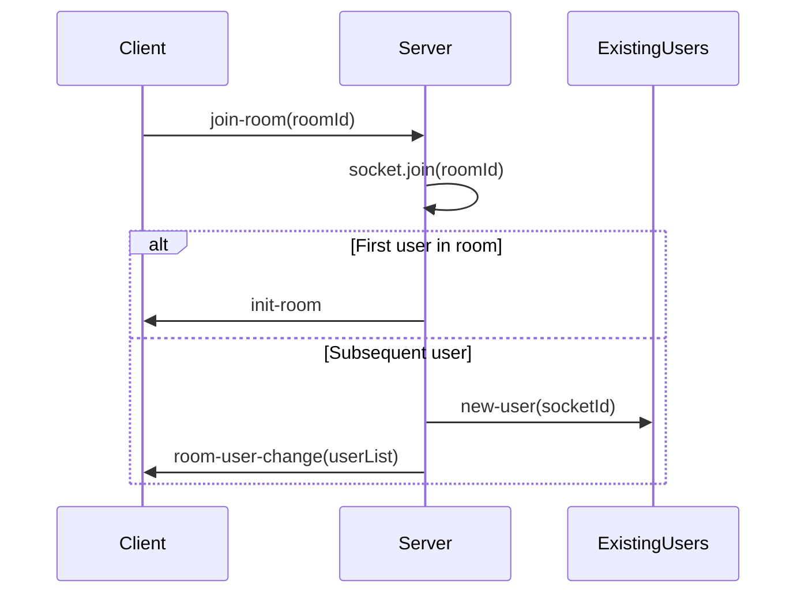
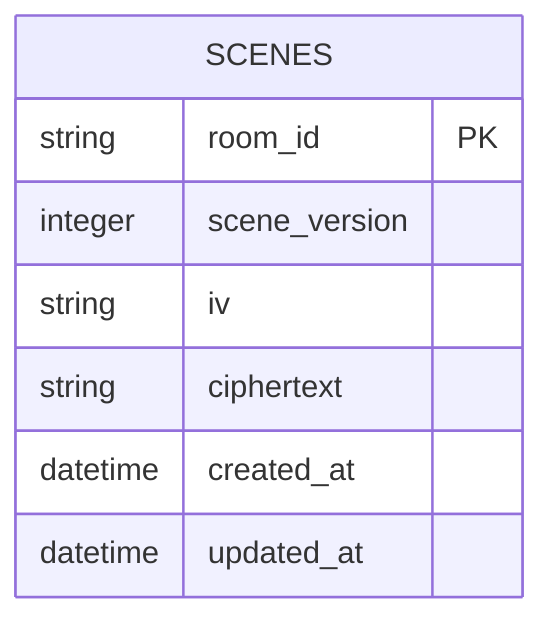
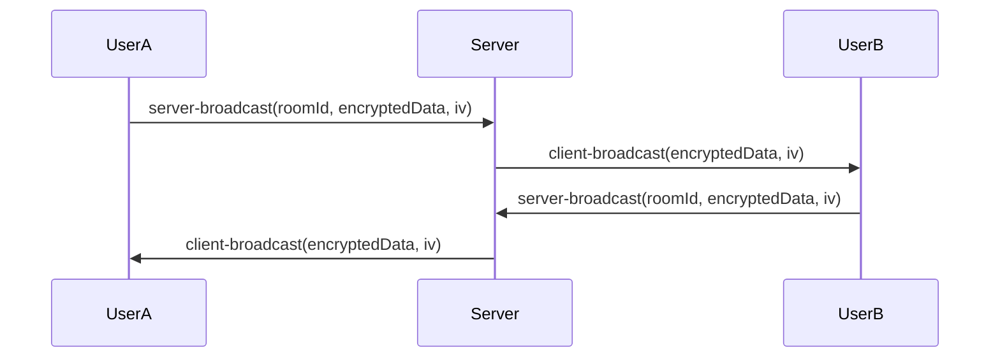
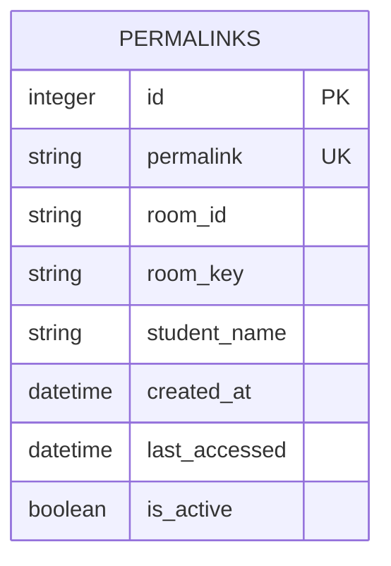

# Room Management

<cite>
**Referenced Files in This Document**   
- [index.ts](file://excalidraw-room/src/index.ts)
- [routes.ts](file://Backned/src/routes.ts)
- [db.ts](file://Backned/src/db.ts)
- [Portal.tsx](file://excalidraw/excalidraw-app/collab/Portal.tsx)
- [Collab.tsx](file://excalidraw/excalidraw-app/collab/Collab.tsx)
</cite>

## Table of Contents
1. [Introduction](#introduction)
2. [Room Lifecycle Management](#room-lifecycle-management)
3. [Room Creation and Joining](#room-creation-and-joining)
4. [Room Destruction and Cleanup](#room-destruction-and-cleanup)
5. [Session Persistence and Storage](#session-persistence-and-storage)
6. [WebSocket Integration and State Management](#websocket-integration-and-state-management)
7. [Room URL Generation and Access Control](#room-url-generation-and-access-control)
8. [Capacity Limits and Connection Management](#capacity-limits-and-connection-management)
9. [Common Issues and Scaling Considerations](#common-issues-and-scaling-considerations)

## Introduction
The Excalidraw collaboration infrastructure relies on the excalidraw-room service to manage real-time collaborative drawing sessions. This document details the room management system that enables multiple users to collaborate on shared whiteboards through WebSocket-based communication and REST API integration. The system handles room creation, joining, state synchronization, and cleanup through a combination of in-memory session tracking and persistent database storage. The architecture separates concerns between the WebSocket server for real-time collaboration and the REST API for persistent scene storage, creating a robust foundation for scalable collaborative editing.

## Room Lifecycle Management
The room lifecycle in Excalidraw's collaboration system consists of three primary phases: creation, active collaboration, and destruction. Rooms are created implicitly when the first user joins a room ID that doesn't exist, with the system automatically initializing the room state. During the active phase, the room maintains a collection of connected clients and broadcasts scene updates between them. The lifecycle terminates when all users disconnect from the room, triggering cleanup procedures. The system employs a stateless approach to room management, where rooms exist only as long as there are active connections, eliminating the need for explicit room creation endpoints and reducing complexity in the lifecycle management process.

**Section sources**
- [index.ts](file://excalidraw-room/src/index.ts#L245-L255)
- [index.ts](file://excalidraw-room/src/index.ts#L275-L316)

## Room Creation and Joining
Rooms are created through the "join-room" WebSocket event, which follows an implicit creation pattern. When a client emits the "join-room" event with a room ID, the server adds the client's socket to the specified room using Socket.IO's room functionality. If the room doesn't exist, Socket.IO automatically creates it. The joining process includes several key steps: the client socket joins the room, the server checks if the client is the first in the room, and appropriate initialization events are emitted. First users receive an "init-room" event, while subsequent users trigger a "new-user" event to existing members and receive the current list of room participants through the "room-user-change" event.

**Diagram sources**
- [index.ts](file://excalidraw-room/src/index.ts#L245-L255)
- [Portal.tsx](file://excalidraw/excalidraw-app/collab/Portal.tsx#L41-L55)

## Room Destruction and Cleanup
Room destruction occurs automatically when the last user disconnects from a room, following a cleanup procedure that maintains system integrity. The process begins with the "disconnecting" event, which iterates through all rooms the disconnecting socket was a member of. For regular collaboration rooms (those not prefixed with "follow@"), the server notifies remaining participants of the user's departure via the "room-user-change" event. When a room reaches zero participants, it is automatically removed from Socket.IO's internal room tracking. The system also handles special "follow@" rooms used for user tracking, emitting "broadcast-unfollow" events when follower rooms are emptied, ensuring proper cleanup of all room types.

**Section sources**
- [index.ts](file://excalidraw-room/src/index.ts#L275-L316)

## Session Persistence and Storage
The room management system separates transient session state from persistent scene data, storing scene content in a PostgreSQL or SQLite database while keeping connection state in memory. Scene persistence is handled through the /api/scenes/:roomId REST endpoints, which allow clients to retrieve and update encrypted scene data. The scenes table contains critical fields including room_id (primary key), scene_version, iv (initialization vector), and ciphertext (encrypted scene data). Scene updates use an UPSERT pattern, inserting new records or updating existing ones with the latest scene version and encrypted content. The system automatically updates the updated_at timestamp on each modification, enabling potential timeout policies based on activity.

**Diagram sources**
- [index.ts](file://excalidraw-room/src/index.ts#L78-L90)
- [db.ts](file://Backned/src/db.ts#L10-L22)

## WebSocket Integration and State Management
The integration between the backend API and WebSocket server enables real-time collaboration through a publish-subscribe pattern. The WebSocket server handles immediate state synchronization, while the REST API manages persistent storage. When clients make changes to a scene, they broadcast encrypted updates via the "server-broadcast" event, which the server relays to all other clients in the room using "client-broadcast". A separate "server-volatile-broadcast" channel handles high-frequency, non-critical updates like cursor movements, leveraging Socket.IO's volatile delivery mechanism to reduce network overhead. The system uses debug logging with namespaces ("server", "io", "socket") to facilitate monitoring and troubleshooting of the real-time communication flow.

**Diagram sources**
- [index.ts](file://excalidraw-room/src/index.ts#L237-L244)
- [Collab.tsx](file://excalidraw/excalidraw-app/collab/Collab.tsx#583-L619)

## Room URL Generation and Access Control
The system implements permalink functionality through the /api/permalinks endpoints, allowing for stable room references that decouple human-readable URLs from internal room identifiers. The POST /api/permalinks endpoint generates random 8-character permalinks using Math.random().toString(36) and stores the mapping between permalink, room_id, and room_key in the permalinks table. Access control is enforced through the room_key, which is required for decrypting scene data but not validated by the room service itself. The GET /api/permalinks/:permalink endpoint resolves permalinks to room IDs and keys while updating the last_accessed timestamp, enabling potential analytics or timeout mechanisms. The is_active boolean field allows for deactivation of permalinks without deletion, supporting use cases like teacher-managed student links.

**Diagram sources**
- [index.ts](file://excalidraw-room/src/index.ts#L145-L175)
- [db.ts](file://Backned/src/db.ts#L24-L45)

## Capacity Limits and Connection Management
The current implementation does not enforce explicit capacity limits on room membership, allowing unrestricted scaling of participants per room. Connection management is handled through Socket.IO's built-in mechanisms, with the server tracking connected clients through room membership. The system efficiently manages connection storms through Socket.IO's connection handling and the use of volatile messages for non-essential updates. Each socket maintains a list of rooms it belongs to, enabling proper cleanup during disconnection. The architecture supports high-volume deployments by separating the WebSocket server (handling real-time traffic) from the REST API (handling persistent storage), allowing independent scaling of these components based on their respective load characteristics.

**Section sources**
- [index.ts](file://excalidraw-room/src/index.ts#L245-L316)

## Common Issues and Scaling Considerations
Several common issues and scaling considerations emerge from the current architecture. Orphaned rooms are prevented by the automatic cleanup mechanism that removes rooms when they reach zero participants. Connection storms are mitigated through Socket.IO's efficient connection handling and the separation of volatile vs. guaranteed delivery channels. For high-volume deployments, scaling considerations include database connection pooling, potential implementation of room-level timeouts for inactive rooms, and the need for sticky sessions if deploying multiple WebSocket server instances. The current random permalink generation could benefit from collision detection or a more robust ID generation strategy in high-traffic scenarios. Additionally, monitoring room creation rates and participant counts would help identify potential abuse patterns or performance bottlenecks in large-scale deployments.

**Section sources**
- [index.ts](file://excalidraw-room/src/index.ts#L275-L316)
- [index.ts](file://excalidraw-room/src/index.ts#L145-L175)