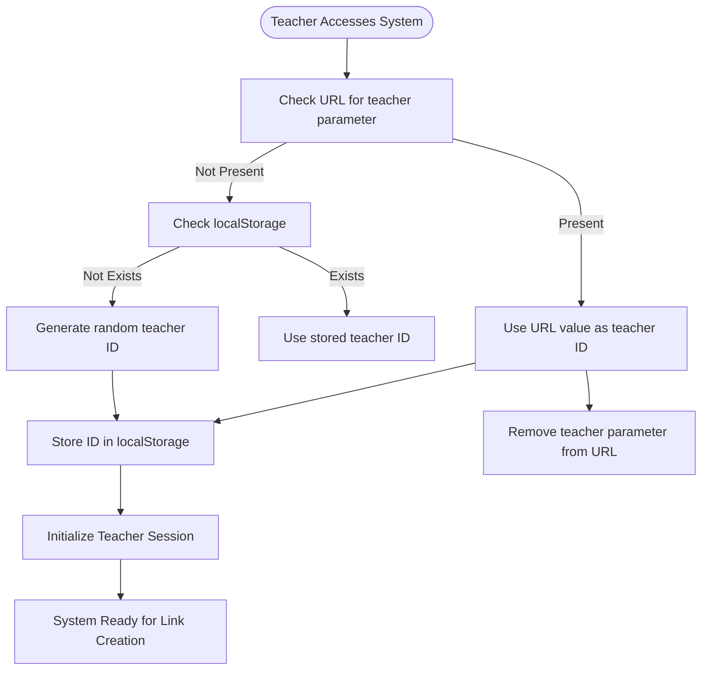
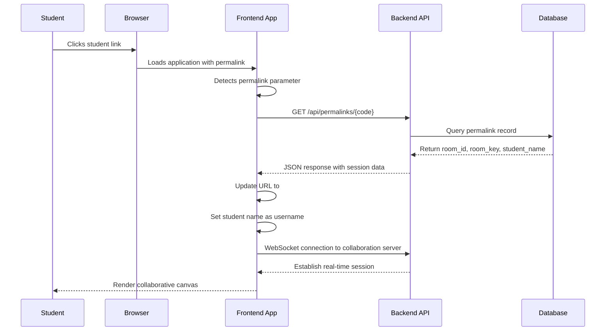
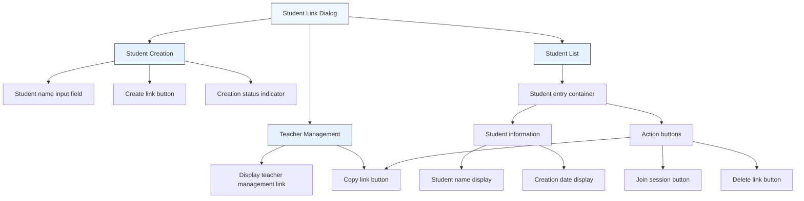

# Teacher-Student Linking

<cite>
**Referenced Files in This Document**   
- [StudentLinkDialog.tsx](file://excalidraw/excalidraw-app/components/StudentLinkDialog.tsx)
- [routes.ts](file://Backned/src/routes.ts)
- [api-client.ts](file://excalidraw/excalidraw-app/data/api-client.ts)
- [App.tsx](file://excalidraw/excalidraw-app/App.tsx)
- [data/index.ts](file://excalidraw/excalidraw-app/data/index.ts)
</cite>

## Table of Contents
1. [Introduction](#introduction)
2. [Link Generation Process](#link-generation-process)
3. [Data Flow and Token Management](#data-flow-and-token-management)
4. [UI Components and User Interface](#ui-components-and-user-interface)
5. [Backend API Endpoints](#backend-api-endpoints)
6. [Security Considerations](#security-considerations)
7. [Common Issues and Troubleshooting](#common-issues-and-troubleshooting)
8. [Implementation Examples](#implementation-examples)

## Introduction
The teacher-student linking mechanism in the Excalidraw educational collaboration system enables teachers to create persistent, secure connections with their students for collaborative drawing sessions. This system allows teachers to generate unique links for each student, manage these links through a dedicated interface, and maintain control over classroom sessions. The mechanism combines client-side UI components with backend API services to create a seamless educational experience where teachers can monitor and join student sessions while maintaining proper role-based permissions and security controls.

**Section sources**
- [StudentLinkDialog.tsx](file://excalidraw/excalidraw-app/components/StudentLinkDialog.tsx#L1-L340)

## Link Generation Process

### Teacher Identification and Token Management
The system establishes teacher identity through a combination of URL parameters and localStorage persistence. When a teacher accesses the application, the system first checks for a "teacher" parameter in the URL query string. If present, this value becomes the teacher ID and is stored in localStorage for future sessions. If no URL parameter exists, the system retrieves the teacher ID from localStorage. If neither source provides a valid ID, a random 10-character alphanumeric identifier is generated using `Math.random().toString(36).slice(2, 12)` and stored for consistent identification across sessions.

Teacher authentication tokens follow a similar pattern, with the system checking for "t" or "token" parameters in the URL before falling back to localStorage. This token enables access to protected endpoints that allow teachers to manage their student links with additional security verification.



**Diagram sources**
- [StudentLinkDialog.tsx](file://excalidraw/excalidraw-app/components/StudentLinkDialog.tsx#L31-L73)
- [StudentLinkDialog.tsx](file://excalidraw/excalidraw-app/components/StudentLinkDialog.tsx#L70-L113)

### Student Link Creation Workflow
When creating a new student link, the system follows a comprehensive workflow to ensure uniqueness and proper session association. The process begins with the teacher entering a student name in the UI interface. The system first validates that no existing link already exists for a student with the same name (case-insensitive comparison) to prevent duplication.

Upon validation, the system generates a unique collaboration session by creating both a room ID and encryption key through the `generateCollaborationLinkData()` function. This function leverages cryptographic random number generation to create a secure 10-byte room ID and a corresponding encryption key for the collaborative session.

The system then creates a server-side permalink by calling the `createPermalink` API endpoint with the following payload:
- `room_id`: The generated collaboration room identifier
- `room_key`: The encryption key for the session
- `student_name`: The provided student identifier
- `teacher_id`: The authenticated teacher's identifier
- `teacher_token`: Optional authentication token for protected access

The backend processes this request and returns a short, randomly generated permalink code (8 characters from base-36 encoding) that serves as a stable, shareable identifier for the student session.

**Section sources**
- [StudentLinkDialog.tsx](file://excalidraw/excalidraw-app/components/StudentLinkDialog.tsx#L145-L186)
- [api-client.ts](file://excalidraw/excalidraw-app/data/api-client.ts#L70-L157)

## Data Flow and Token Management

### Permalink Resolution and Session Joining
The data flow from link creation to active session involves multiple components working in concert. When a student accesses their unique link, the application processes the permalink parameter through the routing system in `App.tsx`. The `initializeScene` function detects the presence of a "permalink" parameter in the URL query string and initiates the resolution process.

The system calls the `resolvePermalink` method on the collaboration API, which makes a GET request to the `/api/permalinks/:permalink` endpoint. This request retrieves the associated room ID, room key, and optionally the student name from the database. Upon successful resolution, the application automatically updates the URL to replace the permalink parameter with a direct collaboration hash (`#room=roomId,roomKey`) while removing the permalink parameter from the query string to maintain security.

For teachers joining student sessions, the `joinStudent` function in `StudentLinkDialog.tsx` initiates collaboration by calling `collabAPI.startCollaboration()` with the resolved room ID and key. This establishes a WebSocket connection to the collaboration server, enabling real-time synchronization between the teacher and student sessions.



**Diagram sources**
- [App.tsx](file://excalidraw/excalidraw-app/App.tsx#L234-L258)
- [StudentLinkDialog.tsx](file://excalidraw/excalidraw-app/components/StudentLinkDialog.tsx#L181-L226)
- [api-client.ts](file://excalidraw/excalidraw-app/data/api-client.ts#L70-L157)

### Token Generation and Validation
The system employs multiple token types for different purposes within the teacher-student linking mechanism. Permalinks are generated using the `generatePermalink()` function in the backend, which creates an 8-character random string using `Math.random().toString(36).slice(2, 10)`. These permalinks serve as stable, shareable identifiers that map to specific collaboration sessions.

Room keys for end-to-end encryption are generated using the `generateEncryptionKey()` function, which leverages the Web Crypto API to create cryptographically secure keys. Room IDs are generated as 10-byte random values converted to hexadecimal strings, providing a large enough space to prevent collisions.

Token validation occurs at multiple levels. The backend verifies teacher tokens by comparing the provided token with the stored token for the specified teacher ID in the database. When resolving permalinks, the system checks that the permalink is active (is_active = 1) before returning session data. Upon successful resolution, the system updates the last_accessed timestamp to track link usage.

The system implements several safeguards to prevent conflicts and ensure data integrity. When creating a new permalink, the backend first checks for existing mappings by teacher ID and student name, returning the existing permalink if found. It also checks for existing room mappings to maintain link stability across sessions. A unique constraint on the (teacher_id, student_name) combination prevents duplicate student links within a teacher's roster.

**Section sources**
- [routes.ts](file://Backned/src/routes.ts#L126-L187)
- [data/index.ts](file://excalidraw/excalidraw-app/data/index.ts#L111-L130)

## UI Components and User Interface

### Student Link Dialog Interface
The primary interface for teacher-student linking is the `StudentLinkDialog` component, which provides a comprehensive management interface for creating and managing student connections. The dialog features several key sections:

The teacher management section displays the teacher's unique management link in the format `?teacher={teacherId}`, which can be copied to maintain access to their student roster across devices and sessions. This section emphasizes the teacher's administrative role in the system.

The student creation section allows teachers to input student names and generate persistent links. This form includes validation to prevent duplicate student names and provides immediate feedback when conflicts occur. The interface uses a TextField component for name input and a FilledButton to initiate link creation, with visual feedback during the creation process.

The student list section displays all existing student links with key information including student name, creation date, and action controls. Each student entry provides three primary actions:
- **Join**: Connects the teacher to the student's collaboration session
- **Copy**: Copies the student's unique access link to the clipboard
- **Delete**: Removes the student link from the teacher's roster



**Diagram sources**
- [StudentLinkDialog.tsx](file://excalidraw/excalidraw-app/components/StudentLinkDialog.tsx#L222-L326)
- [StudentLinkDialog.scss](file://excalidraw/excalidraw-app/components/StudentLinkDialog.scss#L1-L88)

### Role-Based Permission Enforcement
The system enforces role-based permissions through a combination of frontend UI controls and backend API protection. Teachers have elevated privileges that allow them to create, manage, and delete student links, while students have limited access focused on their individual collaboration sessions.

The backend implements protected endpoints that require teacher authentication tokens for certain operations. The `/api/teachers/:teacherId/permalinks` endpoints require a valid token parameter to list or delete permalinks, providing an additional security layer beyond the teacher ID. The `assertTeacherToken` function verifies that the provided token matches the stored token for the specified teacher ID in the database.

In the frontend interface, permission enforcement is reflected in the available actions. Teachers can create new links, join any student session, and delete links, while students only have access to their specific collaboration session through their unique link. The system prevents students from accessing the management interface or viewing other students' links.

When a teacher deletes a student link, the system sends a DELETE request to the appropriate endpoint, either using the token-protected route if a teacher token is available or the standard route with teacher ID verification. This ensures that only authorized teachers can remove links from their roster.

**Section sources**
- [StudentLinkDialog.tsx](file://excalidraw/excalidraw-app/components/StudentLinkDialog.tsx#L181-L226)
- [routes.ts](file://Backned/src/routes.ts#L202-L260)

## Backend API Endpoints

### Permalink Management Endpoints
The backend provides a comprehensive set of REST endpoints for managing permalinks in the teacher-student linking system. These endpoints follow RESTful conventions and use JSON for request and response payloads.

The primary endpoints include:

**POST /api/permalinks** - Creates a new permalink mapping
- Request body: JSON with room_id, room_key, student_name, and teacher_id
- Response: JSON with permalink code
- Logic: Checks for existing mappings by teacher+student or room+key before creating a new record
- Security: Validates input types and handles unique constraint violations gracefully

**GET /api/permalinks/:permalink** - Resolves a permalink to session data
- Response: JSON with roomId, roomKey, and optional studentName
- Security: Verifies the permalink is active (is_active = 1)
- Analytics: Updates last_accessed timestamp on successful resolution

**GET /api/permalinks** - Lists permalinks for a teacher
- Query parameter: teacher_id
- Response: JSON array of permalink records
- Security: Requires teacher_id parameter and returns only active links

**DELETE /api/permalinks/:permalink** - Deactivates a permalink
- Query parameter: teacher_id
- Security: Validates teacher_id and updates is_active flag to 0

The system also provides teacher-protected variants of the list and delete endpoints at `/api/teachers/:teacherId/permalinks` that require an additional token parameter for enhanced security. These endpoints follow the same patterns but include token verification through the `assertTeacherToken` function.

```mermaid
classDiagram
class PermalinkAPI {
+POST /api/permalinks
+GET /api/permalinks/{code}
+GET /api/permalinks
+DELETE /api/permalinks/{code}
+GET /api/teachers/{id}/permalinks
+DELETE /api/teachers/{id}/permalinks/{code}
}
class PermalinkData {
+string permalink
+string room_id
+string room_key
+string student_name
+string teacher_id
+datetime created_at
+datetime last_accessed
+boolean is_active
}
class PermalinkRequest {
+string room_id
+string room_key
+string student_name
+string teacher_id
+string teacher_token
}
class PermalinkResponse {
+string permalink
}
PermalinkAPI --> PermalinkData : "manages"
PermalinkAPI --> PermalinkRequest : "accepts"
PermalinkAPI --> PermalinkResponse : "returns"
```

**Diagram sources**
- [routes.ts](file://Backned/src/routes.ts#L126-L260)
- [api-client.ts](file://excalidraw/excalidraw-app/data/api-client.ts#L70-L157)

## Security Considerations

### Link Randomness and Brute-Force Protection
The system employs several security measures to protect against unauthorized access and brute-force attacks. Permalink codes are generated as 8-character random strings using base-36 encoding (0-9, a-z), providing approximately 2.8 trillion possible combinations (36^8). This large keyspace makes brute-force guessing impractical, as an attacker would need to make trillions of requests to have a reasonable chance of success.

The backend does not implement explicit rate limiting or brute-force protection mechanisms in the provided code, relying instead on the inherent entropy of the permalink generation. However, the system does include some protective measures:
- Permalinks are deactivated (is_active = 0) rather than deleted, preserving audit trails while preventing reuse
- Teacher tokens provide an additional authentication factor for sensitive operations
- The system validates all input parameters to prevent injection attacks

Session isolation is maintained through the use of unique room IDs and encryption keys for each collaboration session. Even if an attacker were to discover a valid permalink, they would only gain access to a single student's session without the ability to traverse to other sessions or access teacher management functions.

The system also employs client-side security measures by storing sensitive information in appropriate locations. Teacher IDs and tokens are stored in localStorage for persistence, while temporary session data remains in memory. The application removes teacher parameters from the URL after processing to prevent them from being logged in server access logs or shared inadvertently.

**Section sources**
- [routes.ts](file://Backned/src/routes.ts#L126-L187)
- [StudentLinkDialog.tsx](file://excalidraw/excalidraw-app/components/StudentLinkDialog.tsx#L31-L73)

## Common Issues and Troubleshooting

### Handling Expired and Invalid Links
The system addresses several common issues related to link management and access. When a teacher attempts to create a link for a student with a name that already exists in their roster, the system displays an alert message indicating that the link already exists and advising the teacher to use the existing link or delete it before creating a new one.

If a permalink cannot be resolved (returns 404), the frontend handles this gracefully by catching the error and displaying an appropriate error message to the user. The `resolvePermalink` function in the API client includes specific error handling for "not_found" errors, returning null instead of throwing an exception, which allows the calling code to handle the situation appropriately.

For unauthorized access attempts, the backend returns 403 Forbidden responses when teacher tokens are missing or invalid. The frontend does not appear to have specific error handling for these cases, but the API client will throw an error that can be caught by the calling code.

Classroom size limitations are not explicitly enforced in the current implementation. Teachers can create links for an unlimited number of students, with storage limited only by the database capacity and localStorage size constraints. The system does not implement any quotas or limits on the number of active student links per teacher.

Network connectivity issues are handled through standard fetch API error handling, with the API client propagating network errors to the calling code. The system does not appear to have specific retry logic or offline capabilities for link management operations.

**Section sources**
- [StudentLinkDialog.tsx](file://excalidraw/excalidraw-app/components/StudentLinkDialog.tsx#L145-L186)
- [api-client.ts](file://excalidraw/excalidraw-app/data/api-client.ts#L70-L157)

## Implementation Examples

### Practical Usage Patterns
The teacher-student linking mechanism supports several practical usage patterns in educational settings:

**Initial Setup**: A teacher accesses the application and either uses an existing teacher ID or generates a new one. They open the Student Link Dialog and begin creating links for each student in their class, entering student names and generating persistent links.

**Daily Use**: Students bookmark their unique links and use them to access their collaborative sessions each day. The teacher can join any student's session by clicking the "Join" button in their management interface, allowing for real-time guidance and feedback.

**Session Management**: Teachers can revoke access by deleting student links, which deactivates the permalink on the server. They can also copy student links to share via email or learning management systems.

**Cross-Device Access**: Teachers can access their student roster from any device by using their teacher management link, which restores their identity and links through localStorage synchronization.

The system's design prioritizes simplicity and reliability, using localStorage for client-side persistence and a straightforward REST API for server-side management. The combination of short, memorable permalinks and cryptographically secure session keys provides a balance between usability and security appropriate for educational environments.

**Section sources**
- [StudentLinkDialog.tsx](file://excalidraw/excalidraw-app/components/StudentLinkDialog.tsx#L1-L340)
- [routes.ts](file://Backned/src/routes.ts#L126-L260)