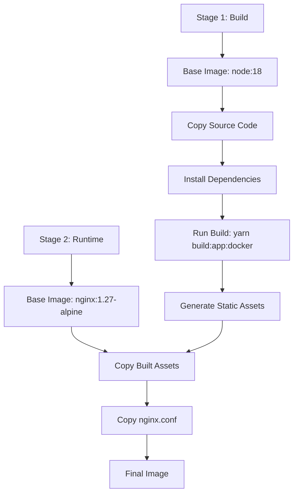
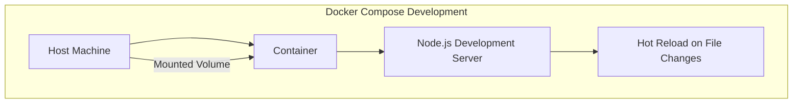
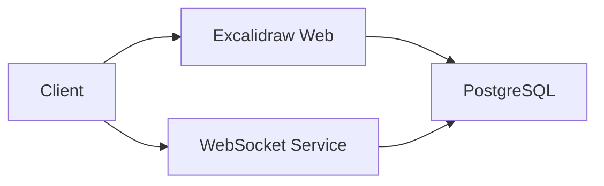

# Configuration & Deployment

<cite>
**Referenced Files in This Document**   
- [Dockerfile](file://excalidraw/Dockerfile)
- [nginx.conf](file://excalidraw/nginx.conf)
- [RAILWAY_DEPLOYMENT.md](file://excalidraw/RAILWAY_DEPLOYMENT.md)
- [railway.toml](file://excalidraw/railway.toml)
- [docker-compose.yml](file://excalidraw/docker-compose.yml)
- [vercel.json](file://excalidraw/vercel.json)
</cite>

## Table of Contents
1. [Environment Variables](#environment-variables)
2. [Docker Containerization Strategy](#docker-containerization-strategy)
3. [nginx Reverse Proxy Configuration](#nginx-reverse-proxy-configuration)
4. [Deployment to Railway](#deployment-to-railway)
5. [Deployment to Vercel](#deployment-to-vercel)
6. [Production Optimization Techniques](#production-optimization-techniques)
7. [Scaling Recommendations](#scaling-recommendations)
8. [Monitoring Setup](#monitoring-setup)
9. [Troubleshooting Guide](#troubleshooting-guide)

## Environment Variables

The Excalidraw application utilizes several environment variables to control behavior across different deployment environments. These variables are primarily consumed during the build process via Vite's environment injection system.

**Core Application Variables**
- `NODE_ENV`: Specifies the Node.js environment mode. Default: `production`. Used during Docker builds and service execution.
- `VITE_APP_PERSISTENT_ROOMS`: Enables PostgreSQL-backed persistent room storage. Default: `true` in production.
- `VITE_APP_EDUCATIONAL_MODE`: Activates educational features and student room management. Default: `true` in production.
- `VITE_APP_DEBUG`: Enables debug logging and development tools. Default: `false` in production.

**Database & Service Integration**
- `DATABASE_URL`: PostgreSQL connection string, auto-injected by Railway from the Postgres service.
- `VITE_APP_DATABASE_URL`: Client-side accessible database URL, typically mirrors `DATABASE_URL`.
- `RAILWAY_WEBSOCKET_URL`: WebSocket endpoint for real-time collaboration, auto-resolved to the public domain.
- `CORS_ORIGIN`: Origin allowed for cross-origin requests in the WebSocket service. Default: `*`.

**Build-Time Configuration**
- `BUILDPLATFORM`: Specifies the build platform architecture for multi-arch Docker builds.
- `TARGETPLATFORM`: Target platform for the final image, used in multi-stage Docker builds.
- `TARGETARCH`: Target architecture (e.g., amd64, arm64), passed to npm/yarn during dependency resolution.

**Section sources**
- [railway.toml](file://excalidraw/railway.toml#L1-L32)
- [RAILWAY_DEPLOYMENT.md](file://excalidraw/RAILWAY_DEPLOYMENT.md#L0-L143)

## Docker Containerization Strategy

Excalidraw employs a multi-stage Docker build process to optimize image size and performance. The strategy separates build dependencies from the runtime environment, resulting in a minimal production image.

### Multi-Stage Build Process



**Diagram sources**
- [Dockerfile](file://excalidraw/Dockerfile#L1-L22)

The first stage uses a full Node.js environment to install dependencies and build the React application. The second stage uses an Alpine-based nginx image to serve static assets, reducing the final image size and attack surface.

### Build Arguments and Platform Targeting

The Docker build supports cross-platform compilation through build arguments:
- `${BUILDPLATFORM}`: Platform where the build runs
- `${TARGETPLATFORM}`: Target platform for the output image
- `${TARGETARCH}`: Target CPU architecture

This enables building images for multiple architectures (amd64, arm64, arm/v7) from a single pipeline, as seen in the GitHub Actions workflow.

### Development Containerization

For local development, `docker-compose.yml` provides a containerized environment with hot-reloading capabilities. It mounts the source directory and uses volume delegation to synchronize changes without rebuilding.



**Diagram sources**
- [docker-compose.yml](file://excalidraw/docker-compose.yml#L1-L24)

**Section sources**
- [Dockerfile](file://excalidraw/Dockerfile#L1-L22)
- [docker-compose.yml](file://excalidraw/docker-compose.yml#L1-L24)

## nginx Reverse Proxy Configuration

The nginx configuration serves as a reverse proxy and static asset server for the Excalidraw application, optimized for performance and security.

### Core Configuration

```mermaid
graph TD
A[Client Request] --> B[nginx Entry Point]
B --> C{Request Type?}
C --> |Static Asset| D[Cache Headers: 1y + immutable]
C --> |HTML/SPA Route| E[Try Files: $uri → $uri/ → /index.html]
C --> |Health Check| F[Return 200 "healthy"]
D --> G[Response]
E --> G
F --> G
```

**Diagram sources**
- [nginx.conf](file://excalidraw/nginx.conf#L1-L35)

### Static Asset Caching

Static assets (JS, CSS, images, fonts) are cached aggressively with a one-year expiration and immutable directive:

```
location ~* \.(js|css|png|jpg|jpeg|gif|ico|svg|woff|woff2|ttf|eot)$ {
    expires 1y;
    add_header Cache-Control "public, immutable";
}
```

This ensures optimal CDN and browser caching behavior.

### Security Headers

nginx enforces several security headers:
- `X-Frame-Options: SAMEORIGIN` - Prevents clickjacking
- `X-Content-Type-Options: nosniff` - Blocks MIME type sniffing
- `X-XSS-Protection: 1; mode=block` - Enables XSS filtering

### Gzip Compression

Gzip is enabled for text-based content types:
- Text: plain, css, xml, javascript
- Applications: javascript, xml+rss, json
- Minimum length: 1024 bytes

### Health Check Endpoint

A dedicated `/health` endpoint returns a plain text "healthy" response with 200 status, used for container health checks.

**Section sources**
- [nginx.conf](file://excalidraw/nginx.conf#L1-L35)

## Deployment to Railway

Railway provides a seamless deployment experience for Excalidraw through its Dockerfile-based deployment model and integrated services.

### Deployment Configuration

The `railway.toml` file defines the deployment configuration:

```toml
[build]
builder = "dockerfile"
dockerfilePath = "Dockerfile"
buildCommand = "yarn build:app:docker"

[deploy]
startCommand = "nginx -g 'daemon off;'"
```

This configuration uses the standard Dockerfile for building and starts nginx in the foreground.

### Service Architecture

Railway deploys multiple services:
- **Web Application**: Serves the Excalidraw frontend
- **PostgreSQL**: Persistent storage for scenes and permalinks
- **WebSocket Service**: Real-time collaboration on port 3002



**Diagram sources**
- [railway.toml](file://excalidraw/railway.toml#L1-L32)

### Environment Integration

Railway automatically injects PostgreSQL connection variables (`DATABASE_URL`, `PGHOST`, etc.) and allows custom variables like `VITE_APP_PERSISTENT_ROOMS` to be set per environment.

### Database Initialization

The `init-db.sql` script must be manually executed after deployment to create the required tables:
- `scenes`: Encrypted scene data with versioning
- `permalinks`: Student room links with metadata

**Section sources**
- [railway.toml](file://excalidraw/railway.toml#L1-L32)
- [RAILWAY_DEPLOYMENT.md](file://excalidraw/RAILWAY_DEPLOYMENT.md#L0-L143)

## Deployment to Vercel

Excalidraw supports deployment to Vercel through the `vercel.json` configuration file, which defines build and routing behavior.

### Build Configuration

The Vercel configuration specifies:
- Build command: `yarn build:app`
- Output directory: `excalidraw-app/build`
- Framework detection: Disabled to allow custom configuration

### Routing and Rewrites

Vercel handles client-side routing through rewrites, directing all non-file requests to `index.html` for SPA routing, similar to the nginx configuration.

### Environment Variables

Vercel environment variables mirror those used in Railway:
- `VITE_APP_PERSISTENT_ROOMS`
- `VITE_APP_EDUCATIONAL_MODE`
- `VITE_APP_DEBUG`

These can be set in the Vercel dashboard per project and environment.

### Static Asset Optimization

Vercel automatically optimizes and serves static assets through its global CDN, providing built-in compression, caching, and edge delivery.

**Section sources**
- [vercel.json](file://excalidraw/vercel.json#L1-L10)

## Production Optimization Techniques

Excalidraw implements several optimization techniques for production performance.

### Build Optimization

- **Multi-stage Docker builds**: Separate build and runtime environments
- **Alpine-based runtime**: Minimal nginx image reduces attack surface
- **Architecture-specific builds**: Optimized binaries for target platforms

### Asset Optimization

- **Long-term caching**: Immutable static assets with 1-year TTL
- **Gzip compression**: Reduced payload sizes for text content
- **CDN-ready structure**: Flat asset paths suitable for edge delivery

### Database Optimization

- **Connection pooling**: Efficient database connection reuse
- **Encrypted storage**: Client-side encryption before database write
- **Automatic cleanup**: Timestamp-based data lifecycle management

### Cache Optimization

- **Docker layer caching**: Reuse of dependency installation layers
- **Yarn cache**: Persistent package cache for faster builds
- **Buildkit cache mounts**: `--mount=type=cache,id=<cache-id>` for node_modules

**Section sources**
- [Dockerfile](file://excalidraw/Dockerfile#L1-L22)
- [nginx.conf](file://excalidraw/nginx.conf#L1-L35)
- [RAILWAY_DEPLOYMENT.md](file://excalidraw/RAILWAY_DEPLOYMENT.md#L0-L143)

## Scaling Recommendations

### Horizontal Scaling

The Excalidraw frontend is stateless and can be scaled horizontally across multiple instances. The nginx configuration is designed to be stateless and CDN-friendly.

### Database Scaling

PostgreSQL can be scaled vertically (larger instance) or horizontally (read replicas) based on load. Connection pooling should be configured to match the number of application instances.

### WebSocket Scaling

The WebSocket service (`excalidraw-room`) should be scaled independently based on real-time collaboration demand. Each instance can handle multiple concurrent rooms.

### Caching Strategy

- **Client-side**: Leverage browser caching with long TTLs
- **Edge**: Use CDN caching for static assets
- **Database**: Implement query caching for frequent read operations

### Load Testing

Recommend using tools like k6 or Artillery to test:
- Concurrent room creation
- Real-time collaboration under load
- Database write/read performance

## Monitoring Setup

### Built-in Health Checks

The `/health` endpoint provides a simple health check mechanism:
- Returns HTTP 200 with "healthy" text
- No access logging to reduce noise
- Used by Docker HEALTHCHECK and orchestration platforms

### Platform Monitoring

- **Railway**: Provides built-in metrics for CPU, memory, and database performance
- **Vercel**: Offers deployment metrics and edge network performance
- **Docker**: Container resource usage via `docker stats`

### Log Management

Logs are available through platform dashboards:
- Application logs: Standard output from nginx and Node.js processes
- Database logs: PostgreSQL query and connection logs
- Error tracking: Client-side errors can be monitored via Sentry (configured in workflows)

### Performance Monitoring

- **Frontend**: Lighthouse audits for performance, accessibility
- **Network**: CDN hit rates, asset load times
- **Database**: Query execution times, connection pool usage

**Section sources**
- [nginx.conf](file://excalidraw/nginx.conf#L30-L34)
- [RAILWAY_DEPLOYMENT.md](file://excalidraw/RAILWAY_DEPLOYMENT.md#L0-L143)

## Troubleshooting Guide

### Common Deployment Issues

**Cache Mount Errors**
- **Symptom**: Docker build fails with cache-related errors
- **Solution**: Ensure Dockerfile uses `--mount=type=cache,id=<cache-id>` format
- **Reference**: [RAILWAY_DEPLOYMENT.md](file://excalidraw/RAILWAY_DEPLOYMENT.md#L120-L122)

**Database Connection Problems**
- **Symptom**: Application fails to start or save rooms
- **Solution**: Verify PostgreSQL service is running and environment variables are set
- **Check**: `DATABASE_URL` availability in environment

**Environment Variable Issues**
- **Symptom**: Features not working as expected (e.g., persistent rooms)
- **Solution**: Verify variables like `VITE_APP_PERSISTENT_ROOMS` are set correctly
- **Note**: Vite environment variables must be prefixed with `VITE_`

### Build and Runtime Errors

**Multi-arch Build Failures**
- **Symptom**: Missing module errors for @rollup/rollup-linux-x64-gnu
- **Solution**: Ensure `npm_config_target_arch=${TARGETARCH}` is passed during yarn install

**Health Check Failures**
- **Symptom**: Container restarts continuously
- **Solution**: Verify `/health` endpoint returns 200 and nginx is properly configured

### WebSocket Issues

**Connection Problems**
- **Symptom**: Real-time collaboration not working
- **Solution**: Check WebSocket service is running on port 3002 and CORS settings

**CORS Configuration**
- **Default**: `CORS_ORIGIN=*` allows all origins
- **Production**: Should be restricted to specific domains

**Section sources**
- [RAILWAY_DEPLOYMENT.md](file://excalidraw/RAILWAY_DEPLOYMENT.md#L120-L143)
- [nginx.conf](file://excalidraw/nginx.conf#L30-L34)
- [railway.toml](file://excalidraw/railway.toml#L1-L32)