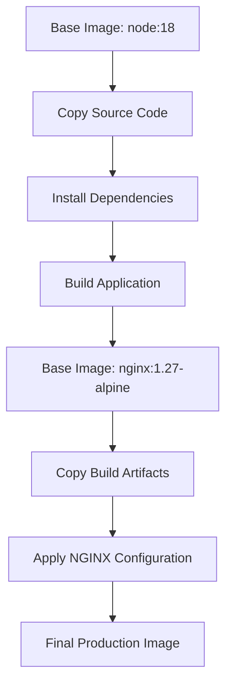
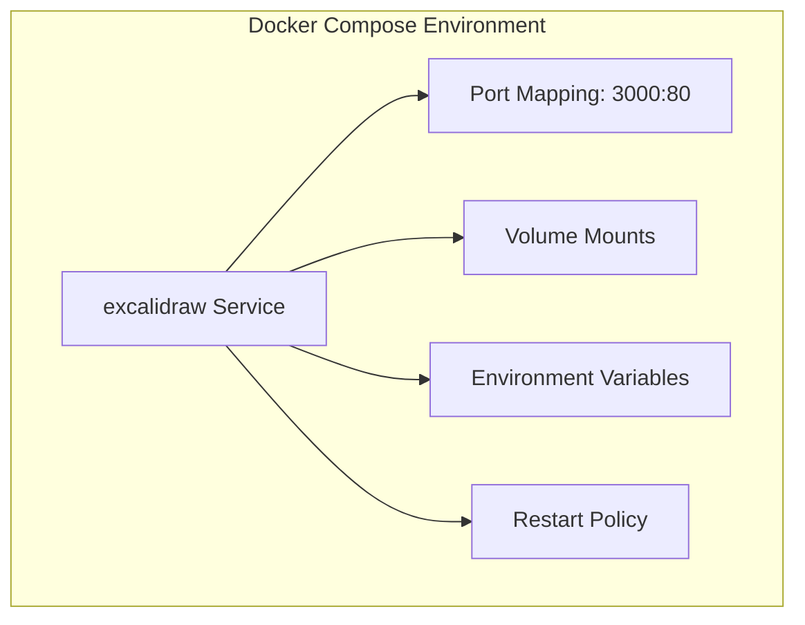
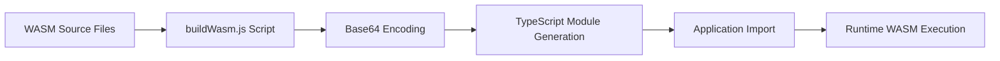
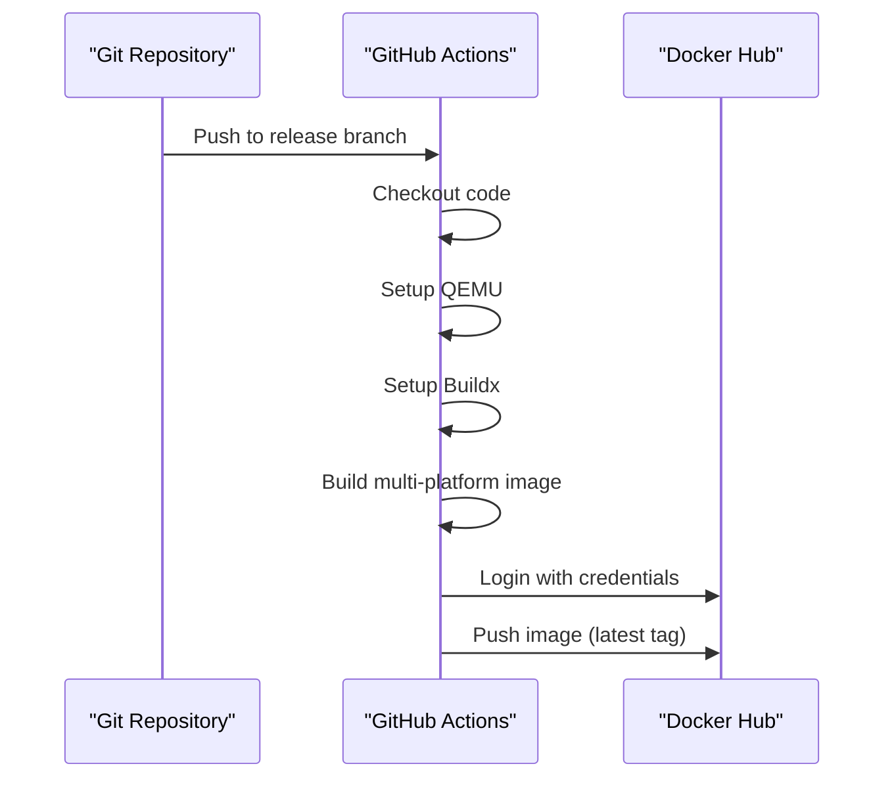

# Docker Deployment

<cite>
**Referenced Files in This Document**   
- [Dockerfile](file://excalidraw/Dockerfile)
- [docker-compose.yml](file://excalidraw/docker-compose.yml)
- [nginx.conf](file://excalidraw/nginx.conf)
- [buildWasm.js](file://excalidraw/scripts/buildWasm.js)
- [build-docker.yml](file://excalidraw/.github/workflows/build-docker.yml)
- [publish-docker.yml](file://excalidraw/.github/workflows/publish-docker.yml)
</cite>

## Table of Contents
1. [Introduction](#introduction)
2. [Multi-Stage Docker Build Process](#multi-stage-docker-build-process)
3. [Docker Compose Configuration](#docker-compose-configuration)
4. [WASM Module Integration](#wasm-module-integration)
5. [CI/CD Pipeline for Docker Images](#cicd-pipeline-for-docker-images)
6. [Performance Optimization](#performance-optimization)
7. [Security Best Practices](#security-best-practices)
8. [Debugging and Troubleshooting](#debugging-and-troubleshooting)
9. [Customization for Different Environments](#customization-for-different-environments)
10. [Conclusion](#conclusion)

## Introduction
This document provides comprehensive guidance on deploying the Excalidraw application using Docker. It covers the complete containerization strategy including multi-stage builds, service orchestration, WASM integration, and production-ready configurations. The documentation details how to build, deploy, and maintain the Excalidraw application in containerized environments with optimal performance and security.

## Multi-Stage Docker Build Process

The Excalidraw Docker build process utilizes a multi-stage approach to create efficient production images. The build process is defined in the Dockerfile and consists of two main stages: build and runtime.

The first stage uses a Node.js 18 base image to compile the frontend application. It copies the entire repository, installs dependencies with yarn, and executes the build command `yarn build:app:docker`. This stage handles all frontend compilation tasks including TypeScript transpilation, asset optimization, and static site generation.

The second stage uses an NGINX Alpine base image as a lightweight web server. It copies the compiled build artifacts from the first stage to the NGINX html directory and applies the custom NGINX configuration. This separation ensures that the final image contains only the necessary runtime components, significantly reducing image size and attack surface.

**Diagram sources**
- [Dockerfile](file://excalidraw/Dockerfile#L1-L22)

**Section sources**
- [Dockerfile](file://excalidraw/Dockerfile#L1-L22)

## Docker Compose Configuration

The docker-compose.yml file defines the service orchestration for local development and testing environments. The configuration specifies a single service named "excalidraw" that builds from the current context with development environment settings.

The service exposes port 3000 on the host machine, mapping it to port 80 in the container. It configures environment variables for development mode and implements volume mounting for live reloading. The volume configuration mounts the application source code into the container while excluding node_modules to prevent conflicts between host and container dependencies.

Health checks are disabled in the development configuration to accommodate the hot-reloading workflow, and the container is configured to restart on failure to maintain service availability during development.

**Diagram sources**
- [docker-compose.yml](file://excalidraw/docker-compose.yml#L1-L25)

**Section sources**
- [docker-compose.yml](file://excalidraw/docker-compose.yml#L1-L25)

## WASM Module Integration

The Excalidraw application integrates WebAssembly (WASM) modules for font processing and text rendering performance. The buildWasm.js script handles the conversion of WASM binaries into JavaScript modules with base64-encoded content.

This process imports WASM files from external dependencies like fonteditor-core and harfbuzzjs, converts them to base64 strings, and generates TypeScript modules that can be imported by the application. The generated code includes a optimized base64 decoding function and preserves license information from the original packages.

The integration approach allows the application to leverage high-performance WASM functionality while maintaining compatibility with the build system and ensuring proper licensing attribution.

**Diagram sources**
- [buildWasm.js](file://excalidraw/scripts/buildWasm.js#L1-L75)

**Section sources**
- [buildWasm.js](file://excalidraw/scripts/buildWasm.js#L1-L75)

## CI/CD Pipeline for Docker Images

The GitHub Actions workflows automate the Docker image building and publishing process. The build-docker.yml workflow triggers on pushes to the release branch and executes a basic Docker build to validate the image creation process.

The publish-docker.yml workflow implements a more comprehensive pipeline that builds and pushes multi-platform Docker images to Docker Hub. It uses Docker Buildx to create images for multiple architectures (AMD64, ARM64, ARM/v7) ensuring broad compatibility across different infrastructure.

The pipeline includes authentication with Docker Hub using repository secrets, QEMU setup for cross-platform builds, and automated pushing of the built images with the "latest" tag. This enables continuous delivery of updated images whenever changes are merged to the release branch.

**Diagram sources**
- [build-docker.yml](file://excalidraw/.github/workflows/build-docker.yml#L1-L13)
- [publish-docker.yml](file://excalidraw/.github/workflows/publish-docker.yml#L1-L30)

**Section sources**
- [build-docker.yml](file://excalidraw/.github/workflows/build-docker.yml#L1-L13)
- [publish-docker.yml](file://excalidraw/.github/workflows/publish-docker.yml#L1-L30)

## Performance Optimization

The Docker deployment includes several performance optimization techniques. The NGINX configuration implements aggressive caching for static assets with a one-year expiration and immutable cache control headers. This significantly reduces bandwidth usage and improves load times for returning users.

Gzip compression is enabled for text-based content types including HTML, CSS, JavaScript, and JSON, reducing payload sizes over the network. The NGINX server is configured to serve precompressed assets when available and vary the cache based on the Accept-Encoding header.

The multi-stage build process optimizes image size by separating build and runtime environments, resulting in a minimal final image that contains only the necessary production files. This reduces container startup time and memory footprint.

**Section sources**
- [nginx.conf](file://excalidraw/nginx.conf#L1-L34)
- [Dockerfile](file://excalidraw/Dockerfile#L1-L22)

## Security Best Practices

The deployment implements multiple security best practices through both Docker configuration and NGINX settings. The NGINX configuration includes essential security headers: X-Frame-Options to prevent clickjacking, X-Content-Type-Options to block MIME type sniffing, and X-XSS-Protection to enable browser XSS filtering.

The production Docker image is based on Alpine Linux, providing a minimal attack surface. The multi-stage build process ensures that build tools and development dependencies are not included in the final image, reducing potential vulnerabilities.

The health check endpoint is configured without access logging to prevent log pollution and includes a plain text response type for reliable monitoring. The container runs with default security settings and can be further hardened with additional Docker security options in production environments.

**Section sources**
- [nginx.conf](file://excalidraw/nginx.conf#L1-L34)
- [Dockerfile](file://excalidraw/Dockerfile#L1-L22)

## Debugging and Troubleshooting

Common issues in Docker deployments include port conflicts, build cache problems, and health check failures. For port conflicts, verify that port 3000 is available on the host system or modify the docker-compose.yml to use an alternative port mapping.

Build cache issues can be resolved by using the --no-cache flag with docker build or by cleaning the Docker build cache with docker builder prune. When troubleshooting build failures, examine the specific stage where the error occurs, as the multi-stage process may require different dependencies in each stage.

Health check failures should be investigated by accessing the /health endpoint directly and verifying NGINX configuration. The health check uses a simple wget command to test endpoint availability, and failures may indicate issues with the NGINX server or file permissions.

For development debugging, the volume-mounted configuration allows real-time code changes to be reflected in the container, facilitating rapid iteration and issue resolution.

**Section sources**
- [docker-compose.yml](file://excalidraw/docker-compose.yml#L1-L25)
- [nginx.conf](file://excalidraw/nginx.conf#L1-L34)
- [Dockerfile](file://excalidraw/Dockerfile#L1-L22)

## Customization for Different Environments

The Docker configuration can be customized for different deployment environments through various mechanisms. Environment variables can be modified in the docker-compose.yml file to switch between development, staging, and production modes.

For production deployments, the health check should be enabled by removing the "disable: true" directive and ensuring the /health endpoint is accessible. Resource limits and restart policies can be adjusted based on the target environment's requirements.

Custom NGINX configurations can be created by modifying the nginx.conf file to include additional security headers, SSL termination, or reverse proxy settings for integration with existing infrastructure. The Dockerfile can be extended to include additional build arguments or stages for specialized deployment requirements.

**Section sources**
- [docker-compose.yml](file://excalidraw/docker-compose.yml#L1-L25)
- [nginx.conf](file://excalidraw/nginx.conf#L1-L34)
- [Dockerfile](file://excalidraw/Dockerfile#L1-L22)

## Conclusion
The Docker deployment strategy for Excalidraw provides a robust, scalable, and secure method for containerizing the application. The multi-stage build process ensures efficient image creation, while the comprehensive configuration supports both development and production use cases. By following the practices outlined in this documentation, teams can successfully deploy and maintain Excalidraw in containerized environments with optimal performance and reliability.