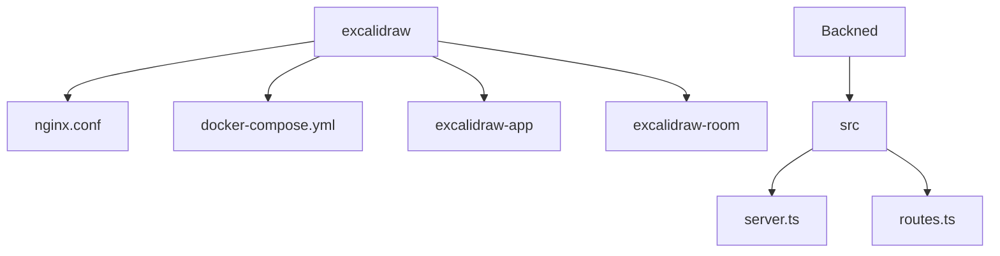
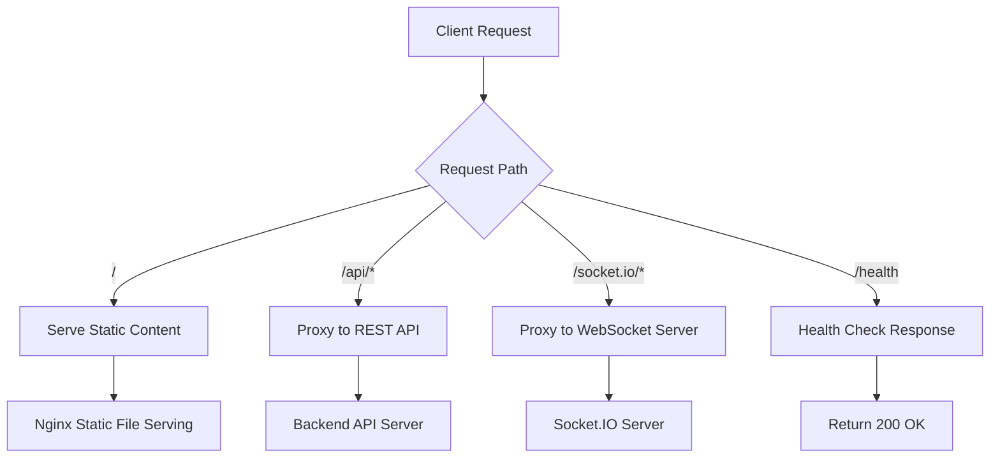
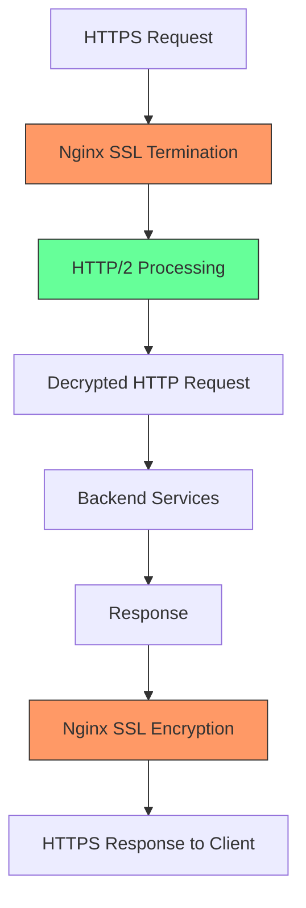
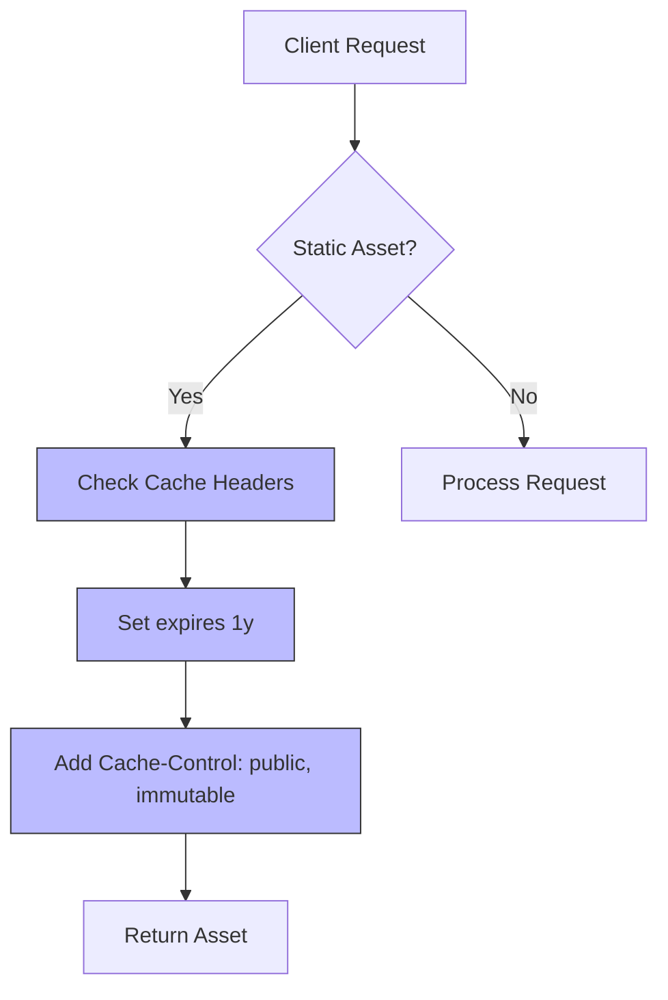
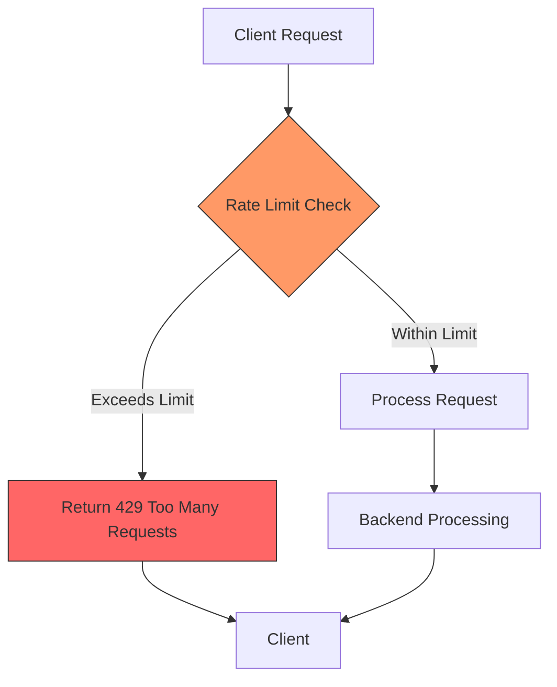
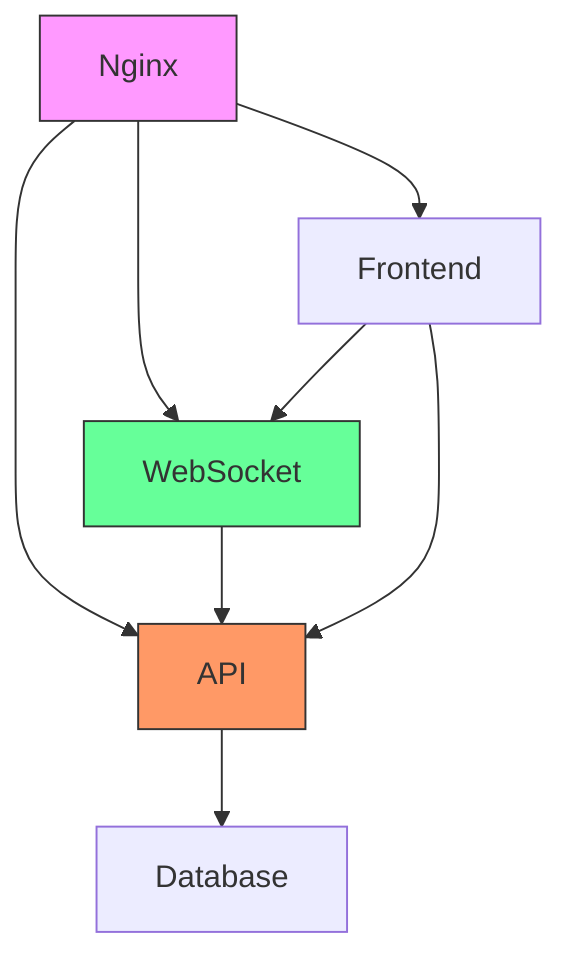

# Nginx Configuration

<cite>
**Referenced Files in This Document**   
- [nginx.conf](file://excalidraw/nginx.conf)
- [docker-compose.yml](file://excalidraw/docker-compose.yml)
- [issue.md](file://issue.md)
- [RAILWAY_DEPLOYMENT.md](file://excalidraw/RAILWAY_DEPLOYMENT.md)
- [excalidraw-room/src/index.ts](file://excalidraw-room/src/index.ts)
- [Backned/src/routes.ts](file://Backned/src/routes.ts)
- [excalidraw-app/data/api-client.ts](file://excalidraw/excalidraw-app/data/api-client.ts)
</cite>

## Table of Contents
1. [Introduction](#introduction)
2. [Project Structure](#project-structure)
3. [Core Components](#core-components)
4. [Architecture Overview](#architecture-overview)
5. [Detailed Component Analysis](#detailed-component-analysis)
6. [Dependency Analysis](#dependency-analysis)
7. [Performance Considerations](#performance-considerations)
8. [Troubleshooting Guide](#troubleshooting-guide)
9. [Conclusion](#conclusion)

## Introduction
This document provides comprehensive configuration guidance for Nginx in the Excalidraw deployment architecture. It covers reverse proxy setup for routing requests between frontend, backend API, and collaboration server components. The documentation details SSL termination, HTTP/2 support, security headers, static asset serving, caching strategies, compression settings, WebSocket proxying, rate limiting, IP filtering, and DDoS protection measures. It also addresses common Nginx issues such as timeout settings, buffer configurations, and error handling.

## Project Structure



**Diagram sources**
- [nginx.conf](file://excalidraw/nginx.conf)
- [docker-compose.yml](file://excalidraw/docker-compose.yml)
- [Backned/src/routes.ts](file://Backned/src/routes.ts)

**Section sources**
- [nginx.conf](file://excalidraw/nginx.conf)
- [docker-compose.yml](file://excalidraw/docker-compose.yml)

## Core Components

The Excalidraw deployment architecture consists of three main components: the frontend application served through Nginx, the REST API backend, and the real-time collaboration server. The current Nginx configuration serves static content but lacks proxy rules for API and WebSocket endpoints, which is critical for production deployment. The architecture requires proper routing for `/api` to the REST backend and `/socket.io` to the Socket.IO server for real-time collaboration features.

**Section sources**
- [nginx.conf](file://excalidraw/nginx.conf)
- [issue.md](file://issue.md)
- [excalidraw-room/src/index.ts](file://excalidraw-room/src/index.ts)

## Architecture Overview

```mermaid
graph LR
Client --> Nginx
Nginx --> Frontend
Nginx --> API["Backend API"]
Nginx --> WebSocket["Collaboration Server"]
subgraph "Frontend"
Frontend[Static Assets]
end
subgraph "Backend Services"
API[REST API Server]
WebSocket[Socket.IO Server]
end
style Nginx fill:#f9f,stroke:#333
style Frontend fill:#bbf,stroke:#333
style API fill:#f96,stroke:#333
style WebSocket fill:#6f9,stroke:#333
```

**Diagram sources**
- [nginx.conf](file://excalidraw/nginx.conf)
- [docker-compose.yml](file://excalidraw/docker-compose.yml)
- [issue.md](file://issue.md)

## Detailed Component Analysis

### Reverse Proxy Configuration

The current Nginx configuration serves static content but requires enhancement for production deployment. The configuration must include proxy rules for API and WebSocket endpoints to enable proper routing between frontend and backend services.

#### Reverse Proxy Setup


**Diagram sources**
- [nginx.conf](file://excalidraw/nginx.conf)
- [issue.md](file://issue.md)
- [excalidraw-app/data/api-client.ts](file://excalidraw/excalidraw-app/data/api-client.ts)

**Section sources**
- [nginx.conf](file://excalidraw/nginx.conf)
- [issue.md](file://issue.md)

### SSL Termination and HTTP/2

For production deployment, SSL termination should be configured at the Nginx level to handle HTTPS requests and forward decrypted traffic to backend services. HTTP/2 should be enabled to improve performance through multiplexing and header compression.

#### SSL and HTTP/2 Configuration


**Diagram sources**
- [nginx.conf](file://excalidraw/nginx.conf)
- [RAILWAY_DEPLOYMENT.md](file://excalidraw/RAILWAY_DEPLOYMENT.md)

### Security Headers Implementation

The current configuration includes basic security headers, but additional headers should be implemented for enhanced security in production environments.

#### Security Headers Flow
```mermaid
sequenceDiagram
participant Client
participant Nginx
participant Backend
Client->>Nginx : HTTP Request
Nginx->>Nginx : Add Security Headers
Nginx->>Backend : Forward Request
Backend->>Nginx : Response
Nginx->>Nginx : Add Security Headers
Nginx->>Client : Response with Headers
Note right of Nginx : X-Frame-Options : SAMEORIGIN<br/>X-Content-Type-Options : nosniff<br/>X-XSS-Protection : 1; mode=block
```

**Diagram sources**
- [nginx.conf](file://excalidraw/nginx.conf)

### Static Asset Serving and Caching

The current configuration implements caching for static assets with long expiration times and immutable cache control, which is optimal for performance.

#### Static Asset Caching Strategy


**Diagram sources**
- [nginx.conf](file://excalidraw/nginx.conf)

### WebSocket Proxying

WebSocket proxying is essential for the real-time collaboration features in Excalidraw. The configuration must include proper upgrade headers for WebSocket connections.

#### WebSocket Proxy Flow
```mermaid
sequenceDiagram
participant Client
participant Nginx
participant SocketIO
Client->>Nginx : WebSocket Upgrade Request
Nginx->>Nginx : Set Upgrade Headers
Nginx->>SocketIO : Proxy WebSocket Connection
SocketIO->>Nginx : WebSocket Connection Established
Nginx->>Client : WebSocket Connection Established
Note right of Nginx : proxy_set_header Upgrade $http_upgrade;<br/>proxy_set_header Connection "upgrade";
```

**Diagram sources**
- [nginx.conf](file://excalidraw/nginx.conf)
- [excalidraw-room/src/index.ts](file://excalidraw-room/src/index.ts)
- [issue.md](file://issue.md)

### Rate Limiting and DDoS Protection

Rate limiting should be implemented to protect against DDoS attacks and ensure fair usage of the service.

#### Rate Limiting Configuration


**Diagram sources**
- [nginx.conf](file://excalidraw/nginx.conf)

## Dependency Analysis



**Diagram sources**
- [nginx.conf](file://excalidraw/nginx.conf)
- [docker-compose.yml](file://excalidraw/docker-compose.yml)
- [issue.md](file://issue.md)

**Section sources**
- [nginx.conf](file://excalidraw/nginx.conf)
- [docker-compose.yml](file://excalidraw/docker-compose.yml)
- [issue.md](file://issue.md)

## Performance Considerations

The current Nginx configuration includes gzip compression for various content types, which reduces bandwidth usage and improves page load times. The static asset caching strategy with one-year expiration and immutable cache control headers ensures optimal performance for frequently accessed resources. For production deployment, additional performance optimizations should include connection pooling, CDN integration, and proper timeout configurations for upstream services.

**Section sources**
- [nginx.conf](file://excalidraw/nginx.conf)
- [RAILWAY_DEPLOYMENT.md](file://excalidraw/RAILWAY_DEPLOYMENT.md)

## Troubleshooting Guide

Common Nginx issues in the Excalidraw deployment include missing proxy rules for API and WebSocket endpoints, improper timeout settings, and buffer configuration issues. The current configuration serves static content only and lacks proxy blocks for `/api` and `/socket.io` endpoints, which prevents proper functionality in production environments. Timeout settings should be configured appropriately for upstream services to handle long-running requests, particularly for collaboration features. Buffer configurations should be optimized to handle large payloads from the drawing application.

**Section sources**
- [nginx.conf](file://excalidraw/nginx.conf)
- [issue.md](file://issue.md)

## Conclusion

The current Nginx configuration provides basic static content serving with security headers and compression, but requires significant enhancements for production deployment. Essential additions include reverse proxy rules for API and WebSocket endpoints, SSL termination, HTTP/2 support, and rate limiting. The configuration should be updated to properly route requests to the backend services, enabling full functionality of the Excalidraw application including real-time collaboration features. Proper timeout and buffer configurations should be implemented to ensure reliable operation under various network conditions.