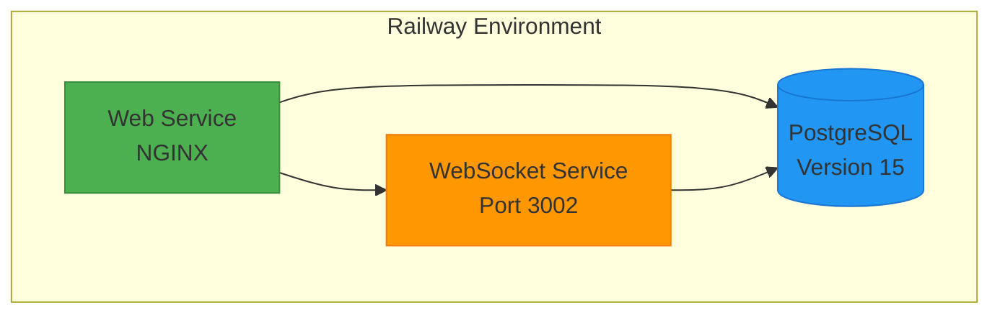
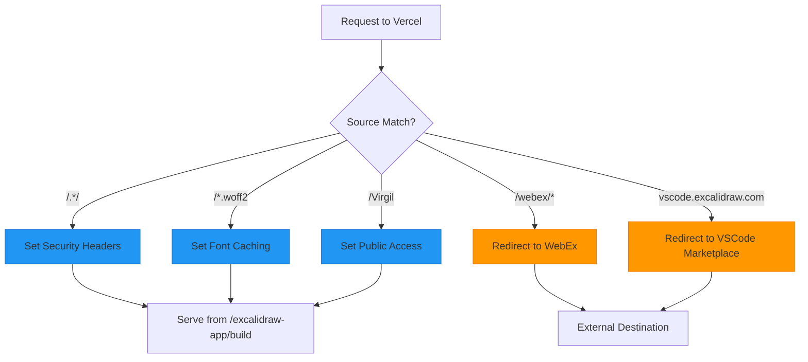
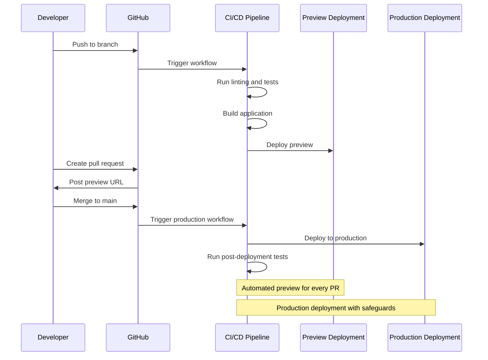
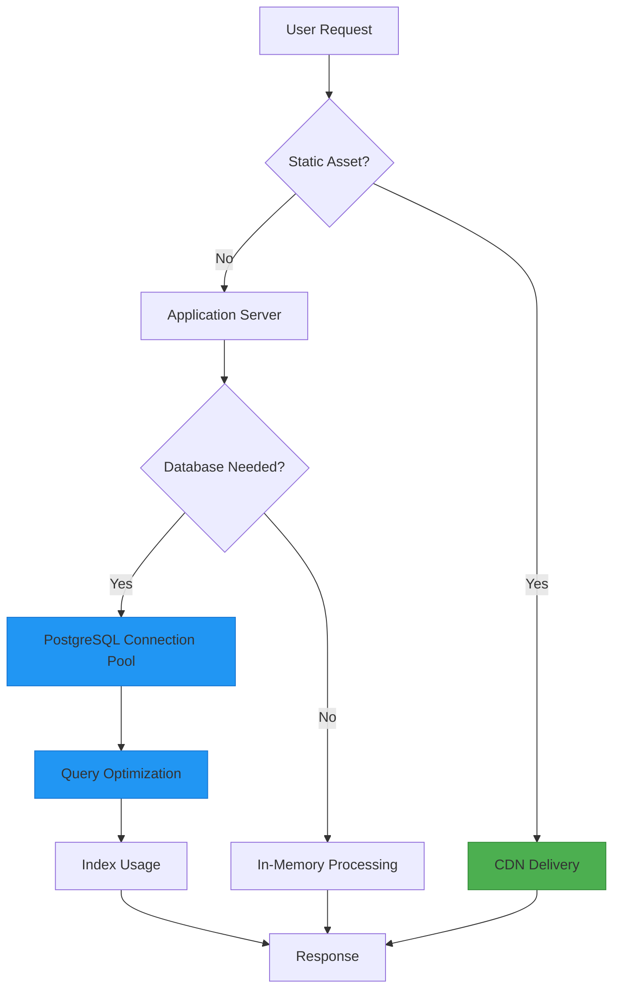

# Platform Deployment

<cite>
**Referenced Files in This Document**   
- [railway.toml](file://excalidraw/railway.toml)
- [vercel.json](file://excalidraw/vercel.json)
- [RAILWAY_DEPLOYMENT.md](file://excalidraw/RAILWAY_DEPLOYMENT.md)
- [Dockerfile](file://excalidraw/Dockerfile)
- [init-db.sql](file://excalidraw/init-db.sql)
- [excalidraw-room/src/index.ts](file://excalidraw-room/src/index.ts)
- [examples/with-nextjs/vercel.json](file://excalidraw/examples/with-nextjs/vercel.json)
- [examples/with-script-in-browser/vercel.json](file://excalidraw/examples/with-script-in-browser/vercel.json)
</cite>

## Table of Contents
1. [Introduction](#introduction)
2. [Railway Deployment](#railway-deployment)
3. [Vercel Deployment](#vercel-deployment)
4. [CI/CD and Preview Deployments](#cicd-and-preview-deployments)
5. [Scaling and Performance](#scaling-and-performance)
6. [Monitoring and Cost Optimization](#monitoring-and-cost-optimization)
7. [Conclusion](#conclusion)

## Introduction
This document provides comprehensive guidance for deploying Excalidraw on multiple cloud platforms, with detailed configuration for Railway and Vercel. The deployment strategies cover service definitions, environment variables, database provisioning, and platform-specific optimizations. The document also addresses CI/CD workflows, scaling configurations, and cost optimization strategies to ensure reliable and efficient production deployments.

## Railway Deployment

Excalidraw can be deployed on Railway with full PostgreSQL support for persistent room storage and educational mode functionality. The deployment leverages Railway's service-based architecture and automatic environment variable injection.



**Diagram sources**
- [railway.toml](file://excalidraw/railway.toml#L1-L32)
- [Dockerfile](file://excalidraw/Dockerfile#L1-L22)

**Section sources**
- [railway.toml](file://excalidraw/railway.toml#L1-L32)
- [RAILWAY_DEPLOYMENT.md](file://excalidraw/RAILWAY_DEPLOYMENT.md#L1-L143)
- [init-db.sql](file://excalidraw/init-db.sql#L1-L65)

### Service Definitions
The `railway.toml` configuration defines three services in the production environment:

1. **Web Service**: Serves the static Excalidraw application through NGINX
2. **PostgreSQL Database**: Stores encrypted scene data and permalinks with automatic cleanup
3. **WebSocket Service**: Handles real-time collaboration on port 3002

The build process uses Docker with a custom build command `yarn build:app:docker` that optimizes the application bundle for production deployment.

### Environment Variables
Railway automatically configures PostgreSQL connection variables and allows custom application settings:

```env
# Core Application Settings
VITE_APP_PERSISTENT_ROOMS=true
VITE_APP_EDUCATIONAL_MODE=true
VITE_APP_DEBUG=false

# WebSocket Configuration
RAILWAY_WEBSOCKET_URL=${{websocket.RAILWAY_PUBLIC_DOMAIN}}

# Database Connection (Auto-configured)
DATABASE_URL=${{Postgres.DATABASE_URL}}
PGHOST, PGPORT, PGDATABASE, PGUSER, PGPASSWORD
```

### Database Provisioning
The deployment includes automatic PostgreSQL provisioning with version 15. The database schema is initialized using the `init-db.sql` script, which creates two primary tables:

- **scenes**: Stores encrypted Excalidraw scene data with versioning and timestamps
- **permalinks**: Manages student room links with access tracking

The schema includes UUID generation, indexes for performance optimization, and triggers to automatically update timestamps.

## Vercel Deployment

Vercel deployment is configured through the `vercel.json` file, which defines routing rules, headers, redirects, and build settings for both the main application and example integrations.



**Diagram sources**
- [vercel.json](file://excalidraw/vercel.json#L1-L70)
- [examples/with-nextjs/vercel.json](file://excalidraw/examples/with-nextjs/vercel.json#L1-L3)
- [examples/with-script-in-browser/vercel.json](file://excalidraw/examples/with-script-in-browser/vercel.json#L1-L5)

**Section sources**
- [vercel.json](file://excalidraw/vercel.json#L1-L70)
- [examples/with-nextjs/vercel.json](file://excalidraw/examples/with-nextjs/vercel.json#L1-L3)
- [examples/with-script-in-browser/vercel.json](file://excalidraw/examples/with-script-in-browser/vercel.json#L1-L5)

### Configuration Overview
The main `vercel.json` configuration includes:

- **Headers**: Security policies and caching rules for fonts and assets
- **Redirects**: Custom routing for WebEx and VSCode integrations
- **Output Directory**: Specifies `/excalidraw-app/build` as the deployment target
- **Install Command**: Custom yarn installation process

### Example Integrations
The examples directory contains specialized Vercel configurations:

1. **with-nextjs**: Minimal configuration with build output directory
2. **with-script-in-browser**: Includes custom install and build commands for package compilation

### Routing and Redirects
The deployment implements sophisticated routing rules:

- All requests receive security headers including CORS, content type options, and referrer policies
- Font files receive long-term caching (1 year) with appropriate CORS settings
- Specific paths redirect to external services:
  - `/webex/*` → WebEx integration
  - `vscode.excalidraw.com` → VSCode Marketplace

## CI/CD and Preview Deployments

The Excalidraw repository includes comprehensive GitHub Actions workflows for automated testing, building, and deployment. These workflows enable robust CI/CD pipelines and preview deployments for pull requests.



**Diagram sources**
- [excalidraw/.github/workflows](file://excalidraw/.github/workflows)
- [excalidraw-room/.github/workflows](file://excalidraw-room/.github/workflows)

**Section sources**
- [excalidraw/.github/workflows](file://excalidraw/.github/workflows)
- [excalidraw-room/.github/workflows](file://excalidraw-room/.github/workflows)

### Workflow Configuration
The `.github/workflows` directory contains multiple YAML files that define the CI/CD processes:

- **Build and Test**: Automated testing, linting, and coverage analysis
- **Docker Management**: Build, publish, and release Docker images
- **Production Deployment**: Automated deployment to production environments
- **Size Monitoring**: Track bundle size changes to prevent bloat

### Build Hooks
The deployment supports build hooks for triggering deployments from external systems. These hooks can be configured in the platform settings and are useful for integrating with third-party services or custom deployment scripts.

### Preview Deployments
Every pull request automatically generates a preview deployment, allowing stakeholders to review changes before merging. The preview environment includes:

- Full application functionality
- Isolated database instances
- Real-time collaboration capabilities
- Performance monitoring

## Scaling and Performance

Both Railway and Vercel deployments are designed for scalability and high performance. The configurations include optimizations for database connections, asset delivery, and real-time collaboration.



**Diagram sources**
- [railway.toml](file://excalidraw/railway.toml#L1-L32)
- [excalidraw-room/src/index.ts](file://excalidraw-room/src/index.ts#L53-L134)
- [Dockerfile](file://excalidraw/Dockerfile#L1-L22)

**Section sources**
- [railway.toml](file://excalidraw/railway.toml#L1-L32)
- [excalidraw-room/src/index.ts](file://excalidraw-room/src/index.ts#L53-L134)
- [Dockerfile](file://excalidraw/Dockerfile#L1-L22)

### Railway Scaling
Railway automatically scales services based on traffic patterns. The configuration includes:

- **Restart Policy**: On failure with maximum 10 retries
- **Connection Pooling**: Efficient database connection management
- **Caching**: Yarn and node modules caching for faster builds
- **Health Checks**: Built-in health check endpoint for service monitoring

### Vercel Performance
Vercel provides global CDN delivery and automatic scaling:

- **Static Assets**: All assets are served through the global edge network
- **Caching**: Font files and static content have long-term caching
- **Compression**: Automatic GZIP and Brotli compression
- **HTTP/2**: Full support for modern HTTP protocols

### Database Optimization
The PostgreSQL database includes several performance optimizations:

- Indexes on frequently queried fields (room_id, permalink)
- UUID primary keys for distributed systems
- Automatic timestamp updates with triggers
- SSL connections in production

## Monitoring and Cost Optimization

Effective monitoring and cost management are critical for production deployments. Both Railway and Vercel provide tools and configurations to optimize resource usage and control costs.

### Railway Monitoring
Railway offers comprehensive monitoring capabilities:

- **Real-time Logs**: Access to application and database logs
- **Performance Metrics**: CPU, memory, and network usage
- **Database Insights**: Query performance and connection statistics
- **Alerting**: Custom alerts for service disruptions

The deployment includes a health check endpoint at `/health` that returns the service status and timestamp.

### Vercel Analytics
Vercel provides detailed analytics for all deployments:

- **Usage Statistics**: Visitor counts and geographic distribution
- **Performance Metrics**: Load times and asset delivery
- **Error Tracking**: Client-side error monitoring
- **Build Insights**: Build duration and resource usage

### Cost Optimization Strategies
To optimize costs across both platforms:

1. **Resource Sizing**: Use appropriate instance sizes for production and preview environments
2. **Caching**: Maximize cache utilization for builds and assets
3. **Database Management**: Implement data retention policies and cleanup routines
4. **Preview Environments**: Automatically destroy preview deployments after merge
5. **Monitoring**: Set up alerts to detect and address performance issues early

The configuration balances performance and cost by using efficient caching strategies, connection pooling, and optimized build processes.

## Conclusion
Deploying Excalidraw on Railway and Vercel requires careful configuration of services, environment variables, and database settings. The Railway deployment excels in database integration and real-time collaboration, while Vercel provides superior static asset delivery and global CDN capabilities. Both platforms support robust CI/CD workflows with automated testing, preview deployments, and production releases. By following the configurations outlined in this document, teams can deploy Excalidraw with high availability, scalability, and cost efficiency. The combination of platform-specific features and shared best practices ensures a reliable and performant deployment for both educational and general use cases.