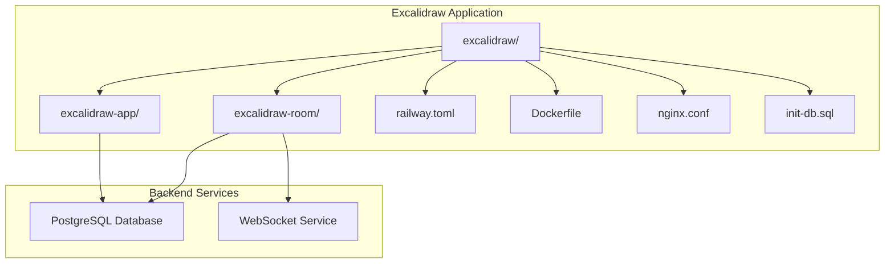
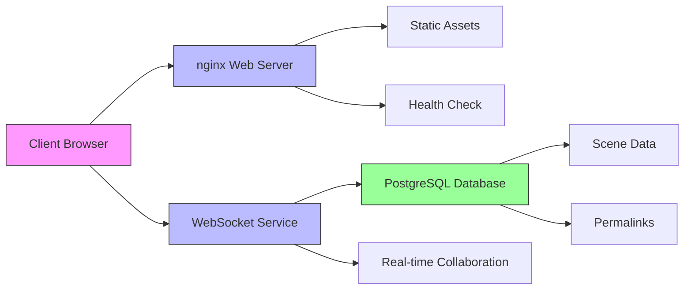
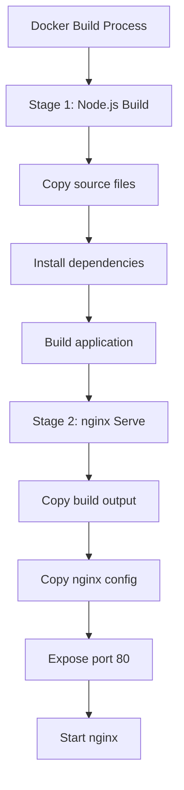
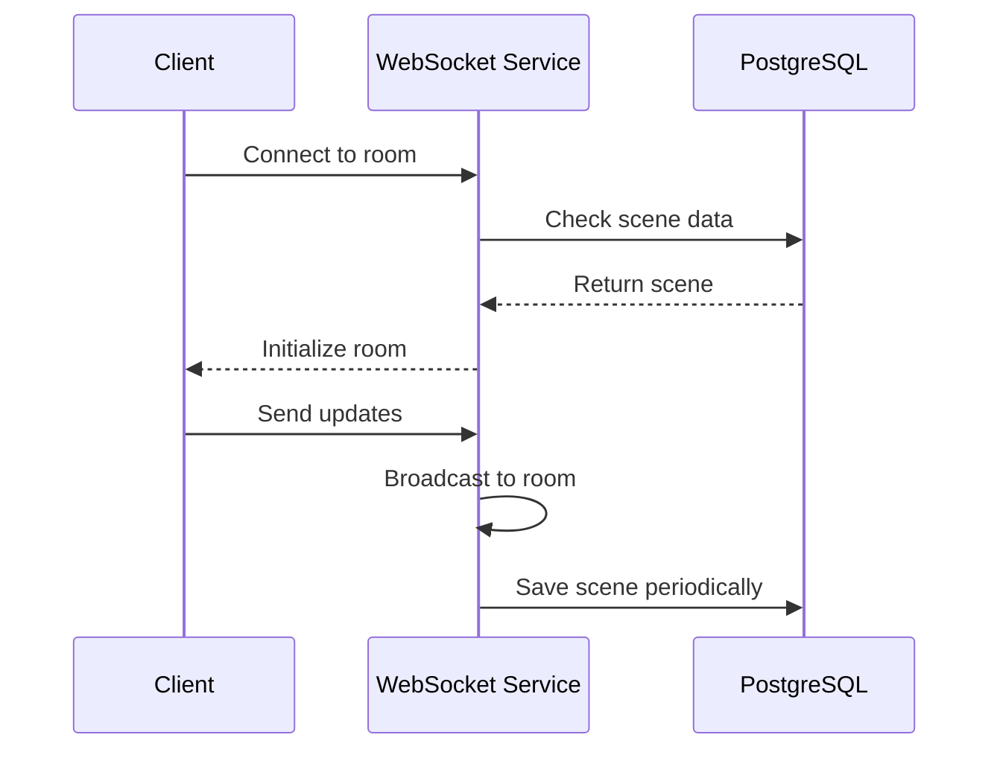
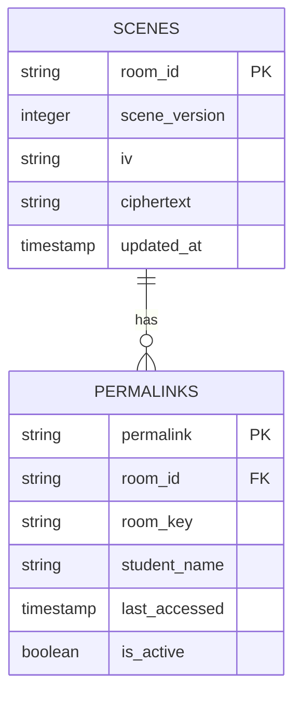
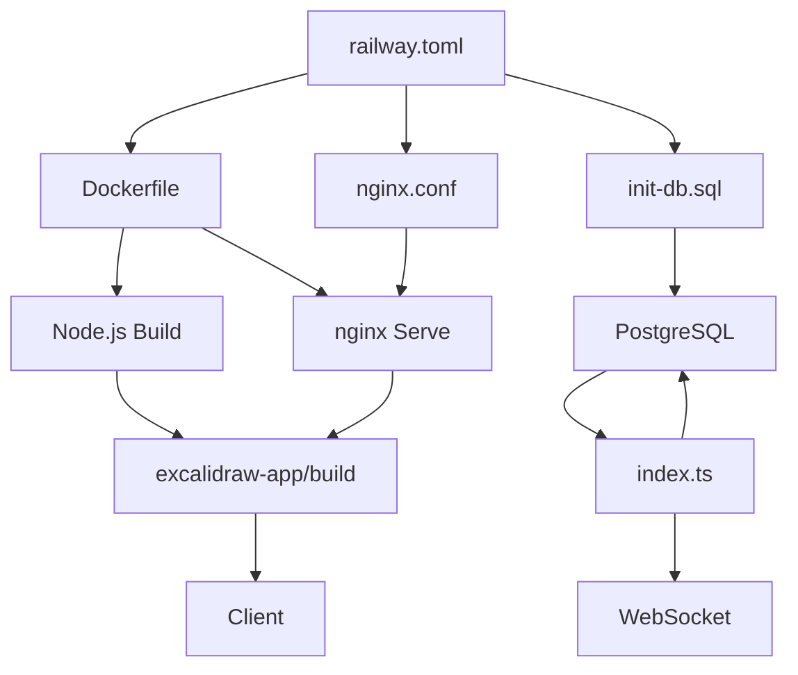

# Railway Deployment

<cite>
**Referenced Files in This Document**   
- [railway.toml](file://excalidraw/railway.toml)
- [Dockerfile](file://excalidraw/Dockerfile)
- [nginx.conf](file://excalidraw/nginx.conf)
- [RAILWAY_DEPLOYMENT.md](file://excalidraw/RAILWAY_DEPLOYMENT.md)
- [init-db.sql](file://excalidraw/init-db.sql)
- [index.ts](file://excalidraw-room/src/index.ts)
- [postgresql.ts](file://excalidraw/excalidraw-app/data/postgresql.ts)
</cite>

## Table of Contents
1. [Introduction](#introduction)
2. [Project Structure](#project-structure)
3. [Core Components](#core-components)
4. [Architecture Overview](#architecture-overview)
5. [Detailed Component Analysis](#detailed-component-analysis)
6. [Dependency Analysis](#dependency-analysis)
7. [Performance Considerations](#performance-considerations)
8. [Troubleshooting Guide](#troubleshooting-guide)
9. [Conclusion](#conclusion)

## Introduction
This document provides comprehensive guidance for deploying Excalidraw on Railway using the railway.toml configuration file. It covers service definitions for web, backend, and database provisioning with PostgreSQL, environment variable setup, deployment workflows, scaling strategies, and common issue resolution. The deployment leverages Docker for containerization, nginx for static asset serving, and PostgreSQL for persistent data storage.

## Project Structure
The project consists of multiple components organized in a monorepo structure. The main Excalidraw application is located in the excalidraw directory, with a separate excalidraw-room service for WebSocket functionality. The deployment configuration is managed through railway.toml, Dockerfile, and nginx.conf.

**Diagram sources**
- [railway.toml](file://excalidraw/railway.toml)
- [Dockerfile](file://excalidraw/Dockerfile)
- [nginx.conf](file://excalidraw/nginx.conf)

**Section sources**
- [railway.toml](file://excalidraw/railway.toml)
- [Dockerfile](file://excalidraw/Dockerfile)
- [nginx.conf](file://excalidraw/nginx.conf)

## Core Components
The deployment architecture consists of three main services defined in railway.toml: a web service for serving the Excalidraw application, a WebSocket service for real-time collaboration, and a PostgreSQL database for persistent storage. The Dockerfile defines a multi-stage build process that first builds the application and then serves it through nginx. The nginx configuration includes routing, caching, and security headers.

**Section sources**
- [railway.toml](file://excalidraw/railway.toml)
- [Dockerfile](file://excalidraw/Dockerfile)
- [nginx.conf](file://excalidraw/nginx.conf)

## Architecture Overview
The Excalidraw deployment on Railway follows a microservices architecture with clear separation of concerns. The web service serves static assets through nginx, the WebSocket service handles real-time collaboration, and PostgreSQL stores persistent data like scenes and permalinks. Environment variables connect these services, with Railway automatically provisioning database credentials.

**Diagram sources**
- [railway.toml](file://excalidraw/railway.toml)
- [Dockerfile](file://excalidraw/Dockerfile)
- [nginx.conf](file://excalidraw/nginx.conf)
- [index.ts](file://excalidraw-room/src/index.ts)

## Detailed Component Analysis

### Web Service Configuration
The web service is configured through the Dockerfile and nginx.conf. The Dockerfile uses a multi-stage build process with Node.js for building and nginx for serving. The nginx configuration handles client-side routing, caches static assets, and includes security headers.

**Diagram sources**
- [Dockerfile](file://excalidraw/Dockerfile)
- [nginx.conf](file://excalidraw/nginx.conf)

### Backend Service Configuration
The WebSocket backend service, defined as "websocket" in railway.toml, handles real-time collaboration between users. It's built from the excalidraw-room directory and runs on port 3002. The service connects to PostgreSQL for persistent data storage and uses environment variables for configuration.

**Diagram sources**
- [railway.toml](file://excalidraw/railway.toml)
- [index.ts](file://excalidraw-room/src/index.ts)
- [postgresql.ts](file://excalidraw/excalidraw-app/data/postgresql.ts)

### Database Provisioning
The PostgreSQL database is provisioned through railway.toml with version 15. It stores encrypted scene data and permalinks for student rooms. The init-db.sql script creates the necessary tables and indexes, including triggers to automatically update timestamps.

**Diagram sources**
- [railway.toml](file://excalidraw/railway.toml)
- [init-db.sql](file://excalidraw/init-db.sql)
- [index.ts](file://excalidraw-room/src/index.ts)

**Section sources**
- [railway.toml](file://excalidraw/railway.toml)
- [init-db.sql](file://excalidraw/init-db.sql)
- [index.ts](file://excalidraw-room/src/index.ts)

## Dependency Analysis
The deployment has clear dependencies between services. The web service depends on the build output from the Node.js build stage. The WebSocket service depends on both the PostgreSQL database and environment variables for configuration. The entire system relies on Railway's service discovery for inter-service communication.

**Diagram sources**
- [railway.toml](file://excalidraw/railway.toml)
- [Dockerfile](file://excalidraw/Dockerfile)
- [nginx.conf](file://excalidraw/nginx.conf)
- [init-db.sql](file://excalidraw/init-db.sql)
- [index.ts](file://excalidraw-room/src/index.ts)

**Section sources**
- [railway.toml](file://excalidraw/railway.toml)
- [Dockerfile](file://excalidraw/Dockerfile)
- [nginx.conf](file://excalidraw/nginx.conf)
- [init-db.sql](file://excalidraw/init-db.sql)

## Performance Considerations
The deployment is optimized for performance through several mechanisms. Static assets are cached by nginx with a one-year expiration and immutable flag. The Docker build process uses cache mounts for node_modules to speed up builds. PostgreSQL connections use connection pooling, and the application implements efficient querying with appropriate indexes on frequently accessed columns.

## Troubleshooting Guide
Common deployment issues include port binding conflicts, database connection problems, and static asset serving errors. The health check endpoint at /health helps verify service availability. Database initialization must be performed manually by running the init-db.sql script after provisioning. CORS configuration in environment variables ensures proper cross-origin access for the WebSocket service.

**Section sources**
- [nginx.conf](file://excalidraw/nginx.conf)
- [index.ts](file://excalidraw-room/src/index.ts)
- [RAILWAY_DEPLOYMENT.md](file://excalidraw/RAILWAY_DEPLOYMENT.md)

## Conclusion
Deploying Excalidraw on Railway provides a robust, scalable solution for collaborative diagramming. The configuration separates concerns between web serving, real-time collaboration, and data persistence. The use of Docker ensures consistent builds, while nginx provides efficient static asset serving. PostgreSQL enables persistent storage of scenes and permalinks, making this deployment suitable for educational and collaborative use cases.