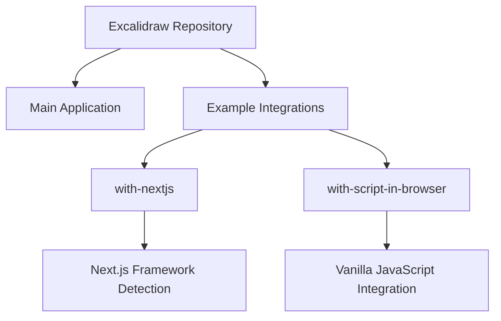
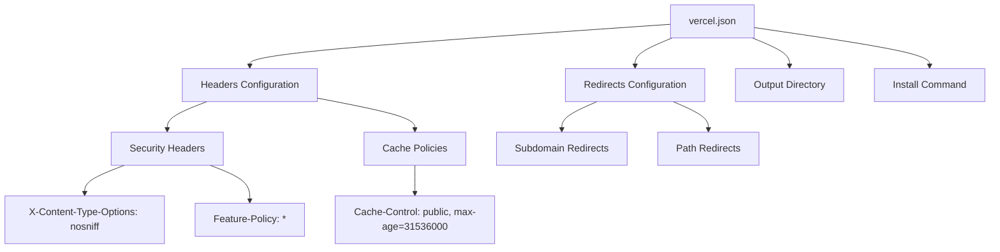
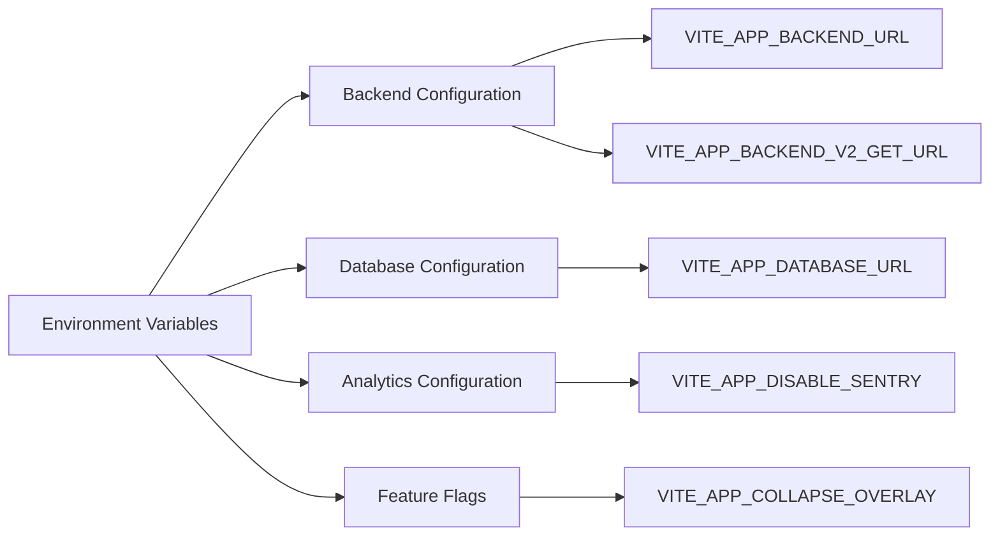
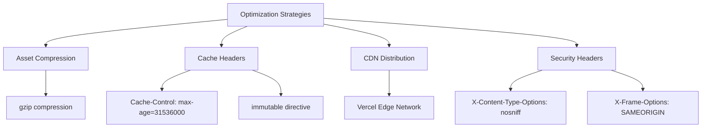
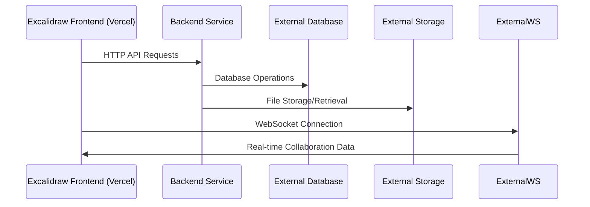

# Vercel Deployment

<cite>
**Referenced Files in This Document**   
- [vercel.json](file://excalidraw/vercel.json)
- [excalidraw-app/package.json](file://excalidraw/excalidraw-app/package.json)
- [excalidraw-app/data/firebase.ts](file://excalidraw/excalidraw-app/data/firebase.ts)
- [excalidraw-app/data/api-client.ts](file://excalidraw/excalidraw-app/data/api-client.ts)
- [excalidraw-app/vite-env.d.ts](file://excalidraw/excalidraw-app/vite-env.d.ts)
- [excalidraw/examples/with-nextjs/vercel.json](file://excalidraw/examples/with-nextjs/vercel.json)
- [excalidraw/examples/with-script-in-browser/vercel.json](file://excalidraw/examples/with-script-in-browser/vercel.json)
- [Backned/src/server.ts](file://Backned/src/server.ts)
- [excalidraw/excalidraw-room/README.md](file://excalidraw/excalidraw-room/README.md)
</cite>

## Table of Contents
1. [Introduction](#introduction)
2. [Project Structure Overview](#project-structure-overview)
3. [Main Application Deployment](#main-application-deployment)
4. [Example Integrations](#example-integrations)
5. [Vercel Configuration](#vercel-configuration)
6. [Environment Variables](#environment-variables)
7. [Build Settings and Output Configuration](#build-settings-and-output-configuration)
8. [SPA Routing and API Proxying](#spa-routing-and-api-proxying)
9. [Optimization Strategies](#optimization-strategies)
10. [Limitations and Workarounds](#limitations-and-workarounds)
11. [Preview Deployments and Custom Domains](#preview-deployments-and-custom-domains)

## Introduction
This document provides comprehensive guidance for deploying Excalidraw on Vercel, covering both the main application and example integrations. It details configuration requirements, deployment workflows, optimization techniques, and solutions for common limitations when hosting collaborative drawing applications on serverless infrastructure.

## Project Structure Overview
The Excalidraw repository contains multiple deployment targets including the main application, example integrations with different frameworks, and backend services. The primary deployment targets for Vercel are the main Excalidraw application and the example projects with Next.js and script-in-browser implementations.

**Section sources**
- [excalidraw/vercel.json](file://excalidraw/vercel.json)
- [excalidraw/examples/with-nextjs/vercel.json](file://excalidraw/examples/with-nextjs/vercel.json)
- [excalidraw/examples/with-script-in-browser/vercel.json](file://excalidraw/examples/with-script-in-browser/vercel.json)

## Main Application Deployment
Deploying the main Excalidraw application to Vercel requires proper configuration of the vercel.json file, which specifies the output directory, installation command, and header policies. The main application is configured to build to the excalidraw-app/build directory and requires yarn for dependency installation.

The deployment process involves building the Vite-based application and serving the static assets through Vercel's edge network. The application's build script is defined in the package.json file, which orchestrates the compilation of the frontend assets.

**Section sources**
- [vercel.json](file://excalidraw/vercel.json)
- [excalidraw-app/package.json](file://excalidraw/excalidraw-app/package.json)

## Example Integrations
The repository includes two example integrations that demonstrate different deployment patterns: with-nextjs and with-script-in-browser. The with-nextjs example is optimized for Next.js framework detection on Vercel, while the with-script-in-browser example demonstrates a vanilla JavaScript integration.

Each example contains its own vercel.json configuration file tailored to its specific build requirements and output directories. These examples serve as templates for integrating Excalidraw into existing applications with different architectural patterns.

**Diagram sources**
- [excalidraw/examples/with-nextjs/vercel.json](file://excalidraw/examples/with-nextjs/vercel.json)
- [excalidraw/examples/with-script-in-browser/vercel.json](file://excalidraw/examples/with-script-in-browser/vercel.json)

**Section sources**
- [excalidraw/examples/with-nextjs/vercel.json](file://excalidraw/examples/with-nextjs/vercel.json)
- [excalidraw/examples/with-script-in-browser/vercel.json](file://excalidraw/examples/with-script-in-browser/vercel.json)

## Vercel Configuration
The vercel.json configuration file is central to deploying Excalidraw on Vercel. It defines routing rules, redirects, headers, and rewrites necessary for proper application behavior. The main configuration includes:

- **Headers**: Security headers and cache policies for static assets
- **Redirects**: URL redirection rules for different subdomains and paths
- **Output Directory**: Specifies where built assets are located
- **Install Command**: Defines the package manager command for dependency installation

The configuration implements SPA navigation by ensuring client-side routing works correctly and sets appropriate cache headers for font files and other static assets to optimize performance.

**Diagram sources**
- [vercel.json](file://excalidraw/vercel.json)

**Section sources**
- [vercel.json](file://excalidraw/vercel.json)

## Environment Variables
Excalidraw uses several environment variables to configure its behavior in different deployment environments. These variables are accessed through import.meta.env in the frontend code and control various aspects of the application's connectivity and features.

Key environment variables include:
- VITE_APP_BACKEND_URL: Backend API endpoint
- VITE_APP_FIREBASE_CONFIG: Firebase configuration for authentication and storage
- VITE_APP_DATABASE_URL: PostgreSQL database connection string
- VITE_APP_WS_SERVER_URL: WebSocket server URL for real-time collaboration
- VITE_APP_DISABLE_SENTRY: Toggle for error tracking

These variables allow the application to adapt to different deployment environments without code changes, enabling separation between development, staging, and production configurations.

**Diagram sources**
- [excalidraw-app/vite-env.d.ts](file://excalidraw/excalidraw-app/vite-env.d.ts)
- [excalidraw-app/data/firebase.ts](file://excalidraw/excalidraw-app/data/firebase.ts)
- [excalidraw-app/data/api-client.ts](file://excalidraw/excalidraw-app/data/api-client.ts)

**Section sources**
- [excalidraw-app/vite-env.d.ts](file://excalidraw/excalidraw-app/vite-env.d.ts)
- [excalidraw-app/data/firebase.ts](file://excalidraw/excalidraw-app/data/firebase.ts)
- [excalidraw-app/data/api-client.ts](file://excalidraw/excalidraw-app/data/api-client.ts)

## Build Settings and Output Configuration
The build configuration varies between the main application and example integrations. The main Excalidraw application uses a multi-step build process defined in package.json, while the examples have simpler build requirements.

Build settings include:
- **Main Application**: Output directory set to excalidraw-app/build with yarn install as the installation command
- **with-nextjs**: Output directory set to build, leveraging Next.js framework detection
- **with-script-in-browser**: Output directory set to dist with custom build command that first builds packages

The buildCommand field in vercel.json allows customization of the build process, which is essential for projects with complex dependency trees or monorepo structures.

**Section sources**
- [vercel.json](file://excalidraw/vercel.json)
- [excalidraw/examples/with-nextjs/vercel.json](file://excalidraw/examples/with-nextjs/vercel.json)
- [excalidraw/examples/with-script-in-browser/vercel.json](file://excalidraw/examples/with-script-in-browser/vercel.json)
- [excalidraw-app/package.json](file://excalidraw/excalidraw-app/package.json)

## SPA Routing and API Proxying
Excalidraw implements SPA routing through Vercel's rewrite rules, ensuring that client-side navigation works correctly by serving the index.html file for all routes. This allows the frontend application to handle routing internally.

For API proxying, the application relies on environment variables to direct requests to the appropriate backend services. While Vercel's serverless functions could theoretically proxy API requests, Excalidraw typically connects directly to backend services deployed separately.

The vercel.json configuration includes redirect rules that map specific paths to external destinations, such as redirecting /webex to a dedicated WebEx integration. This demonstrates how Vercel can route traffic based on path patterns and host headers.

**Section sources**
- [vercel.json](file://excalidraw/vercel.json)

## Optimization Strategies
Deploying Excalidraw on Vercel benefits from several optimization techniques:

- **Asset Compression**: Static assets are compressed using gzip as defined in the nginx.conf file, reducing bandwidth usage
- **Cache Headers**: Long-term caching is implemented for static assets like WOFF2 fonts with Cache-Control headers set to one year
- **Immutable Caching**: Static assets are marked as immutable, allowing browsers to cache them aggressively
- **CDN Distribution**: Vercel's global edge network serves assets from locations close to users

The configuration also includes security headers to protect against common web vulnerabilities and ensures proper content type handling to prevent MIME type sniffing attacks.

**Diagram sources**
- [vercel.json](file://excalidraw/vercel.json)
- [nginx.conf](file://excalidraw/nginx.conf)

**Section sources**
- [vercel.json](file://excalidraw/vercel.json)
- [nginx.conf](file://excalidraw/nginx.conf)

## Limitations and Workarounds
Deploying Excalidraw on Vercel presents certain limitations, particularly regarding real-time collaboration features that require persistent connections:

- **WebSocket Support**: Vercel serverless functions have limitations with WebSockets and long-lived connections. The recommended workaround is to deploy the WebSocket server separately and point VITE_APP_WS_SERVER_URL to that endpoint
- **Database Persistence**: Serverless environments are not ideal for direct database connections. Use external database services with connection pooling
- **File Storage**: For persistent file storage, integrate with external services like Firebase, S3, or dedicated object storage

The repository structure shows a separate backend service in the Backned directory that could serve as a foundation for deploying API and WebSocket services on platforms that support long-lived connections.

**Diagram sources**
- [Backned/src/server.ts](file://Backned/src/server.ts)
- [excalidraw/excalidraw-room/README.md](file://excalidraw/excalidraw-room/README.md)
- [excalidraw-app/data/firebase.ts](file://excalidraw/excalidraw-app/data/firebase.ts)

**Section sources**
- [Backned/src/server.ts](file://Backned/src/server.ts)
- [excalidraw/excalidraw-room/README.md](file://excalidraw/excalidraw-room/README.md)
- [excalidraw-app/data/firebase.ts](file://excalidraw/excalidraw-app/data/firebase.ts)

## Preview Deployments and Custom Domains
Vercel's preview deployment feature allows testing changes in isolated environments before merging to production. Each pull request automatically generates a preview URL, enabling stakeholders to review changes without affecting the production site.

For custom domains, Vercel provides a straightforward configuration process through the dashboard or vercel.json file. The platform handles SSL certificate provisioning and renewal automatically, ensuring secure connections for custom domains.

The deployment workflow integrates with Git, allowing automatic deployments on push to specific branches. This enables continuous deployment practices where changes to the main branch are automatically deployed to production.

**Section sources**
- [vercel.json](file://excalidraw/vercel.json)