# Data Models & Persistence

<cite>
**Referenced Files in This Document**   
- [init-db.sql](file://excalidraw/init-db.sql)
- [Scene.ts](file://excalidraw/packages/element/src/Scene.ts)
- [transform.ts](file://excalidraw/packages/excalidraw/data/transform.ts)
- [types.ts](file://excalidraw/packages/excalidraw/data/types.ts)
- [StudentLinkDialog.tsx](file://excalidraw/excalidraw-app/components/StudentLinkDialog.tsx)
- [routes.ts](file://Backned/src/routes.ts)
- [db.ts](file://Backned/src/db.ts)
- [LocalData.ts](file://excalidraw/excalidraw-app/data/LocalData.ts)
- [api-client.ts](file://excalidraw/excalidraw-app/data/api-client.ts)
</cite>

## Table of Contents
1. [Introduction](#introduction)
2. [Core Entities](#core-entities)
3. [Database Schema](#database-schema)
4. [Data Lifecycle](#data-lifecycle)
5. [Local Storage Strategy](#local-storage-strategy)
6. [Backup and Migration](#backup-and-migration)
7. [JSON Schema Examples](#json-schema-examples)
8. [Validation and Business Logic](#validation-and-business-logic)
9. [Privacy Considerations](#privacy-considerations)

## Introduction
This document provides comprehensive documentation of the data models and persistence mechanisms in the Excalidraw application. It details the core entities including Scene, Element, Permalink, Teacher, and Student, along with their relationships and lifecycle management. The document covers the database schema, local storage strategies, data synchronization, and privacy considerations essential for understanding how Excalidraw manages and persists user data.

## Core Entities

The Excalidraw application is built around several core entities that represent different aspects of the drawing and collaboration functionality.

### Scene
The Scene entity represents the complete state of a whiteboard, including all drawing elements and application state. Scenes are stored in the database with encryption and are identified by unique room IDs.

### Element
Elements are the fundamental building blocks of drawings in Excalidraw. Each element represents a primitive drawing object such as rectangles, ellipses, diamonds, lines, arrows, text, frames, and images. Elements are organized within scenes and can be grouped, bound, or linked.

### Permalink
Permalinks provide stable, shareable URLs that map to specific collaboration rooms. They enable persistent access to scenes for students and teachers, with metadata including student names and creation timestamps.

### Teacher
Teachers are users who create and manage educational sessions. They can generate permalinks for students, manage access, and view student activity. Teachers are identified by unique IDs and can have authentication tokens for administrative functions.

### Student
Students are participants in educational sessions who access scenes through permalinks. They can be associated with specific room IDs and keys through permalink mappings, allowing for personalized and persistent access to collaborative whiteboards.

**Section sources**
- [init-db.sql](file://excalidraw/init-db.sql#L1-L65)
- [Scene.ts](file://excalidraw/packages/element/src/Scene.ts#L112-L156)
- [transform.ts](file://excalidraw/packages/excalidraw/data/transform.ts#L481-L525)

## Database Schema

The Excalidraw application uses a PostgreSQL database with several key tables to store scene data, permalinks, and teacher information.

```mermaid
erDiagram
SCENES {
uuid id PK
varchar(255) room_id UK
varchar(255) room_key
text encrypted_data
text iv
integer version
timestamp created_at
timestamp updated_at
}
PERMALINKS {
uuid id PK
varchar(255) permalink UK
varchar(255) room_id FK
varchar(255) room_key
varchar(255) student_name
varchar(255) teacher_id FK
timestamp created_at
timestamp last_accessed
boolean is_active
}
TEACHERS {
varchar(255) teacher_id PK
varchar(255) name
varchar(255) email
varchar(255) token UK
timestamp created_at
timestamp last_accessed
boolean is_active
}
SCENES ||--o{ PERMALINKS : "contains"
TEACHERS ||--o{ PERMALINKS : "manages"
```



**Diagram sources**
- [init-db.sql](file://excalidraw/init-db.sql#L1-L65)
- [db.ts](file://Backned/src/db.ts#L43-L95)

### Scenes Table
The scenes table stores encrypted scene data with the following structure:
- **id**: UUID primary key
- **room_id**: Unique identifier for the collaboration room
- **room_key**: Encryption key for the room
- **encrypted_data**: Base64-encoded encrypted scene data
- **iv**: Initialization vector for encryption
- **version**: Schema version number
- **created_at**: Timestamp of creation
- **updated_at**: Timestamp of last update

Indexes are created on room_id for fast lookups and on updated_at for cleanup operations.

### Permalinks Table
The permalinks table maps short URLs to collaboration rooms:
- **id**: UUID primary key
- **permalink**: Unique short URL identifier
- **room_id**: Reference to the scenes table
- **room_key**: Room encryption key
- **student_name**: Optional student identifier
- **teacher_id**: Reference to the teacher who created the permalink
- **created_at**: Timestamp of creation
- **last_accessed**: Timestamp of last access
- **is_active**: Boolean flag indicating if the permalink is active

The table includes indexes on permalink and room_id for efficient lookups, and a unique constraint on the combination of teacher_id and student_name to prevent duplicate student names for the same teacher.

### Teachers Table
The teachers table stores information about teacher accounts:
- **teacher_id**: Primary key identifier
- **name**: Teacher's name
- **email**: Teacher's email address
- **token**: Authentication token for API access
- **created_at**: Account creation timestamp
- **last_accessed**: Last login timestamp
- **is_active**: Account status flag

The token field has a unique constraint to ensure secure authentication.

**Section sources**
- [init-db.sql](file://excalidraw/init-db.sql#L1-L65)
- [db.ts](file://Backned/src/db.ts#L43-L95)

## Data Lifecycle

The data lifecycle in Excalidraw spans from client-side creation through server persistence and synchronization.


**Diagram sources**
- [routes.ts](file://Backned/src/routes.ts#L126-L187)
- [LocalData.ts](file://excalidraw/excalidraw-app/data/LocalData.ts#L81-L138)

When a user creates or modifies a scene, the data is first saved to local storage for immediate persistence. Periodically, the application synchronizes with the backend server by sending encrypted scene data. The server stores this data in the database with appropriate encryption. When sharing is required, the client requests a permalink from the server, which creates a mapping between a short URL and the room identifier. Students accessing a permalink trigger a lookup in the database to retrieve the corresponding room information and scene data.

**Section sources**
- [routes.ts](file://Backned/src/routes.ts#L126-L187)
- [LocalData.ts](file://excalidraw/excalidraw-app/data/LocalData.ts#L81-L138)

## Local Storage Strategy

Excalidraw employs a comprehensive local storage strategy to ensure data persistence and improve user experience.


**Diagram sources**
- [LocalData.ts](file://excalidraw/excalidraw-app/data/LocalData.ts#L81-L138)
- [EditorLocalStorage.ts](file://excalidraw/packages/excalidraw/data/EditorLocalStorage.ts#L0-L51)

The application uses both localStorage and IndexedDB for client-side data persistence. Application state and elements are stored in localStorage using JSON serialization, while binary files (such as images) are stored in IndexedDB for better performance with large data. The LocalData class manages this persistence with debounced saving to avoid excessive writes. A saving lock mechanism prevents data loss during collaboration sessions.

**Section sources**
- [LocalData.ts](file://excalidraw/excalidraw-app/data/LocalData.ts#L81-L138)
- [EditorLocalStorage.ts](file://excalidraw/packages/excalidraw/data/EditorLocalStorage.ts#L0-L51)

## Backup and Migration

Excalidraw implements several mechanisms for data backup and migration to ensure data integrity and support evolving storage requirements.

The system automatically creates local backups through the periodic saving to localStorage and IndexedDB. For migration, the application includes adapters to handle legacy data formats. The LibraryLocalStorageMigrationAdapter facilitates migration from older localStorage-based library storage to the current IndexedDB implementation. Similarly, versioning is implemented in the data model to support schema evolution, with the version field in the scenes table indicating the schema version of stored data.

When upgrading the application, data migration occurs transparently to the user. The system detects the version of stored data and applies appropriate transformation functions to update it to the current schema. For server-side data, the database schema includes migration scripts that are applied during deployment to ensure compatibility between code and data.

**Section sources**
- [LocalData.ts](file://excalidraw/excalidraw-app/data/LocalData.ts#L238-L257)
- [init-db.sql](file://excalidraw/init-db.sql#L1-L65)

## JSON Schema Examples

### Scene Data Structure
```json
{
  "type": "excalidraw",
  "version": 2,
  "source": "https://excalidraw.com",
  "elements": [
    {
      "id": "vWrqOAfkind2qcm7LDAGZ",
      "type": "rectangle",
      "x": 414,
      "y": 237,
      "width": 214,
      "height": 214,
      "angle": 0,
      "strokeColor": "#000000",
      "backgroundColor": "#15aabf",
      "fillStyle": "hachure",
      "strokeWidth": 1,
      "strokeStyle": "solid",
      "roughness": 1,
      "opacity": 100,
      "groupIds": [],
      "frameId": null,
      "roundness": null,
      "seed": 1041657908,
      "version": 120,
      "versionNonce": 1188004276,
      "isDeleted": false,
      "boundElements": null,
      "updated": 1,
      "link": null,
      "locked": false
    }
  ],
  "appState": {
    "viewBackgroundColor": "#ffffff",
    "gridModeEnabled": false
  },
  "files": {}
}
```

### API Payload for Permalink Creation
```json
{
  "room_id": "abc123xyz",
  "room_key": "def456uvw",
  "student_name": "John Doe",
  "teacher_id": "t789"
}
```

### API Response for Permalink List
```json
{
  "items": [
    {
      "permalink": "p123",
      "room_id": "abc123xyz",
      "room_key": "def456uvw",
      "student_name": "John Doe",
      "created_at": "2023-01-15T10:30:00Z",
      "last_accessed": "2023-01-15T10:30:00Z",
      "is_active": true
    }
  ]
}
```

**Section sources**
- [types.ts](file://excalidraw/packages/excalidraw/data/types.ts#L0-L61)
- [diagramFixture.ts](file://excalidraw/packages/excalidraw/tests/fixtures/diagramFixture.ts#L0-L33)

## Validation and Business Logic

Excalidraw implements several validation rules and business logic constraints to maintain data integrity and enforce application rules.

### Data Validation Rules
- **Element Position and Size**: Coordinates and dimensions are validated to prevent extremely large values (greater than 1e6)
- **Unique Constraints**: Room IDs are unique in the scenes table, permalinks are unique in the permalinks table
- **Foreign Key Relationships**: Permalinks reference valid room IDs in the scenes table
- **Type Safety**: Elements are validated against defined types (rectangle, ellipse, diamond, etc.)

### Business Logic Constraints
- **Permalink Stability**: When creating a permalink, if a mapping already exists for a room, the existing permalink is reused to maintain stable sharing links
- **Teacher-Student Uniqueness**: Each teacher can have only one active permalink for a given student name
- **Access Control**: Teachers can only manage permalinks associated with their teacher ID
- **Data Expiration**: Scenes are automatically cleaned up based on the updated_at timestamp

The application also implements conflict resolution logic for collaborative editing, using version numbers and version nonces to detect and resolve concurrent modifications.

**Section sources**
- [transform.ts](file://excalidraw/packages/excalidraw/data/transform.ts#L77-L122)
- [routes.ts](file://Backned/src/routes.ts#L126-L187)

## Privacy Considerations

Excalidraw incorporates several privacy features to protect user data:

### Data Encryption
All scene data stored on the server is encrypted using AES-GCM encryption. The encrypted_data field in the scenes table contains the encrypted payload, while the iv field stores the initialization vector. Room keys provide an additional layer of security, ensuring that only users with the correct key can decrypt and access scene content.

### Anonymous Usage
The application supports anonymous usage without requiring user accounts. Teacher and student identities are represented by randomly generated IDs rather than personal information, minimizing data collection.

### Data Minimization
The system collects only the minimum necessary data for functionality. Student names in permalinks are optional, and no personally identifiable information is required for basic functionality.

### Access Control
Teacher tokens provide authenticated access to administrative functions, ensuring that only authorized teachers can manage permalinks and view student activity. The is_active flag allows for revocation of access by deactivating permalinks.

### Local Data Management
Client-side data is stored securely in the browser's storage mechanisms. The application includes functionality to clear obsolete files from IndexedDB after 24 hours of inactivity, reducing the local data footprint.

**Section sources**
- [init-db.sql](file://excalidraw/init-db.sql#L1-L65)
- [routes.ts](file://Backned/src/routes.ts#L274-L326)
- [LocalData.ts](file://excalidraw/excalidraw-app/data/LocalData.ts#L47-L79)