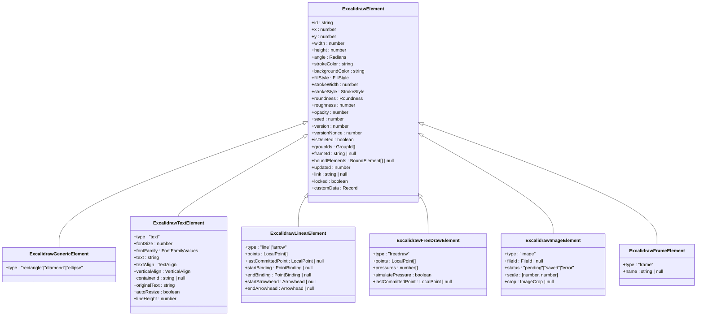

# Element Data Model

<cite>
**Referenced Files in This Document**   
- [types.ts](file://excalidraw/packages/element/src/types.ts)
- [newElement.ts](file://excalidraw/packages/element/src/newElement.ts)
- [textElement.ts](file://excalidraw/packages/element/src/textElement.ts)
- [typeChecks.ts](file://excalidraw/packages/element/src/typeChecks.ts)
- [Scene.ts](file://excalidraw/packages/element/src/Scene.ts)
- [elementLink.ts](file://excalidraw/packages/element/src/elementLink.ts)
- [groups.ts](file://excalidraw/packages/element/src/groups.ts)
</cite>

## Table of Contents
1. [Introduction](#introduction)
2. [Core Element Structure](#core-element-structure)
3. [Element Types and Inheritance](#element-types-and-inheritance)
4. [Base Element Properties](#base-element-properties)
5. [Type-Specific Properties](#type-specific-properties)
6. [Element Creation and Initialization](#element-creation-and-initialization)
7. [Grouping and Organization](#grouping-and-organization)
8. [Element Linking and Referencing](#element-linking-and-referencing)
9. [Scene Management](#scene-management)
10. [Validation and Constraints](#validation-and-constraints)
11. [Rendering Implications](#rendering-implications)
12. [Examples](#examples)

## Introduction
The Element data model in Excalidraw represents the fundamental building blocks of drawings, serving as individual drawing primitives that compose scenes. This documentation provides a comprehensive analysis of the element system, covering all primitive types including rectangles, diamonds, arrows, text, and other geometric shapes. The model is implemented in TypeScript with a sophisticated inheritance hierarchy and type discrimination mechanism that enables efficient scene management, rendering, and collaboration features. Elements contain geometric, stylistic, and behavioral properties that define their appearance and interaction within the drawing environment.

## Core Element Structure

The Element data model is built around a base interface that defines common properties shared across all element types, with specific types extending this base to include type-specific attributes. The inheritance hierarchy is implemented through TypeScript interfaces and type unions, allowing for type-safe operations while maintaining flexibility in the element system.



**Diagram sources**
- [types.ts](file://excalidraw/packages/element/src/types.ts#L150-L438)

**Section sources**
- [types.ts](file://excalidraw/packages/element/src/types.ts#L150-L438)

## Element Types and Inheritance

The Element data model employs a sophisticated type system that combines interface inheritance with discriminated unions to provide both type safety and flexibility. The core is the `_ExcalidrawElementBase` interface which defines all common properties, and specific element types extend this base with their unique characteristics. Type discrimination is achieved through the `type` property, which serves as a literal type guard allowing TypeScript to narrow types based on the element's type field.

The inheritance hierarchy includes several categories of elements:
- **Generic elements**: Basic geometric shapes like rectangles, diamonds, and ellipses
- **Text elements**: Elements containing textual content with formatting options
- **Linear elements**: Lines and arrows with configurable points and arrowheads
- **Free draw elements**: Hand-drawn paths with pressure sensitivity
- **Image elements**: Embedded images with cropping and scaling capabilities
- **Frame elements**: Container elements for organizing content

This structure enables polymorphic operations across all elements while allowing specialized behavior for specific types. The type system also includes utility types like `NonDeleted<T>` and `Ordered<T>` that create refined versions of elements with additional constraints, such as ensuring an element is not deleted or has a defined ordering index.


**Diagram sources**
- [types.ts](file://excalidraw/packages/element/src/types.ts#L150-L438)

**Section sources**
- [types.ts](file://excalidraw/packages/element/src/types.ts#L150-L438)

## Base Element Properties

All elements in the Excalidraw data model share a common set of base properties defined in the `_ExcalidrawElementBase` interface. These properties provide the fundamental geometric, stylistic, and metadata attributes that every element requires for rendering and manipulation within the drawing environment.

### Geometric Properties
- **x, y**: Position coordinates in the scene (number)
- **width, height**: Dimensions of the element's bounding box (number)
- **angle**: Rotation angle in radians (Radians)
- **points**: Array of LocalPoint tuples for path-based elements

### Stylistic Properties
- **strokeColor**: Color of the element's stroke (string)
- **backgroundColor**: Fill color for the element (string)
- **fillStyle**: Pattern style for filling (FillStyle: "hachure"|"cross-hatch"|"solid"|"zigzag")
- **strokeWidth**: Width of the stroke in pixels (number)
- **strokeStyle**: Line style (StrokeStyle: "solid"|"dashed"|"dotted")
- **roundness**: Configuration for rounded corners (Roundness object)
- **roughness**: Level of hand-drawn effect (number)
- **opacity**: Transparency level from 0 to 100 (number)

### Metadata and State Properties
- **id**: Unique identifier for the element (string)
- **type**: Discriminant property indicating element type (ElementType)
- **seed**: Random seed for deterministic rendering (number)
- **version**: Version number for collaboration (number)
- **versionNonce**: Random nonce for version conflicts (number)
- **isDeleted**: Deletion status flag (boolean)
- **index**: Fractional index for ordering (FractionalIndex)
- **groupIds**: Array of group identifiers (GroupId[])
- **frameId**: Reference to containing frame (string | null)
- **boundElements**: Array of bound element references (BoundElement[] | null)
- **updated**: Timestamp of last update (number)
- **link**: URL hyperlink (string | null)
- **locked**: Edit lock status (boolean)
- **customData**: Arbitrary custom data storage (Record<string,any>)

These base properties ensure consistency across all element types while providing the necessary information for rendering, collaboration, and persistence.

**Section sources**
- [types.ts](file://excalidraw/packages/element/src/types.ts#L150-L438)

## Type-Specific Properties

In addition to the shared base properties, each element type includes specific properties that define its unique behavior and appearance.

### Text Elements
Text elements extend the base with properties for text content and formatting:
- **fontSize**: Size of the text in pixels (number)
- **fontFamily**: Font family identifier (FontFamilyValues)
- **text**: Actual text content (string)
- **textAlign**: Horizontal alignment ("left"|"center"|"right")
- **verticalAlign**: Vertical alignment ("top"|"middle"|"bottom")
- **containerId**: Reference to containing shape (string | null)
- **originalText**: Unwrapped text content (string)
- **autoResize**: Whether width adjusts to content (boolean)
- **lineHeight**: Unitless line height multiplier (number)

### Linear Elements
Linear elements (lines and arrows) include properties for path definition and endpoints:
- **points**: Array of [x,y] coordinate pairs defining the path
- **lastCommittedPoint**: Most recently finalized point
- **startBinding/endBinding**: Connection points to other elements
- **startArrowhead/endArrowhead**: Arrowhead style at endpoints
- **polygon**: Flag indicating closed polygon (line elements only)
- **elbowed**: Flag for elbow-style arrows with fixed segments
- **fixedSegments**: Array of fixed segment definitions for elbow arrows

### Image Elements
Image elements contain properties for image management:
- **fileId**: Unique identifier for the image file (FileId)
- **status**: Upload/persistence status ("pending"|"saved"|"error")
- **scale**: X and Y scale factors for flipping ([number, number])
- **crop**: Crop configuration with coordinates and dimensions

### Frame Elements
Frame elements include organizational properties:
- **name**: Display name for the frame (string | null)

### Free Draw Elements
Free draw elements capture drawing input:
- **points**: Array of [x,y] coordinates from drawing
- **pressures**: Array of pressure values from stylus
- **simulatePressure**: Flag to simulate pressure if not available

These type-specific properties enable the diverse functionality required by different drawing primitives while maintaining a consistent interface for common operations.

**Section sources**
- [types.ts](file://excalidraw/packages/element/src/types.ts#L150-L438)

## Element Creation and Initialization

Elements are created through a factory pattern implemented in the `newElement.ts` file, which provides specialized functions for each element type. The creation process follows a consistent pattern across all types, ensuring proper initialization of required properties and adherence to the data model constraints.

The core creation function `_newElementBase` serves as the foundation for all element creation, accepting a type parameter and construction options. It initializes all base properties with default values when not explicitly provided, generates a unique ID, and sets up versioning information for collaboration.


**Diagram sources**
- [newElement.ts](file://excalidraw/packages/element/src/newElement.ts#L0-L549)

**Section sources**
- [newElement.ts](file://excalidraw/packages/element/src/newElement.ts#L0-L549)

Specialized creation functions include:
- **newElement**: Generic element creation
- **newTextElement**: Text element with text measurement and positioning
- **newLinearElement**: Line or arrow with point array initialization
- **newArrowElement**: Arrow with arrowhead configuration
- **newFreeDrawElement**: Free draw path with pressure data
- **newImageElement**: Image with file reference and status
- **newFrameElement**: Frame with organizational name

Text elements receive special handling during creation, with automatic measurement of text dimensions and adjustment of position based on alignment settings. The `getTextElementPositionOffsets` function calculates appropriate x and y offsets to ensure proper text alignment within its bounding box.

## Grouping and Organization

Elements can be organized into groups through the `groupIds` property, which maintains an ordered array of group identifiers. Groups are implemented as a flat array on each element rather than a hierarchical structure, with the order of group IDs indicating nesting depth (deepest to shallowest).

```mermaid
flowchart TD
A[Element] --> B[groupIds: ["group2", "group1"]]
C[Group1] --> D[Contains elements]
E[Group2] --> F[Nested within Group1]
G[Element] --> H[Belongs to Group2]
H --> I[Also part of Group1 via nesting]
style A fill:#f9f,stroke:#333
style C fill:#bbf,stroke:#333
style E fill:#bbf,stroke:#333
```

**Diagram sources**
- [groups.ts](file://excalidraw/packages/element/src/groups.ts)

**Section sources**
- [types.ts](file://excalidraw/packages/element/src/types.ts#L150-L438)
- [groups.ts](file://excalidraw/packages/element/src/groups.ts)

The grouping system supports:
- **Nested grouping**: Elements can belong to multiple groups, creating hierarchical structures
- **Order preservation**: Group IDs are ordered from deepest to shallowest nesting level
- **Atomic operations**: Group operations (creation, deletion, modification) maintain consistency across all members
- **Visual representation**: Groups are rendered with bounding boxes and can be collapsed/expanded

Group membership is managed through utility functions that handle the addition, removal, and reorganization of elements within groups, ensuring that the `groupIds` arrays remain synchronized across related elements.

## Element Linking and Referencing

Elements can be linked to other elements through several mechanisms, enabling rich interactive relationships within drawings.

### Binding System
The binding system allows elements to be connected at specific points, with automatic adjustment when connected elements move. This is implemented through the `boundElements` property and `PointBinding` interface:

- **boundElements**: Array of references to elements bound to this element
- **startBinding/endBinding**: Point bindings for linear elements
- **FixedPointBinding**: Enhanced binding with percentage-based positioning


**Diagram sources**
- [types.ts](file://excalidraw/packages/element/src/types.ts#L150-L438)
- [elementLink.ts](file://excalidraw/packages/element/src/elementLink.ts)

### Hyperlinking
Elements can contain hyperlinks through the `link` property, enabling navigation to external URLs when the element is interacted with.

### Container Relationships
Text elements can be associated with container elements through the `containerId` property, creating a parent-child relationship where the text is bound to and constrained by the container shape.

These linking mechanisms enable complex diagrams with interconnected elements that maintain their relationships during editing operations.

**Section sources**
- [types.ts](file://excalidraw/packages/element/src/types.ts#L150-L438)
- [elementLink.ts](file://excalidraw/packages/element/src/elementLink.ts)

## Scene Management

Elements exist within scenes, which are managed through specialized data structures that optimize for performance and collaboration. The scene system uses several specialized map types to organize elements:

- **ElementsMap**: General map of element IDs to elements
- **NonDeletedElementsMap**: Map containing only non-deleted elements
- **SceneElementsMap**: Map of all scene elements with ordering
- **NonDeletedSceneElementsMap**: Map of non-deleted scene elements with ordering

The `index` property, typed as `FractionalIndex`, uses fractional indexing to enable efficient reordering of elements without requiring sequential renumbering. This is particularly important for collaborative editing where multiple users may be reordering elements simultaneously.

Scene operations are optimized through utility functions that handle:
- Element addition and removal
- Order manipulation (bring to front, send to back)
- Batch updates for performance
- Conflict resolution during collaboration

The scene management system ensures that elements are properly organized and accessible while maintaining the integrity of the drawing structure.

**Section sources**
- [Scene.ts](file://excalidraw/packages/element/src/Scene.ts)
- [types.ts](file://excalidraw/packages/element/src/types.ts#L150-L438)

## Validation and Constraints

The Element data model includes several validation rules and constraints to ensure data integrity and prevent invalid states.

### Property Constraints
- **Position and size**: Coordinates and dimensions are validated to prevent excessively large values
- **Color values**: Stroke and background colors must be valid CSS color strings
- **Opacity**: Values must be between 0 and 100
- **Versioning**: Version numbers are sequentially incremented
- **ID uniqueness**: Element IDs must be unique within a scene

### Type Safety
The TypeScript implementation provides compile-time validation through:
- Strict interface definitions
- Discriminated unions for type safety
- Utility types for constrained operations
- Generics for type-preserving functions

### Runtime Validation
During element creation, runtime checks validate critical properties:
- Position and size values are checked against reasonable limits
- Required properties are ensured to have valid values
- Type-specific constraints are enforced

The validation system balances flexibility with data integrity, allowing creative freedom while preventing corrupt or unusable states.

**Section sources**
- [newElement.ts](file://excalidraw/packages/element/src/newElement.ts#L0-L549)
- [types.ts](file://excalidraw/packages/element/src/types.ts#L150-L438)

## Rendering Implications

The properties of elements have direct implications for their rendering behavior in the Excalidraw application.

### Geometric Properties
- **x, y, width, height**: Determine the element's position and size in the canvas
- **angle**: Controls rotation of the element during rendering
- **points**: Define the path for linear and free-draw elements

### Stylistic Properties
- **strokeColor, backgroundColor**: Determine the color scheme
- **fillStyle**: Controls the fill pattern (hachure, cross-hatch, etc.)
- **strokeWidth, strokeStyle**: Affect the appearance of borders
- **roundness**: Determines corner radius for shapes
- **roughness**: Controls the level of "sketchiness" in rendering
- **opacity**: Affects transparency during compositing

### Performance Considerations
- **Element complexity**: Elements with many points or complex paths require more rendering resources
- **Caching**: Elements may be cached as bitmap representations for performance
- **Batching**: Similar elements may be rendered in batches for efficiency
- **LOD (Level of Detail)**: Distant or small elements may use simplified rendering

The rendering system leverages the consistent property structure to optimize drawing operations while maintaining the distinctive hand-drawn aesthetic that characterizes Excalidraw.

**Section sources**
- [types.ts](file://excalidraw/packages/element/src/types.ts#L150-L438)
- [renderElement.ts](file://excalidraw/packages/element/src/renderElement.ts)

## Examples

### Basic Rectangle Element
```json
{
  "id": "abc123",
  "type": "rectangle",
  "x": 100,
  "y": 100,
  "width": 200,
  "height": 150,
  "strokeColor": "#000000",
  "backgroundColor": "#ffffff",
  "fillStyle": "solid",
  "strokeWidth": 2,
  "strokeStyle": "solid",
  "roughness": 1,
  "opacity": 100,
  "angle": 0,
  "seed": 12345,
  "version": 1,
  "versionNonce": 0,
  "isDeleted": false,
  "groupIds": [],
  "frameId": null,
  "boundElements": null,
  "updated": 1640995200000,
  "link": null,
  "locked": false
}
```

### Text Element with Container
```json
{
  "id": "def456",
  "type": "text",
  "x": 110,
  "y": 110,
  "width": 180,
  "height": 30,
  "strokeColor": "transparent",
  "backgroundColor": "transparent",
  "fillStyle": "solid",
  "strokeWidth": 1,
  "strokeStyle": "solid",
  "roughness": 1,
  "opacity": 100,
  "angle": 0,
  "seed": 67890,
  "version": 1,
  "versionNonce": 0,
  "isDeleted": false,
  "groupIds": ["group1"],
  "frameId": null,
  "boundElements": null,
  "updated": 1640995200000,
  "link": null,
  "locked": false,
  "fontSize": 20,
  "fontFamily": 1,
  "text": "Hello World",
  "textAlign": "left",
  "verticalAlign": "top",
  "containerId": "abc123",
  "originalText": "Hello World",
  "autoResize": false,
  "lineHeight": 1.2
}
```

### Arrow Element with Binding
```json
{
  "id": "ghi789",
  "type": "arrow",
  "x": 320,
  "y": 175,
  "width": 80,
  "height": 50,
  "strokeColor": "#000000",
  "backgroundColor": "transparent",
  "fillStyle": "solid",
  "strokeWidth": 2,
  "strokeStyle": "solid",
  "roughness": 1,
  "opacity": 100,
  "angle": 0,
  "seed": 24680,
  "version": 1,
  "versionNonce": 0,
  "isDeleted": false,
  "groupIds": [],
  "frameId": null,
  "boundElements": null,
  "updated": 1640995200000,
  "link": null,
  "locked": false,
  "points": [[0, 0], [80, 50]],
  "lastCommittedPoint": [80, 50],
  "startBinding": {
    "elementId": "abc123",
    "focus": 0.5,
    "gap": 10
  },
  "endBinding": {
    "elementId": "def456",
    "focus": 0.5,
    "gap": 10
  },
  "startArrowhead": null,
  "endArrowhead": "arrow",
  "elbowed": false
}
```

These examples demonstrate the structure of different element types with their specific properties, showing how the base properties are combined with type-specific attributes to create complete drawing primitives.

**Section sources**
- [types.ts](file://excalidraw/packages/element/src/types.ts#L150-L438)
- [newElement.ts](file://excalidraw/packages/element/src/newElement.ts#L0-L549)