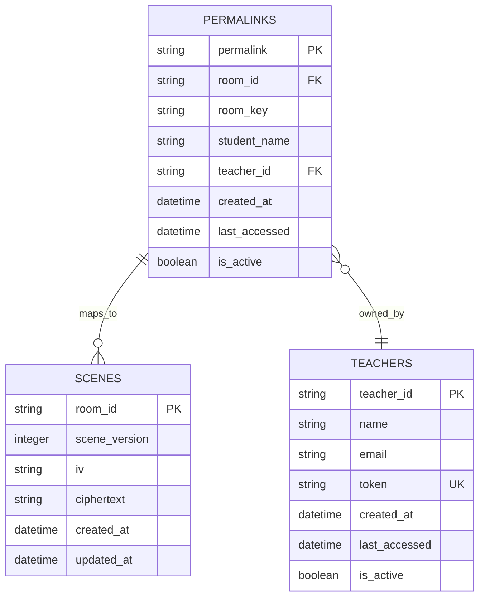
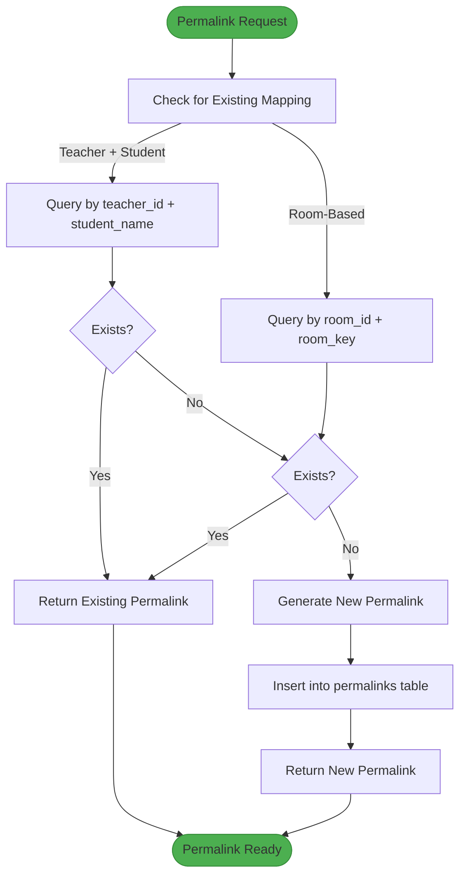
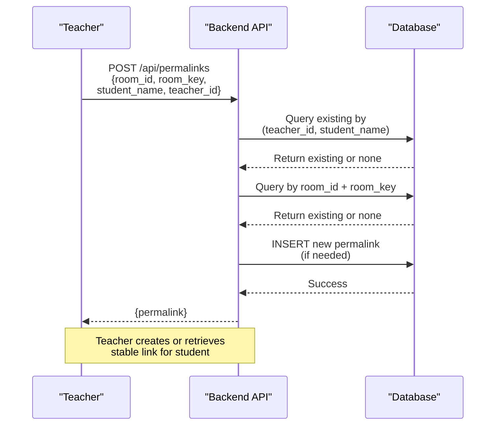
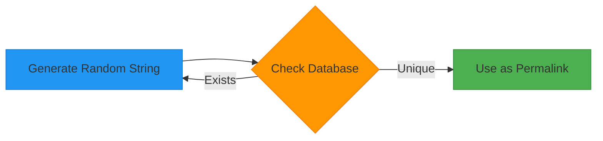

# Permalink Data Model

<cite>
**Referenced Files in This Document**   
- [db.ts](file://Backned/src/db.ts)
- [routes.ts](file://Backned/src/routes.ts)
- [server.ts](file://Backned/src/server.ts)
</cite>

## Table of Contents
1. [Introduction](#introduction)
2. [Database Schema](#database-schema)
3. [Permalink Lifecycle](#permalink-lifecycle)
4. [Collaboration Session Persistence](#collaboration-session-persistence)
5. [Teacher-Student Linking System](#teacher-student-linking-system)
6. [API Examples](#api-examples)
7. [Security Considerations](#security-considerations)
8. [Conclusion](#conclusion)

## Introduction
The Permalink data model enables persistent collaboration sessions in the Excalidraw application by mapping short, shareable URLs to collaboration rooms. This system supports both anonymous collaboration and structured teacher-student interactions, providing stable access to shared drawing environments. The implementation uses SQLite for persistence and Express.js for API endpoints, with permalinks serving as durable references to encrypted room data.

**Section sources**
- [db.ts](file://Backned/src/db.ts#L15-L45)
- [routes.ts](file://Backned/src/routes.ts#L1-L50)

## Database Schema
The permalink system is implemented through a dedicated `permalinks` table in the SQLite database, which stores the mapping between short URLs and collaboration rooms. The schema includes fields for tracking creation time, access patterns, and ownership relationships.



**Diagram sources**
- [db.ts](file://Backned/src/db.ts#L25-L35)

The `permalinks` table contains the following fields:
- **permalink**: Primary key, a randomly generated 8-character string serving as the short URL
- **room_id**: Foreign key referencing the collaboration room in the scenes table
- **room_key**: Encryption key used to decrypt the room content
- **student_name**: Optional name of the student associated with the permalink
- **teacher_id**: Optional reference to the teacher who created or manages the permalink
- **created_at**: Timestamp of permalink creation (defaults to current time)
- **last_accessed**: Timestamp of the last access, updated on each resolution
- **is_active**: Boolean flag indicating whether the permalink is active (soft delete mechanism)

Unique constraints ensure that each teacher-student combination has only one active permalink, preventing duplicate mappings while allowing multiple teachers to have students with the same name.

**Section sources**
- [db.ts](file://Backned/src/db.ts#L25-L45)

## Permalink Lifecycle
The lifecycle of a permalink spans from creation through active usage to eventual deactivation. Permalinks are created on demand when a user requests a shareable link for a collaboration room, either through direct creation or as part of the teacher-student linking system.

When a permalink is created, the system first checks for existing mappings to maintain link stability. If a room already has an active permalink with the same room key, that existing permalink is reused rather than creating a new one. This ensures that shared links remain consistent over time, even as the underlying scene data is updated.

Permalinks remain active indefinitely by default, but can be deactivated through API calls by authorized users (typically teachers or administrators). Deactivation is implemented as a soft delete using the `is_active` flag, which preserves historical data while preventing new access. The `last_accessed` timestamp is updated every time a permalink is resolved, enabling usage tracking and potential future expiration policies.



**Diagram sources**
- [routes.ts](file://Backned/src/routes.ts#L150-L200)

**Section sources**
- [routes.ts](file://Backned/src/routes.ts#L150-L200)
- [db.ts](file://Backned/src/db.ts#L25-L45)

## Collaboration Session Persistence
Permalinks enable persistent collaboration sessions by providing stable, shareable references to encrypted drawing rooms. When users access a permalink, they are directed to the same collaboration environment, allowing for ongoing teamwork on visual projects. The persistence mechanism works in conjunction with the scenes table, which stores the actual drawing data in encrypted form.

Each collaboration room maintains its state independently of the permalink system. The scenes table stores the current version of the drawing, initialization vector (IV), and ciphertext, with updates occurring whenever participants modify the content. The permalink serves as the access token to this room, decoupling the sharing mechanism from the storage mechanism.

This architecture supports both synchronous and asynchronous collaboration patterns. Multiple users can join the same room simultaneously through the same permalink, enabling real-time collaboration. Alternatively, users can access the room at different times, with each session building upon the previous work. The system automatically updates the `last_accessed` timestamp on each visit, providing insight into collaboration patterns without disrupting the user experience.

**Section sources**
- [db.ts](file://Backned/src/db.ts#L15-L25)
- [routes.ts](file://Backned/src/routes.ts#L70-L100)

## Teacher-Student Linking System
The permalink system is integrated with a teacher-student linking framework that enables educators to manage collaborative sessions with their students. Teachers are represented as first-class entities in the system, with unique identifiers and authentication tokens that grant them administrative control over their students' collaboration rooms.

Teachers can create permalinks that are associated with specific student names, establishing a persistent link between a student and their drawing environment. The system enforces uniqueness at the teacher-student level, ensuring that each student has only one active permalink per teacher. This prevents confusion and ensures that teachers can reliably access their students' work.

The API provides endpoints for teachers to list all active permalinks they manage, enabling oversight of their students' collaboration spaces. Teachers can also deactivate permalinks, effectively revoking access to specific collaboration rooms. These operations require teacher authentication via their unique token, ensuring that only authorized educators can manage their students' links.



**Diagram sources**
- [routes.ts](file://Backned/src/routes.ts#L150-L250)

**Section sources**
- [routes.ts](file://Backned/src/routes.ts#L150-L250)
- [db.ts](file://Backned/src/db.ts#L30-L45)

## API Examples
The permalink system exposes several RESTful endpoints for creating, resolving, and managing permalinks. These APIs follow standard HTTP conventions with JSON payloads and appropriate status codes.

### Creating a Permalink
**Request:**
```http
POST /api/permalinks
Content-Type: application/json

{
  "room_id": "abc123xyz",
  "room_key": "k9m2n4p7q8r",
  "student_name": "Alice Johnson",
  "teacher_id": "t789xyz"
}
```

**Response:**
```http
HTTP/1.1 200 OK
Content-Type: application/json

{
  "permalink": "a1b2c3d4"
}
```

### Resolving a Permalink
**Request:**
```http
GET /api/permalinks/a1b2c3d4
```

**Response:**
```http
HTTP/1.1 200 OK
Content-Type: application/json

{
  "roomId": "abc123xyz",
  "roomKey": "k9m2n4p7q8r",
  "studentName": "Alice Johnson"
}
```

### Listing Teacher's Permalinks
**Request:**
```http
GET /api/permalinks?teacher_id=t789xyz
```

**Response:**
```http
HTTP/1.1 200 OK
Content-Type: application/json

{
  "items": [
    {
      "permalink": "a1b2c3d4",
      "room_id": "abc123xyz",
      "room_key": "k9m2n4p7q8r",
      "student_name": "Alice Johnson",
      "created_at": "2024-01-15T10:30:00Z",
      "last_accessed": "2024-01-16T14:22:15Z",
      "is_active": 1
    }
  ]
}
```

### Deactivating a Permalink
**Request:**
```http
DELETE /api/permalinks/a1b2c3d4?teacher_id=t789xyz
```

**Response:**
```http
HTTP/1.1 200 OK
Content-Type: application/json

{
  "ok": true
}
```

**Section sources**
- [routes.ts](file://Backned/src/routes.ts#L150-L350)

## Security Considerations
The permalink system incorporates several security measures to protect collaboration rooms and ensure appropriate access control. These measures address token generation, collision prevention, and access authorization.

### Token Generation and Collision Prevention
Permalinks are generated using cryptographically secure random string generation, creating 8-character strings from a 36-character alphabet (a-z, 0-9). This provides approximately 2.8 trillion possible combinations, making brute force attacks impractical. The system checks for existing mappings before creating new permalinks, ensuring uniqueness at the database level through primary key constraints.



**Diagram sources**
- [routes.ts](file://Backned/src/routes.ts#L110-L120)

### Access Control
The system implements role-based access control through teacher tokens and admin tokens. Teacher operations on permalinks require authentication with a teacher-specific token, which is verified against the teachers table before any operation is permitted. This ensures that teachers can only manage permalinks associated with their own ID.

Admin endpoints are protected by an environment-configured admin token, restricting sensitive operations like bulk teacher creation to authorized personnel. All sensitive operations include input validation to prevent injection attacks and ensure data integrity.

The database schema includes appropriate indexes to support efficient lookups while maintaining security. The unique constraint on `(teacher_id, student_name)` prevents naming conflicts within a teacher's namespace, while the primary key on `permalink` ensures global uniqueness of shareable links.

**Section sources**
- [routes.ts](file://Backned/src/routes.ts#L120-L150)
- [db.ts](file://Backned/src/db.ts#L35-L45)

## Conclusion
The Permalink data model provides a robust foundation for persistent collaboration in the Excalidraw application. By mapping short, shareable URLs to encrypted drawing rooms, the system enables both casual collaboration and structured educational workflows. The integration with the teacher-student linking system allows educators to manage their students' collaborative spaces efficiently, while security measures ensure appropriate access control and data protection. The implementation balances usability with security, providing stable, persistent links while protecting against unauthorized access and ensuring data integrity.