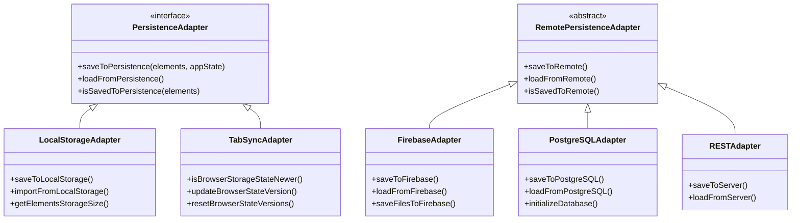

# Persistence Strategies

<cite>
**Referenced Files in This Document**   
- [localStorage.ts](file://excalidraw/excalidraw-app/data/localStorage.ts)
- [tabSync.ts](file://excalidraw/excalidraw-app/data/tabSync.ts)
- [restPersistence.ts](file://excalidraw/excalidraw-app/data/restPersistence.ts)
- [firebase.ts](file://excalidraw/excalidraw-app/data/firebase.ts)
- [postgresql.ts](file://excalidraw/excalidraw-app/data/postgresql.ts)
- [FileManager.ts](file://excalidraw/excalidraw-app/data/FileManager.ts)
- [index.ts](file://excalidraw/excalidraw-app/data/index.ts)
- [app_constants.ts](file://excalidraw/excalidraw-app/app_constants.ts)
</cite>

## Table of Contents
1. [Introduction](#introduction)
2. [Persistence Layer Hierarchy](#persistence-layer-hierarchy)
3. [Immediate Local Storage](#immediate-local-storage)
4. [Tab Synchronization](#tab-synchronization)
5. [Remote Persistence Mechanisms](#remote-persistence-mechanisms)
6. [Data Flow and Synchronization Triggers](#data-flow-and-synchronization-triggers)
7. [Persistence Adapter Interface and Implementation](#persistence-adapter-interface-and-implementation)
8. [Error Handling and Recovery](#error-handling-and-recovery)
9. [Performance Implications](#performance-implications)
10. [Conclusion](#conclusion)

## Introduction
Excalidraw implements a multi-layered persistence system designed to provide seamless user experience across different scenarios, from immediate local storage to collaborative real-time editing. This document details the architecture of Excalidraw's persistence mechanisms, focusing on the three-tiered approach: immediate local storage for data durability, tab synchronization for cross-tab consistency, and remote database persistence for collaboration and long-term storage. The system is designed to handle network interruptions gracefully while maintaining data integrity and providing responsive user interactions.

**Section sources**
- [index.ts](file://excalidraw/excalidraw-app/data/index.ts#L1-L343)
- [app_constants.ts](file://excalidraw/excalidraw-app/app_constants.ts#L1-L60)

## Persistence Layer Hierarchy
Excalidraw's persistence system operates on three distinct but interconnected layers, each serving a specific purpose in the data lifecycle:

1. **Immediate Local Storage**: Provides instant data durability by saving changes to the browser's localStorage, ensuring data persistence even if the user closes the tab unexpectedly.
2. **Tab Synchronization**: Coordinates state across multiple browser tabs using localStorage as a shared communication channel, ensuring consistency when users work with the same document in multiple tabs.
3. **Remote Persistence**: Handles collaboration and long-term storage through various backend mechanisms including Firebase, PostgreSQL, and REST APIs, enabling real-time collaboration and data recovery.

These layers work in concert to create a robust persistence system that prioritizes data safety while maintaining performance and responsiveness.

**Diagram sources**
- [localStorage.ts](file://excalidraw/excalidraw-app/data/localStorage.ts#L1-L102)
- [tabSync.ts](file://excalidraw/excalidraw-app/data/tabSync.ts#L1-L40)
- [restPersistence.ts](file://excalidraw/excalidraw-app/data/restPersistence.ts#L1-L114)

## Immediate Local Storage
The immediate local storage layer serves as the first line of defense against data loss, automatically saving the current state to the browser's localStorage. This mechanism ensures that even if a user accidentally closes the tab or experiences a browser crash, their work is preserved.

The implementation uses two primary storage keys defined in `app_constants.ts`: `LOCAL_STORAGE_ELEMENTS` for storing the drawing elements and `LOCAL_STORAGE_APP_STATE` for storing application state. The `importFromLocalStorage` function handles data retrieval, parsing stored JSON while applying necessary cleanup through `clearElementsForLocalStorage` and `clearAppStateForLocalStorage` to remove transient properties not meant for persistent storage.

A key aspect of this layer is its asynchronous nature - changes are not saved immediately but are debounced using the `SAVE_TO_LOCAL_STORAGE_TIMEOUT` constant (300ms), preventing excessive write operations during rapid editing sessions. This balance between data safety and performance ensures that the application remains responsive while still providing strong data durability guarantees.

**Section sources**
- [localStorage.ts](file://excalidraw/excalidraw-app/data/localStorage.ts#L1-L102)
- [app_constants.ts](file://excalidraw/excalidraw-app/app_constants.ts#L1-L60)

## Tab Synchronization
Tab synchronization enables seamless cross-tab operation, allowing users to work with the same document in multiple browser tabs without conflicts. This is achieved through a versioning system that uses localStorage as a shared communication channel between tabs.

The implementation in `tabSync.ts` maintains in-memory state versions (timestamps) for different data types, specifically `VERSION_DATA_STATE` and `VERSION_FILES`. When a tab saves data to localStorage, it also updates the corresponding version timestamp. Other tabs periodically check these timestamps using `isBrowserStorageStateNewer` to detect changes made by sibling tabs.

The synchronization process follows a pull-based model: each tab independently checks for newer versions in localStorage and updates its internal state accordingly. This decentralized approach eliminates the need for complex coordination mechanisms while ensuring eventual consistency across all tabs. The `SYNC_BROWSER_TABS_TIMEOUT` constant (50ms) controls the frequency of these checks, striking a balance between responsiveness and performance.

**Diagram sources**
- [tabSync.ts](file://excalidraw/excalidraw-app/data/tabSync.ts#L1-L40)
- [app_constants.ts](file://excalidraw/excalidraw-app/app_constants.ts#L1-L60)

## Remote Persistence Mechanisms
Excalidraw supports multiple remote persistence mechanisms to accommodate different deployment scenarios and collaboration requirements. These include Firebase, PostgreSQL, and REST-based persistence, each implementing a common interface for seamless integration.

### Firebase Persistence
The Firebase implementation in `firebase.ts` provides real-time collaboration capabilities using Firestore for scene data and Firebase Storage for binary files. Scene data is encrypted client-side before being stored in Firestore, with the encryption key never transmitted to the server. The implementation uses Firestore transactions to ensure data consistency during concurrent edits and maintains a scene version cache to optimize synchronization.

### PostgreSQL Persistence
The PostgreSQL implementation in `postgresql.ts` offers a self-hostable alternative for organizations preferring traditional relational databases. It uses a Node.js environment with the pg library to connect to the database, storing encrypted scene data in a dedicated `scenes` table. The implementation includes database initialization logic and handles connection configuration through environment variables, supporting both development and production deployments.

### REST Persistence
The REST-based persistence in `restPersistence.ts` provides a flexible interface for integrating with custom backend services. It communicates with a remote server through an API client, sending encrypted scene data and handling reconciliation of concurrent edits. This implementation is particularly useful for organizations with existing backend infrastructure or specific security requirements.

All remote persistence mechanisms share common characteristics: client-side encryption, scene versioning, and conflict resolution through element reconciliation.

**Section sources**
- [firebase.ts](file://excalidraw/excalidraw-app/data/firebase.ts#L1-L348)
- [postgresql.ts](file://excalidraw/excalidraw-app/data/postgresql.ts#L1-L282)
- [restPersistence.ts](file://excalidraw/excalidraw-app/data/restPersistence.ts#L1-L114)

## Data Flow and Synchronization Triggers
The data flow between persistence layers is carefully orchestrated to ensure data consistency while minimizing unnecessary operations. Changes flow from the application state through the persistence layers based on specific triggers and conditions.

### Synchronization Triggers
Synchronization is initiated by several events:
- **User interactions**: Direct edits to the drawing elements
- **Timer-based intervals**: The `SYNC_FULL_SCENE_INTERVAL_MS` (20,000ms) triggers periodic full scene synchronization
- **Tab focus changes**: When a tab gains focus, it checks for updates from other tabs
- **Network connectivity changes**: The system detects network status changes and adjusts synchronization behavior accordingly

### Data Flow Process
The data flow follows a hierarchical pattern:
1. Local changes are immediately written to localStorage
2. Other tabs detect these changes through version checking and update their local state
3. When collaboration is enabled, changes are sent to the remote persistence layer
4. Remote changes are propagated to all connected clients through the collaboration channel

The system uses scene versioning to determine when synchronization is needed, comparing the current scene version with the last saved version. This prevents unnecessary network operations when no changes have occurred.

**Diagram sources**
- [tabSync.ts](file://excalidraw/excalidraw-app/data/tabSync.ts#L1-L40)
- [restPersistence.ts](file://excalidraw/excalidraw-app/data/restPersistence.ts#L1-L114)
- [firebase.ts](file://excalidraw/excalidraw-app/data/firebase.ts#L1-L348)
- [app_constants.ts](file://excalidraw/excalidraw-app/app_constants.ts#L1-L60)

## Persistence Adapter Interface and Implementation
Excalidraw's persistence system follows a consistent adapter pattern, with each persistence mechanism implementing a common interface despite their different underlying technologies. This design enables seamless switching between persistence backends while maintaining a uniform API for the rest of the application.

### Common Interface Patterns
All persistence adapters share several key functions:
- `saveToX`: Saves the current scene state to the persistence layer
- `loadFromX`: Retrieves the scene state from the persistence layer
- `isSavedToX`: Checks whether the current state has been successfully saved
- Error handling and recovery mechanisms

### Implementation Details
The adapters implement several sophisticated patterns to ensure data integrity:

**Encryption**: All remote persistence mechanisms use client-side encryption with keys that never leave the browser. The `encryptData` and `decryptData` functions from the encryption module ensure that sensitive content remains private.

**Conflict Resolution**: When multiple users edit the same document concurrently, the system uses element reconciliation to merge changes. The `reconcileElements` function compares local and remote elements, preserving all changes while resolving conflicts based on element IDs and versioning.

**Caching**: Each adapter implements a scene version cache using WeakMap to associate sockets with scene versions. This optimization prevents unnecessary network requests when the local state is already up-to-date.

**Transaction Management**: The PostgreSQL and Firebase implementations use database transactions to ensure atomicity of write operations, preventing partial updates that could corrupt the scene data.

**Diagram sources**
- [localStorage.ts](file://excalidraw/excalidraw-app/data/localStorage.ts#L1-L102)
- [tabSync.ts](file://excalidraw/excalidraw-app/data/tabSync.ts#L1-L40)
- [restPersistence.ts](file://excalidraw/excalidraw-app/data/restPersistence.ts#L1-L114)
- [firebase.ts](file://excalidraw/excalidraw-app/data/firebase.ts#L1-L348)
- [postgresql.ts](file://excalidraw/excalidraw-app/data/postgresql.ts#L1-L282)

## Error Handling and Recovery
The persistence system implements comprehensive error handling strategies to maintain data integrity and provide a resilient user experience during failures.

### Error Detection and Classification
Errors are categorized and handled differently based on their source and severity:
- **LocalStorage errors**: Typically related to quota limits or permission issues, handled by graceful degradation
- **Network errors**: Include timeouts, connection failures, and server errors, handled with retry mechanisms
- **Encryption/decryption errors**: Critical errors that may indicate data corruption or key mismatches

### Recovery Mechanisms
The system employs several recovery strategies:
- **Automatic retries**: Network operations are retried with exponential backoff
- **Fallback storage**: When remote persistence fails, data remains available in local storage
- **Error state tracking**: The FileManager class tracks the status of individual files, preventing repeated failed operations
- **User notifications**: Critical errors are communicated to users through alert dialogs

The FileManager class plays a crucial role in error handling, maintaining separate maps for files being fetched, saved, successfully saved, and errored. This allows the system to make intelligent decisions about which operations to attempt and when to prevent page unload based on the state of file operations.

**Diagram sources**
- [FileManager.ts](file://excalidraw/excalidraw-app/data/FileManager.ts#L1-L275)
- [firebase.ts](file://excalidraw/excalidraw-app/data/firebase.ts#L1-L348)
- [restPersistence.ts](file://excalidraw/excalidraw-app/data/restPersistence.ts#L1-L114)

## Performance Implications
The multi-layered persistence system has several performance implications that are carefully balanced to maintain a responsive user experience.

### Latency Considerations
- **Local operations**: Immediate localStorage writes complete in milliseconds, providing instant feedback
- **Tab synchronization**: 50ms polling interval ensures near-real-time consistency with minimal performance impact
- **Remote operations**: Network latency varies but is mitigated through asynchronous operations and optimistic UI updates

### Resource Usage
The system is designed to minimize resource consumption:
- **Memory**: Version caches use WeakMap to avoid memory leaks
- **CPU**: Encryption operations are optimized and performed asynchronously
- **Network**: Data is compressed before transmission, reducing bandwidth usage

### Network Interruption Handling
During network outages, the system gracefully degrades functionality:
- Local editing remains fully functional
- Changes are queued for later synchronization
- Users are notified of connectivity status
- The application prevents unload only when critical operations are in progress

The `FILE_UPLOAD_MAX_BYTES` constant (3MB) limits the size of individual files, preventing performance issues from large file uploads. Similarly, the debounced saving to localStorage (`SAVE_TO_LOCAL_STORAGE_TIMEOUT` = 300ms) prevents excessive write operations during rapid editing sessions.

**Section sources**
- [app_constants.ts](file://excalidraw/excalidraw-app/app_constants.ts#L1-L60)
- [FileManager.ts](file://excalidraw/excalidraw-app/data/FileManager.ts#L1-L275)
- [localStorage.ts](file://excalidraw/excalidraw-app/data/localStorage.ts#L1-L102)

## Conclusion
Excalidraw's multi-layered persistence system represents a sophisticated approach to data management in web applications. By combining immediate local storage, cross-tab synchronization, and multiple remote persistence options, the system provides robust data durability while maintaining excellent performance and user experience. The architecture demonstrates several best practices in modern web development, including client-side encryption, conflict-free data reconciliation, and graceful degradation during network failures. The adapter pattern used for persistence mechanisms allows for flexibility in deployment scenarios while maintaining a consistent interface for the application logic. This comprehensive approach ensures that users can trust the system to preserve their work across devices, tabs, and network conditions.