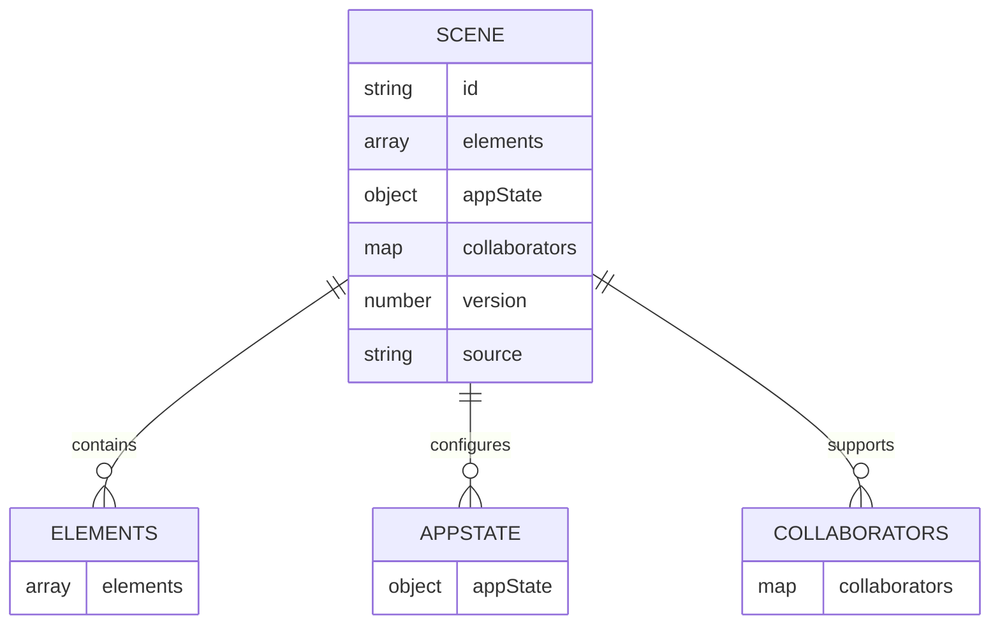
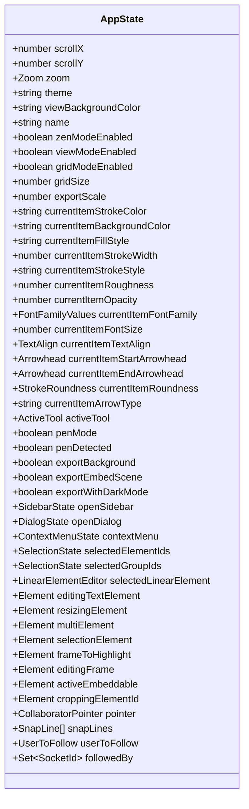
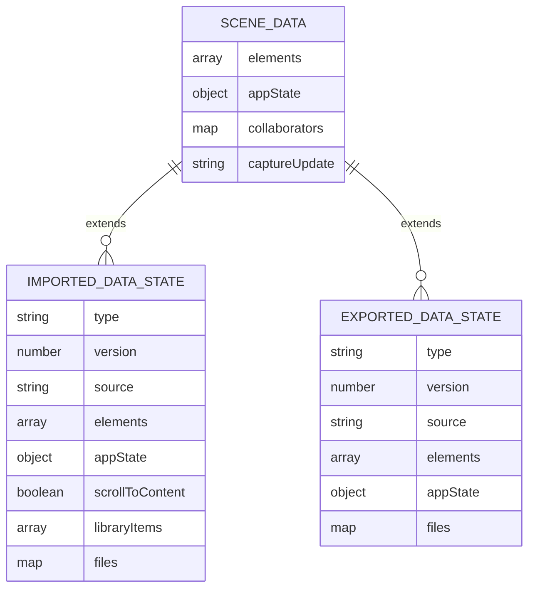
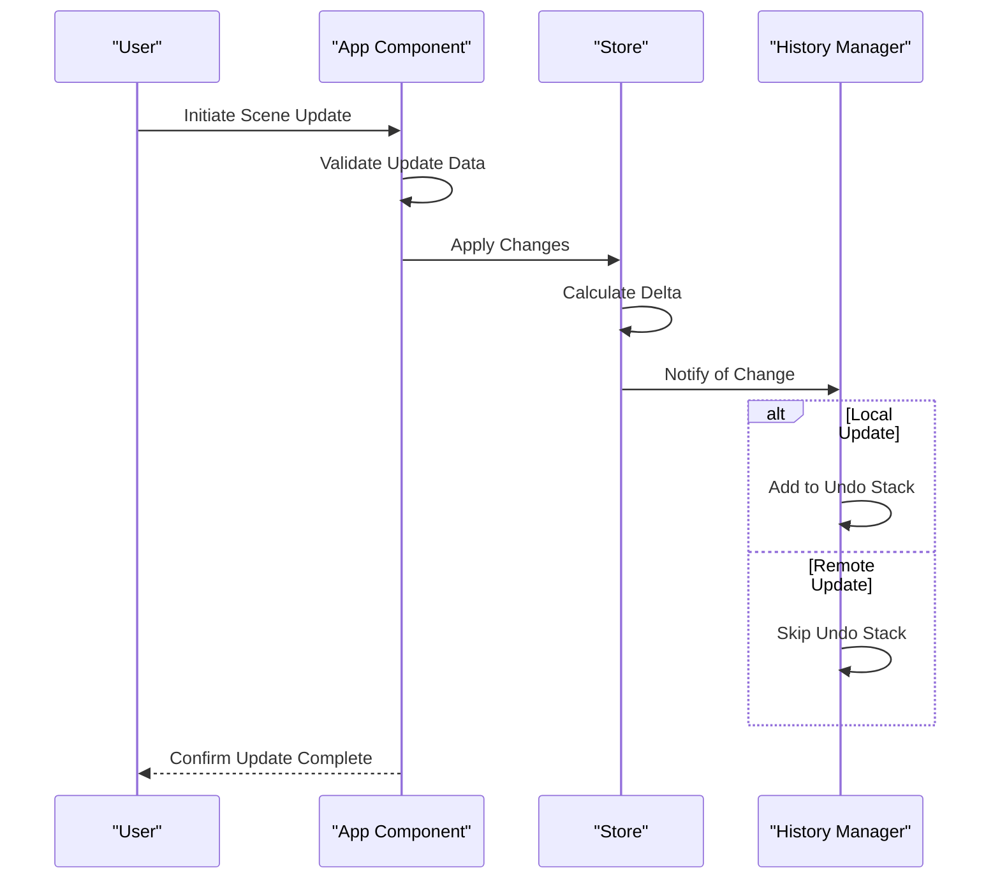
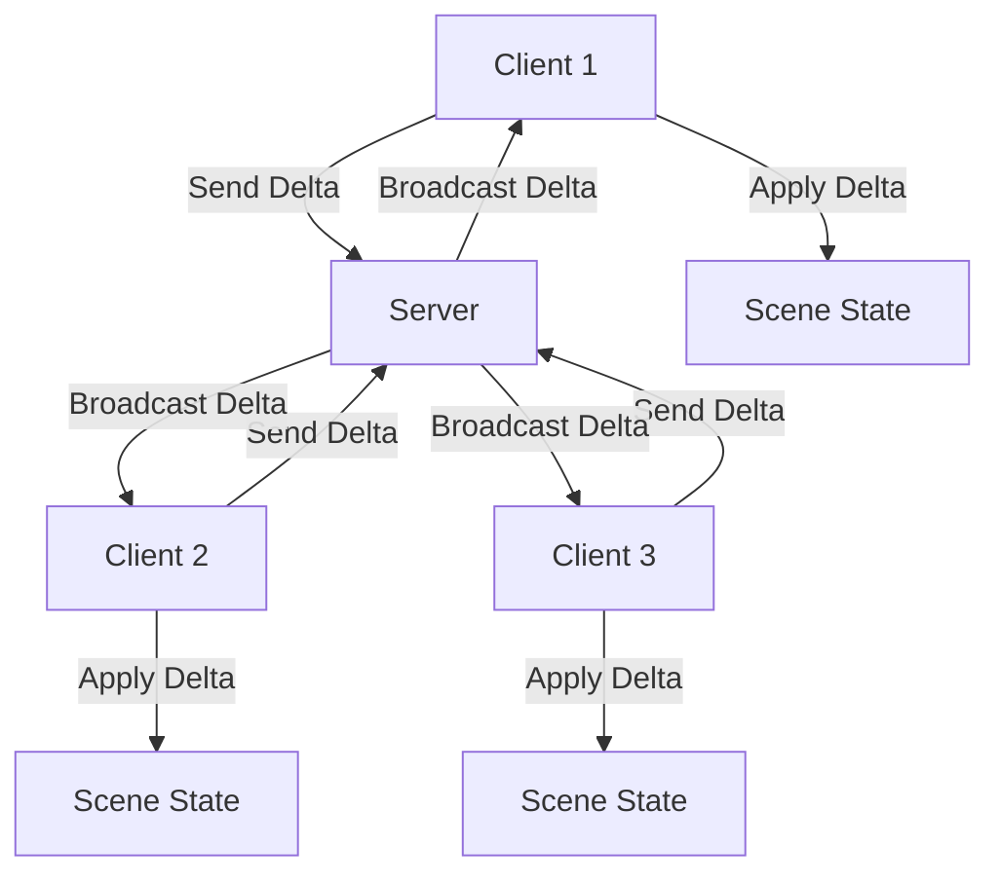
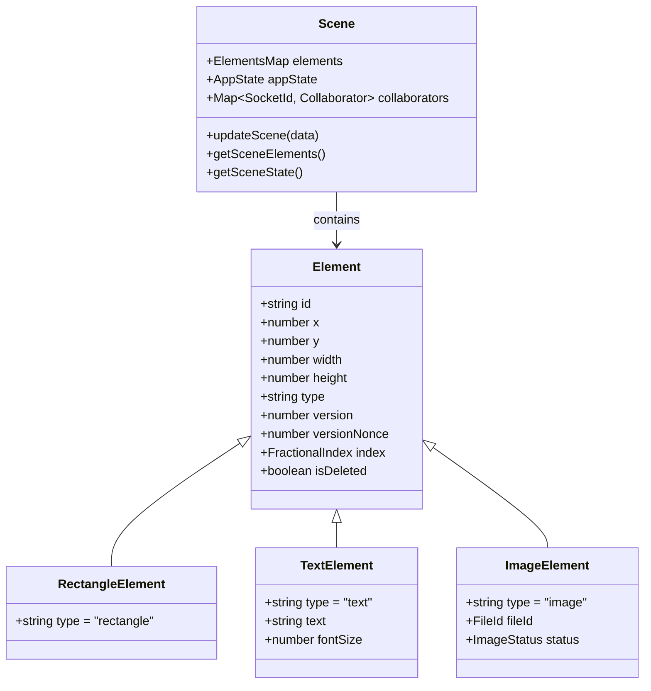

# Scene Data Model

<cite>
**Referenced Files in This Document**   
- [App.tsx](file://excalidraw/packages/excalidraw/components/App.tsx)
- [types.ts](file://excalidraw/packages/excalidraw/types.ts)
- [types.ts](file://excalidraw/packages/element/src/types.ts)
- [store.ts](file://excalidraw/packages/element/src/store.ts)
- [data/types.ts](file://excalidraw/packages/excalidraw/data/types.ts)
</cite>

## Table of Contents
1. [Introduction](#introduction)
2. [Scene Structure](#scene-structure)
3. [Elements](#elements)
4. [AppState](#appstate)
5. [Collaborators](#collaborators)
6. [Metadata and Versioning](#metadata-and-versioning)
7. [Scene Serialization and JSON Schema](#scene-serialization-and-json-schema)
8. [Scene Creation and Update Process](#scene-creation-and-update-process)
9. [Client-Server Synchronization](#client-server-synchronization)
10. [Scene and Element Relationship](#scene-and-element-relationship)
11. [Validation Rules and Size Limitations](#validation-rules-and-size-limitations)
12. [Performance Considerations](#performance-considerations)
13. [Example Scene Payloads](#example-scene-payloads)

## Introduction
The Scene entity in Excalidraw represents the complete state of a drawing canvas, encompassing all visual elements, user interface state, collaboration data, and metadata. This document provides a comprehensive analysis of the Scene data model, detailing its structure, serialization format, and operational mechanics. The Scene serves as the central data structure that maintains the integrity and consistency of user drawings across different sessions and collaboration scenarios.

## Scene Structure
The Scene in Excalidraw is composed of several key components that work together to represent the complete state of a drawing. These components include elements (the visual objects on the canvas), appState (user interface and application settings), collaborators (real-time collaboration data), and metadata (versioning and source information). The Scene structure is designed to be serializable to JSON for storage and transmission, while maintaining the ability to reconstruct the complete drawing state when loaded.

**Diagram sources**
- [types.ts](file://excalidraw/packages/excalidraw/types.ts#L622-L627)
- [data/types.ts](file://excalidraw/packages/excalidraw/data/types.ts#L33-L48)

**Section sources**
- [types.ts](file://excalidraw/packages/excalidraw/types.ts#L622-L627)
- [data/types.ts](file://excalidraw/packages/excalidraw/data/types.ts#L33-L48)

## Elements
Elements represent the individual visual components within a Scene, such as rectangles, arrows, text, and images. Each element is a structured object with properties that define its appearance, position, and behavior. Elements are stored as an array within the Scene and are identified by unique IDs. The elements array maintains the z-order of objects on the canvas, with later elements appearing above earlier ones.

**Section sources**
- [types.ts](file://excalidraw/packages/element/src/types.ts#L200-L205)
- [types.ts](file://excalidraw/packages/element/src/types.ts#L350-L355)

## AppState
The appState object contains all user interface settings and application state that is not directly related to the visual elements on the canvas. This includes properties such as zoom level, scroll position, selected tools, color preferences, and UI visibility states. The appState is crucial for restoring the exact user experience when a Scene is reloaded, ensuring that the canvas appears exactly as the user left it.

**Diagram sources**
- [types.ts](file://excalidraw/packages/excalidraw/types.ts#L200-L600)
- [types.ts](file://excalidraw/packages/excalidraw/types.ts#L601-L621)

**Section sources**
- [types.ts](file://excalidraw/packages/excalidraw/types.ts#L200-L621)

## Collaborators
The collaborators component of the Scene model manages real-time collaboration features, tracking the presence and activities of multiple users working on the same drawing. Collaborators are represented as a map with socket IDs as keys and collaborator objects as values. Each collaborator object contains information about the user's current pointer position, selected elements, username, and avatar. This data enables features like cursor sharing, presence indication, and collaborative editing.

**Section sources**
- [types.ts](file://excalidraw/packages/excalidraw/types.ts#L50-L99)
- [App.tsx](file://excalidraw/packages/excalidraw/components/App.tsx#L3880-L3912)

## Metadata and Versioning
Scene metadata includes versioning information and source identification, which are critical for maintaining backward compatibility and tracking the origin of drawing data. The version number allows the application to handle schema changes over time, while the source field identifies the application or service that created the Scene. This metadata ensures that Scenes can be properly interpreted even as the data model evolves.

**Section sources**
- [data/types.ts](file://excalidraw/packages/excalidraw/data/types.ts#L33-L48)
- [types.ts](file://excalidraw/packages/excalidraw/types.ts#L622-L627)

## Scene Serialization and JSON Schema
The Scene is serialized to JSON using a well-defined schema that includes elements, appState, collaborators, and metadata. The JSON schema supports optional fields to accommodate different use cases and ensure backward compatibility. The serialization process converts complex data types like maps and sets into plain JavaScript objects that can be safely stringified. The resulting JSON payload can be stored, transmitted, or embedded in other documents.

**Diagram sources**
- [data/types.ts](file://excalidraw/packages/excalidraw/data/types.ts#L33-L48)
- [types.ts](file://excalidraw/packages/excalidraw/types.ts#L622-L627)

**Section sources**
- [data/types.ts](file://excalidraw/packages/excalidraw/data/types.ts#L33-L48)
- [types.ts](file://excalidraw/packages/excalidraw/types.ts#L622-L627)

## Scene Creation and Update Process
Scenes are created and updated through a structured process that ensures data consistency and enables features like undo/redo and collaboration. The updateScene method in the App component handles Scene modifications, accepting partial updates to elements, appState, and collaborators. The captureUpdate parameter controls how updates are handled in the undo/redo stack, with options for immediate capture, eventual capture, or no capture (for remote updates).

**Diagram sources**
- [App.tsx](file://excalidraw/packages/excalidraw/components/App.tsx#L3880-L3912)
- [store.ts](file://excalidraw/packages/element/src/store.ts#L695-L735)

**Section sources**
- [App.tsx](file://excalidraw/packages/excalidraw/components/App.tsx#L3880-L3912)
- [store.ts](file://excalidraw/packages/element/src/store.ts#L695-L735)

## Client-Server Synchronization
Scene synchronization between client and server is managed through a delta-based update system that minimizes data transfer and ensures consistency. The Store class handles the creation and application of deltas, which represent the differences between Scene states. During collaboration, clients send deltas to the server, which broadcasts them to other clients. Each client applies the received deltas to its local Scene, maintaining synchronization across all participants.

**Diagram sources**
- [store.ts](file://excalidraw/packages/element/src/store.ts#L533-L585)
- [store.ts](file://excalidraw/packages/element/src/store.ts#L587-L640)

**Section sources**
- [store.ts](file://excalidraw/packages/element/src/store.ts#L533-L640)

## Scene and Element Relationship
The relationship between Scene and Element entities is fundamental to the Excalidraw architecture. The Scene acts as a container and coordinator for Elements, managing their lifecycle, rendering order, and interactions. Elements are independent objects that contain their own state and behavior, but they rely on the Scene for context and coordination. This separation of concerns allows for efficient rendering, manipulation, and serialization of complex drawings.

**Diagram sources**
- [types.ts](file://excalidraw/packages/element/src/types.ts#L200-L205)
- [types.ts](file://excalidraw/packages/element/src/types.ts#L350-L355)

**Section sources**
- [types.ts](file://excalidraw/packages/element/src/types.ts#L200-L355)

## Validation Rules and Size Limitations
The Scene data model includes validation rules and size limitations to ensure data integrity and performance. Elements are validated for required properties and valid values, with constraints on dimensions, colors, and other attributes. Size limitations are enforced to prevent excessive memory usage and maintain responsive performance, particularly for large drawings with many elements. The validation process occurs during Scene creation, updates, and deserialization.

**Section sources**
- [types.ts](file://excalidraw/packages/element/src/types.ts#L200-L355)
- [store.ts](file://excalidraw/packages/element/src/store.ts#L695-L735)

## Performance Considerations
Performance optimization is a key consideration in the Scene data model design. Large scenes with many elements are managed through efficient data structures and algorithms that minimize memory usage and maximize rendering performance. The use of maps for element lookup, fractional indexing for ordering, and delta-based updates for synchronization all contribute to the overall performance. Additionally, features like view frustum culling and lazy loading of images help maintain responsiveness even with complex drawings.

**Section sources**
- [store.ts](file://excalidraw/packages/element/src/store.ts#L533-L640)
- [types.ts](file://excalidraw/packages/element/src/types.ts#L400-L438)

## Example Scene Payloads
Example Scene payloads demonstrate the actual JSON structure used in API interactions. These examples show how elements, appState, and collaborators are represented in the serialized format, including versioning information and metadata. The payloads illustrate both minimal scenes with a few elements and complex scenes with multiple layers of elements, text, and images.

**Section sources**
- [data/types.ts](file://excalidraw/packages/excalidraw/data/types.ts#L33-L48)
- [types.ts](file://excalidraw/packages/excalidraw/types.ts#L622-L627)