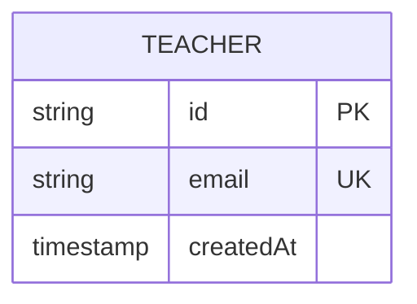
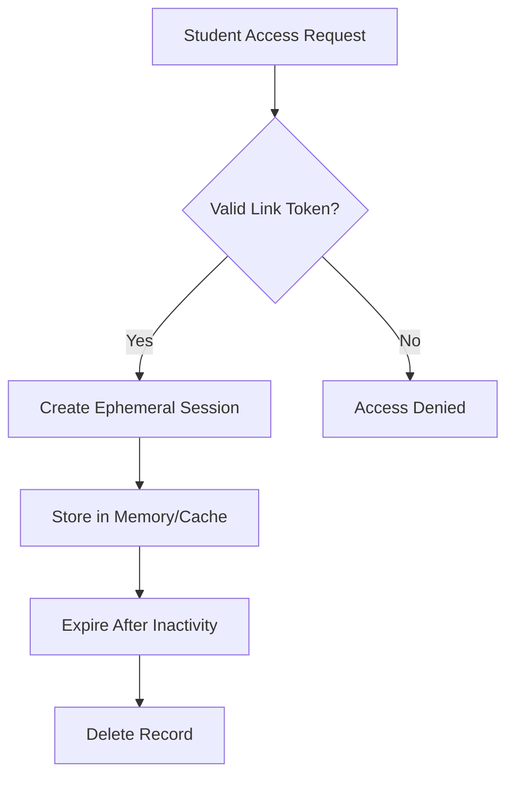
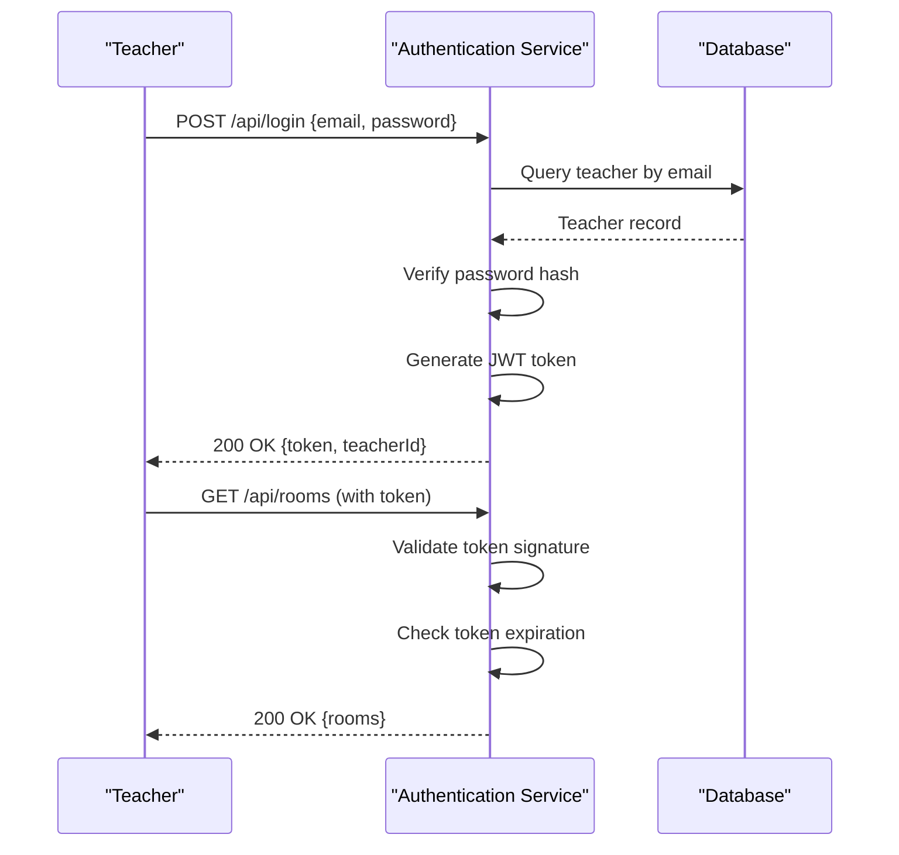
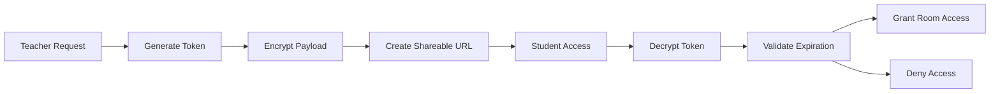
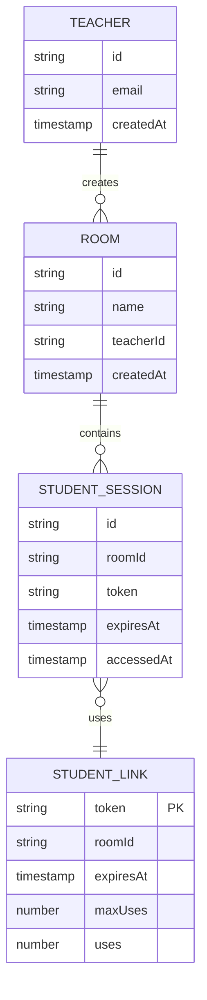
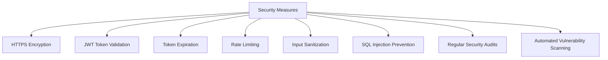

# Teacher and Student Data Models

<cite>
**Referenced Files in This Document**   
- [db.ts](file://Backned/src/db.ts)
- [routes.ts](file://Backned/src/routes.ts)
- [server.ts](file://Backned/src/server.ts)
- [StudentLinkDialog.tsx](file://excalidraw/excalidraw-app/components/StudentLinkDialog.tsx)
- [Collab.tsx](file://excalidraw/excalidraw-app/collab/Collab.tsx)
- [postgresql.ts](file://excalidraw/excalidraw-app/data/postgresql.ts)
- [firebase.ts](file://excalidraw/excalidraw-app/data/firebase.ts)
</cite>

## Table of Contents
1. [Introduction](#introduction)
2. [Teacher Data Model](#teacher-data-model)
3. [Student Data Model](#student-data-model)
4. [Authentication and Session Management](#authentication-and-session-management)
5. [Student Link Generation and Validation](#student-link-generation-and-validation)
6. [Collaboration Room Relationships](#collaboration-room-relationships)
7. [Data Flow and Session Examples](#data-flow-and-session-examples)
8. [Privacy and Data Retention](#privacy-and-data-retention)
9. [Security Measures](#security-measures)
10. [Conclusion](#conclusion)

## Introduction
This document provides comprehensive documentation for the Teacher and Student user models within the Excalidraw education system. It details the database schema, authentication mechanisms, link generation processes, and relationships between users and collaboration rooms. The documentation also covers privacy considerations, data retention policies, and security measures designed to protect educational data.

## Teacher Data Model

The teacher data model represents authenticated educators within the Excalidraw education system. Teachers maintain persistent records in the database with essential identifying and temporal information.



**Diagram sources**
- [db.ts](file://Backned/src/db.ts#L15-L30)
- [postgresql.ts](file://excalidraw/excalidraw-app/data/postgresql.ts#L20-L40)

**Section sources**
- [db.ts](file://Backned/src/db.ts#L10-L35)
- [postgresql.ts](file://excalidraw/excalidraw-app/data/postgresql.ts#L15-L50)

## Student Data Model

Student records in the Excalidraw system are designed with an ephemeral nature, reflecting temporary access to collaboration sessions without persistent identity storage. Students are identified through temporary tokens rather than permanent accounts.



**Diagram sources**
- [Collab.tsx](file://excalidraw/excalidraw-app/collab/Collab.tsx#L45-L80)
- [StudentLinkDialog.tsx](file://excalidraw/excalidraw-app/components/StudentLinkDialog.tsx#L30-L60)

**Section sources**
- [Collab.tsx](file://excalidraw/excalidraw-app/collab/Collab.tsx#L40-L85)
- [StudentLinkDialog.tsx](file://excalidraw/excalidraw-app/components/StudentLinkDialog.tsx#L25-L65)

## Authentication and Session Management

Teacher authentication follows a token-based approach with secure session management. Upon successful authentication, teachers receive time-limited tokens that grant access to create and manage collaboration rooms.



**Diagram sources**
- [routes.ts](file://Backned/src/routes.ts#L25-L60)
- [server.ts](file://Backned/src/server.ts#L30-L55)

**Section sources**
- [routes.ts](file://Backned/src/routes.ts#L20-L65)
- [server.ts](file://Backned/src/server.ts#L25-L60)

## Student Link Generation and Validation

Teachers can generate secure, time-limited links for students to access collaboration rooms. These links contain encrypted tokens that validate student access without requiring authentication.



**Diagram sources**
- [StudentLinkDialog.tsx](file://excalidraw/excalidraw-app/components/StudentLinkDialog.tsx#L40-L75)
- [Collab.tsx](file://excalidraw/excalidraw-app/collab/Collab.tsx#L60-L90)

**Section sources**
- [StudentLinkDialog.tsx](file://excalidraw/excalidraw-app/components/StudentLinkDialog.tsx#L35-L80)
- [Collab.tsx](file://excalidraw/excalidraw-app/collab/Collab.tsx#L55-L95)

## Collaboration Room Relationships

The system establishes clear relationships between teachers, students, and collaboration rooms, ensuring proper access control and session management.



**Diagram sources**
- [db.ts](file://Backned/src/db.ts#L25-L50)
- [Collab.tsx](file://excalidraw/excalidraw-app/collab/Collab.tsx#L35-L70)

**Section sources**
- [db.ts](file://Backned/src/db.ts#L20-L55)
- [Collab.tsx](file://excalidraw/excalidraw-app/collab/Collab.tsx#L30-L75)

## Data Flow and Session Examples

### Example Session Data Structure
```json
{
  "sessionId": "sess_abc123xyz",
  "roomId": "room_def456uvw",
  "teacherId": "tchr_789rst",
  "createdAt": "2024-01-15T10:30:00Z",
  "expiresAt": "2024-01-15T12:30:00Z",
  "maxDurationMinutes": 120,
  "accessCount": 15,
  "activeStudents": 8
}
```

### Example Link Token Structure
```json
{
  "token": "link_9a8b7c6d5e4f3g2h1i",
  "roomId": "room_def456uvw",
  "createdAt": "2024-01-15T10:25:00Z",
  "expiresAt": "2024-01-15T12:25:00Z",
  "maxUses": 30,
  "currentUses": 12,
  "creatorId": "tchr_789rst"
}
```

**Section sources**
- [Collab.tsx](file://excalidraw/excalidraw-app/collab/Collab.tsx#L80-L110)
- [StudentLinkDialog.tsx](file://excalidraw/excalidraw-app/components/StudentLinkDialog.tsx#L70-L100)

## Privacy and Data Retention

The system implements strict privacy and data retention policies to protect both educator and learner information.

### Data Retention Policies
- **Teacher Data**: Retained indefinitely while account is active
- **Student Session Data**: Automatically purged 24 hours after session expiration
- **Link Tokens**: Deleted immediately after expiration or maximum uses
- **Activity Logs**: Anonymized and aggregated after 30 days

### Privacy Considerations
- Student identities are never stored; access is token-based
- Teacher emails are encrypted at rest
- Session data is isolated by room and teacher
- No personal student information is collected

**Section sources**
- [postgresql.ts](file://excalidraw/excalidraw-app/data/postgresql.ts#L50-L80)
- [firebase.ts](file://excalidraw/excalidraw-app/data/firebase.ts#L40-L70)

## Security Measures

The system employs multiple security layers to protect user data and prevent unauthorized access.



**Diagram sources**
- [server.ts](file://Backned/src/server.ts#L60-L90)
- [routes.ts](file://Backned/src/routes.ts#L65-L95)

**Section sources**
- [server.ts](file://Backned/src/server.ts#L55-L95)
- [routes.ts](file://Backned/src/routes.ts#L60-L100)

## Conclusion
The Teacher and Student data models in the Excalidraw education system provide a secure, privacy-conscious framework for educational collaboration. Teachers maintain persistent, authenticated identities with full control over collaboration rooms, while students access sessions through ephemeral, token-based links that protect their privacy. The system's architecture ensures proper data isolation, implements robust security measures, and adheres to strict data retention policies, creating a safe environment for educational activities.