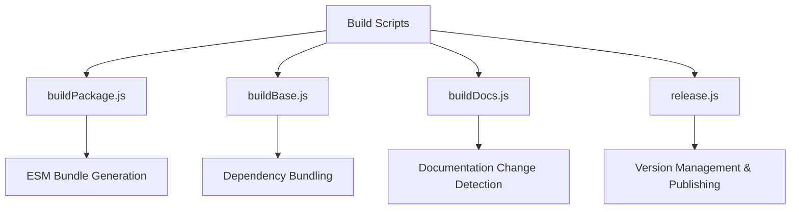
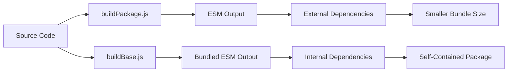
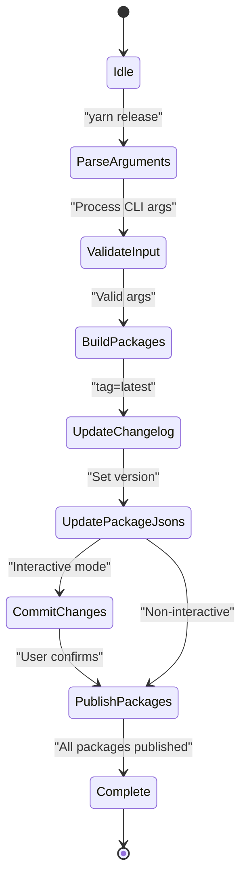
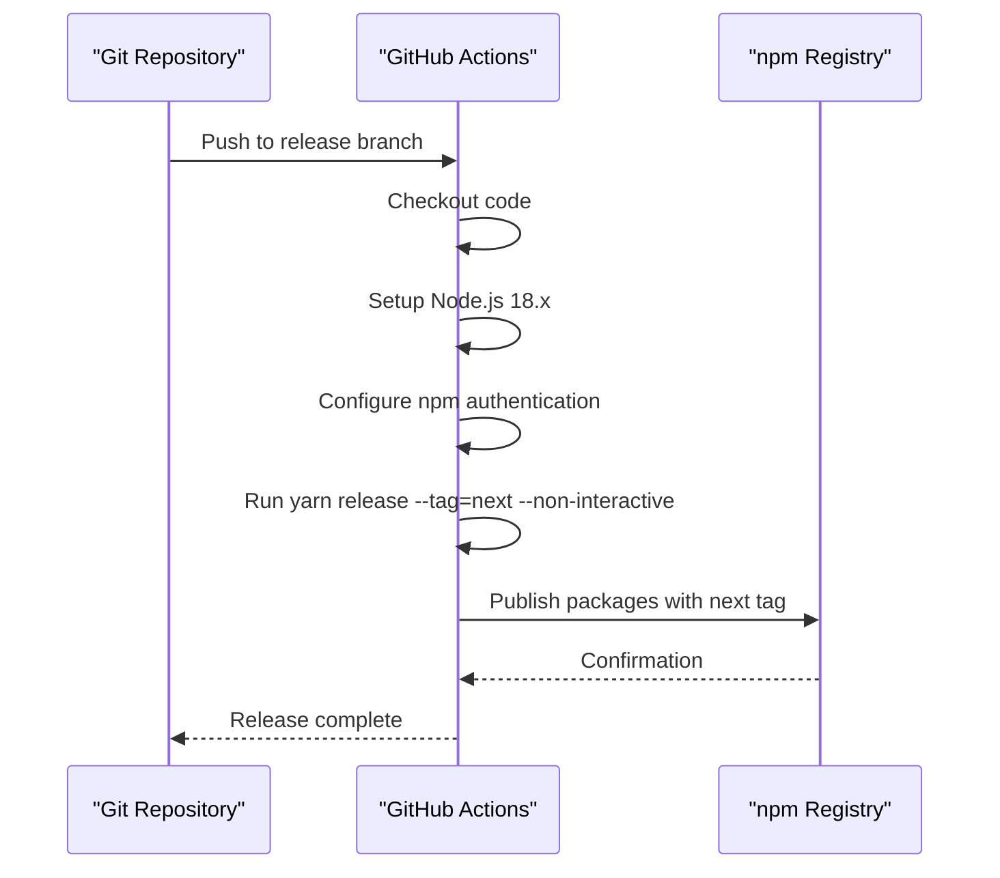
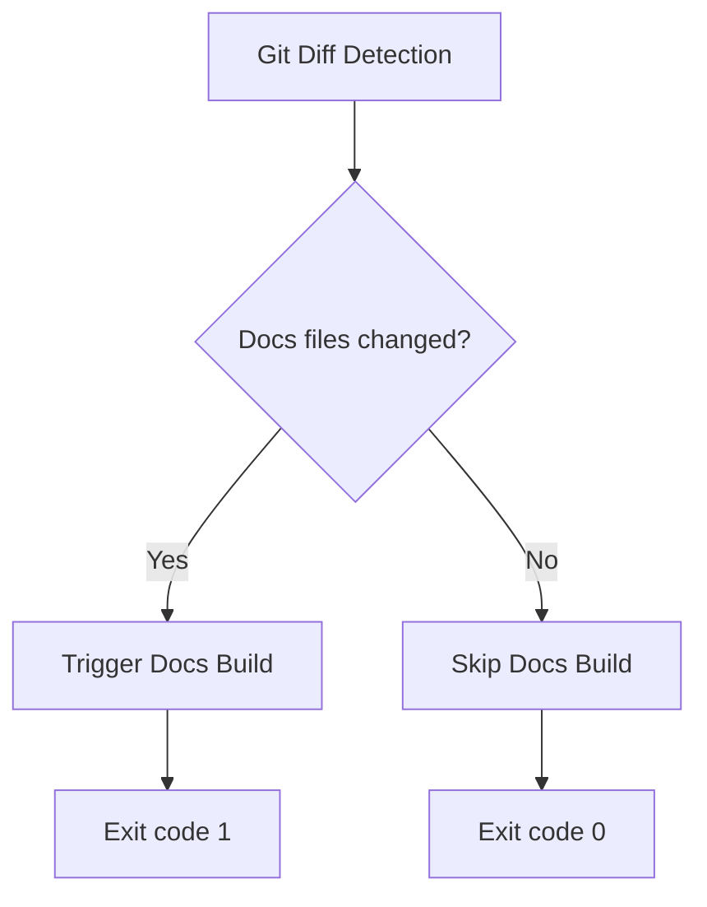

# Build and Release Process

<cite>
**Referenced Files in This Document**   
- [buildPackage.js](file://scripts/buildPackage.js)
- [buildBase.js](file://scripts/buildBase.js)
- [release.js](file://scripts/release.js)
- [autorelease-excalidraw.yml](file://.github/workflows/autorelease-excalidraw.yml)
- [publish-docker.yml](file://.github/workflows/publish-docker.yml)
- [buildDocs.js](file://scripts/buildDocs.js)
</cite>

## Table of Contents
1. [Introduction](#introduction)
2. [Build Scripts Overview](#build-scripts-overview)
3. [Package Compilation Process](#package-compilation-process)
4. [Release Management](#release-management)
5. [CI/CD Automation](#cicd-automation)
6. [Documentation and Examples Build](#documentation-and-examples-build)
7. [Artifact Generation and Publishing](#artifact-generation-and-publishing)
8. [Conclusion](#conclusion)

## Introduction
The Excalidraw monorepo employs a sophisticated build and release infrastructure to manage package compilation, versioning, and deployment. This system combines custom build scripts with GitHub Actions workflows to automate the generation of distributable assets, npm package publishing, and Docker image creation. The process ensures consistent, reliable releases across multiple packages while supporting both development and production environments.

## Build Scripts Overview

The build infrastructure is powered by a collection of Node.js scripts located in the `scripts/` directory. These scripts leverage esbuild for fast compilation and handle different aspects of the build process.

**Diagram sources**
- [buildPackage.js](file://scripts/buildPackage.js#L1-L80)
- [buildBase.js](file://scripts/buildBase.js#L1-L49)
- [buildDocs.js](file://scripts/buildDocs.js#L1-L21)
- [release.js](file://scripts/release.js#L1-L239)

**Section sources**
- [buildPackage.js](file://scripts/buildPackage.js#L1-L80)
- [buildBase.js](file://scripts/buildBase.js#L1-L49)

## Package Compilation Process

The build system uses two primary scripts to compile packages: `buildPackage.js` and `buildBase.js`. These scripts configure esbuild with different settings to produce optimized outputs for various use cases.

### buildPackage.js Configuration
This script creates ESM (ECMAScript Module) builds with external dependencies excluded, allowing for tree-shaking and smaller bundle sizes. It generates both development and production builds with appropriate source maps and minification.

**Key features:**
- Externalizes `@excalidraw/common`, `@excalidraw/element`, and `@excalidraw/math` dependencies
- Uses Sass plugin for CSS preprocessing
- Generates chunked output with hashed filenames for cache busting
- Supports environment variable injection through `.env` files
- Produces both development (unminified with source maps) and production (minified) builds

### buildBase.js Configuration
This script creates fully bundled ESM builds that include all dependencies. It's designed for scenarios where a complete, self-contained package is required.

**Key differences from buildPackage.js:**
- Bundles all dependencies internally
- Simpler configuration with single entry point
- No splitting or chunking of output
- Minimal external dependencies

**Diagram sources**
- [buildPackage.js](file://scripts/buildPackage.js#L1-L80)
- [buildBase.js](file://scripts/buildBase.js#L1-L49)

**Section sources**
- [buildPackage.js](file://scripts/buildPackage.js#L1-L80)
- [buildBase.js](file://scripts/buildBase.js#L1-L49)

## Release Management

The `release.js` script orchestrates the entire release process, handling version management, changelog updates, package building, and npm publishing. It supports multiple release channels and provides both interactive and non-interactive modes.

### Release Channels
The system supports three release tags:
- **test**: For testing releases with commit hash suffixes
- **next**: For prerelease versions
- **latest**: For stable production releases

**Diagram sources**
- [release.js](file://scripts/release.js#L1-L239)

### Version Management
The release script implements sophisticated version management:
- For `latest` releases: Requires explicit version parameter
- For `next` and `test` releases: Derives version from current package version plus commit hash
- Ensures idempotency by checking if hash is already present
- Updates all relevant `package.json` files atomically

### Package Synchronization
The script maintains version consistency across all packages by:
1. Reading current version from `@excalidraw/excalidraw` package
2. Updating version in all monorepo packages (`common`, `math`, `element`, `excalidraw`)
3. Updating dependency versions within packages to match the new version
4. Writing all changes atomically to prevent inconsistent states

**Section sources**
- [release.js](file://scripts/release.js#L1-L239)

## CI/CD Automation

GitHub Actions workflows automate key aspects of the build and release process, ensuring consistent execution across environments.

### Auto-Release Workflow
The `autorelease-excalidraw.yml` workflow triggers automatic releases when changes are pushed to the `release` branch:

**Diagram sources**
- [autorelease-excalidraw.yml](file://.github/workflows/autorelease-excalidraw.yml#L1-L27)

### Docker Publishing Workflow
The `publish-docker.yml` workflow handles Docker image creation and publishing:

**Key features:**
- Multi-platform support (amd64, arm64, arm/v7)
- Automated login to DockerHub using secrets
- Buildx for efficient cross-platform builds
- Tags images as `excalidraw/excalidraw:latest`

**Section sources**
- [autorelease-excalidraw.yml](file://.github/workflows/autorelease-excalidraw.yml#L1-L27)
- [publish-docker.yml](file://.github/workflows/publish-docker.yml#L1-L30)

## Documentation and Examples Build

The build system includes specialized handling for documentation and examples to optimize build times and resource usage.

### Documentation Change Detection
The `buildDocs.js` script implements an optimization that skips documentation builds when no relevant files have changed:

The script:
1. Runs `git diff` to identify changed files between commits
2. Filters for files in the `docs` directory
3. Exits with code 1 (trigger build) if documentation files changed
4. Exits with code 0 (skip build) if no documentation changes detected

This approach prevents unnecessary rebuilds of documentation when only code changes are made.

**Section sources**
- [buildDocs.js](file://scripts/buildDocs.js#L1-L21)

## Artifact Generation and Publishing

The complete build and release pipeline generates multiple types of artifacts for different use cases:

### npm Packages
- Published to npm registry with appropriate tags
- Versioned consistently across all `@excalidraw/*` packages
- Includes both ESM and bundled distributions
- Supports semantic versioning through the release script

### Docker Images
- Built using the root `Dockerfile`
- Multi-architecture support through Buildx
- Automatically tagged as latest
- Published to DockerHub

### Build Outputs
- Development builds: Unminified with source maps in `dist/dev`
- Production builds: Minified without source maps in `dist/prod`
- Chunked assets with content hashing for cache optimization
- Properly resolved aliases for internal packages

The release process ensures that all artifacts are generated from the same codebase and version, maintaining consistency across distribution channels.

**Section sources**
- [release.js](file://scripts/release.js#L1-L239)
- [publish-docker.yml](file://.github/workflows/publish-docker.yml#L1-L30)

## Conclusion
The Excalidraw monorepo's build and release process demonstrates a well-architected approach to managing complex JavaScript packages. By combining custom build scripts with GitHub Actions automation, the system achieves:
- Consistent versioning across packages
- Efficient build processes with appropriate optimizations
- Reliable automated releases
- Multi-platform Docker image support
- Intelligent build skipping for documentation

The separation of concerns between different build scripts allows for flexibility in output formats while maintaining a unified release process. The use of non-interactive modes in CI/CD environments ensures reliable automation, while interactive prompts protect against accidental releases in manual operations.

This infrastructure supports both rapid development cycles and stable production releases, making it adaptable to various deployment scenarios and team workflows.