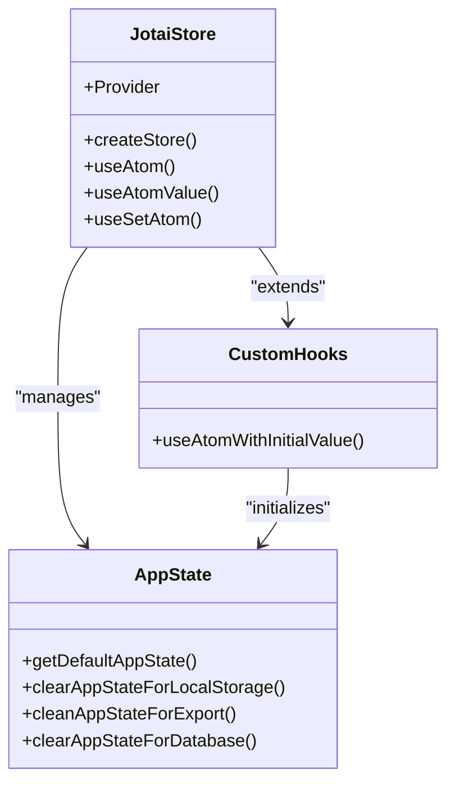

# Coding Standards

<cite>
**Referenced Files in This Document**   
- [eslintrc.base.json](file://packages/eslintrc.base.json)
- [tsconfig.base.json](file://packages/tsconfig.base.json)
- [app-jotai.ts](file://excalidraw-app/app-jotai.ts)
- [utility-types.ts](file://packages/common/src/utility-types.ts)
- [useStableCallback.ts](file://packages/excalidraw/hooks/useStableCallback.ts)
- [useStable.ts](file://packages/excalidraw/hooks/useStable.ts)
- [useCallbackRefState.ts](file://packages/excalidraw/hooks/useCallbackRefState.ts)
- [appState.ts](file://packages/excalidraw/appState.ts)
</cite>

## Table of Contents
1. [TypeScript Configuration](#typescript-configuration)
2. [ESLint Rules and Code Formatting](#eslint-rules-and-code-formatting)
3. [Shared Configuration Files](#shared-configuration-files)
4. [State Management with Jotai](#state-management-with-jotai)
5. [React Best Practices and Component Design](#react-best-practices-and-component-design)
6. [Type-Safe Code and Utility Types](#type-safe-code-and-utility-types)
7. [Component Structure and File Organization](#component-structure-and-file-organization)
8. [Common Linting Errors and Resolutions](#common-linting-errors-and-resolutions)
9. [Pre-Commit Hooks and Code Quality Enforcement](#pre-commit-hooks-and-code-quality-enforcement)

## TypeScript Configuration

The Excalidraw monorepo uses a centralized TypeScript configuration defined in `tsconfig.base.json` located in the `packages/` directory. This base configuration ensures consistent compilation settings across all packages. Key compiler options include strict type checking, ESNext target, Node module resolution, and support for JSON modules. The configuration also defines path aliases for internal packages such as `@excalidraw/common`, `@excalidraw/element`, and `@excalidraw/excalidraw`, enabling cleaner import statements across the codebase. Each package extends this base configuration to maintain uniformity in type checking and module resolution.

**Section sources**
- [tsconfig.base.json](file://packages/tsconfig.base.json#L1-L27)

## ESLint Rules and Code Formatting

The codebase enforces strict linting rules through a shared ESLint configuration in `eslintrc.base.json`. This configuration includes restrictions on imports to maintain package independence, particularly preventing non-type imports from the main `@excalidraw/excalidraw` package in other internal packages. The rules ensure that packages remain decoupled and can be used independently. The ESLint setup works in conjunction with Prettier for code formatting, ensuring consistent code style across the repository. The linting configuration is applied uniformly across all packages to maintain code quality and prevent architectural violations.

**Section sources**
- [eslintrc.base.json](file://packages/eslintrc.base.json#L1-L22)

## Shared Configuration Files

Shared configuration files play a crucial role in maintaining consistency across the monorepo. The `tsconfig.base.json` and `eslintrc.base.json` files in the `packages/` directory serve as the foundation for TypeScript and ESLint configurations respectively. These files are extended by individual packages to ensure uniform settings. The base TypeScript configuration defines path mappings that allow for clean, consistent imports across packages. Similarly, the ESLint configuration enforces architectural boundaries by restricting imports between packages. This shared configuration approach reduces duplication and ensures that all packages adhere to the same coding standards.

**Section sources**
- [tsconfig.base.json](file://packages/tsconfig.base.json#L1-L27)
- [eslintrc.base.json](file://packages/eslintrc.base.json#L1-L22)

## State Management with Jotai

Excalidraw uses Jotai for state management, providing a minimal and flexible approach to managing application state. The `app-jotai.ts` file in the `excalidraw-app` package sets up a global Jotai store and exports essential utilities like `atom`, `Provider`, `useAtom`, `useAtomValue`, and `useSetAtom`. A custom hook `useAtomWithInitialValue` is implemented to initialize atoms with default values, using `useLayoutEffect` to ensure the initial value is set only once. This approach allows for predictable state management while maintaining React's reactivity model. The use of Jotai enables fine-grained re-renders and simplifies state updates across the application.



**Diagram sources**
- [app-jotai.ts](file://excalidraw-app/app-jotai.ts#L1-L38)
- [appState.ts](file://packages/excalidraw/appState.ts#L1-L301)

**Section sources**
- [app-jotai.ts](file://excalidraw-app/app-jotai.ts#L1-L38)

## React Best Practices and Component Design

The codebase follows React best practices with a focus on performance and maintainability. Custom hooks like `useStableCallback`, `useStable`, and `useCallbackRefState` are implemented to address common React patterns. `useStableCallback` ensures function references remain stable across renders by using a ref to store the function, preventing unnecessary re-renders in child components. `useStable` maintains a stable object reference while allowing property updates, useful for props that would otherwise trigger re-renders. `useCallbackRefState` combines state management with ref callbacks, commonly used for DOM element references. These patterns demonstrate a deep understanding of React's reactivity model and optimization techniques.

```mermaid
classDiagram
class useStableCallback {
+useStableCallback(userFn)
}
class useStable {
+useStable(value)
}
class useCallbackRefState {
+useCallbackRefState()
}
useStableCallback --> "React useRef" : "uses"
useStable --> "React useRef" : "uses"
useCallbackRefState --> "React useState" : "uses"
useCallbackRefState --> "React useCallback" : "uses"
```

**Diagram sources**
- [useStableCallback.ts](file://packages/excalidraw/hooks/useStableCallback.ts#L1-L19)
- [useStable.ts](file://packages/excalidraw/hooks/useStable.ts#L1-L8)
- [useCallbackRefState.ts](file://packages/excalidraw/hooks/useCallbackRefState.ts#L1-L8)

**Section sources**
- [useStableCallback.ts](file://packages/excalidraw/hooks/useStableCallback.ts#L1-L19)
- [useStable.ts](file://packages/excalidraw/hooks/useStable.ts#L1-L8)
- [useCallbackRefState.ts](file://packages/excalidraw/hooks/useCallbackRefState.ts#L1-L8)

## Type-Safe Code and Utility Types

The codebase emphasizes type safety through extensive use of TypeScript utility types. The `utility-types.ts` file in the `common` package contains a comprehensive collection of type utilities that enhance type manipulation and validation. These include `Mutable` for removing readonly modifiers, `ValueOf` for extracting value types, `Merge` for combining types, and `SubtypeOf` for enforcing subtype relationships. The collection also includes advanced types like `MarkOptional`, `MarkRequired`, and `MarkNonNullable` for precise type transformations. These utilities enable developers to write more robust and type-safe code, reducing runtime errors and improving code maintainability.

```mermaid
classDiagram
class UtilityTypes {
+Mutable
+ValueOf
+Merge
+SubtypeOf
+ResolutionType
+MarkOptional
+MarkRequired
+MarkNonNullable
+NonOptional
+SignatureType
+CallableType
+ForwardRef
+ExtractSetType
+SameType
+Assert
+NestedKeyOf
+SetLike
+ReadonlySetLike
+MakeBrand
+MaybePromise
+AllPossibleKeys
+DTO
+MapEntry
}
UtilityTypes --> "TypeScript" : "extends"
```

**Diagram sources**
- [utility-types.ts](file://packages/common/src/utility-types.ts#L1-L80)

**Section sources**
- [utility-types.ts](file://packages/common/src/utility-types.ts#L1-L80)

## Component Structure and File Organization

The repository follows a well-organized file structure with clear separation of concerns. The `packages/` directory contains independent modules like `common`, `element`, `excalidraw`, `math`, and `utils`, each with their own `src/`, `tests/`, and configuration files. Within the `excalidraw` package, components are organized into logical directories such as `components/`, `hooks/`, `context/`, and `data/`. This structure promotes reusability and makes it easier to locate related functionality. The use of index.ts files for exports enables clean import statements. The organization reflects a modular architecture where each package has a specific responsibility and can be developed and tested independently.

**Section sources**
- [project_structure](file://#L1-L500)

## Common Linting Errors and Resolutions

One common linting error in the codebase relates to the restricted imports rule defined in `eslintrc.base.json`. Developers may encounter errors when attempting to import non-type values from the `@excalidraw/excalidraw` package in other internal packages. This restriction exists to maintain package independence. The resolution is to only import types from this package or restructure the code to avoid the dependency. Another common issue involves the use of `eslint-disable-next-line` comments, which should be used sparingly and only when necessary. The codebase also enforces strict type checking, so type-related errors must be addressed rather than suppressed. Understanding these common issues helps maintain code quality and architectural integrity.

**Section sources**
- [eslintrc.base.json](file://packages/eslintrc.base.json#L1-L22)

## Pre-Commit Hooks and Code Quality Enforcement

Code quality is enforced through pre-commit hooks configured with Husky. The `.husky/` directory contains scripts that run before commits are finalized, ensuring that only properly formatted and linted code is committed. These hooks typically run ESLint, Prettier, and potentially tests to catch issues early in the development process. The GitHub Actions workflows in `.github/workflows/` complement this by running linting, testing, and building processes on pull requests and pushes. This multi-layered approach to code quality ensures that issues are caught both locally and in CI/CD pipelines, maintaining a high standard of code quality throughout the repository.

**Section sources**
- [.husky_/husky.sh](file://.husky_/husky.sh)
- [.github/workflows/lint.yml](file://.github/workflows/lint.yml)