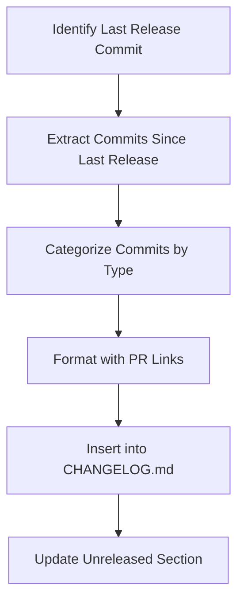
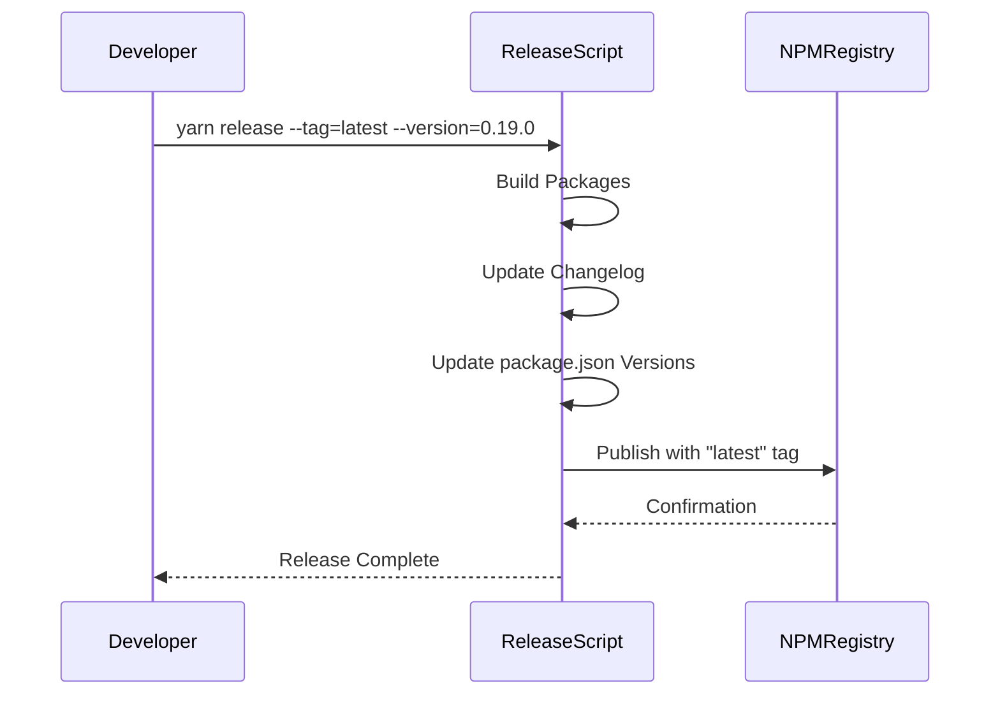
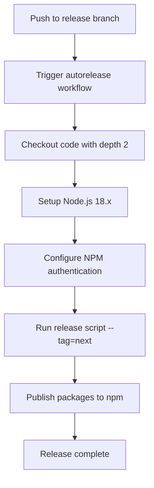

# Contribution Process

<cite>
**Referenced Files in This Document**   
- [CONTRIBUTING.md](file://excalidraw/CONTRIBUTING.md)
- [semantic-pr-title.yml](file://excalidraw/.github/workflows/semantic-pr-title.yml)
- [autorelease-excalidraw.yml](file://excalidraw/.github/workflows/autorelease-excalidraw.yml)
- [release.js](file://excalidraw/scripts/release.js)
- [updateChangelog.js](file://excalidraw/scripts/updateChangelog.js)
</cite>

## Table of Contents
1. [Introduction](#introduction)
2. [Setting Up the Development Environment](#setting-up-the-development-environment)
3. [Branching Strategy and Feature Development](#branching-strategy-and-feature-development)
4. [Commit Message Guidelines](#commit-message-guidelines)
5. [Pull Request Requirements](#pull-request-requirements)
6. [Semantic Pull Request Title Enforcement](#semantic-pull-request-title-enforcement)
7. [Code Review Process](#code-review-process)
8. [Changelog Management](#changelog-management)
9. [Version Bumping and Release Scripting](#version-bumping-and-release-scripting)
10. [CI/CD Pipeline Validation](#cicd-pipeline-validation)
11. [Automated Release Process](#automated-release-process)

## Introduction
This document outlines the complete contribution process for the Excalidraw project. It details the workflow from local development setup to pull request submission, code review, and eventual release. The project follows a structured approach to ensure code quality, maintainable version history, and automated release processes. Contributors are expected to adhere to specific guidelines for commits, pull requests, and code reviews to maintain consistency across the codebase.

## Setting Up the Development Environment
To contribute to Excalidraw, developers must first set up a local development environment. This involves cloning the repository, installing dependencies, and running the application locally. The project uses Node.js and Yarn as its primary development tools. After cloning the repository, run `yarn install` to install all required dependencies. The development server can be started with `yarn start`, which launches the application on localhost. Developers should ensure they have Node.js version 18.x installed, as specified in the CI/CD configuration.

**Section sources**
- [package.json](file://excalidraw/package.json#L1-L20)
- [README.md](file://excalidraw/README.md#L1-L15)

## Branching Strategy and Feature Development
The Excalidraw project follows a branching model where feature development occurs on topic branches created from the main branch. Contributors should create a new branch for each feature or bug fix using a descriptive name. The main branch represents the latest development state, while the release branch is used for automated releases. When a new feature is ready for integration, a pull request should be opened against the main branch. The release branch is protected and only updated through automated workflows triggered by specific conditions.

**Section sources**
- [autorelease-excalidraw.yml](file://excalidraw/.github/workflows/autorelease-excalidraw.yml#L2-L10)

## Commit Message Guidelines
Commit messages in the Excalidraw project follow a conventional format that enables automated changelog generation and version management. Each commit message should start with a type followed by a colon and a brief description. The supported types include: `feat` (new features), `fix` (bug fixes), `style` (formatting changes), `refactor` (code restructuring), `perf` (performance improvements), and `build` (build system changes). This structured approach allows the release script to categorize changes appropriately in the changelog. Commit messages should be clear, concise, and written in the imperative mood.

**Section sources**
- [updateChangelog.js](file://excalidraw/scripts/updateChangelog.js#L7-L12)

## Pull Request Requirements
All contributions to Excalidraw must be submitted through pull requests. Each pull request should focus on a single feature or bug fix to facilitate code review. Before submitting, contributors must ensure their code passes all linting and testing requirements. The pull request should include a clear description of the changes, the motivation behind them, and any relevant context. For significant changes, documentation updates should be included. Pull requests are automatically validated by CI pipelines that run tests, check code style, and verify build integrity.

**Section sources**
- [test.yml](file://excalidraw/.github/workflows/test.yml#L1-L15)
- [lint.yml](file://excalidraw/.github/workflows/lint.yml#L1-L15)

## Semantic Pull Request Title Enforcement
The Excalidraw project enforces semantic pull request titles through a GitHub Actions workflow that validates the format of pull request titles. This ensures consistency in how changes are described and categorized. The workflow runs on pull request creation, editing, and synchronization events. It uses the `amannn/action-semantic-pull-request` GitHub Action to validate that pull request titles follow the expected format. This enforcement helps maintain a clean and predictable release process by ensuring that all contributions are properly categorized before merging.

```mermaid
workflow
title Pull Request Title Validation Workflow
PR_Opened["Pull Request Opened/Edited"] --> Validate_Title["Validate PR Title Format"]
Validate_Title -->|Valid| Continue["Continue Review Process"]
Validate_Title -->|Invalid| Reject["Request Title Update"]
Continue --> Code_Review["Code Review"]
```

**Diagram sources**
- [semantic-pr-title.yml](file://excalidraw/.github/workflows/semantic-pr-title.yml#L1-L17)

**Section sources**
- [semantic-pr-title.yml](file://excalidraw/.github/workflows/semantic-pr-title.yml#L1-L17)

## Code Review Process
The code review process in Excalidraw is designed to maintain code quality and share knowledge across the team. All pull requests require approval from at least one maintainer before merging. Reviewers evaluate the code for correctness, performance, maintainability, and adherence to project standards. Contributors are expected to respond promptly to feedback and make necessary revisions. The review process also includes automated checks for code coverage, accessibility, and bundle size. Discussions should be constructive, focusing on improving the code rather than criticizing the contributor.

**Section sources**
- [test-coverage-pr.yml](file://excalidraw/.github/workflows/test-coverage-pr.yml#L1-L15)
- [size-limit.yml](file://excalidraw/.github/workflows/size-limit.yml#L1-L15)

## Changelog Management
The Excalidraw project maintains a changelog to document changes between versions. The changelog is automatically generated based on commit messages using the `updateChangelog.js` script. When preparing a release, the script analyzes commits since the last release, categorizes them by type, and formats them into the changelog. Each entry includes a link to the corresponding pull request for additional context. The changelog follows a structured format with sections for features, fixes, refactorings, and other changes. This automated approach ensures that the changelog remains up-to-date and accurate without requiring manual maintenance.



**Diagram sources**
- [updateChangelog.js](file://excalidraw/scripts/updateChangelog.js#L30-L106)

**Section sources**
- [updateChangelog.js](file://excalidraw/scripts/updateChangelog.js#L1-L107)
- [CHANGELOG.md](file://excalidraw/packages/excalidraw/CHANGELOG.md#L1-L10)

## Version Bumping and Release Scripting
Version management in Excalidraw is handled through the `release.js` script, which automates the release process for the project's packages. The script supports three release types: `test`, `next`, and `latest`, each corresponding to different npm distribution tags. For stable releases (`latest`), a specific version number must be provided. The script performs several key functions: building packages, updating package.json files with the new version, generating changelog entries, and publishing to npm. The version bumping process ensures that all interdependent packages are updated consistently, maintaining compatibility across the ecosystem.



**Diagram sources**
- [release.js](file://excalidraw/scripts/release.js#L1-L240)

**Section sources**
- [release.js](file://excalidraw/scripts/release.js#L1-L240)
- [package.json](file://excalidraw/packages/excalidraw/package.json#L1-L10)

## CI/CD Pipeline Validation
Contributions to Excalidraw are validated through a comprehensive CI/CD pipeline that ensures code quality and stability. The pipeline includes multiple workflows that run on every pull request and push to main branches. These workflows perform linting, testing, code coverage analysis, and size limit checks. The build process is also validated to ensure that the application can be successfully compiled. For production deployments, additional workflows verify Docker image builds and deployment configurations. This multi-layered validation approach catches issues early and prevents regressions from reaching users.

**Section sources**
- [test.yml](file://excalidraw/.github/workflows/test.yml#L1-L15)
- [lint.yml](file://excalidraw/.github/workflows/lint.yml#L1-L15)
- [build-docker.yml](file://excalidraw/.github/workflows/build-docker.yml#L1-L15)
- [size-limit.yml](file://excalidraw/.github/workflows/size-limit.yml#L1-L15)

## Automated Release Process
The Excalidraw project features an automated release process that triggers when changes are pushed to the release branch. This process is defined in the `autorelease-excalidraw.yml` workflow, which automatically publishes packages to npm with the "next" tag. The workflow checks out the code, sets up Node.js 18.x, configures npm authentication, and runs the release script in non-interactive mode. This automation ensures consistent and reliable releases without manual intervention. The process includes safeguards such as frozen lockfile installation to prevent dependency changes during release. This automated approach enables frequent, reliable releases while maintaining quality standards.



**Diagram sources**
- [autorelease-excalidraw.yml](file://excalidraw/.github/workflows/autorelease-excalidraw.yml#L1-L28)

**Section sources**
- [autorelease-excalidraw.yml](file://excalidraw/.github/workflows/autorelease-excalidraw.yml#L1-L28)
- [release.js](file://excalidraw/scripts/release.js#L1-L240)