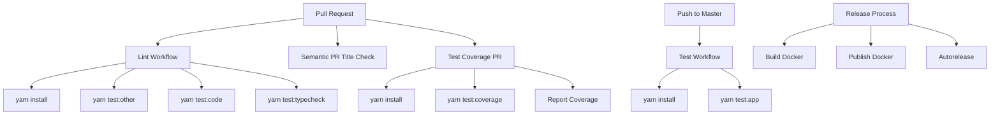
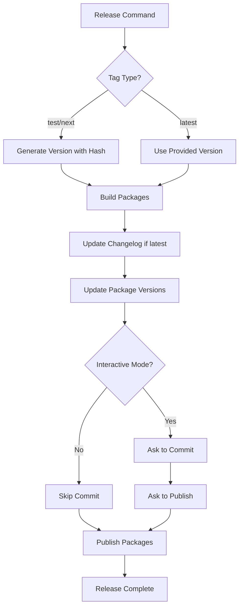

# Development Guidelines

<cite>
**Referenced Files in This Document**   
- [CONTRIBUTING.md](file://excalidraw/CONTRIBUTING.md)
- [README.md](file://excalidraw/README.md)
- [package.json](file://excalidraw/package.json)
- [release.js](file://excalidraw/scripts/release.js)
- [test.yml](file://excalidraw/.github/workflows/test.yml)
- [lint.yml](file://excalidraw/.github/workflows/lint.yml)
- [semantic-pr-title.yml](file://excalidraw/.github/workflows/semantic-pr-title.yml)
- [test-coverage-pr.yml](file://excalidraw/.github/workflows/test-coverage-pr.yml)
</cite>

## Table of Contents
1. [Introduction](#introduction)
2. [Codebase Conventions](#codebase-conventions)
3. [Testing Strategy](#testing-strategy)
4. [CI/CD Pipeline Configuration](#cicd-pipeline-configuration)
5. [Monorepo Package Management](#monorepo-package-management)
6. [Versioning Strategy and Release Process](#versioning-strategy-and-release-process)
7. [Debugging Tips and Performance Profiling](#debugging-tips-and-performance-profiling)
8. [Code Quality Standards](#code-quality-standards)
9. [Pull Request and Code Review Guidelines](#pull-request-and-code-review-guidelines)
10. [Local Development Workflow and Tooling](#local-development-workflow-and-tooling)

## Introduction
This document provides comprehensive guidance for developers contributing to the Excalidraw application. It covers development practices, contribution workflows, testing strategies, CI/CD pipelines, and release processes. The information is derived from the repository's configuration files, scripts, and documentation to ensure accurate and practical guidance for contributors.

## Codebase Conventions
The Excalidraw codebase follows established conventions for code quality and consistency. The project uses Prettier for code formatting with configuration inherited from `@excalidraw/prettier-config`, ensuring uniform styling across the codebase. ESLint is configured through `@excalidraw/eslint-config` to enforce coding standards, with rules aligned with React best practices. TypeScript is used throughout the codebase with version 4.9.4, providing strong typing and enhanced developer experience. The codebase supports Node.js versions 18.0.0 to 22.x.x, ensuring compatibility with modern JavaScript features. All code must pass linting checks (`yarn test:code`) and formatting validation (`yarn test:other`) before being committed.

**Section sources**
- [package.json](file://excalidraw/package.json#L10-L94)

## Testing Strategy
Excalidraw employs a comprehensive testing strategy that includes multiple testing levels. The test suite is built on Vitest, providing a modern testing framework with excellent TypeScript support. Unit tests are written for individual components and utility functions, while integration tests verify the interaction between components. The test suite includes type checking (`yarn test:typecheck`) to catch type-related issues during development. Code coverage is measured using Vitest's coverage plugin, with results reported in pull requests. End-to-end testing is supported through the testing framework, allowing for comprehensive validation of user interactions. Test files are colocated with their corresponding source files in `tests/` directories or with the `.test.ts`/`.test.tsx` naming convention.

**Section sources**
- [package.json](file://excalidraw/package.json#L60-L68)
- [test.yml](file://excalidraw/.github/workflows/test.yml#L1-L20)

## CI/CD Pipeline Configuration
The Excalidraw repository implements a robust CI/CD pipeline through GitHub Actions workflows. The pipeline includes multiple independent workflows that run on different triggers. The `test.yml` workflow runs on pushes to the master branch, executing the application tests. The `lint.yml` workflow triggers on pull requests, performing code linting, formatting checks, and type checking to ensure code quality. The `test-coverage-pr.yml` workflow runs on pull requests and generates test coverage reports, posting them as comments. The `semantic-pr-title.yml` workflow enforces semantic pull request titles using the action-semantic-pull-request tool. Additional workflows handle Docker builds, publishing, and size limitations. All workflows use Ubuntu runners with Node.js 18.x installed via the setup-node action.

**Diagram sources**
- [test.yml](file://excalidraw/.github/workflows/test.yml#L1-L20)
- [lint.yml](file://excalidraw/.github/workflows/lint.yml#L1-L23)
- [semantic-pr-title.yml](file://excalidraw/.github/workflows/semantic-pr-title.yml#L1-L17)
- [test-coverage-pr.yml](file://excalidraw/.github/workflows/test-coverage-pr.yml#L1-L27)

## Monorepo Package Management
Excalidraw is structured as a monorepo using Yarn workspaces, managed through the `package.json` file in the repository root. The workspace configuration includes multiple packages and applications: `excalidraw-app`, all packages under `packages/*`, and examples under `examples/*`. This structure enables shared dependencies and consistent tooling across the codebase while maintaining separation of concerns. The monorepo contains several published packages including `@excalidraw/common`, `@excalidraw/math`, `@excalidraw/element`, and `@excalidraw/excalidraw`. Dependencies between these packages are managed internally, with version synchronization handled during the release process. The monorepo approach facilitates code sharing and coordinated releases while allowing independent development of components.

**Section sources**
- [package.json](file://excalidraw/package.json#L3-L8)

## Versioning Strategy and Release Process
The Excalidraw project follows a structured versioning and release process managed by the `release.js` script in the scripts directory. The release process supports three distribution tags: "test" for experimental releases, "next" for pre-releases, and "latest" for stable releases. For "test" and "next" tags, versions are based on the current package version with a git commit hash suffix, enabling unique identification of development builds. Stable releases require an explicit version parameter and trigger changelog updates. The release process involves building all packages, updating version numbers across the monorepo, committing changes, and publishing to npm. The script ensures version consistency by updating all `@excalidraw/*` dependencies to match the new version. Release commands are available as npm scripts: `release:test`, `release:next`, and `release:latest`.

**Diagram sources**
- [release.js](file://excalidraw/scripts/release.js#L0-L239)

**Section sources**
- [release.js](file://excalidraw/scripts/release.js#L0-L239)
- [package.json](file://excalidraw/package.json#L88-L91)

## Debugging Tips and Performance Profiling
For effective debugging in Excalidraw, developers should leverage the comprehensive test suite and development tools. The `yarn test:app` command runs Vitest in watch mode, automatically re-running tests when files change, which accelerates the debug cycle. For type-related issues, `yarn test:typecheck` identifies TypeScript errors. When investigating performance issues, the `yarn test:coverage` command can help identify untested code paths that may contain performance bottlenecks. The monorepo structure allows for isolated testing of individual packages using their respective build commands (e.g., `yarn build:common`). For debugging UI issues, the `start:example` script launches an example application with the latest built packages, providing a controlled environment for testing. Browser developer tools can be used in conjunction with source maps for detailed debugging of runtime behavior.

**Section sources**
- [package.json](file://excalidraw/package.json#L60-L68)

## Code Quality Standards
Excalidraw maintains high code quality standards through automated tooling and established practices. The project uses ESLint with a custom configuration (`@excalidraw/eslint-config`) to enforce coding standards and prevent common errors. Prettier is used for consistent code formatting, with rules defined in `@excalidraw/prettier-config`. All code must pass both linting and formatting checks, which are enforced in the CI pipeline. The codebase uses TypeScript with strict type checking to catch errors at compile time. Commit hooks are configured through Husky to run checks before commits, ensuring that only high-quality code is committed. The `fix` script (`yarn fix`) combines code formatting and lint fixing, making it easy to correct most style issues automatically. Documentation is maintained in the codebase, with comments and README files providing context for complex functionality.

**Section sources**
- [package.json](file://excalidraw/package.json#L10-L22)

## Pull Request and Code Review Guidelines
Contributors to Excalidraw should follow established guidelines for submitting pull requests and participating in code reviews. The CONTRIBUTING.md file directs contributors to the online documentation for detailed contribution guidelines. Pull requests trigger multiple automated checks: linting, type checking, formatting validation, and test coverage analysis. The semantic-pr-title workflow enforces the use of semantic commit messages, improving changelog generation and release notes. Code reviews should focus on code quality, adherence to project conventions, test coverage, and overall design. Reviewers should verify that new functionality is properly tested and that changes maintain backward compatibility where appropriate. The CI pipeline provides feedback on all pull requests, and all checks must pass before merging. Contributors are encouraged to respond promptly to review feedback and update their pull requests accordingly.

**Section sources**
- [CONTRIBUTING.md](file://excalidraw/CONTRIBUTING.md#L0-L3)
- [lint.yml](file://excalidraw/.github/workflows/lint.yml#L1-L23)
- [semantic-pr-title.yml](file://excalidraw/.github/workflows/semantic-pr-title.yml#L1-L17)

## Local Development Workflow and Tooling
The local development workflow for Excalidraw is designed to be efficient and consistent across developer environments. After cloning the repository, developers should run `yarn install` to set up dependencies. The `prepare` script automatically installs Husky git hooks, ensuring that pre-commit checks are in place. Developers can start the application with `yarn start`, which launches the development server. For testing changes to individual packages, the `build:packages` script compiles all packages, and `start:example` launches an example application with the built packages. The `test` script (`yarn test`) runs Vitest in watch mode for interactive test development. Code formatting and linting can be applied automatically with the `fix` script. The `clean-install` script removes all node_modules directories and reinstalls dependencies, useful for resolving dependency issues. All development tools are version-pinned through the package manager to ensure consistency across environments.

**Section sources**
- [package.json](file://excalidraw/package.json#L69-L87)