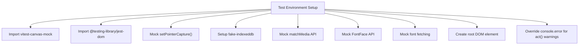
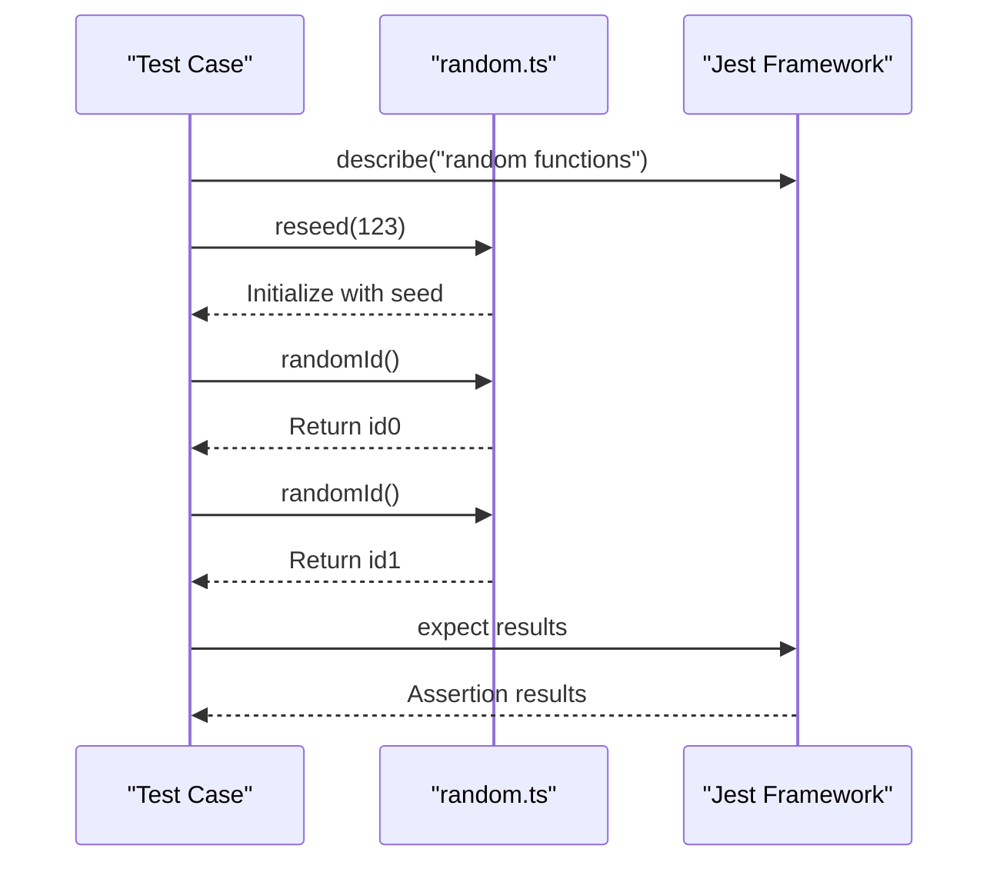
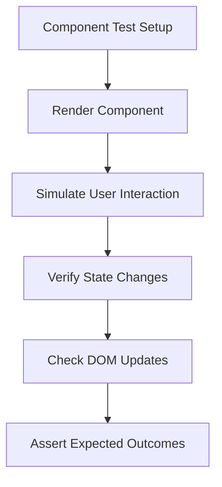
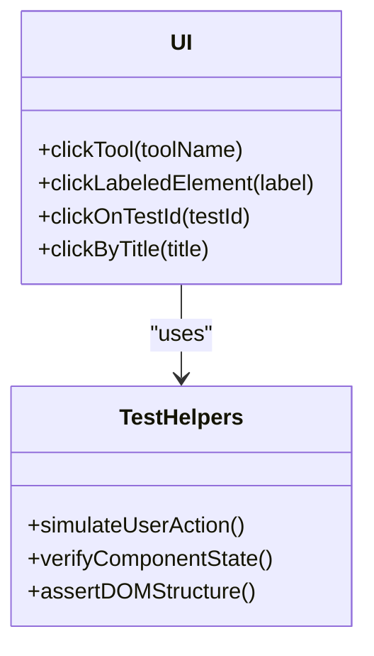
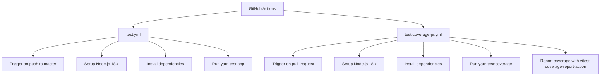
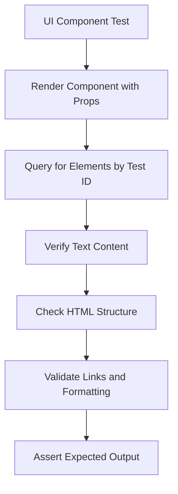
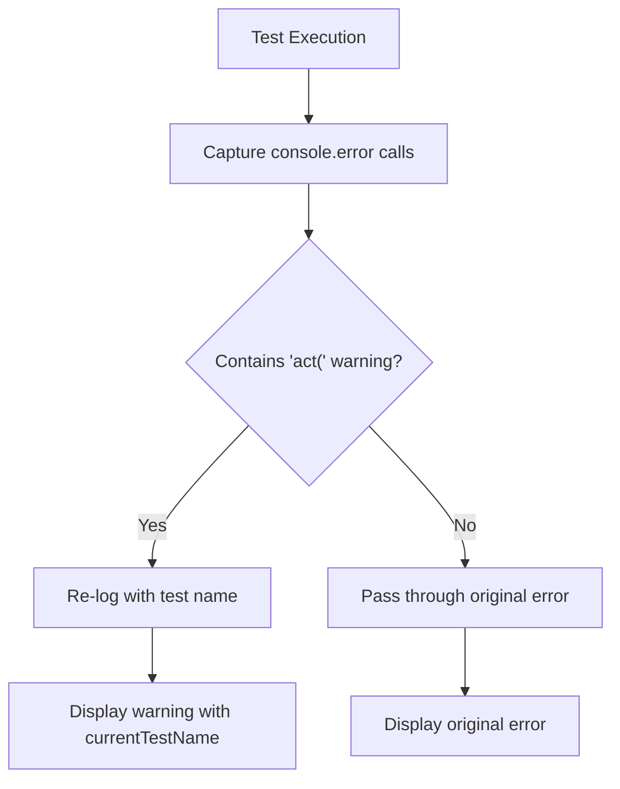

# Testing Strategy

<cite>
**Referenced Files in This Document**   
- [setupTests.ts](file://setupTests.ts)
- [test.yml](file://.github/workflows/test.yml)
- [test-coverage-pr.yml](file://.github/workflows/test-coverage-pr.yml)
- [LanguageList.test.tsx](file://excalidraw-app/tests/LanguageList.test.tsx)
- [MobileMenu.test.tsx](file://excalidraw-app/tests/MobileMenu.test.tsx)
- [collab.test.tsx](file://excalidraw-app/tests/collab.test.tsx)
- [random.ts](file://packages/common/src/random.ts)
- [ui.ts](file://packages/excalidraw/tests/helpers/ui.ts)
- [Trans.test.tsx](file://packages/excalidraw/components/Trans.test.tsx)
</cite>

## Table of Contents
1. [Introduction](#introduction)
2. [Test Setup and Configuration](#test-setup-and-configuration)
3. [Unit Testing with Jest](#unit-testing-with-jest)
4. [Integration Testing for React Components](#integration-testing-for-react-components)
5. [End-to-End Testing Patterns](#end-to-end-testing-patterns)
6. [Test Utilities and Helper Functions](#test-utilities-and-helper-functions)
7. [CI/CD Test Workflows](#cicd-test-workflows)
8. [Testing UI Components](#testing-ui-components)
9. [Testing Collaboration Features](#testing-collaboration-features)
10. [Testing Data Persistence Logic](#testing-data-persistence-logic)
11. [Test Coverage Requirements](#test-coverage-requirements)
12. [Debugging Failed Tests](#debugging-failed-tests)
13. [Conclusion](#conclusion)

## Introduction
The Excalidraw application employs a comprehensive testing strategy to ensure reliability, maintainability, and robustness across its various components. This document details the testing approach used throughout the codebase, covering unit testing with Jest, integration testing for React components, and end-to-end testing patterns. The strategy includes test setup processes, mocking techniques, DOM simulation, and CI/CD orchestration through GitHub Actions workflows. Special attention is given to testing complex features such as collaboration, data persistence, and UI interactions.

## Test Setup and Configuration

The test environment is configured through the `setupTests.ts` file, which initializes essential mocking and polyfilling mechanisms for consistent test execution. This setup ensures that browser APIs and external dependencies are properly simulated during testing.

**Diagram sources**
- [setupTests.ts](file://setupTests.ts#L1-L119)

**Section sources**
- [setupTests.ts](file://setupTests.ts#L1-L119)

## Unit Testing with Jest

Unit testing in Excalidraw leverages Jest as the primary testing framework, combined with Vitest for faster execution. The strategy focuses on isolating individual functions and modules to validate their behavior under various conditions.

The codebase includes unit tests for utility functions, such as those in the `random.ts` module, which provides deterministic ID generation during testing through seeded randomization. This ensures consistent test results across executions.

**Diagram sources**
- [random.ts](file://packages/common/src/random.ts#L1-L15)

**Section sources**
- [random.ts](file://packages/common/src/random.ts#L1-L15)

## Integration Testing for React Components

Integration testing focuses on validating the interaction between React components and their rendering behavior. The testing strategy uses React Testing Library to simulate user interactions and verify component state changes.

Component tests such as `LanguageList.test.tsx` and `MobileMenu.test.tsx` demonstrate how UI components are rendered and interacted with programmatically. These tests verify that components respond correctly to user actions and maintain proper state throughout their lifecycle.

**Section sources**
- [LanguageList.test.tsx](file://excalidraw-app/tests/LanguageList.test.tsx)
- [MobileMenu.test.tsx](file://excalidraw-app/tests/MobileMenu.test.tsx)

## End-to-End Testing Patterns

End-to-end testing in Excalidraw ensures that major user workflows function correctly from start to finish. While specific E2E test files are not visible in the provided structure, the testing infrastructure supports comprehensive workflow validation through simulated user journeys.

The testing approach combines component-level interactions with application state management to validate complex user scenarios, such as creating diagrams, collaborating in real-time, and persisting data across sessions.

## Test Utilities and Helper Functions

The codebase includes a suite of test utilities and helper functions to streamline test creation and maintenance. These utilities provide abstractions for common testing patterns, reducing boilerplate code and improving test readability.

The `ui.ts` helper file contains utility methods for interacting with UI elements, such as clicking tools, labeled elements, and elements by test ID. These helpers abstract the underlying testing library calls and provide a consistent interface for test authors.

**Diagram sources**
- [ui.ts](file://packages/excalidraw/tests/helpers/ui.ts#L447-L471)

**Section sources**
- [ui.ts](file://packages/excalidraw/tests/helpers/ui.ts#L447-L471)

## CI/CD Test Workflows

The Excalidraw project utilizes GitHub Actions to automate test execution through two primary workflows: `test.yml` for regular test runs and `test-coverage-pr.yml` for pull request coverage reporting.

**Diagram sources**
- [test.yml](file://.github/workflows/test.yml#L1-L18)
- [test-coverage-pr.yml](file://.github/workflows/test-coverage-pr.yml#L1-L26)

**Section sources**
- [test.yml](file://.github/workflows/test.yml#L1-L18)
- [test-coverage-pr.yml](file://.github/workflows/test-coverage-pr.yml#L1-L26)

## Testing UI Components

UI component testing follows React Testing Library principles, focusing on user-centric interactions rather than implementation details. Tests validate that components render correctly, respond to user input, and update their state appropriately.

The `Trans.test.tsx` file demonstrates how text rendering and HTML interpolation are tested, ensuring that translated content displays correctly with proper HTML structure and links.

**Section sources**
- [Trans.test.tsx](file://packages/excalidraw/components/Trans.test.tsx#L58-L72)

## Testing Collaboration Features

Collaboration features are tested through dedicated test files like `collab.test.tsx`, which validate the real-time collaboration functionality. These tests ensure that multiple users can interact with the same diagram simultaneously without conflicts.

The testing strategy for collaboration includes verifying message passing, state synchronization, and conflict resolution mechanisms that enable seamless multi-user editing experiences.

**Section sources**
- [collab.test.tsx](file://excalidraw-app/tests/collab.test.tsx)

## Testing Data Persistence Logic

Data persistence logic is tested to ensure that diagrams are properly saved and restored across sessions. The testing approach validates both client-side storage mechanisms and server-side persistence interfaces.

While specific test files for data persistence are not visible in the provided structure, the testing infrastructure supports mocking of storage APIs and network requests to validate data flow through the application.

## Test Coverage Requirements

The project enforces test coverage requirements through the `test-coverage-pr.yml` workflow, which generates coverage reports for pull requests. This ensures that new code contributions maintain adequate test coverage and helps identify untested code paths.

The coverage reporting integrates with GitHub's pull request interface, providing immediate feedback on coverage changes and helping maintain code quality standards.

**Section sources**
- [test-coverage-pr.yml](file://.github/workflows/test-coverage-pr.yml#L1-L26)

## Debugging Failed Tests

Debugging failed tests is facilitated by several mechanisms in the test setup. The `setupTests.ts` file includes special handling for React's `act()` warnings, which are enhanced with the current test name to help identify tests that don't properly wrap state updates.

**Diagram sources**
- [setupTests.ts](file://setupTests.ts#L102-L118)

**Section sources**
- [setupTests.ts](file://setupTests.ts#L102-L118)

## Conclusion

The Excalidraw testing strategy provides a comprehensive framework for ensuring code quality and reliability across the application. By combining unit, integration, and end-to-end testing approaches with robust CI/CD automation, the project maintains high standards for functionality and user experience. The testing infrastructure, with its extensive mocking, helper utilities, and coverage requirements, enables developers to write effective tests for complex features including UI components, collaboration, and data persistence. This comprehensive approach helps maintain the application's stability as it continues to evolve.