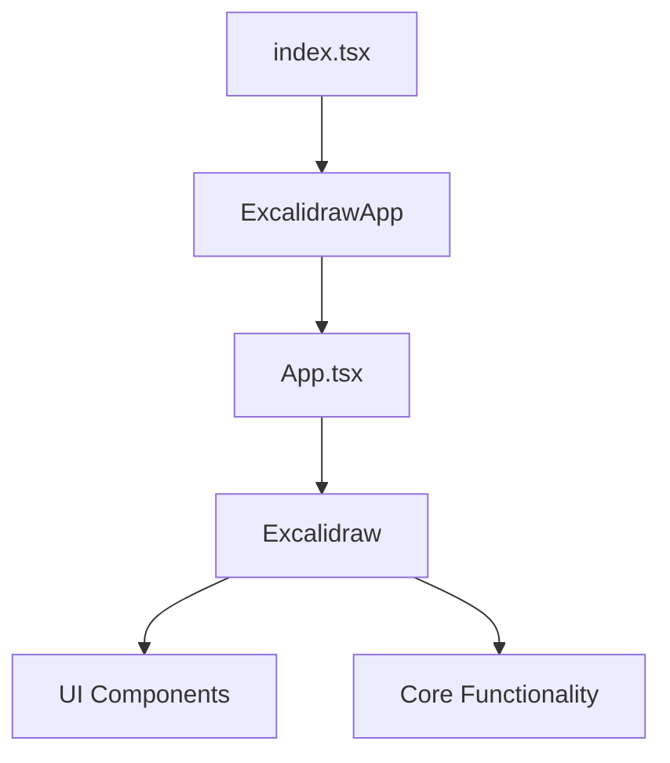
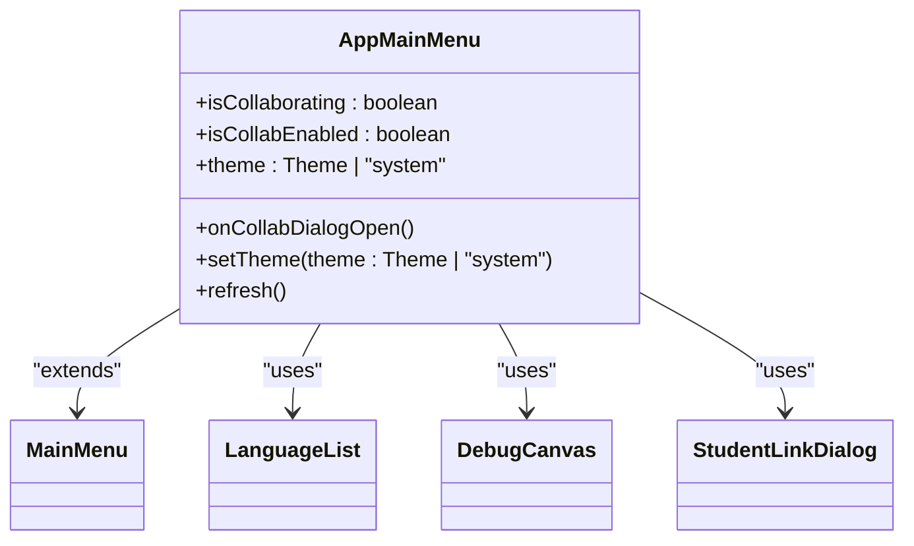
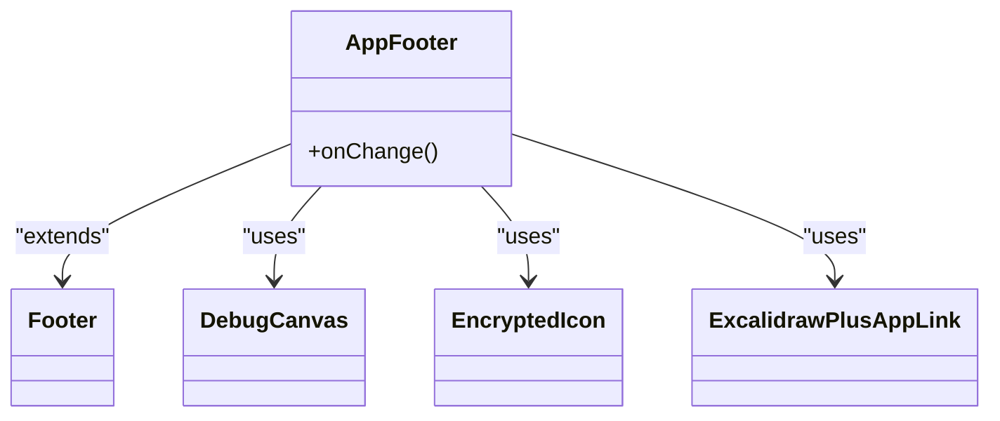
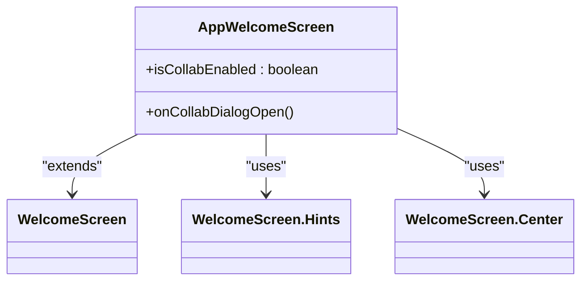
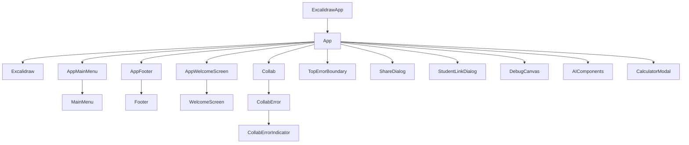

# Component Hierarchy

<cite>
**Referenced Files in This Document**   
- [index.tsx](file://excalidraw/excalidraw-app/index.tsx)
- [App.tsx](file://excalidraw/excalidraw-app/App.tsx)
- [AppMainMenu.tsx](file://excalidraw/excalidraw-app/components/AppMainMenu.tsx)
- [AppFooter.tsx](file://excalidraw/excalidraw-app/components/AppFooter.tsx)
- [AppWelcomeScreen.tsx](file://excalidraw/excalidraw-app/components/AppWelcomeScreen.tsx)
</cite>

## Table of Contents
1. [Introduction](#introduction)
2. [Root Component Structure](#root-component-structure)
3. [Main Application Shell](#main-application-shell)
4. [Key UI Components](#key-ui-components)
5. [Layout Composition and Conditional Rendering](#layout-composition-and-conditional-rendering)
6. [Component Tree Diagram](#component-tree-diagram)
7. [Props, State, and Event Propagation](#props-state-and-event-propagation)
8. [Accessibility and Responsive Design](#accessibility-and-responsive-design)
9. [Conclusion](#conclusion)

## Introduction
This document provides a detailed analysis of the frontend component hierarchy in the Excalidraw application. It examines the root-level component structure starting from index.tsx and App.tsx, detailing how the main application shell organizes UI subcomponents. The document covers key components such as AppMainMenu, AppFooter, and AppWelcomeScreen, including their integration, layout composition, conditional rendering patterns, and dynamic component loading strategies.

**Section sources**
- [index.tsx](file://excalidraw/excalidraw-app/index.tsx#L1-L17)
- [App.tsx](file://excalidraw/excalidraw-app/App.tsx#L1-L799)

## Root Component Structure
The Excalidraw application follows a hierarchical component structure with a clear entry point and main application wrapper. The component hierarchy begins with index.tsx, which serves as the application's entry point, rendering the root ExcalidrawApp component into the DOM.

The index.tsx file imports and renders the ExcalidrawApp component (defined in App.tsx) within a React StrictMode wrapper, ensuring best practices during development. This file also handles service worker registration and sets the application's git SHA for version tracking.

The App.tsx component serves as the main application wrapper, managing the core application state, initialization logic, and coordination between various subsystems. It acts as the central orchestrator for the entire application, handling scene initialization, collaboration features, file management, and theme handling.

**Diagram sources**
- [index.tsx](file://excalidraw/excalidraw-app/index.tsx#L1-L17)
- [App.tsx](file://excalidraw/excalidraw-app/App.tsx#L1-L799)

**Section sources**
- [index.tsx](file://excalidraw/excalidraw-app/index.tsx#L1-L17)
- [App.tsx](file://excalidraw/excalidraw-app/App.tsx#L1-L799)

## Main Application Shell
The main application shell in Excalidraw is implemented through the App.tsx component, which serves as the container for all UI elements and manages the overall application structure. This component coordinates between the Excalidraw core component and various UI subcomponents, ensuring proper initialization and state management.

The application shell handles several critical responsibilities:
- Initializing the scene state from various sources (localStorage, URL parameters, collaboration links)
- Managing collaboration features through the Collab component
- Handling file operations and image loading
- Coordinating theme management and language preferences
- Implementing error boundaries and debugging tools

The shell structure follows a provider pattern, using React context and Jotai atoms to manage global state. It wraps the Excalidraw component with necessary providers and handles the initialization promise that resolves when the scene is ready.

**Section sources**
- [App.tsx](file://excalidraw/excalidraw-app/App.tsx#L1-L799)

## Key UI Components
The Excalidraw application implements several key UI components that provide essential functionality and user interface elements.

### AppMainMenu
The AppMainMenu component provides access to core application features and settings. It extends the MainMenu component from the @excalidraw/excalidraw package and adds application-specific functionality.

Key features of AppMainMenu include:
- Image export capabilities
- Student link management (displayed as "Uczniowie (stałe linki)")
- Visual debugging tools (available in development environment)
- Theme toggling with system theme support
- Canvas background color changing

The component receives props for collaboration status, theme management, and refresh functionality, allowing it to integrate seamlessly with the main application state.

**Diagram sources**
- [AppMainMenu.tsx](file://excalidraw/excalidraw-app/components/AppMainMenu.tsx#L1-L74)

**Section sources**
- [AppMainMenu.tsx](file://excalidraw/excalidraw-app/components/AppMainMenu.tsx#L1-L74)

### AppFooter
The AppFooter component displays status information and branding elements at the bottom of the application. It extends the Footer component from the @excalidraw/excalidraw package.

The footer content varies based on user authentication status:
- For non-signed users: displays an encrypted icon
- For Matsin Plus signed users: displays an ExcalidrawPlusAppLink

Additionally, when visual debugging is enabled, the footer shows debug information through the DebugFooter component. The component accepts an onChange callback prop to handle state changes.

**Diagram sources**
- [AppFooter.tsx](file://excalidraw/excalidraw-app/components/AppFooter.tsx#L1-L31)

**Section sources**
- [AppFooter.tsx](file://excalidraw/excalidraw-app/components/AppFooter.tsx#L1-L31)

### AppWelcomeScreen
The AppWelcomeScreen component displays a welcome interface when the application loads or when the canvas is empty. It extends the WelcomeScreen component from the @excalidraw/excalidraw package.

The welcome screen displays different content based on user authentication status:
- For Matsin Plus signed users: shows a customized heading with Excalidraw+ branding and links
- For guest users: displays a sign-up option with login icon

The component includes helpful hints for new users, such as menu, toolbar, and help hints. It also provides menu items for loading scenes and accessing help resources.

**Diagram sources**
- [AppWelcomeScreen.tsx](file://excalidraw/excalidraw-app/components/AppWelcomeScreen.tsx#L1-L70)

**Section sources**
- [AppWelcomeScreen.tsx](file://excalidraw/excalidraw-app/components/AppWelcomeScreen.tsx#L1-L70)

## Layout Composition and Conditional Rendering
The Excalidraw application employs sophisticated layout composition and conditional rendering patterns to create a dynamic user interface.

### Layout Composition
The application follows a container-component pattern where the main App component serves as the container, managing state and passing props to presentational components. The layout is composed of three main sections:
1. Main drawing area (handled by Excalidraw component)
2. Top menu (AppMainMenu)
3. Bottom footer (AppFooter)

These components are integrated within the main application shell, with proper spacing and responsive design considerations.

### Conditional Rendering
The application implements several conditional rendering patterns based on:
- User authentication status (Matsin Plus signed users vs. guests)
- Development environment (visual debugging tools only in dev)
- Collaboration state (different UI elements when collaborating)
- Canvas state (welcome screen when canvas is empty)

For example, the AppWelcomeScreen conditionally renders a sign-up link only for non-signed users, while the AppFooter displays different branding elements based on authentication status.

**Section sources**
- [App.tsx](file://excalidraw/excalidraw-app/App.tsx#L1-L799)
- [AppMainMenu.tsx](file://excalidraw/excalidraw-app/components/AppMainMenu.tsx#L1-L74)
- [AppFooter.tsx](file://excalidraw/excalidraw-app/components/AppFooter.tsx#L1-L31)
- [AppWelcomeScreen.tsx](file://excalidraw/excalidraw-app/components/AppWelcomeScreen.tsx#L1-L70)

## Component Tree Diagram
The following diagram illustrates the component hierarchy in the Excalidraw application:

**Diagram sources**
- [App.tsx](file://excalidraw/excalidraw-app/App.tsx#L1-L799)
- [AppMainMenu.tsx](file://excalidraw/excalidraw-app/components/AppMainMenu.tsx#L1-L74)
- [AppFooter.tsx](file://excalidraw/excalidraw-app/components/AppFooter.tsx#L1-L31)
- [AppWelcomeScreen.tsx](file://excalidraw/excalidraw-app/components/AppWelcomeScreen.tsx#L1-L70)

## Props, State, and Event Propagation
The Excalidraw application implements a well-defined system for props, state management, and event propagation.

### Component Props
Key components receive specific props that enable their functionality:
- AppMainMenu receives theme, collaboration status, and callback functions
- AppFooter receives an onChange callback for state updates
- AppWelcomeScreen receives collaboration dialog handlers and enabled status

### State Management
The application uses a combination of React state and Jotai atoms for state management:
- Local component state for UI-specific state (e.g., dialog visibility)
- Jotai atoms for global application state (collaboration, sharing dialogs)
- External state management through the Excalidraw imperative API

### Event Propagation
Event handling follows a clear pattern:
- UI events (clicks, selections) are handled within components
- Significant events are propagated to parent components via callback props
- Global events (hash changes, visibility changes) are handled at the application level
- Collaboration events are managed through the Collab component and its API

The application also implements proper cleanup of event listeners to prevent memory leaks.

**Section sources**
- [App.tsx](file://excalidraw/excalidraw-app/App.tsx#L1-L799)
- [AppMainMenu.tsx](file://excalidraw/excalidraw-app/components/AppMainMenu.tsx#L1-L74)
- [AppFooter.tsx](file://excalidraw/excalidraw-app/components/AppFooter.tsx#L1-L31)
- [AppWelcomeScreen.tsx](file://excalidraw/excalidraw-app/components/AppWelcomeScreen.tsx#L1-L70)

## Accessibility and Responsive Design
The Excalidraw application implements several accessibility and responsive design features.

### Accessibility
The application follows accessibility best practices:
- Semantic HTML structure with appropriate ARIA attributes
- Keyboard navigation support through the Excalidraw core component
- Screen reader compatibility for UI elements
- Proper focus management for interactive components
- High contrast themes for improved visibility

### Responsive Design
The application adapts to different screen sizes and device types:
- Flexible layout that adjusts to available viewport space
- Mobile-friendly interface elements
- Responsive welcome screen that hides on very small screens
- Touch-friendly controls for mobile devices
- Media queries to adjust layout based on screen dimensions

The responsive design ensures that the application remains usable across various devices, from desktop computers to tablets and smartphones.

**Section sources**
- [App.tsx](file://excalidraw/excalidraw-app/App.tsx#L1-L799)
- [AppMainMenu.tsx](file://excalidraw/excalidraw-app/components/AppMainMenu.tsx#L1-L74)
- [AppFooter.tsx](file://excalidraw/excalidraw-app/components/AppFooter.tsx#L1-L31)
- [AppWelcomeScreen.tsx](file://excalidraw/excalidraw-app/components/AppWelcomeScreen.tsx#L1-L70)

## Conclusion
The Excalidraw application implements a well-structured component hierarchy with clear separation of concerns. The root component structure, starting from index.tsx and App.tsx, provides a solid foundation for the application. The main application shell effectively organizes UI subcomponents, including AppMainMenu, AppFooter, and AppWelcomeScreen, each serving specific purposes in the user interface.

The application demonstrates effective use of React patterns, including component composition, conditional rendering, and state management. The integration of accessibility features and responsive design ensures a good user experience across different devices and user needs. The component tree structure is logical and maintainable, with clear parent-child relationships and well-defined interfaces between components.

**Section sources**
- [index.tsx](file://excalidraw/excalidraw-app/index.tsx#L1-L17)
- [App.tsx](file://excalidraw/excalidraw-app/App.tsx#L1-L799)
- [AppMainMenu.tsx](file://excalidraw/excalidraw-app/components/AppMainMenu.tsx#L1-L74)
- [AppFooter.tsx](file://excalidraw/excalidraw-app/components/AppFooter.tsx#L1-L31)
- [AppWelcomeScreen.tsx](file://excalidraw/excalidraw-app/components/AppWelcomeScreen.tsx#L1-L70)