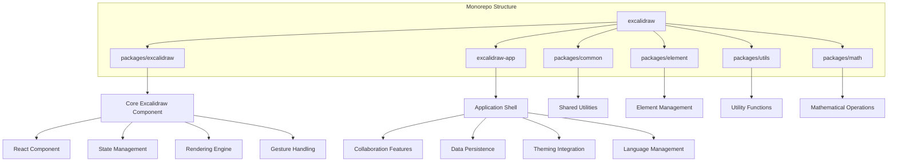
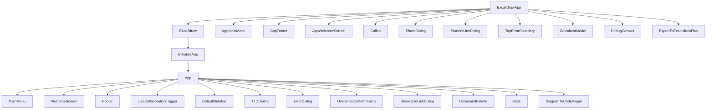
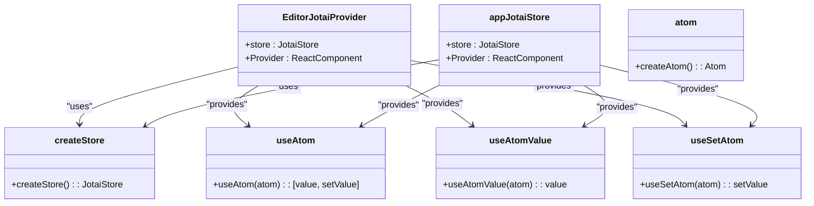
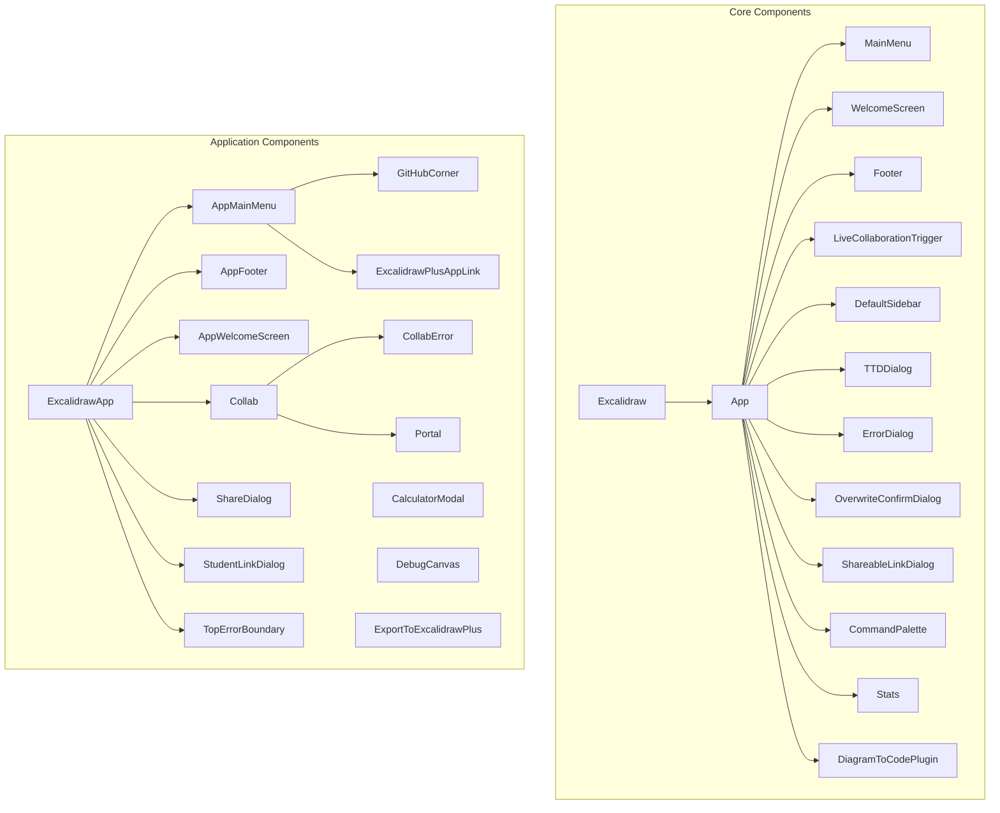
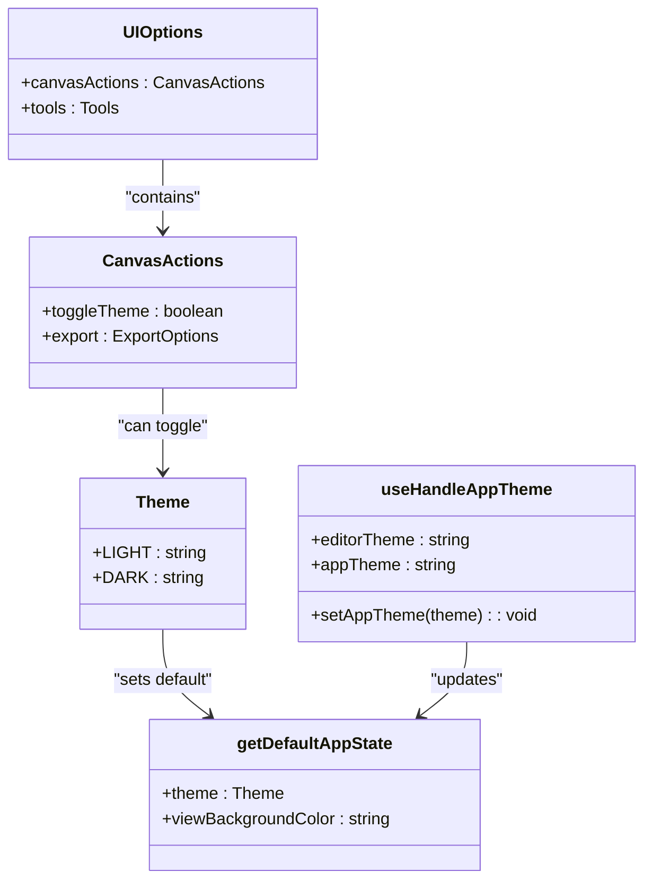
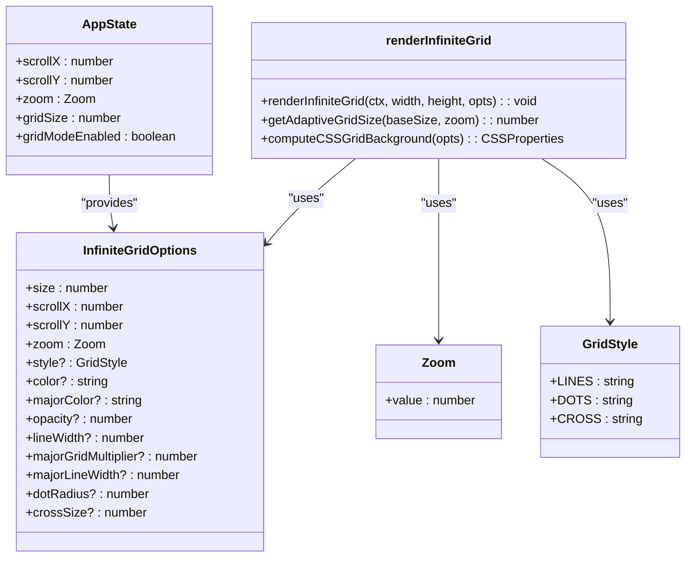
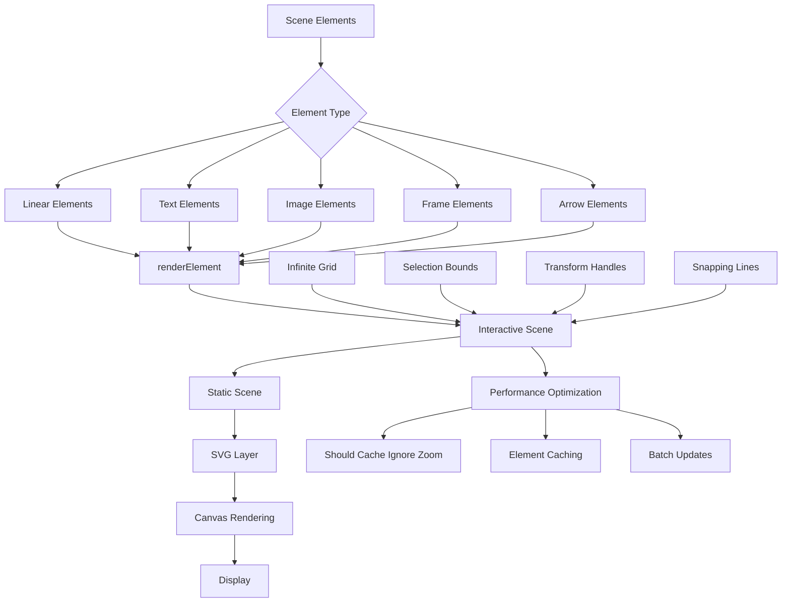
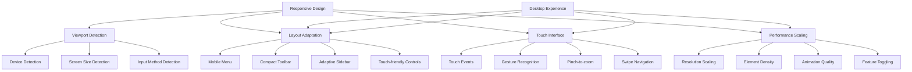

# Frontend Architecture

<cite>
**Referenced Files in This Document**   
- [index.tsx](file://excalidraw/excalidraw-app/index.tsx)
- [App.tsx](file://excalidraw/excalidraw-app/App.tsx)
- [index.tsx](file://excalidraw/packages/excalidraw/index.tsx)
- [editor-jotai.ts](file://excalidraw/packages/excalidraw/editor-jotai.ts)
- [appState.ts](file://excalidraw/packages/excalidraw/appState.ts)
- [i18n.ts](file://excalidraw/packages/excalidraw/i18n.ts)
- [infiniteGrid.ts](file://excalidraw/packages/excalidraw/renderer/infiniteGrid.ts)
- [gesture.ts](file://excalidraw/packages/excalidraw/gesture.ts)
</cite>

## Table of Contents
1. [Introduction](#introduction)
2. [Monorepo Package Structure](#monorepo-package-structure)
3. [React Component Hierarchy](#react-component-hierarchy)
4. [State Management with Jotai](#state-management-with-jotai)
5. [UI Component Organization](#ui-component-organization)
6. [Theming System](#theming-system)
7. [Internationalization Approach](#internationalization-approach)
8. [Infinite Canvas Implementation](#infinite-canvas-implementation)
9. [Rendering Pipeline](#rendering-pipeline)
10. [Gesture Handling](#gesture-handling)
11. [Performance Optimization](#performance-optimization)
12. [Responsive Design Considerations](#responsive-design-considerations)

## Introduction
This document provides comprehensive architectural documentation for the frontend application layer of the Excalidraw collaborative whiteboard. It details the React component hierarchy, state management using Jotai atoms, and the monorepo package structure. The documentation covers the separation between the main application shell (excalidraw-app) and the reusable Excalidraw component (packages/excalidraw), along with UI component organization, theming system, and internationalization approach. It also addresses the infinite canvas implementation, rendering pipeline, gesture handling, performance optimization techniques for large diagrams, and responsive design considerations.

## Monorepo Package Structure
The Excalidraw frontend follows a monorepo structure with clear separation of concerns between different packages and application layers. The architecture is organized into distinct packages that serve specific purposes within the overall application ecosystem.



**Diagram sources**
- [index.tsx](file://excalidraw/excalidraw-app/index.tsx)
- [index.tsx](file://excalidraw/packages/excalidraw/index.tsx)

**Section sources**
- [index.tsx](file://excalidraw/excalidraw-app/index.tsx)
- [index.tsx](file://excalidraw/packages/excalidraw/index.tsx)

## React Component Hierarchy
The React component hierarchy in Excalidraw follows a well-defined structure that separates concerns between the reusable Excalidraw component and the application-specific shell. The component tree is organized to promote reusability while maintaining application-specific functionality.



**Diagram sources**
- [App.tsx](file://excalidraw/excalidraw-app/App.tsx)
- [index.tsx](file://excalidraw/packages/excalidraw/index.tsx)

**Section sources**
- [App.tsx](file://excalidraw/excalidraw-app/App.tsx)
- [index.tsx](file://excalidraw/packages/excalidraw/index.tsx)

## State Management with Jotai
Excalidraw utilizes Jotai for state management, implementing a sophisticated atom-based system that enables efficient state updates and reactivity across the application. The architecture separates state management between the core component and the application shell, with each maintaining its own Jotai store.



**Diagram sources**
- [editor-jotai.ts](file://excalidraw/packages/excalidraw/editor-jotai.ts)
- [App.tsx](file://excalidraw/excalidraw-app/App.tsx)

**Section sources**
- [editor-jotai.ts](file://excalidraw/packages/excalidraw/editor-jotai.ts)
- [App.tsx](file://excalidraw/excalidraw-app/App.tsx)

## UI Component Organization
The UI component organization in Excalidraw follows a modular approach with components grouped by functionality and purpose. The architecture separates components into the core Excalidraw package and the application-specific components in excalidraw-app, enabling reusability while maintaining application-specific features.



**Diagram sources**
- [App.tsx](file://excalidraw/excalidraw-app/App.tsx)
- [index.tsx](file://excalidraw/packages/excalidraw/index.tsx)

**Section sources**
- [App.tsx](file://excalidraw/excalidraw-app/App.tsx)
- [index.tsx](file://excalidraw/packages/excalidraw/index.tsx)

## Theming System
The theming system in Excalidraw provides a flexible approach to managing visual appearance across the application. It supports both light and dark themes with a comprehensive set of theme-related configuration options and state management.



**Diagram sources**
- [appState.ts](file://excalidraw/packages/excalidraw/appState.ts)
- [App.tsx](file://excalidraw/excalidraw-app/App.tsx)
- [useHandleAppTheme.ts](file://excalidraw/excalidraw-app/useHandleAppTheme.ts)

**Section sources**
- [appState.ts](file://excalidraw/packages/excalidraw/appState.ts)
- [App.tsx](file://excalidraw/excalidraw-app/App.tsx)
- [useHandleAppTheme.ts](file://excalidraw/excalidraw-app/useHandleAppTheme.ts)

## Internationalization Approach
Excalidraw implements a comprehensive internationalization system that supports multiple languages with a flexible translation mechanism. The system is designed to handle both RTL and LTR languages with appropriate text direction handling.

```mermaid
classDiagram
class Language {
+code : string
+label : string
+rtl? : boolean
}
class i18n {
+defaultLang : Language
+languages : Language[]
+setLanguage(lang) : Promise<void>
+getLanguage() : Language
+t(path, replacement, fallback) : string
+useI18n() : {t, langCode}
}
class editorLangCodeAtom {
+defaultLang.code : string
}
class Trans {
+i18nKey : string
+children : ReactNode
}
i18n --> Language : "manages"
i18n --> editorLangCodeAtom : "updates"
Trans --> i18n : "uses"
App.tsx --> i18n : "uses"
App.tsx --> Trans : "uses"
```

**Diagram sources**
- [i18n.ts](file://excalidraw/packages/excalidraw/i18n.ts)
- [App.tsx](file://excalidraw/excalidraw-app/App.tsx)

**Section sources**
- [i18n.ts](file://excalidraw/packages/excalidraw/i18n.ts)
- [App.tsx](file://excalidraw/excalidraw-app/App.tsx)

## Infinite Canvas Implementation
The infinite canvas implementation in Excalidraw provides a seamless drawing experience that allows users to pan and zoom across an effectively limitless workspace. The system is designed to maintain performance while providing smooth navigation.



**Diagram sources**
- [infiniteGrid.ts](file://excalidraw/packages/excalidraw/renderer/infiniteGrid.ts)
- [appState.ts](file://excalidraw/packages/excalidraw/appState.ts)

**Section sources**
- [infiniteGrid.ts](file://excalidraw/packages/excalidraw/renderer/infiniteGrid.ts)
- [appState.ts](file://excalidraw/packages/excalidraw/appState.ts)

## Rendering Pipeline
The rendering pipeline in Excalidraw is optimized for performance and visual quality, handling the complex task of rendering various element types efficiently. The system is designed to maintain smooth performance even with large diagrams.



**Diagram sources**
- [renderer](file://excalidraw/packages/excalidraw/renderer)
- [scene](file://excalidraw/packages/excalidraw/scene)
- [appState.ts](file://excalidraw/packages/excalidraw/appState.ts)

**Section sources**
- [renderer](file://excalidraw/packages/excalidraw/renderer)
- [scene](file://excalidraw/packages/excalidraw/scene)
- [appState.ts](file://excalidraw/packages/excalidraw/appState.ts)

## Gesture Handling
The gesture handling system in Excalidraw provides support for multi-touch interactions, enabling users to perform pinch-to-zoom and other touch-based gestures on supported devices. The system is designed to work seamlessly across different input methods.

```mermaid
classDiagram
class PointerCoords {
+x : number
+y : number
}
class gesture {
+getCenter(pointers) : {x, y}
+getDistance([a, b]) : number
}
class AppState {
+lastPointerDownWith : string
+isResizing : boolean
+isRotating : boolean
+selectedElementsAreBeingDragged : boolean
}
class ExcalidrawProps {
+onPointerDown : (event) => void
+onPointerUp : (event) => void
+onPointerUpdate : (event) => void
+onScrollChange : (scrollX, scrollY) => void
}
gesture --> PointerCoords : "uses"
AppState --> gesture : "informs"
ExcalidrawProps --> gesture : "triggers"
```

**Diagram sources**
- [gesture.ts](file://excalidraw/packages/excalidraw/gesture.ts)
- [appState.ts](file://excalidraw/packages/excalidraw/appState.ts)
- [index.tsx](file://excalidraw/packages/excalidraw/index.tsx)

**Section sources**
- [gesture.ts](file://excalidraw/packages/excalidraw/gesture.ts)
- [appState.ts](file://excalidraw/packages/excalidraw/appState.ts)
- [index.tsx](file://excalidraw/packages/excalidraw/index.tsx)

## Performance Optimization
Excalidraw implements several performance optimization techniques to ensure smooth operation even with large and complex diagrams. These optimizations focus on rendering efficiency, state management, and memory usage.

```mermaid
flowchart TD
A[Performance Optimization] --> B[Element Caching]
A --> C[Batch Updates]
A --> D[Selective Re-renders]
A --> E[Memory Management]
A --> F[Input Throttling]
B --> G[Should Cache Ignore Zoom]
B --> H[Element Versioning]
B --> I[Scene Versioning]
C --> J[Debounced State Updates]
C --> K[Batched File Operations]
C --> L[Throttled Scroll Events]
D --> M[Jotai Atom Selectors]
D --> N[React Memoization]
D --> O[Virtualized Lists]
E --> P[File Storage Management]
E --> Q[Image Memory Cleanup]
E --> R[Unused Element Removal]
F --> S[Pointer Event Throttling]
F --> T[Resize Event Debouncing]
F --> U[Animation Frame Handling]
V[Large Diagram Handling] --> B
V --> C
V --> D
V --> E
V --> F
```



**Diagram sources**
- [appState.ts](file://excalidraw/packages/excalidraw/appState.ts)
- [animation-frame-handler.ts](file://excalidraw/packages/excalidraw/animation-frame-handler.ts)
- [editor-jotai.ts](file://excalidraw/packages/excalidraw/editor-jotai.ts)

**Section sources**
- [appState.ts](file://excalidraw/packages/excalidraw/appState.ts)
- [animation-frame-handler.ts](file://excalidraw/packages/excalidraw/animation-frame-handler.ts)
- [editor-jotai.ts](file://excalidraw/packages/excalidraw/editor-jotai.ts)

## Responsive Design Considerations
Excalidraw incorporates responsive design principles to ensure optimal user experience across different device sizes and screen resolutions. The system adapts layout and functionality based on available screen space and device characteristics.



**Diagram sources**
- [App.tsx](file://excalidraw/excalidraw-app/App.tsx)
- [index.tsx](file://excalidraw/packages/excalidraw/index.tsx)
- [components/MobileMenu.tsx](file://excalidraw/excalidraw-app/components/MobileMenu.tsx)

**Section sources**
- [App.tsx](file://excalidraw/excalidraw-app/App.tsx)
- [index.tsx](file://excalidraw/packages/excalidraw/index.tsx)
- [components/MobileMenu.tsx](file://excalidraw/excalidraw-app/components/MobileMenu.tsx)