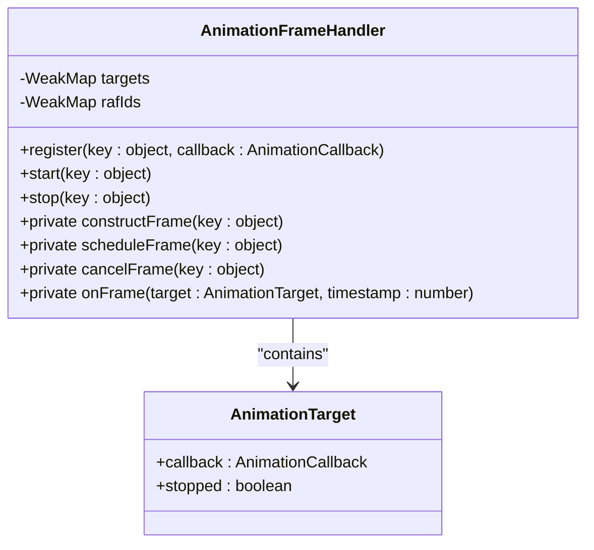
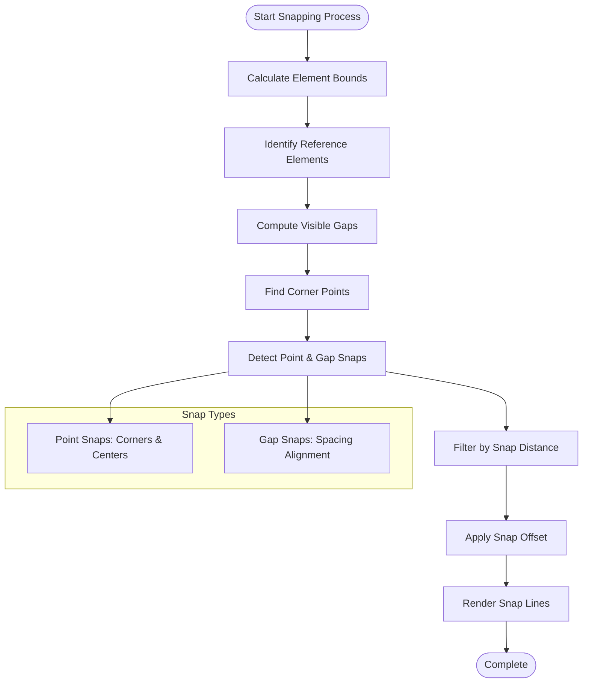
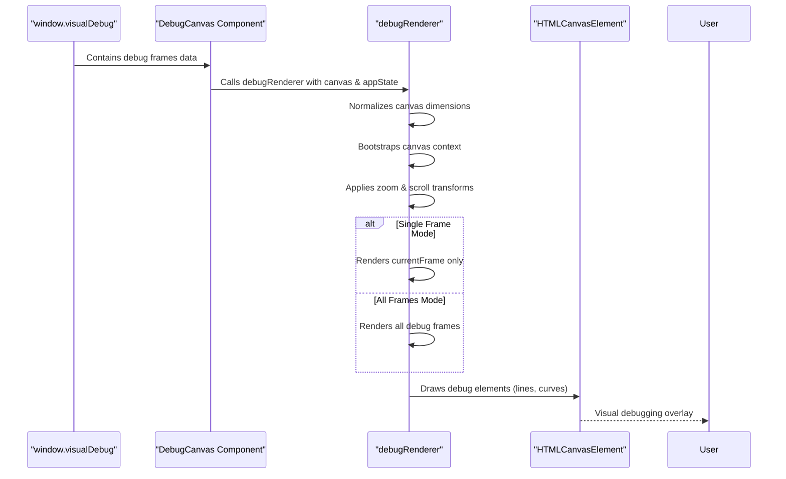

# Gesture Handling & Performance

<cite>
**Referenced Files in This Document**   
- [gesture.ts](file://excalidraw/packages/excalidraw/gesture.ts)
- [animation-frame-handler.ts](file://excalidraw/packages/excalidraw/animation-frame-handler.ts)
- [snapping.ts](file://excalidraw/packages/excalidraw/snapping.ts)
- [DebugCanvas.tsx](file://excalidraw/excalidraw-app/components/DebugCanvas.tsx)
</cite>

## Table of Contents
1. [Gesture Recognition System](#gesture-recognition-system)
2. [Animation Frame Handling](#animation-frame-handling)
3. [Snapping Engine](#snapping-engine)
4. [Performance Debugging Tools](#performance-debugging-tools)
5. [Best Practices for 60fps Performance](#best-practices-for-60fps-performance)
6. [Large Diagram Optimization](#large-diagram-optimization)

## Gesture Recognition System

The gesture recognition system in Excalidraw handles touch, pointer, and mouse events through a unified interface in `gesture.ts`. The system processes multi-pointer interactions and calculates geometric relationships between input points to support complex gestures.

The core functionality includes:
- **Pointer coordinate management** using a Map structure to track multiple simultaneous inputs
- **Center point calculation** for multi-touch gestures using centroid averaging
- **Distance measurement** between pointers for pinch/zoom detection
- **Event normalization** across different input types (touch, mouse, pen)

The system abstracts low-level DOM events into higher-level geometric operations, enabling consistent behavior across devices. It supports both single-pointer interactions (mouse, pen) and multi-pointer gestures (touch pinch, rotate).

**Section sources**
- [gesture.ts](file://excalidraw/packages/excalidraw/gesture.ts#L1-L15)

## Animation Frame Handling

Excalidraw implements a sophisticated animation frame management system through the `AnimationFrameHandler` class, designed to optimize rendering performance and prevent unnecessary computations.

**Diagram sources**
- [animation-frame-handler.ts](file://excalidraw/packages/excalidraw/animation-frame-handler.ts#L1-L80)

The handler provides several key optimization features:
- **WeakMap storage** to prevent memory leaks by allowing garbage collection of unused animation targets
- **Conditional frame scheduling** that avoids redundant requestAnimationFrame calls
- **Stop/start control** for pausing and resuming animations without losing state
- **Callback abortion** support where animations can terminate themselves
- **Timestamp propagation** for smooth, time-based animations

The system ensures that only active animations consume resources, and multiple animations can be managed independently while sharing the same requestAnimationFrame timeline.

**Section sources**
- [animation-frame-handler.ts](file://excalidraw/packages/excalidraw/animation-frame-handler.ts#L1-L80)

## Snapping Engine

The snapping engine provides intelligent alignment assistance during element manipulation, enhancing precision while maintaining fluid interaction. It operates through a multi-stage process that identifies potential snap points and applies appropriate offsets.

**Diagram sources**
- [snapping.ts](file://excalidraw/packages/excalidraw/snapping.ts#L1-L800)

Key features of the snapping system include:
- **Configurable snap distance** that adjusts based on zoom level
- **Two snap modes**: objects snap mode (default) and grid snap mode
- **Intelligent snap detection** that prioritizes the closest alignment
- **Visual feedback** through temporary snap lines during dragging
- **Performance optimizations** including cached reference points and gap calculations
- **Keyboard modifier control** where Ctrl/Cmd key toggles snapping behavior

The engine distinguishes between point snapping (aligning corners and centers) and gap snapping (matching spacing between elements), providing comprehensive alignment assistance.

**Section sources**
- [snapping.ts](file://excalidraw/packages/excalidraw/snapping.ts#L1-L800)

## Performance Debugging Tools

Excalidraw includes comprehensive performance debugging tools, with `DebugCanvas.tsx` providing visual instrumentation for development and optimization.

**Diagram sources**
- [DebugCanvas.tsx](file://excalidraw/excalidraw-app/components/DebugCanvas.tsx#L1-L341)

The debugging system features:
- **Throttled rendering** using `throttleRAF` to prevent performance degradation
- **Frame-by-frame inspection** with navigation controls (forward, backward, reset)
- **Persistent storage** of debug state in localStorage
- **Visual elements** including lines, curves, and origin markers
- **Zoom-aware rendering** that respects current view transformation
- **Memory management** that filters and retains only permanent debug elements

The debug canvas overlays on top of the main drawing area with pointer events disabled, allowing inspection without interfering with normal operation.

**Section sources**
- [DebugCanvas.tsx](file://excalidraw/excalidraw-app/components/DebugCanvas.tsx#L1-L341)

## Best Practices for 60fps Performance

To maintain smooth 60fps performance during complex interactions, Excalidraw employs several optimization strategies:

### Animation Optimization
- Use the `AnimationFrameHandler` for all time-based animations to consolidate requestAnimationFrame calls
- Implement proper start/stop lifecycle management to prevent unnecessary rendering
- Utilize the throttled `debugRenderer` pattern for high-frequency updates
- Avoid direct DOM manipulation during animation frames

### Gesture Handling Optimization
- Minimize computation in gesture event handlers by caching expensive calculations
- Use geometric primitives (points, vectors) rather than DOM elements for calculations
- Implement early exit conditions in gesture recognition algorithms
- Batch related operations to reduce re-renders

### Rendering Optimization
- Leverage the existing canvas rendering pipeline rather than introducing new layers
- Use `throttleRAF` for any custom visual feedback to align with the main rendering loop
- Minimize canvas state changes and batch drawing operations
- Implement proper cleanup of event listeners and animation callbacks

### Memory Management
- Use WeakMap for storing animation and gesture state to prevent memory leaks
- Clear debug data regularly during development
- Implement proper cleanup in React useEffect cleanup functions
- Avoid creating closures that capture large objects unnecessarily

## Large Diagram Optimization

For handling large diagrams with thousands of elements, consider the following strategies:

### Data Structure Optimization
- Ensure elements are stored in efficient data structures that support fast lookups
- Use spatial indexing for elements when possible
- Implement lazy loading of element data based on viewport visibility

### Rendering Pipeline Optimization
- Implement level-of-detail rendering for distant or small elements
- Use simplified representations for elements outside the immediate viewport
- Batch similar drawing operations to reduce context switching
- Consider offscreen canvas rendering for complex element groups

### Interaction Optimization
- Implement coarse-to-fine interaction handling (e.g., first check bounding boxes, then detailed shapes)
- Use spatial partitioning to quickly identify relevant elements for gestures
- Implement debouncing for high-frequency events like mouse move
- Optimize the snapping engine for large numbers of reference elements

### Memory and Performance Monitoring
- Use the DebugCanvas to identify performance bottlenecks
- Monitor frame timing to ensure consistent 60fps
- Track memory usage during extended editing sessions
- Implement performance regression tests for critical interactions

By following these practices and leveraging Excalidraw's built-in optimization systems, developers can maintain responsive performance even with complex diagrams and intensive user interactions.