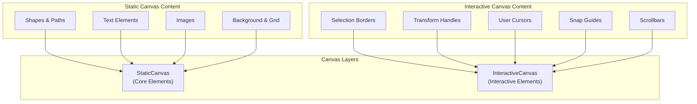
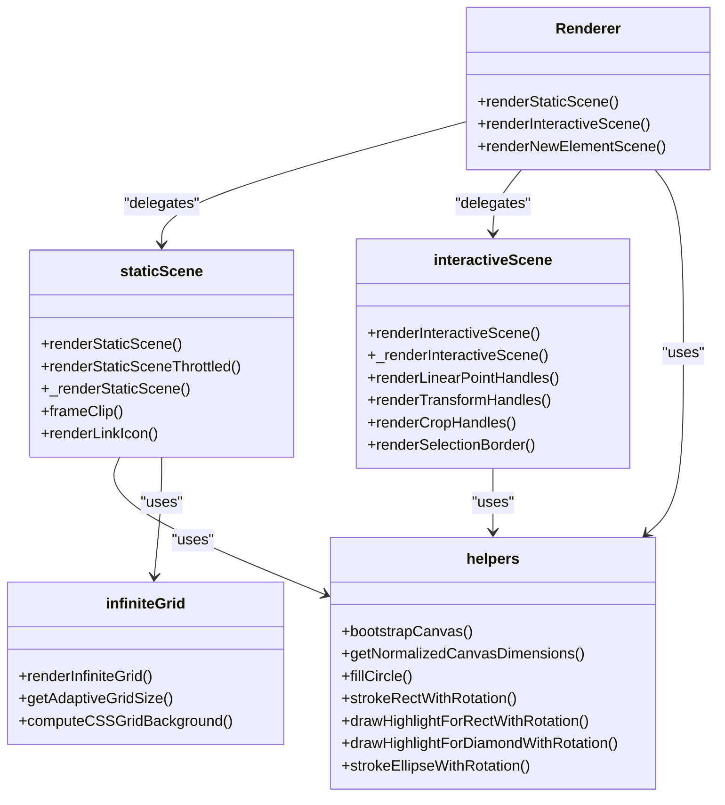
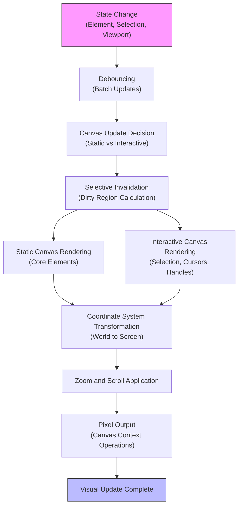
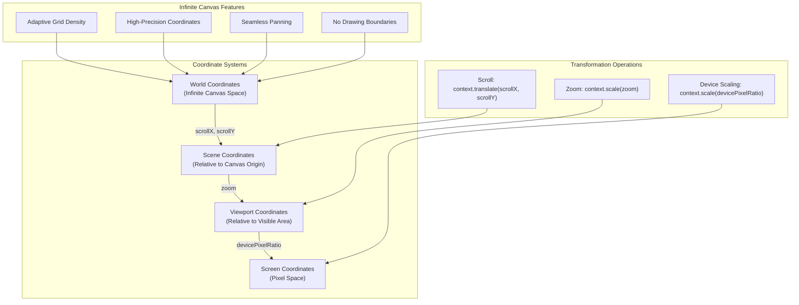
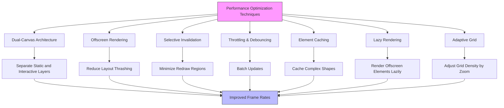
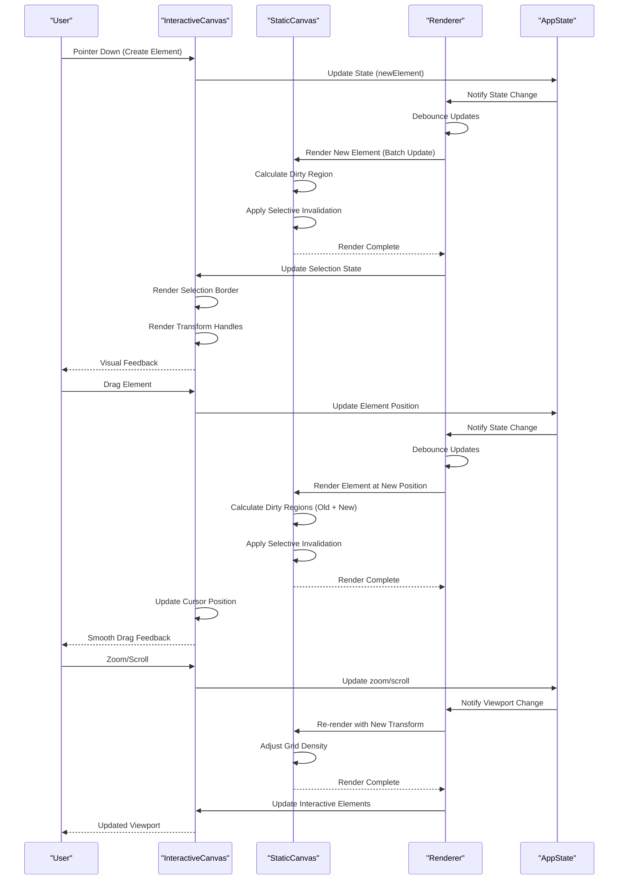

# Rendering Pipeline

<cite>
**Referenced Files in This Document**   
- [interactiveScene.ts](file://excalidraw/packages/excalidraw/renderer/interactiveScene.ts)
- [staticScene.ts](file://excalidraw/packages/excalidraw/renderer/staticScene.ts)
- [helpers.ts](file://excalidraw/packages/excalidraw/renderer/helpers.ts)
- [infiniteGrid.ts](file://excalidraw/packages/excalidraw/renderer/infiniteGrid.ts)
- [types.ts](file://excalidraw/packages/excalidraw/types.ts)
- [scene/types.ts](file://excalidraw/packages/excalidraw/scene/types.ts)
- [InteractiveCanvas.tsx](file://excalidraw/packages/excalidraw/components/canvases/InteractiveCanvas.tsx)
- [StaticCanvas.tsx](file://excalidraw/packages/excalidraw/components/canvases/StaticCanvas.tsx)
</cite>

## Table of Contents
1. [Introduction](#introduction)
2. [Dual-Canvas Architecture](#dual-canvas-architecture)
3. [Renderer Components](#renderer-components)
4. [Rendering Lifecycle](#rendering-lifecycle)
5. [Infinite Canvas Implementation](#infinite-canvas-implementation)
6. [Performance Optimization](#performance-optimization)
7. [Sequence Diagram: User Input to Visual Update](#sequence-diagram-user-input-to-visual-update)
8. [Conclusion](#conclusion)

## Introduction
The Excalidraw frontend implements a sophisticated rendering pipeline designed for optimal performance in a collaborative drawing environment. The system utilizes a dual-canvas architecture to separate static content from interactive elements, enabling efficient updates and smooth user interactions. This document details the rendering pipeline, focusing on the InteractiveCanvas and StaticCanvas components, the role of Renderer.ts in managing scene updates, and the complete rendering lifecycle from state change to pixel output.

**Section sources**
- [interactiveScene.ts](file://excalidraw/packages/excalidraw/renderer/interactiveScene.ts#L1-L1225)
- [staticScene.ts](file://excalidraw/packages/excalidraw/renderer/staticScene.ts#L1-L493)

## Dual-Canvas Architecture
Excalidraw employs a dual-canvas architecture consisting of InteractiveCanvas and StaticCanvas components to optimize rendering performance. The StaticCanvas renders the core drawing elements (shapes, text, images) while the InteractiveCanvas handles dynamic, user-interactive elements (selection borders, cursors, transform handles).

The StaticCanvas contains the primary drawing content and is updated only when the underlying elements change. This canvas benefits from caching and selective invalidation, reducing the need for full redraws. In contrast, the InteractiveCanvas is updated more frequently to reflect user interactions such as cursor movements, selection changes, and transform operations.

This separation allows Excalidraw to minimize expensive redraw operations on the main content canvas while maintaining responsive feedback for user interactions. The two canvases are perfectly aligned in the DOM, creating the illusion of a single drawing surface while providing significant performance benefits.

**Diagram sources**
- [StaticCanvas.tsx](file://excalidraw/packages/excalidraw/components/canvases/StaticCanvas.tsx#L32-L74)
- [InteractiveCanvas.tsx](file://excalidraw/packages/excalidraw/components/canvases/InteractiveCanvas.tsx#L72-L181)

**Section sources**
- [StaticCanvas.tsx](file://excalidraw/packages/excalidraw/components/canvases/StaticCanvas.tsx#L32-L74)
- [InteractiveCanvas.tsx](file://excalidraw/packages/excalidraw/components/canvases/InteractiveCanvas.tsx#L72-L181)

## Renderer Components
The rendering pipeline is managed by several key components in the renderer module. The Renderer.ts file orchestrates the rendering process, coordinating between the interactiveScene and staticScene modules to ensure consistent and efficient updates.

The interactiveScene module handles the rendering of dynamic elements on the InteractiveCanvas. It manages the display of selection borders, transform handles, user cursors, and other interactive elements. This module is optimized for frequent updates, using throttled rendering to maintain performance during continuous interactions like dragging or scrolling.

The staticScene module is responsible for rendering the core drawing elements on the StaticCanvas. It implements sophisticated optimization techniques including selective invalidation, offscreen rendering, and caching. The module renders elements in proper z-order and handles complex features like frame clipping and embeddable content.

Both modules share common helper functions for canvas operations, coordinate transformations, and visual effects. The infiniteGrid module provides the implementation for the infinite canvas background, handling grid rendering at various zoom levels with adaptive density.

**Diagram sources**
- [interactiveScene.ts](file://excalidraw/packages/excalidraw/renderer/interactiveScene.ts#L1-L1225)
- [staticScene.ts](file://excalidraw/packages/excalidraw/renderer/staticScene.ts#L1-L493)
- [helpers.ts](file://excalidraw/packages/excalidraw/renderer/helpers.ts#L1-L430)
- [infiniteGrid.ts](file://excalidraw/packages/excalidraw/renderer/infiniteGrid.ts#L1-L227)

**Section sources**
- [interactiveScene.ts](file://excalidraw/packages/excalidraw/renderer/interactiveScene.ts#L1-L1225)
- [staticScene.ts](file://excalidraw/packages/excalidraw/renderer/staticScene.ts#L1-L493)
- [helpers.ts](file://excalidraw/packages/excalidraw/renderer/helpers.ts#L1-L430)
- [infiniteGrid.ts](file://excalidraw/packages/excalidraw/renderer/infiniteGrid.ts#L1-L227)

## Rendering Lifecycle
The rendering lifecycle in Excalidraw follows a well-defined sequence from state change to pixel output. When a state change occurs (such as element creation, modification, or user interaction), the system initiates a rendering process that involves several optimization steps.

The lifecycle begins with state change detection, where the application identifies modifications to elements, selection state, or viewport parameters. This triggers a debouncing mechanism that batches multiple rapid updates to prevent excessive rendering calls. The debounce duration is typically set to align with animation frames for optimal performance.

Following debouncing, the system determines which canvases require updating. The StaticCanvas is updated only when core elements change, while the InteractiveCanvas updates more frequently for interactive elements. The rendering process applies batch updates to minimize canvas context switches and maximize rendering efficiency.

Before rendering, the system performs selective invalidation, identifying only the portions of the canvas that need redrawing. This optimization significantly reduces the rendering workload, especially for large drawings. The actual rendering occurs in two phases: first the StaticCanvas is updated with core elements, followed by the InteractiveCanvas with dynamic elements.

**Diagram sources**
- [staticScene.ts](file://excalidraw/packages/excalidraw/renderer/staticScene.ts#L1-L493)
- [interactiveScene.ts](file://excalidraw/packages/excalidraw/renderer/interactiveScene.ts#L1-L1225)
- [types.ts](file://excalidraw/packages/excalidraw/types.ts#L1-L944)

**Section sources**
- [staticScene.ts](file://excalidraw/packages/excalidraw/renderer/staticScene.ts#L1-L493)
- [interactiveScene.ts](file://excalidraw/packages/excalidraw/renderer/interactiveScene.ts#L1-L1225)

## Infinite Canvas Implementation
Excalidraw implements an infinite canvas system that allows users to draw without spatial constraints. The coordinate system is based on world-space coordinates, with the viewport representing the currently visible portion of the infinite canvas. This implementation uses a transformation system that converts between world coordinates (drawing space) and screen coordinates (display space).

The infinite canvas handles zoom and scroll operations through a combination of CSS transforms and canvas context transformations. Zooming is implemented by scaling the canvas context, while scrolling is achieved by translating the context origin. The system maintains high precision even at extreme zoom levels by using floating-point coordinates and careful rounding to prevent pixelation artifacts.

The infiniteGrid module provides the visual representation of the infinite canvas through a dynamically adaptive grid system. The grid density adjusts based on the current zoom level, ensuring optimal visibility at all scales. At low zoom levels, the grid displays major and minor lines with different weights, while at high zoom levels, it transitions to a dot or cross pattern for better readability.

Coordinate transformations are handled by utility functions that convert between different coordinate systems. The system supports multiple coordinate spaces including world coordinates (absolute drawing space), scene coordinates (relative to canvas origin), and viewport coordinates (relative to visible area). These transformations are optimized for performance and accuracy, ensuring precise element placement and interaction.

**Diagram sources**
- [infiniteGrid.ts](file://excalidraw/packages/excalidraw/renderer/infiniteGrid.ts#L1-L227)
- [types.ts](file://excalidraw/packages/excalidraw/types.ts#L1-L944)
- [scene/types.ts](file://excalidraw/packages/excalidraw/scene/types.ts#L1-L160)

**Section sources**
- [infiniteGrid.ts](file://excalidraw/packages/excalidraw/renderer/infiniteGrid.ts#L1-L227)
- [types.ts](file://excalidraw/packages/excalidraw/types.ts#L1-L944)

## Performance Optimization
Excalidraw employs several sophisticated optimization techniques to maintain high performance even with complex drawings. The primary optimization is the dual-canvas architecture, which separates static content from interactive elements, allowing independent update cycles and reducing rendering overhead.

Offscreen rendering is used extensively to minimize layout thrashing and improve rendering efficiency. The system renders elements to offscreen canvases when possible, then composites them onto the main canvas. This technique reduces the number of DOM operations and improves frame rates during complex interactions.

Selective invalidation is another key optimization, where only the portions of the canvas that have changed are redrawn. The system calculates "dirty regions" based on element modifications and updates only those areas, significantly reducing the rendering workload. This is particularly effective for large drawings where only a small portion changes during typical interactions.

The rendering pipeline uses throttling and debouncing to batch updates and prevent excessive rendering calls. The renderStaticScene function is wrapped with throttleRAF to limit updates to animation frame intervals, ensuring smooth performance without overloading the browser's rendering engine. For interactive elements, updates are debounced to handle rapid successive changes efficiently.

Additional optimizations include element caching, where complex shapes are cached as bitmap representations, and lazy rendering of offscreen elements. The system also implements intelligent grid rendering that adapts density based on zoom level, reducing visual clutter and rendering overhead at different scales.

**Diagram sources**
- [staticScene.ts](file://excalidraw/packages/excalidraw/renderer/staticScene.ts#L1-L493)
- [interactiveScene.ts](file://excalidraw/packages/excalidraw/renderer/interactiveScene.ts#L1-L1225)
- [helpers.ts](file://excalidraw/packages/excalidraw/renderer/helpers.ts#L1-L430)

**Section sources**
- [staticScene.ts](file://excalidraw/packages/excalidraw/renderer/staticScene.ts#L1-L493)
- [interactiveScene.ts](file://excalidraw/packages/excalidraw/renderer/interactiveScene.ts#L1-L1225)

## Sequence Diagram: User Input to Visual Update
The following sequence diagram illustrates the complete flow from user input to visual update in the Excalidraw rendering pipeline. This process demonstrates how user interactions are processed through the dual-canvas architecture to produce responsive visual feedback.

**Diagram sources**
- [InteractiveCanvas.tsx](file://excalidraw/packages/excalidraw/components/canvases/InteractiveCanvas.tsx#L72-L181)
- [StaticCanvas.tsx](file://excalidraw/packages/excalidraw/components/canvases/StaticCanvas.tsx#L32-L74)
- [types.ts](file://excalidraw/packages/excalidraw/types.ts#L1-L944)

**Section sources**
- [InteractiveCanvas.tsx](file://excalidraw/packages/excalidraw/components/canvases/InteractiveCanvas.tsx#L72-L181)
- [StaticCanvas.tsx](file://excalidraw/packages/excalidraw/components/canvases/StaticCanvas.tsx#L32-L74)

## Conclusion
The Excalidraw rendering pipeline demonstrates a sophisticated approach to canvas-based drawing applications, combining architectural innovation with practical performance optimizations. The dual-canvas architecture effectively separates static content from interactive elements, enabling efficient updates and responsive user interactions. The rendering lifecycle incorporates debouncing, batch updates, and selective invalidation to minimize performance overhead while maintaining visual consistency.

Key innovations include the infinite canvas implementation with adaptive grid rendering, precise coordinate system transformations, and comprehensive performance optimizations. These features work together to create a seamless drawing experience that scales well from simple sketches to complex diagrams. The modular design of the renderer components allows for maintainable code and future enhancements while providing a solid foundation for collaborative editing features.

The documented rendering pipeline serves as a reference for understanding Excalidraw's performance characteristics and provides insights for developers looking to implement similar canvas-based applications. By following the principles of separation of concerns, selective rendering, and intelligent optimization, the system achieves a balance between visual fidelity and interactive responsiveness.