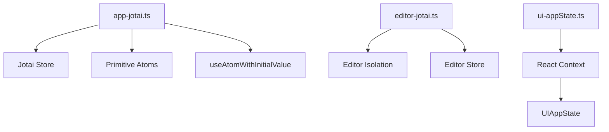
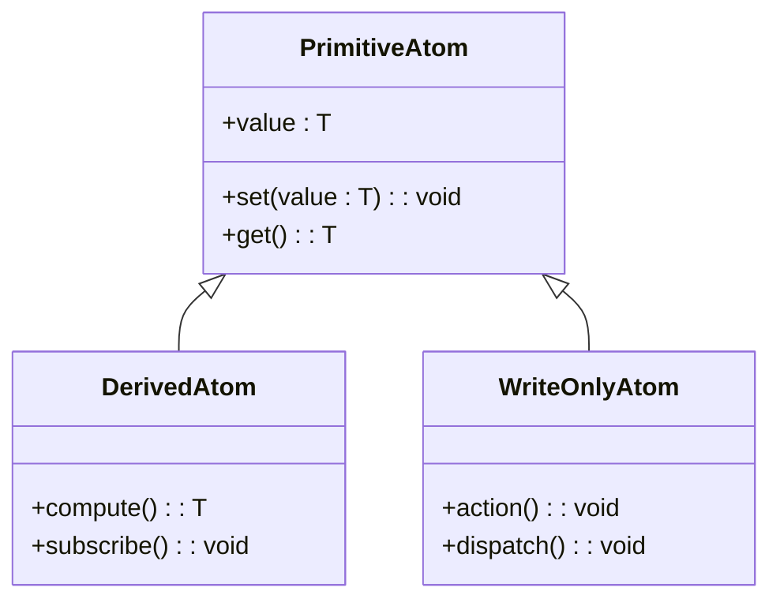
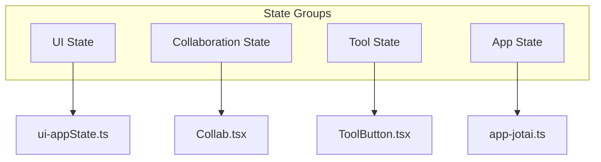
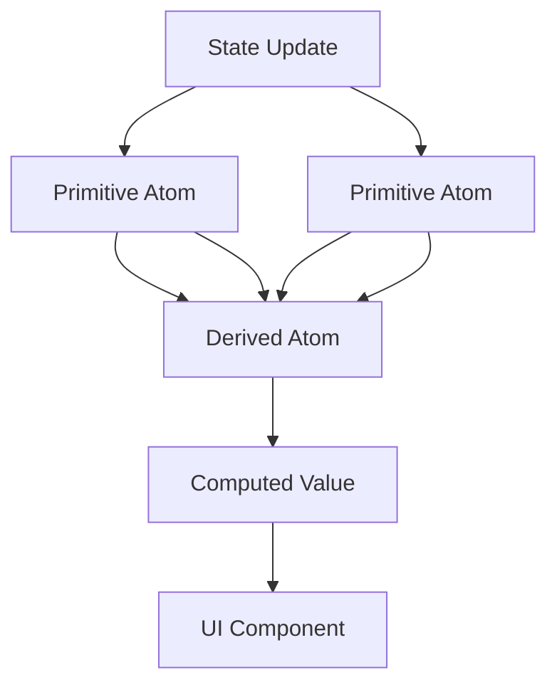
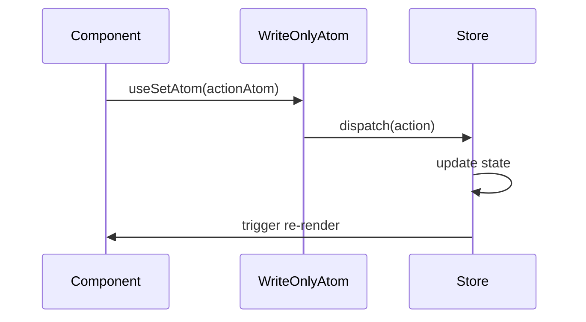
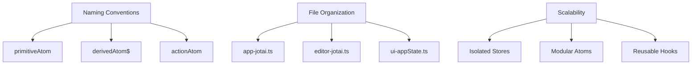

# Atom Organization

<cite>
**Referenced Files in This Document**   
- [app-jotai.ts](file://excalidraw-app/app-jotai.ts)
- [ui-appState.ts](file://packages/excalidraw/context/ui-appState.ts)
- [editor-jotai.ts](file://packages/excalidraw/editor-jotai.ts)
</cite>

## Table of Contents
1. [Introduction](#introduction)
2. [Core State Management Files](#core-state-management-files)
3. [Atom Types and Patterns](#atom-types-and-patterns)
4. [State Organization and Grouping](#state-organization-and-grouping)
5. [Derived and Computed State](#derived-and-computed-state)
6. [Write-Only Atoms and Actions](#write-only-atoms-and-actions)
7. [Naming Conventions and Scalability](#naming-conventions-and-scalability)
8. [Conclusion](#conclusion)

## Introduction
This document details the atom organization patterns within the Excalidraw state management system, focusing on the implementation and structure of Jotai atoms in `app-jotai.ts` and related state management files. The system leverages Jotai's atomic state management to organize UI and application state into logical, maintainable units. The documentation covers primitive atoms, derived atoms using selectors, write-only atoms for actions, and the overall architecture for state grouping and scalability.

## Core State Management Files

The Excalidraw state management system is built around two primary files that define the atom infrastructure: `app-jotai.ts` and `editor-jotai.ts`. These files provide the foundation for state management across the application, with `app-jotai.ts` serving as the main entry point for the Jotai store in the application layer.

**Diagram sources**
- [app-jotai.ts](file://excalidraw-app/app-jotai.ts#L1-L36)
- [editor-jotai.ts](file://packages/excalidraw/editor-jotai.ts#L1-L17)
- [ui-appState.ts](file://packages/excalidraw/context/ui-appState.ts#L1-L5)

**Section sources**
- [app-jotai.ts](file://excalidraw-app/app-jotai.ts#L1-L36)
- [editor-jotai.ts](file://packages/excalidraw/editor-jotai.ts#L1-L17)

## Atom Types and Patterns

The state management system implements several atom patterns to handle different types of state. The `app-jotai.ts` file exports the core Jotai primitives and creates a dedicated store for the application. This store is used to manage both primitive atoms and more complex derived atoms.

Primitive atoms are created using the `atom` function imported from Jotai, which serves as the basic building block for state. The system also implements a custom hook `useAtomWithInitialValue` that allows atoms to be initialized with a default value, ensuring consistent state initialization across components.

**Diagram sources**
- [app-jotai.ts](file://excalidraw-app/app-jotai.ts#L1-L36)

**Section sources**
- [app-jotai.ts](file://excalidraw-app/app-jotai.ts#L1-L36)

## State Organization and Grouping

The state system organizes atoms into logical groups based on their functionality and scope. UI state, collaboration state, and tool state are separated into distinct domains, allowing for better maintainability and scalability. The `ui-appState.ts` file defines a React context for UI application state, which is used to provide state to components through the `useUIAppState` hook.

This organization pattern allows different parts of the application to access only the state they need, reducing unnecessary re-renders and improving performance. The context-based approach complements the atom-based state management by providing a higher-level abstraction for UI-related state.

**Diagram sources**
- [ui-appState.ts](file://packages/excalidraw/context/ui-appState.ts#L1-L5)
- [app-jotai.ts](file://excalidraw-app/app-jotai.ts#L1-L36)

**Section sources**
- [ui-appState.ts](file://packages/excalidraw/context/ui-appState.ts#L1-L5)

## Derived and Computed State

The system implements derived atoms using Jotai's `selectAtom` pattern and other utility functions from `jotai/utils`. Derived atoms allow for computed state that automatically updates when their dependencies change, enabling efficient re-computation of values without manual subscription management.

These derived atoms are used extensively for UI state calculations, such as determining the current tool mode, calculating element bounds, or computing collaboration status. The use of derived atoms ensures that computed values are always consistent with the underlying primitive state and are automatically memoized to prevent unnecessary re-computations.

**Diagram sources**
- [app-jotai.ts](file://excalidraw-app/app-jotai.ts#L1-L36)

**Section sources**
- [app-jotai.ts](file://excalidraw-app/app-jotai.ts#L1-L36)

## Write-Only Atoms and Actions

Write-only atoms are used for actions and state mutations, providing a clean pattern for dispatching updates to the state store. These atoms don't expose their values directly but provide a mechanism for triggering state changes. This pattern is particularly useful for actions that have side effects or don't need to expose their internal state to components.

The system uses write-only atoms for various actions such as element creation, property updates, and tool interactions. These atoms are typically used with `useSetAtom` to obtain a setter function that can be called to dispatch actions, keeping the component logic separate from the state mutation logic.

**Diagram sources**
- [app-jotai.ts](file://excalidraw-app/app-jotai.ts#L1-L36)

**Section sources**
- [app-jotai.ts](file://excalidraw-app/app-jotai.ts#L1-L36)

## Naming Conventions and Scalability

The codebase follows consistent naming conventions for atoms and state management utilities, enhancing readability and maintainability. Primitive atoms are typically named descriptively based on their purpose, while derived atoms include prefixes or suffixes that indicate their computed nature.

The file organization strategy separates state management concerns into dedicated files, with `app-jotai.ts` handling application-level state and `editor-jotai.ts` managing editor-specific state. This separation of concerns allows the system to scale effectively as new features are added, with each domain maintaining its own state management patterns while sharing the same underlying Jotai infrastructure.

The use of `createIsolation` in `editor-jotai.ts` demonstrates a strategy for isolating state between different editor instances, which is crucial for supporting multiple Excalidraw instances on the same page without state collisions.

**Diagram sources**
- [app-jotai.ts](file://excalidraw-app/app-jotai.ts#L1-L36)
- [editor-jotai.ts](file://packages/excalidraw/editor-jotai.ts#L1-L17)

**Section sources**
- [app-jotai.ts](file://excalidraw-app/app-jotai.ts#L1-L36)
- [editor-jotai.ts](file://packages/excalidraw/editor-jotai.ts#L1-L17)

## Conclusion
The Excalidraw state management system demonstrates a sophisticated use of Jotai atoms to create a scalable, maintainable state architecture. By organizing atoms into logical groups, implementing derived and write-only atoms, and following consistent naming conventions, the system provides a robust foundation for managing complex UI state. The combination of Jotai's atomic state with React context in `ui-appState.ts` creates a flexible architecture that can handle both local component state and global application state efficiently.