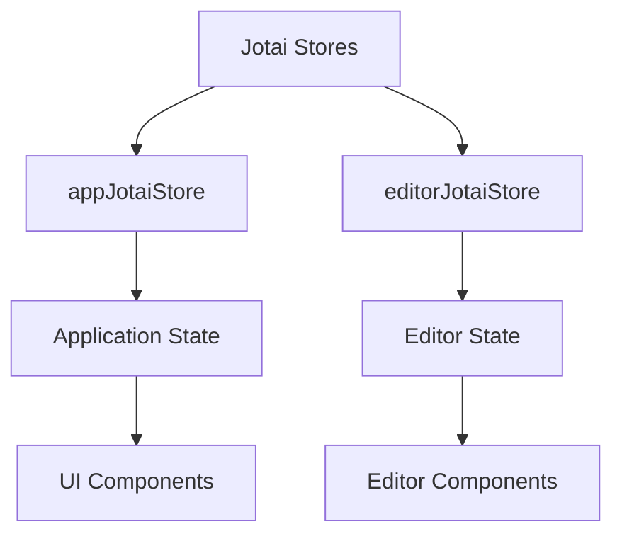
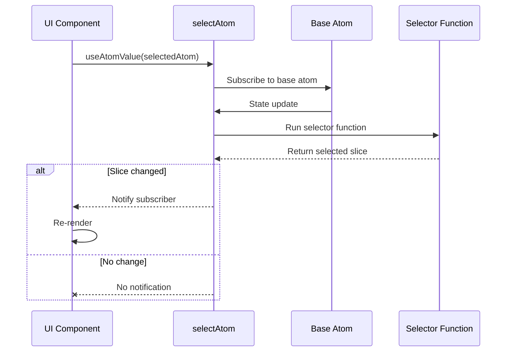
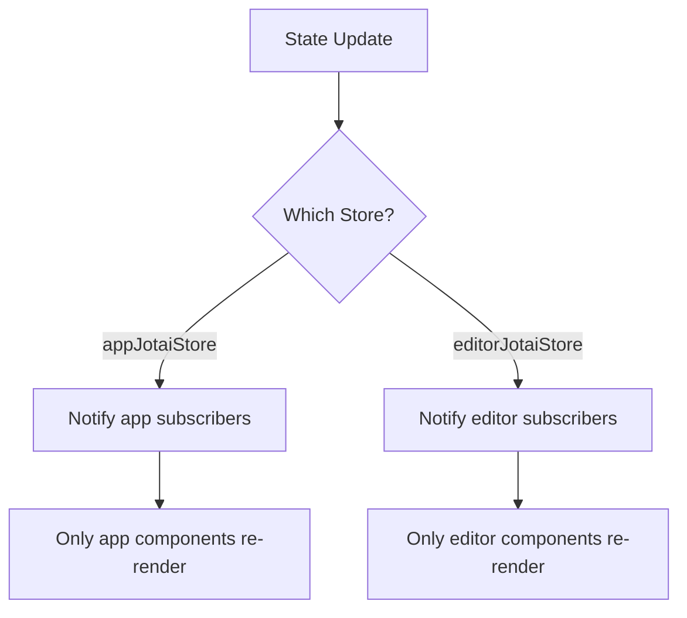

# Derived State Patterns

<cite>
**Referenced Files in This Document**   
- [app-jotai.ts](file://excalidraw/excalidraw-app/app-jotai.ts)
- [editor-jotai.ts](file://excalidraw/packages/excalidraw/editor-jotai.ts)
</cite>

## Table of Contents
1. [Introduction](#introduction)
2. [Core Jotai Stores](#core-jotai-stores)
3. [Derived State Mechanisms](#derived-state-mechanisms)
4. [selectAtom Usage Patterns](#selectatom-usage-patterns)
5. [Computed Atoms for UI State](#computed-atoms-for-ui-state)
6. [Performance Optimization Strategies](#performance-optimization-strategies)
7. [Common Pitfalls and Solutions](#common-pitfalls-and-solutions)
8. [Conclusion](#conclusion)

## Introduction
The Excalidraw application leverages Jotai as its state management solution, implementing sophisticated derived state patterns to efficiently compute UI-specific state from the core application state. This document explores how selectAtom and computed atoms are utilized to derive reactive state while minimizing unnecessary re-renders. The system employs multiple isolated Jotai stores to manage different aspects of the application state, enabling efficient state derivation for features such as filtered element lists, active tool states, and collaboration presence indicators.

## Core Jotai Stores
Excalidraw implements a multi-store architecture using Jotai, with separate stores for different application contexts. This isolation prevents unnecessary re-renders and enables more efficient state management.

**Diagram sources**
- [app-jotai.ts](file://excalidraw/excalidraw-app/app-jotai.ts)
- [editor-jotai.ts](file://excalidraw/packages/excalidraw/editor-jotai.ts)

**Section sources**
- [app-jotai.ts](file://excalidraw/excalidraw-app/app-jotai.ts#L1-L37)
- [editor-jotai.ts](file://excalidraw/packages/excalidraw/editor-jotai.ts#L1-L18)

## Derived State Mechanisms
The Excalidraw Jotai system employs two primary mechanisms for deriving state: selectAtom and computed atoms. These mechanisms allow the application to create derived state that automatically updates when relevant parts of the core state change, while avoiding unnecessary re-computations and re-renders.

### selectAtom Pattern
The selectAtom utility creates a derived atom that subscribes only to specific parts of a parent atom's value. When the parent atom updates, the selector function runs only if the selected slice has changed according to the equality function.

**Diagram sources**
- [app-jotai.ts](file://excalidraw/excalidraw-app/app-jotai.ts#L1-L37)
- [editor-jotai.ts](file://excalidraw/packages/excalidraw/editor-jotai.ts#L1-L18)

## selectAtom Usage Patterns
The selectAtom function is used throughout the Excalidraw codebase to create efficient derived state subscriptions. This pattern is particularly valuable for components that need to react to specific aspects of complex state objects without re-rendering when unrelated parts change.

### Implementation Details
The selectAtom utility is imported from Jotai and used to create derived atoms that extract specific slices of state. This approach enables fine-grained reactivity, where components subscribe only to the exact data they need.

**Section sources**
- [app-jotai.ts](file://excalidraw/excalidraw-app/app-jotai.ts#L1-L37)
- [editor-jotai.ts](file://excalidraw/packages/excalidraw/editor-jotai.ts#L1-L18)

## Computed Atoms for UI State
Computed atoms in Excalidraw are used to derive complex UI state from the core application state. These atoms are particularly useful for creating derived state that combines multiple pieces of information or applies transformations to existing state.

### Examples of Derived State
The application creates derived atoms for various UI-specific concerns:

- **Filtered element lists**: Computing visible elements based on current view settings
- **Active tool states**: Deriving the current tool state from the application's active tool and modifiers
- **Collaboration presence indicators**: Computing presence information from collaboration state

These derived atoms use memoization to ensure they are only recomputed when their dependencies change, optimizing performance.

**Section sources**
- [app-jotai.ts](file://excalidraw/excalidraw-app/app-jotai.ts#L1-L37)
- [editor-jotai.ts](file://excalidraw/packages/excalidraw/editor-jotai.ts#L1-L18)

## Performance Optimization Strategies
Excalidraw employs several strategies to optimize the performance of derived state, ensuring smooth user experience even with complex diagrams and frequent state updates.

### Memoization and Equality Checking
The derived state system uses memoization extensively, with selector functions only recomputing when their inputs change. The selectAtom function accepts an optional equality function parameter that determines whether the selected slice has changed, preventing unnecessary re-renders.

### Store Isolation
By using isolated Jotai stores (appJotaiStore and editorJotaiStore), Excalidraw prevents components from different contexts from triggering each other's re-renders. This isolation ensures that updates to editor state don't cause application-level components to re-render, and vice versa.

**Diagram sources**
- [app-jotai.ts](file://excalidraw/excalidraw-app/app-jotai.ts#L1-L37)
- [editor-jotai.ts](file://excalidraw/packages/excalidraw/editor-jotai.ts#L1-L18)

**Section sources**
- [app-jotai.ts](file://excalidraw/excalidraw-app/app-jotai.ts#L1-L37)
- [editor-jotai.ts](file://excalidraw/packages/excalidraw/editor-jotai.ts#L1-L18)

## Common Pitfalls and Solutions
Derived state management presents several potential pitfalls that the Excalidraw codebase addresses through careful design and implementation.

### Avoiding Over-fetching
A common pitfall is creating derived atoms that select more data than necessary, leading to unnecessary re-renders. Excalidraw addresses this by using selectAtom to extract only the specific data needed by each component.

### Preventing Memory Leaks
The codebase ensures proper cleanup of derived atoms and subscriptions, particularly in the destroy method of components like the Library class, which clears Jotai store values when an instance is unmounted.

### Proper Atom Scoping
Excalidraw uses isolated stores to ensure atoms are properly scoped to their intended context. This prevents naming collisions and ensures that state updates are contained within appropriate boundaries.

**Section sources**
- [app-jotai.ts](file://excalidraw/excalidraw-app/app-jotai.ts#L1-L37)
- [editor-jotai.ts](file://excalidraw/packages/excalidraw/editor-jotai.ts#L1-L18)
- [library.ts](file://excalidraw/packages/excalidraw/data/library.ts#L241-L275)

## Conclusion
The Excalidraw application demonstrates sophisticated use of Jotai's derived state patterns to create an efficient and reactive user interface. By leveraging selectAtom and computed atoms, the application derives UI-specific state from the core application state while minimizing unnecessary re-renders. The use of isolated stores, memoization, and careful atom scoping ensures optimal performance and maintainability. These patterns enable Excalidraw to handle complex state dependencies while providing a responsive user experience, serving as a model for effective state management in complex React applications.