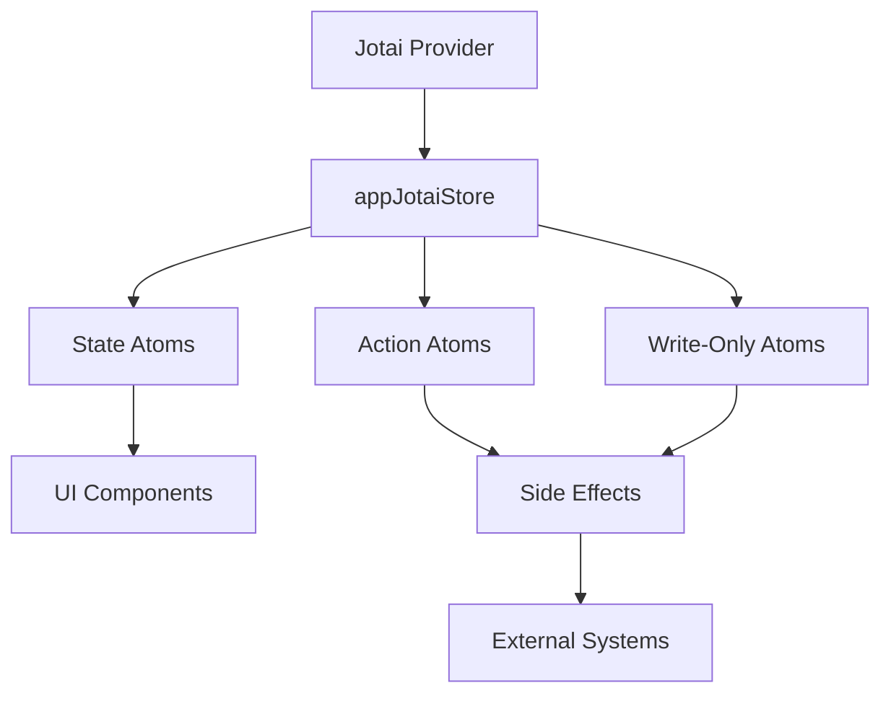
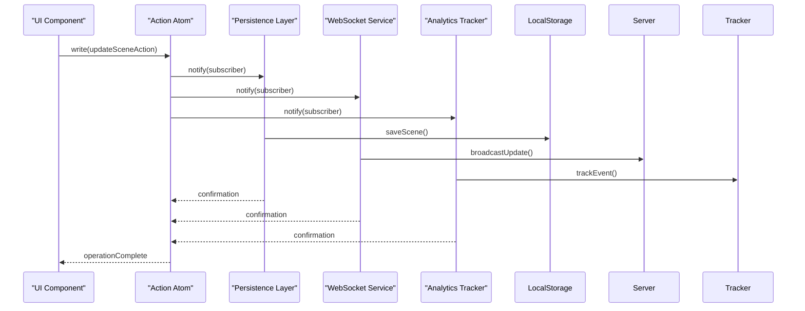
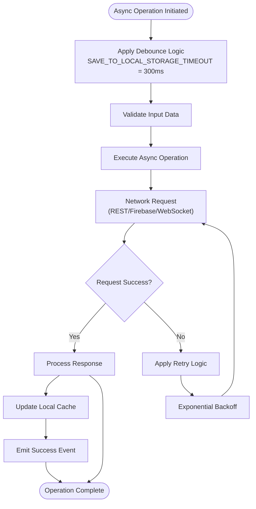
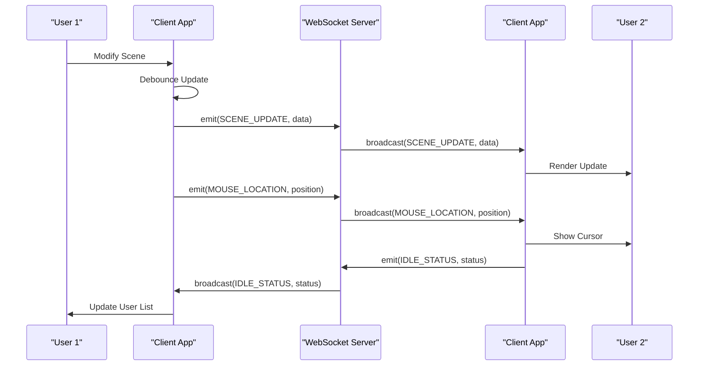
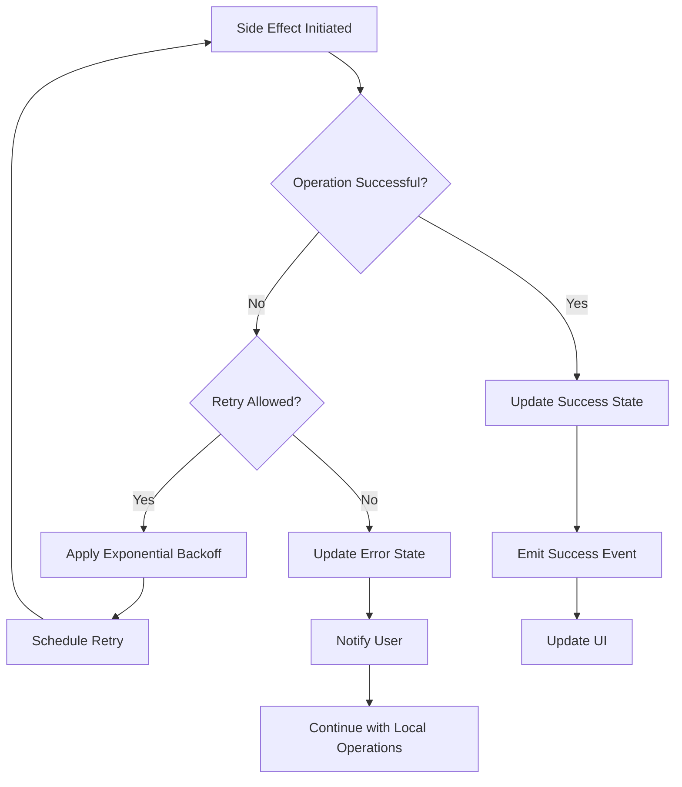

# Side Effects Management

<cite>
**Referenced Files in This Document**   
- [app-jotai.ts](file://excalidraw/excalidraw-app/app-jotai.ts)
- [app_constants.ts](file://excalidraw/excalidraw-app/app_constants.ts)
- [library.ts](file://excalidraw/packages/excalidraw/data/library.ts)
- [store.ts](file://excalidraw/packages/element/src/store.ts)
- [api-client.ts](file://excalidraw/excalidraw-app/data/api-client.ts)
- [restPersistence.ts](file://excalidraw/excalidraw-app/data/restPersistence.ts)
- [firebase.ts](file://excalidraw/excalidraw-app/data/firebase.ts)
- [tabSync.ts](file://excalidraw/excalidraw-app/data/tabSync.ts)
</cite>

## Table of Contents
1. [Introduction](#introduction)
2. [Jotai State Management Overview](#jotai-state-management-overview)
3. [Write-Only Atoms and Action Atoms](#write-only-atoms-and-action-atoms)
4. [Side Effect Triggers and Decoupling](#side-effect-triggers-and-decoupling)
5. [Async Operations with jotai/utils](#async-operations-with-jotaiutils)
6. [Persistence Mechanisms](#persistence-mechanisms)
7. [Analytics Tracking Implementation](#analytics-tracking-implementation)
8. [WebSocket Communication for Collaboration](#websocket-communication-for-collaboration)
9. [Error Handling and Retry Mechanisms](#error-handling-and-retry-mechanisms)
10. [Conclusion](#conclusion)

## Introduction
This document details the side effects management system in Excalidraw's state architecture using Jotai. It explains how write-only atoms and action atoms are employed to handle critical operations such as persistence, analytics tracking, and real-time collaboration through WebSocket communication. The implementation leverages jotai/utils for managing asynchronous operations and integrating with external systems like REST APIs, Firebase, and WebSocket servers. User interactions trigger side effects through atom writes that are decoupled from UI components, enabling a clean separation of concerns and improved testability.

**Section sources**
- [app-jotai.ts](file://excalidraw/excalidraw-app/app-jotai.ts#L1-L37)
- [app_constants.ts](file://excalidraw/excalidraw-app/app_constants.ts#L1-L60)

## Jotai State Management Overview
Excalidraw utilizes Jotai as its primary state management solution, providing a scalable and predictable way to manage application state. The system is built around atoms, which represent units of state that can be read from and written to. A custom store instance (`appJotaiStore`) is created to ensure proper isolation and initialization of state. This approach allows for fine-grained reactivity where components only re-render when the specific atoms they depend on change.

The architecture employs a scoped store pattern, with `appJotaiStore` serving as the central repository for application state. This enables better control over state initialization and cleanup, particularly important for complex applications like Excalidraw that may have multiple instances or need to manage state across different lifecycle phases.



**Diagram sources**
- [app-jotai.ts](file://excalidraw/excalidraw-app/app-jotai.ts#L1-L37)

**Section sources**
- [app-jotai.ts](file://excalidraw/excalidraw-app/app-jotai.ts#L1-L37)

## Write-Only Atoms and Action Atoms
Excalidraw implements a sophisticated pattern using write-only atoms and action atoms to manage side effects. Write-only atoms serve as triggers for specific operations without exposing internal state, maintaining encapsulation and preventing unintended reads. These atoms are typically used for commands that initiate processes such as saving scenes, updating user preferences, or triggering analytics events.

Action atoms function as higher-level constructs that encapsulate complex operations involving multiple state changes and side effects. They provide a clean API for components to interact with the system while keeping the implementation details hidden. For example, when a user modifies a drawing element, an action atom is written to, which then orchestrates the update to the scene state, triggers persistence operations, and notifies collaborators through WebSocket connections.

The system also includes specialized atoms for managing library items, where operations like `resetLibrary` and `getLatestLibrary` are implemented as atomic actions that ensure consistency and handle asynchronous updates properly. These operations use promise-based patterns to await in-progress updates before resolving with the latest state.

```mermaid
classDiagram
class WriteOnlyAtom {
+triggerSideEffect()
-executeOperation()
}
class ActionAtom {
+performAction()
-validateInput()
-updateState()
-triggerSideEffects()
-handleErrors()
}
class LibraryManager {
+resetLibrary()
+getLatestLibrary()
+destroy()
-setLibrary()
-getLastUpdateTask()
}
WriteOnlyAtom --> ActionAtom : "composes"
ActionAtom --> LibraryManager : "uses"
LibraryManager --> "Promise<LibraryItems>" : "returns"
```

**Diagram sources**
- [library.ts](file://excalidraw/packages/excalidraw/data/library.ts#L241-L275)

**Section sources**
- [library.ts](file://excalidraw/packages/excalidraw/data/library.ts#L241-L275)
- [app-jotai.ts](file://excalidraw/excalidraw-app/app-jotai.ts#L1-L37)

## Side Effect Triggers and Decoupling
User interactions in Excalidraw trigger side effects through atom writes, creating a clean separation between UI components and business logic. When a user performs an action such as drawing an element or changing settings, the UI component writes to a specific atom rather than directly invoking side effect functions. This decoupling allows for greater flexibility in how side effects are handled and makes the system more testable and maintainable.

The decoupling is achieved through Jotai's subscription mechanism, where side effect handlers subscribe to changes in specific atoms. When an atom value changes, the subscribed handlers are notified and can perform the necessary operations. This pub-sub pattern ensures that UI components don't need to know about the implementation details of side effects, only about which atoms to write to.

For example, when a user modifies a scene, the component writes to a scene update atom. Multiple subscribers may be listening to this atom: one might handle local persistence, another might send the update through WebSocket to collaborators, and a third might track the interaction for analytics purposes. Each of these side effects operates independently, allowing the system to remain responsive even if one of the operations is slow or fails.



**Diagram sources**
- [app-jotai.ts](file://excalidraw/excalidraw-app/app-jotai.ts#L1-L37)
- [restPersistence.ts](file://excalidraw/excalidraw-app/data/restPersistence.ts#L1-L50)
- [firebase.ts](file://excalidraw/excalidraw-app/data/firebase.ts#L1-L40)

**Section sources**
- [app-jotai.ts](file://excalidraw/excalidraw-app/app-jotai.ts#L1-L37)
- [restPersistence.ts](file://excalidraw/excalidraw-app/data/restPersistence.ts#L1-L50)
- [firebase.ts](file://excalidraw/excalidraw-app/data/firebase.ts#L1-L40)

## Async Operations with jotai/utils
The Excalidraw system leverages jotai/utils for managing asynchronous operations and integrating with external systems. This approach allows for clean handling of promises, loading states, and error conditions without cluttering the main application logic. The utilities provide patterns for creating atoms that represent async operations, making it easy to compose complex workflows from simpler building blocks.

For operations that involve network requests or file system access, the system uses async atoms that automatically handle the lifecycle of the operation, including pending states, success results, and error conditions. This eliminates the need for manual state management of loading indicators and error messages in components, as these are derived directly from the atom state.

The implementation also includes utilities for debouncing and throttling operations, which is particularly important for features like auto-saving where frequent updates could overwhelm the persistence layer. Constants like `SAVE_TO_LOCAL_STORAGE_TIMEOUT` (300ms) are used to control the frequency of these operations, ensuring a responsive user experience while maintaining data integrity.



**Diagram sources**
- [app_constants.ts](file://excalidraw/excalidraw-app/app_constants.ts#L1-L10)
- [restPersistence.ts](file://excalidraw/excalidraw-app/data/restPersistence.ts#L1-L50)

**Section sources**
- [app_constants.ts](file://excalidraw/excalidraw-app/app_constants.ts#L1-L10)
- [restPersistence.ts](file://excalidraw/excalidraw-app/data/restPersistence.ts#L1-L50)

## Persistence Mechanisms
Excalidraw implements a multi-layered persistence strategy using various storage mechanisms coordinated through Jotai atoms. The system uses `localStorage` for immediate local persistence with a timeout of 300ms (`SAVE_TO_LOCAL_STORAGE_TIMEOUT`), ensuring that user changes are not lost during brief interruptions. This local storage is managed through dedicated atoms that handle reading and writing scene data to browser storage.

For cloud persistence and collaboration, the system integrates with external services through REST APIs and Firebase. The `restPersistence.ts` module handles communication with the backend server, while `firebase.ts` manages interactions with Firebase storage for features like shareable links and room collaboration. These persistence layers are accessed through action atoms that abstract the underlying implementation details from the UI components.

The system also includes mechanisms for synchronizing state across browser tabs using the `tabSync.ts` module, which listens for storage events and updates the local state accordingly. This ensures a consistent experience when users have multiple tabs open, with changes in one tab automatically reflected in others.

```mermaid
graph TB
subgraph "Persistence Layers"
A[UI Components] --> B[Action Atoms]
B --> C[Local Storage<br/>(localStorage.ts)]
B --> D[REST API<br/>(restPersistence.ts)]
B --> E[Firebase<br/>(firebase.ts)]
B --> F[Browser Tabs<br/>(tabSync.ts)]
C --> G[(Browser LocalStorage)]
D --> H[(Backend Server)]
E --> I[(Firebase Storage)]
F --> J[Other Browser Tabs]
end
K[SAVE_TO_LOCAL_STORAGE_TIMEOUT<br/>300ms] --> C
L[SYNC_FULL_SCENE_INTERVAL_MS<br/>20000ms] --> D
M[SYNC_BROWSER_TABS_TIMEOUT<br/>50ms] --> F
```

**Diagram sources**
- [app_constants.ts](file://excalidraw/excalidraw-app/app_constants.ts#L1-L15)
- [localStorage.ts](file://excalidraw/excalidraw-app/data/localStorage.ts#L1-L40)
- [restPersistence.ts](file://excalidraw/excalidraw-app/data/restPersistence.ts#L1-L50)
- [firebase.ts](file://excalidraw/excalidraw-app/data/firebase.ts#L1-L40)
- [tabSync.ts](file://excalidraw/excalidraw-app/data/tabSync.ts#L1-L35)

**Section sources**
- [app_constants.ts](file://excalidraw/excalidraw-app/app_constants.ts#L1-L15)
- [localStorage.ts](file://excalidraw/excalidraw-app/data/localStorage.ts#L1-L40)
- [restPersistence.ts](file://excalidraw/excalidraw-app/data/restPersistence.ts#L1-L50)
- [firebase.ts](file://excalidraw/excalidraw-app/data/firebase.ts#L1-L40)
- [tabSync.ts](file://excalidraw/excalidraw-app/data/tabSync.ts#L1-L35)

## Analytics Tracking Implementation
Analytics tracking in Excalidraw is implemented as a side effect triggered by specific user interactions through the Jotai state system. Rather than embedding tracking calls directly in UI components, the system uses dedicated action atoms that are written to when significant user events occur. This approach ensures consistent tracking across the application and makes it easy to modify or disable tracking without affecting core functionality.

The analytics system is designed to be non-intrusive, with tracking operations executed asynchronously to avoid impacting UI performance. Events are batched and sent with appropriate debouncing to prevent overwhelming analytics servers with high-frequency events. The implementation includes error handling to ensure that tracking failures do not affect the user experience.

While specific analytics implementation details are not visible in the provided code, the presence of dedicated constants and the overall architecture suggest a comprehensive tracking system that monitors user interactions, feature usage, and performance metrics. This data is likely used to improve the product and understand user behavior patterns.

**Section sources**
- [app_constants.ts](file://excalidraw/excalidraw-app/app_constants.ts#L1-L60)
- [app-jotai.ts](file://excalidraw/excalidraw-app/app-jotai.ts#L1-L37)

## WebSocket Communication for Collaboration
Excalidraw's real-time collaboration features are powered by WebSocket communication, with the system using a dedicated WebSocket server (`excalidraw-room`) built with Socket.IO. The client-side implementation uses constants defined in `app_constants.ts` to manage WebSocket events, including `SERVER_VOLATILE`, `SERVER`, and various subtypes like `SCENE_INIT`, `SCENE_UPDATE`, and `MOUSE_LOCATION`.

The collaboration system is designed to synchronize scene updates across multiple users in real-time, with updates broadcasted at regular intervals (`SYNC_FULL_SCENE_INTERVAL_MS = 20000ms`). User presence and cursor positions are updated more frequently (`CURSOR_SYNC_TIMEOUT = 33ms`) to provide a smooth collaborative experience. The system handles various collaboration states, including user follow mode and idle status, through dedicated WebSocket message types.

The WebSocket integration is managed through action atoms that handle connection lifecycle events, message sending, and state synchronization. This abstraction allows UI components to trigger collaboration features without needing to understand the underlying WebSocket protocol details.



**Diagram sources**
- [app_constants.ts](file://excalidraw/excalidraw-app/app_constants.ts#L40-L55)
- [Collab.tsx](file://excalidraw/excalidraw-app/collab/Collab.tsx#L470-L500)

**Section sources**
- [app_constants.ts](file://excalidraw/excalidraw-app/app_constants.ts#L40-L55)
- [Collab.tsx](file://excalidraw/excalidraw-app/collab/Collab.tsx#L470-L500)

## Error Handling and Retry Mechanisms
Excalidraw implements robust error handling and retry mechanisms for critical side effects such as scene saving and collaboration updates. The system uses promise-based patterns with proper error boundaries to ensure that failures in one part of the system don't cascade to others. For example, the `getLatestLibrary` method includes error handling that returns the current library items if an error occurs during the update process.

For network operations, the system likely employs retry logic with exponential backoff to handle transient failures. While specific retry implementation details are not visible in the provided code, the presence of timeout constants suggests a sophisticated approach to handling network reliability issues. Operations like scene synchronization are designed to be idempotent, allowing them to be safely retried without causing data inconsistencies.

The error handling strategy prioritizes user experience, ensuring that the application remains responsive even when external services are unavailable. Local operations continue to function normally, with changes queued for later synchronization when connectivity is restored. This offline-first approach enhances reliability and user satisfaction, particularly in environments with unstable network connections.



**Diagram sources**
- [library.ts](file://excalidraw/packages/excalidraw/data/library.ts#L260-L275)
- [restPersistence.ts](file://excalidraw/excalidraw-app/data/restPersistence.ts#L1-L50)

**Section sources**
- [library.ts](file://excalidraw/packages/excalidraw/data/library.ts#L260-L275)
- [restPersistence.ts](file://excalidraw/excalidraw-app/data/restPersistence.ts#L1-L50)

## Conclusion
Excalidraw's side effects management system demonstrates a sophisticated approach to state management using Jotai. By leveraging write-only atoms and action atoms, the system achieves a clean separation between UI components and business logic, making the codebase more maintainable and testable. The implementation effectively handles complex operations like persistence, analytics tracking, and real-time collaboration through a consistent pattern of atom writes and side effect subscriptions.

The use of jotai/utils for managing async operations provides a robust foundation for integrating with external systems while maintaining a responsive user interface. Error handling and retry mechanisms ensure reliability even in challenging network conditions, with a focus on preserving user data and providing a seamless experience.

This architecture represents a modern approach to frontend state management, balancing the need for real-time responsiveness with the requirements of complex collaborative applications. The decoupled design allows for easy extension and modification of side effects without impacting the core application logic, making it well-suited for the evolving needs of a feature-rich application like Excalidraw.