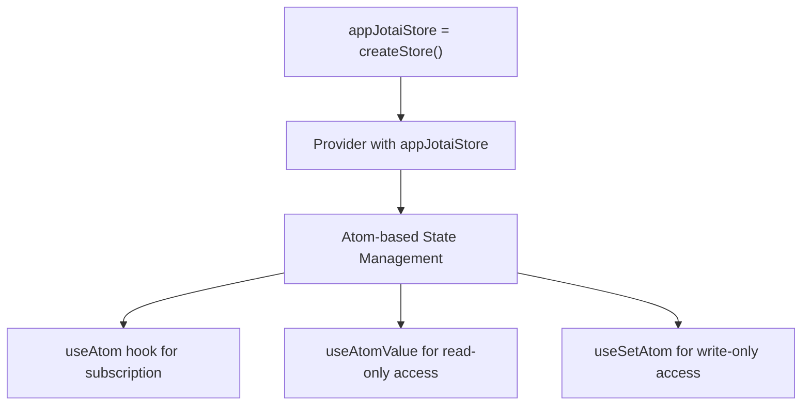
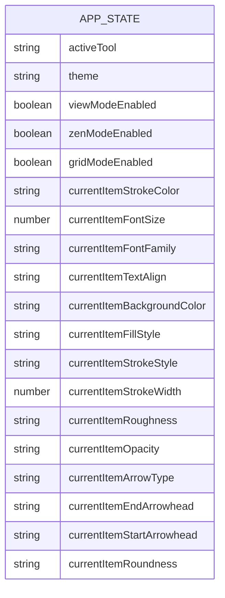
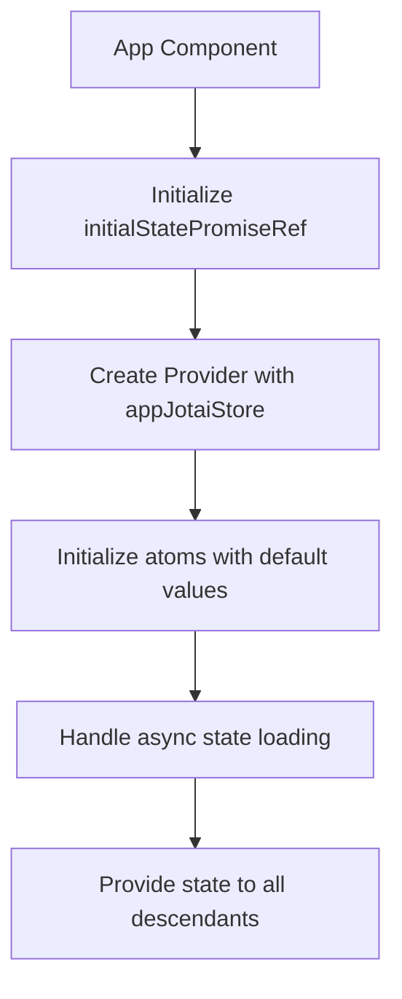
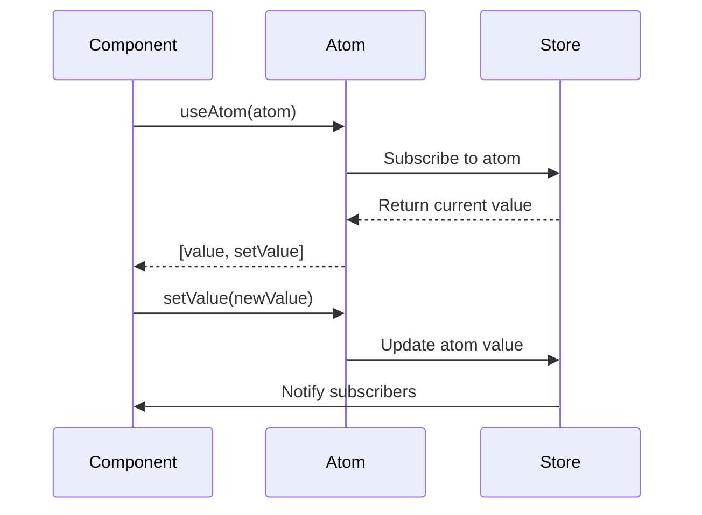

# Core Architecture

<cite>
**Referenced Files in This Document**   
- [app-jotai.ts](file://excalidraw-app/app-jotai.ts)
- [appState.ts](file://packages/excalidraw/appState.ts)
- [App.tsx](file://excalidraw-app/App.tsx)
</cite>

## Table of Contents
1. [Introduction](#introduction)
2. [Jotai State Management System](#jotai-state-management-system)
3. [App State Structure](#app-state-structure)
4. [Root Provider Initialization](#root-provider-initialization)
5. [Atom Usage and Examples](#atom-usage-and-examples)
6. [Advantages Over Traditional Patterns](#advantages-over-traditional-patterns)
7. [Performance Implications](#performance-implications)

## Introduction
Excalidraw implements a sophisticated state management architecture using Jotai, a minimalistic atom-based state management library for React. This document details the core state management system, focusing on the Jotai implementation in the `app-jotai.ts` configuration file and the `appState.ts` structure. The architecture enables efficient global state management for application-wide properties such as active tool selection, theme preferences, and view modes. This approach provides a modern alternative to traditional context or Redux patterns, offering improved performance characteristics and simpler reactivity patterns.

## Jotai State Management System

Excalidraw's state management system is built around Jotai atoms, which serve as the fundamental units of state. The system is configured in the `app-jotai.ts` file, which sets up the foundation for global state management across the application.

The core of the Jotai implementation is the creation of a dedicated store instance:

**Diagram sources**
- [app-jotai.ts](file://excalidraw-app/app-jotai.ts#L1-L36)

The `app-jotai.ts` file exports the essential Jotai primitives while creating an isolated store instance to prevent state collisions. This approach allows Excalidraw to maintain a clean separation between different state domains within the application. The file also implements a custom hook `useAtomWithInitialValue` that combines `useAtom` with `useLayoutEffect` to ensure initial values are set synchronously during component mounting, preventing potential race conditions when initializing state.

**Section sources**
- [app-jotai.ts](file://excalidraw-app/app-jotai.ts#L1-L36)

## App State Structure

The application state structure is defined in the `appState.ts` file, which exports a comprehensive `getDefaultAppState` function that returns the initial state configuration for the application. This state object contains numerous properties that control various aspects of the Excalidraw interface and behavior.

Key state properties include:
- **activeTool**: Tracks the currently selected tool (e.g., selection, rectangle, text)
- **theme**: Manages the current theme (light/dark mode)
- **viewModeEnabled**: Controls whether the canvas is in view mode
- **zenModeEnabled**: Determines if zen mode is active
- **gridModeEnabled**: Indicates whether the grid is visible

The state configuration also includes a detailed storage policy defined in `APP_STATE_STORAGE_CONF`, which specifies how each state property should be handled across different storage contexts (browser, export, server). This granular control allows Excalidraw to persist relevant state to localStorage while excluding transient properties from exported files.

**Diagram sources**
- [appState.ts](file://packages/excalidraw/appState.ts#L1-L300)

**Section sources**
- [appState.ts](file://packages/excalidraw/appState.ts#L1-L300)

## Root Provider Initialization

The root application component in `App.tsx` initializes and provides the Jotai store to the entire component tree. This is accomplished by wrapping the application with the Jotai `Provider` component, which makes the `appJotaiStore` available to all descendants.

The initialization process involves several key steps:
1. Creating a ref to hold the initial state promise
2. Setting up the Jotai provider with the pre-configured store
3. Initializing atoms with their default values
4. Handling asynchronous state loading and synchronization

The provider setup enables components throughout the application to access global state without prop drilling. This approach simplifies the component hierarchy and reduces the complexity of state management across distant components.

**Diagram sources**
- [App.tsx](file://excalidraw-app/App.tsx#L1-L799)

**Section sources**
- [App.tsx](file://excalidraw-app/App.tsx#L1-L799)

## Atom Usage and Examples

Atoms in Excalidraw are used extensively to manage both simple and complex state. The application demonstrates several patterns for atom creation and usage:

### Atom Creation
Atoms are created using the `atom` function imported from the `app-jotai.ts` file. Each atom represents a piece of state that can be read from and written to by components.

### useAtom Hook Usage
Components consume atoms using the `useAtom` hook, which returns a tuple containing the current value and a setter function:

**Diagram sources**
- [app-jotai.ts](file://excalidraw-app/app-jotai.ts#L1-L36)
- [App.tsx](file://excalidraw-app/App.tsx#L1-L799)

Common usage patterns include:
- **Boolean flags**: Managing UI states like `viewModeEnabled` or `zenModeEnabled`
- **String values**: Tracking active tools or theme preferences
- **Complex objects**: Managing application state configurations

The `useAtomWithInitialValue` custom hook provides a convenient way to initialize atoms with default values, ensuring consistent state across application sessions.

## Advantages Over Traditional Patterns

Excalidraw's Jotai-based state management offers several advantages over traditional approaches like React Context or Redux:

### Simplicity and Minimalism
Jotai's atom-based approach eliminates the need for complex store configurations, reducers, and action types. Each atom is self-contained and can be created and used independently.

### Performance Benefits
Unlike React Context, which can cause unnecessary re-renders when any value in the context changes, Jotai atoms only trigger re-renders in components that specifically subscribe to them. This targeted reactivity significantly improves performance, especially in large component trees.

### Scalability
The atomic nature of Jotai state makes it easy to scale the application by adding new atoms as needed without affecting existing state management. This modular approach supports better code organization and maintainability.

### Developer Experience
Jotai's API is minimal and intuitive, reducing the learning curve for new developers. The ability to create derived atoms and combine atoms using utilities simplifies complex state logic.

## Performance Implications

The Jotai implementation in Excalidraw has been carefully designed to optimize performance and minimize unnecessary re-renders:

### Selective Re-renders
Components only re-render when the specific atoms they subscribe to change, rather than when any global state changes. This granular subscription model prevents the "prop drilling" performance issues common in large context providers.

### Memory Efficiency
Atoms are only created when first accessed, following a lazy initialization pattern. This reduces memory overhead for state that may not be used during a user session.

### Batched Updates
Jotai batches state updates to minimize the number of re-renders, similar to React's state batching behavior. This ensures smooth UI performance even when multiple state changes occur in quick succession.

### Cleanup and Subscription Management
The implementation properly manages subscriptions and cleanup through React's useEffect lifecycle, preventing memory leaks and ensuring efficient resource usage.

The architecture demonstrates thoughtful consideration of performance implications, balancing the need for responsive state management with efficient rendering behavior.