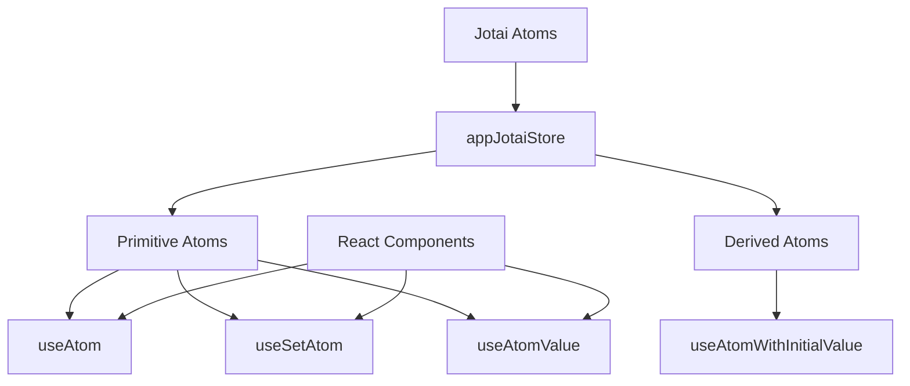
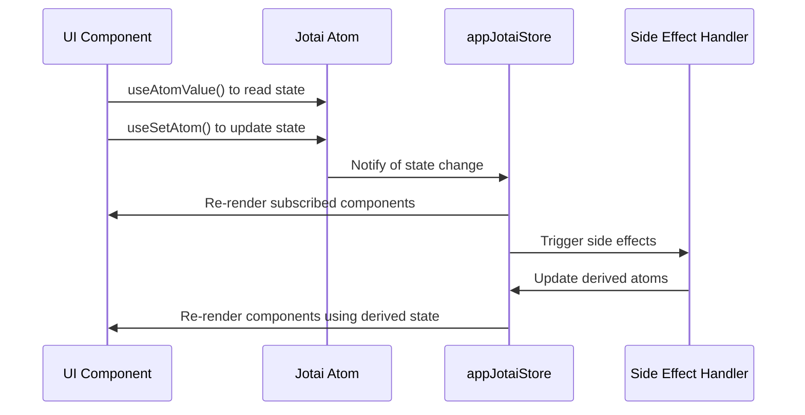
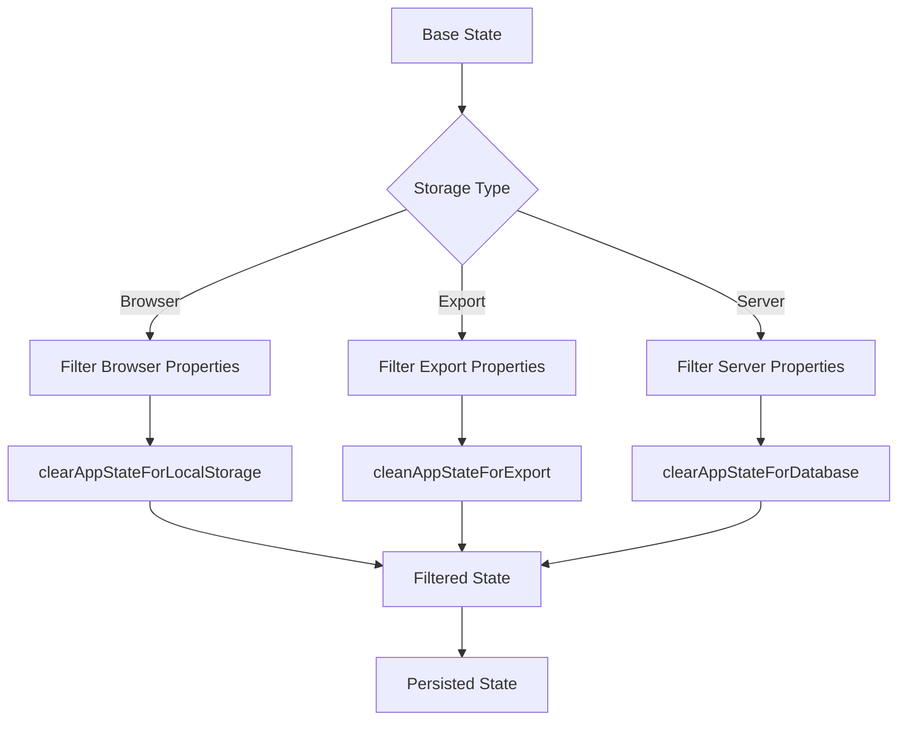
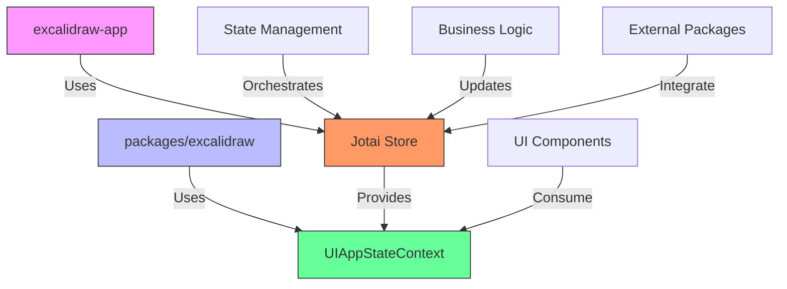
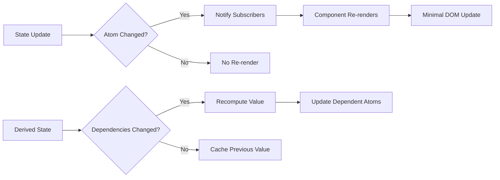

# State Management

<cite>
**Referenced Files in This Document**   
- [app-jotai.ts](file://excalidraw-app/app-jotai.ts)
- [ui-appState.ts](file://packages/excalidraw/context/ui-appState.ts)
- [appState.ts](file://packages/excalidraw/appState.ts)
- [types.ts](file://packages/excalidraw/types.ts)
</cite>

## Table of Contents
1. [Introduction](#introduction)
2. [Jotai-Based Atom Architecture](#jotai-based-atom-architecture)
3. [App State Structure](#app-state-structure)
4. [State Updates and UI Integration](#state-updates-and-ui-integration)
5. [Derived State and Selectors](#derived-state-and-selectors)
6. [Monorepo Package Integration](#monorepo-package-integration)
7. [Performance Optimization](#performance-optimization)
8. [Conclusion](#conclusion)

## Introduction
Excalidraw employs a sophisticated state management system built on Jotai, a minimalistic React state management library that leverages React's concurrent features. The system is designed to efficiently manage global application state across the monorepo architecture, with a clear separation between the main application (excalidraw-app) and shared components (packages/excalidraw). This documentation details the Jotai-based atom architecture, focusing on the core state management files and their integration across the application.

## Jotai-Based Atom Architecture

The state management system in Excalidraw is centered around Jotai atoms, which provide a granular and efficient way to manage state. The `app-jotai.ts` file in the excalidraw-app package serves as the foundation for the global state management system.



**Diagram sources**
- [app-jotai.ts](file://excalidraw-app/app-jotai.ts#L1-L36)

The architecture creates a dedicated store using `createStore()` from Jotai, ensuring isolation of the application's state. This store, exported as `appJotaiStore`, serves as the container for all atoms used throughout the application. The file re-exports core Jotai utilities including `atom`, `Provider`, `useAtom`, `useAtomValue`, and `useSetAtom`, making them readily available across the codebase.

A custom hook `useAtomWithInitialValue` is implemented to handle atoms with initial values. This hook uses `useLayoutEffect` to set the initial value of an atom when the component mounts, ensuring that the state is properly initialized before rendering occurs. The hook supports both direct values and factory functions for initial value computation.

**Section sources**
- [app-jotai.ts](file://excalidraw-app/app-jotai.ts#L1-L36)

## App State Structure

The application state in Excalidraw is comprehensively defined in the `AppState` interface within `types.ts`. This interface captures all aspects of the application's UI and interaction state, providing a single source of truth for the entire application.

```mermaid
classDiagram
class AppState {
+showWelcomeScreen : boolean
+theme : Theme
+collaborators : Map
+currentItemStrokeColor : string
+currentItemBackgroundColor : string
+activeTool : ActiveTool
+penMode : boolean
+exportBackground : boolean
+viewBackgroundColor : string
+scrollX : number
+scrollY : number
+selectedElementIds : { [id : string] : true }
+selectedGroupIds : { [groupId : string] : boolean }
+zoom : Zoom
+viewModeEnabled : boolean
+zenModeEnabled : boolean
+gridModeEnabled : boolean
+gridSize : number
+gridStep : number
+name : string | null
+errorMessage : React.ReactNode
+openDialog : DialogType | null
+openSidebar : SidebarConfig | null
+stats : { open : boolean, panels : number }
+lockedMultiSelections : { [groupId : string] : true }
+activeLockedId : string | null
}
class UIAppState {
+theme : Theme
+viewBackgroundColor : string
+zoom : Zoom
+viewModeEnabled : boolean
+zenModeEnabled : boolean
+gridModeEnabled : boolean
+gridSize : number
+gridStep : number
+name : string | null
+openDialog : DialogType | null
+openSidebar : SidebarConfig | null
+stats : { open : boolean, panels : number }
}
AppState --> UIAppState : "extends"
```

**Diagram sources**
- [types.ts](file://packages/excalidraw/types.ts#L258-L444)
- [ui-appState.ts](file://packages/excalidraw/context/ui-appState.ts#L3-L5)

The `AppState` interface includes numerous properties that track the application's current state:

- **activeTool**: Represents the currently selected tool in the toolbar, with properties for tool type, custom type, lock status, and transition state
- **viewModeEnabled**: A boolean flag indicating whether the application is in view mode, which affects UI rendering and interaction capabilities
- **theme**: Specifies the current theme (light or dark) applied to the application interface
- **gridModeEnabled**: Controls the visibility of the grid overlay on the canvas
- **zenModeEnabled**: Toggles zen mode, which simplifies the interface for focused drawing
- **selectedElementIds**: A read-only map tracking currently selected elements by their IDs
- **selectedGroupIds**: Tracks top-level selected groups in the document
- **zoom**: Contains the current zoom level as a normalized value
- **scrollX** and **scrollY**: Track the current scroll position of the canvas
- **gridSize** and **gridStep**: Define the dimensions and spacing of the grid system

The `UIAppState` type is derived from `AppState` by omitting certain properties that are not needed for UI rendering context. This creates a more focused state representation for UI components, improving performance by reducing unnecessary re-renders.

**Section sources**
- [types.ts](file://packages/excalidraw/types.ts#L258-L444)
- [appState.ts](file://packages/excalidraw/appState.ts#L1-L300)

## State Updates and UI Integration

State updates in Excalidraw are triggered through UI components using Jotai's hook system. The integration between UI components and the global state is seamless, with components subscribing to specific atoms and updating them in response to user interactions.



**Diagram sources**
- [app-jotai.ts](file://excalidraw-app/app-jotai.ts#L1-L36)
- [types.ts](file://packages/excalidraw/types.ts#L258-L444)

When a user interacts with the UI, such as selecting a drawing tool or changing the theme, the corresponding component uses `useSetAtom` to update the relevant atom. This update propagates through the Jotai store, which efficiently notifies all subscribed components of the change. Components that use `useAtomValue` to read the state will automatically re-render with the updated values.

The `UIAppStateContext` provides an additional layer of context-based state management. Created using React's `createContext`, this context allows components to access the UI application state without directly importing Jotai hooks. The `useUIAppState` hook simplifies access to this context, enabling components to consume the state in a clean and consistent manner.

For initialization, the `getDefaultAppState()` function in `appState.ts` provides a comprehensive default state configuration. This function returns an object with all necessary properties initialized to their default values, ensuring a consistent starting point for new sessions.

**Section sources**
- [app-jotai.ts](file://excalidraw-app/app-jotai.ts#L1-L36)
- [ui-appState.ts](file://packages/excalidraw/context/ui-appState.ts#L1-L5)
- [appState.ts](file://packages/excalidraw/appState.ts#L1-L300)

## Derived State and Selectors

Excalidraw leverages Jotai's capabilities for creating derived state and selectors, allowing for efficient computation of values based on the base state. This approach minimizes redundant calculations and ensures that derived values are only recomputed when their dependencies change.

The `APP_STATE_STORAGE_CONF` constant in `appState.ts` serves as a configuration object that determines which state properties should be persisted in different storage contexts (browser, export, server). This configuration effectively acts as a selector that filters the application state based on the target storage medium.



**Diagram sources**
- [appState.ts](file://packages/excalidraw/appState.ts#L30-L200)

The system implements three specialized functions for state filtering:
- `clearAppStateForLocalStorage`: Extracts properties marked for browser storage
- `cleanAppStateForExport`: Extracts properties marked for file/database export
- `clearAppStateForDatabase`: Extracts properties marked for server storage

These functions use the `APP_STATE_STORAGE_CONF` configuration to determine which properties to include in each context, effectively creating derived state tailored to specific use cases. This approach ensures that sensitive or transient state properties are not inadvertently persisted in inappropriate locations.

Additionally, utility functions like `isEraserActive` and `isHandToolActive` serve as simple selectors that derive boolean values from the `activeTool` state, providing convenient abstractions for common state checks.

**Section sources**
- [appState.ts](file://packages/excalidraw/appState.ts#L30-L200)

## Monorepo Package Integration

The state management system in Excalidraw is designed to work seamlessly across the monorepo structure, with clear boundaries between the main application (excalidraw-app) and shared packages (packages/excalidraw).



**Diagram sources**
- [app-jotai.ts](file://excalidraw-app/app-jotai.ts#L1-L36)
- [ui-appState.ts](file://packages/excalidraw/context/ui-appState.ts#L1-L5)

The `app-jotai.ts` file in excalidraw-app creates the central Jotai store and exports the necessary utilities for state management. This store serves as the single source of truth for the entire application. Meanwhile, the `ui-appState.ts` file in packages/excalidraw creates a React context that wraps the UI application state, allowing components in the shared package to access the state without direct dependencies on the Jotai implementation.

This architecture enables a clean separation of concerns: the main application manages the state store and atoms, while the shared components consume the state through the context API. This approach facilitates code reuse and maintainability, as UI components in packages/excalidraw can be used across different applications without being tightly coupled to the specific state management implementation.

The integration is further strengthened by the type definitions in `types.ts`, which are shared across packages. This ensures type safety and consistency in state usage throughout the codebase.

**Section sources**
- [app-jotai.ts](file://excalidraw-app/app-jotai.ts#L1-L36)
- [ui-appState.ts](file://packages/excalidraw/context/ui-appState.ts#L1-L5)
- [types.ts](file://packages/excalidraw/types.ts#L1-L799)

## Performance Optimization

Excalidraw's state management system incorporates several performance optimizations to ensure efficient rendering and minimal re-computation.

The use of Jotai atoms enables fine-grained reactivity, where components only re-render when the specific atoms they depend on change. This is in contrast to traditional global state solutions that might cause widespread re-renders for minor state changes.



**Diagram sources**
- [app-jotai.ts](file://excalidraw-app/app-jotai.ts#L1-L36)
- [appState.ts](file://packages/excalidraw/appState.ts#L30-L200)

The atom splitting strategy is evident in the separation between base state and derived state. By creating specific atoms for different aspects of the application state, the system minimizes unnecessary re-renders. For example, a change in the `activeTool` state will only trigger re-renders in components that specifically subscribe to that atom, rather than causing a global re-render.

The `UIAppState` type, which omits certain properties from the full `AppState`, serves as a performance optimization by creating a more focused state representation for UI components. This reduces the amount of state data that needs to be processed and compared during re-renders.

Additionally, the use of `useLayoutEffect` in the `useAtomWithInitialValue` hook ensures that initial state setup occurs synchronously during the layout phase, preventing potential flickering or inconsistent state during component initialization.

**Section sources**
- [app-jotai.ts](file://excalidraw-app/app-jotai.ts#L1-L36)
- [appState.ts](file://packages/excalidraw/appState.ts#L1-L300)

## Conclusion
Excalidraw's state management system demonstrates a sophisticated implementation of Jotai for global state management in a complex, monorepo-based React application. By leveraging Jotai's atom-based architecture, the system achieves fine-grained reactivity, efficient updates, and clean separation between state management and UI components. The integration between excalidraw-app and packages/excalidraw through a combination of Jotai stores and React context enables code reuse while maintaining type safety and performance. The comprehensive state structure, with its focus on both base and derived state, provides a robust foundation for the application's functionality while incorporating performance optimizations that ensure a smooth user experience.